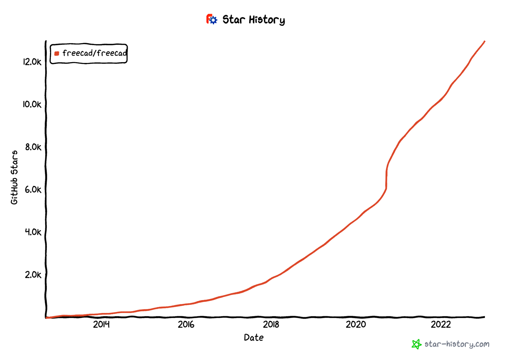
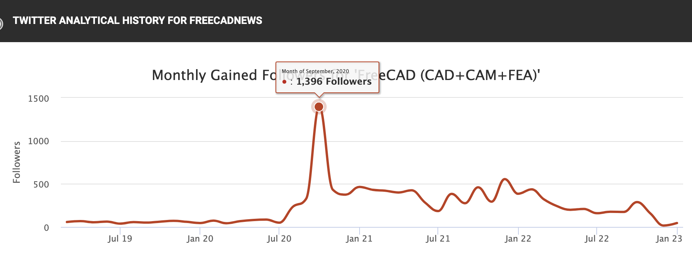
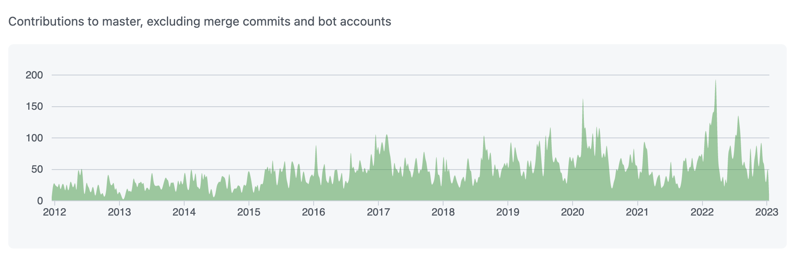

Description: When Autodesk changed their license for Fusion 360 in September of 2020 there was a collective scream from the user community. Hobbyists, YouTubers, and makers felt betrayed. Now, after more than two years, we can see the effect. Many of those people left Fusion and never looked back.

>>“	‘I have altered the deal. Pray I do not alter it further.’
>>	— Darth Vader
>
>If that’s how you’re going to treat the hobbyists, then goodbye forever to Fusion 360.”
>— [solarguy2003](https://www.autodesk.com/products/fusion-360/blog/changes-to-fusion-360-for-personal-use/#comment-11741)

Over two years ago [Autodesk imposed a number of new limitations on its free non-commercial-use license for Fusion 360](https://www.autodesk.com/products/fusion-360/blog/changes-to-fusion-360-for-personal-use/), primarily impacting hobbyist and casual users: project storage was limited, exports to a number of (critical) file types were no longer offered, and support for CAM was drastically cut back, among other restrictions. These changes felt like a slap in the face, with some members deleting their Fusion 360 accounts in protest (whether or not they were affected by the new limitations).
### The proprietary bait and switch
The changes to the license for Fusion 360 for Personal Use were a perfect illustration of the risk of making use of “free as in beer” software. Many users felt betrayed and frustrated at the new limitations:

> “The file export limitations in particular are crippling. No .step? .dxf? No extensions??? I can't even buy stress simulation credits? … yikes.”
> — [raynr on Hacker News](https://news.ycombinator.com/item?id=24496171)

Some users were not surprised, saying it was inevitable that the company would seek to monetize more of their product, even suggesting that the Fusion 360 license had been overly generous to begin with. This take undermines the exchange of benefits that takes place between vendors of free software and the communities that spring up around it:

“Think of the tens of millions of man-hours that have been invested into forum posts helping users, developing plugins, courses, YouTube videos, and Makerspace workshops that could have instead gone into making open source tools like KiCAD, OpenSCAD, pycam, etc better.

>"All that work done by hobbyists, for free, helping Autodesk dominate the market in low-end CAD/CAM software.”
>— [sfdsfsdfdsf on Hackaday.com](https://hackaday.com/2020/09/16/autodesk-announces-major-changes-to-fusion-360-personal-use-license-terms/#comment-6278789)

While Autodesk maintained they were still committed to “democratizing design for everyone,” the community didn’t buy it, seeing it as a bid to squeeze money out of hobbyist users after riding their coattails to market domination. As one disappointed user commented:

“... you showed that you prefer to spend money to block existing features of your software instead of improving it with new paid features. That’s an indicator that you don’t care about the product itself anymore, but that you are just trying to extract the maximum money out of your current users instead.”— [streakycobra on Hacker News](https://news.ycombinator.com/item?id=24498013)
### So where did disgruntled Fusion users go?
Fusion users asked, “What can we use instead?” and the overwhelming sentiment was in favor of supporting free and open source projects that can’t be bought out or taken away.

As a longtime contributor to FreeCAD I was happy to see it suggested often. The effect can be seen clearly in FreeCAD’s [GitHub star history](https://star-history.com/#freecad/freecad&Date): the count has more than tripled since September 2020.

Caption: You can see a dramatic 30% star growth after Autodesk’s controversial changes
The spike in followers for [@FreeCADNews](https://twitter.com/freecadnews) tells a story too:

And here’s the project’s [growth in contributions](https://github.com/FreeCAD/FreeCAD/graphs/contributors):

In the 2+ years since Autodesk changed the Fusion 360 license, new communities around FreeCAD have sprung up on [LinkedIn](https://www.linkedin.com/groups/4295230/), [Reddit](https://www.reddit.com/r/FreeCAD/), and [Facebook](https://facebook.com/FreeCAD/)—all with over 3,000 members.

We know that one of the tradeoffs with FOSS is that sometimes you might need to roll up your sleeves and contribute (time or money) towards the features and fixes you want to see. It’s gratifying to see this growing community getting involved to continue developing FreeCAD into a viable Fusion alternative, without the bait-and-switch risk of proprietary solutions.
### Where to from here?
I’m now working full time on Ondsel, built on top of FreeCAD. While Ondsel’s product set is still being defined, my vision is to improve on the FreeCAD UI to make it more accessible for non-software engineers and build the collaborative features that small businesses and enterprises can benefit from—now with the resources of full-time development talent. With open core, the business model is to [monetize features based on who will use them](https://opencoreventures.com/blog/2023-01-open-core-standard-pricing-model/), with the core product remaining free and open to all. A strong core is integral to Ondsel’s success, as the core features are often an onramp for casual or hobby users who grow into businesses of their own and require different features as they scale. Having a solid and active open source ecosystem around it is vital to actually democratizing design for everyone. In the coming months I’ll be hiring engineers to help define this vision and build it with me, but in the meantime I [would love to hear from you](https://github.com/orgs/Ondsel-Development/discussions/1) about what you’d like to see from FreeCAD and Ondsel in the future.

  
Note...

  

    
I’m Brad Collette, longtime FreeCAD contributor and CTO of Ondsel, a new open core company built on top of FreeCAD. Ondsel helps you share useful aspects of your solid models without giving away your designs. We’re working on improving collaboration and feature accessibility and integrating with your existing tools. You can read more about my vision for FreeCAD and Ondsel <a href="https://opencoreventures.com/blog/2023-01-ondsel-freecad-launch/">here</a>
    

 
  

