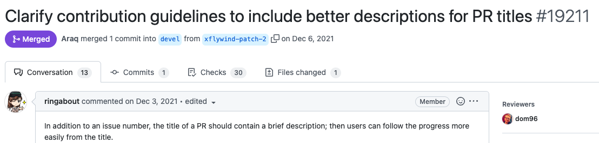
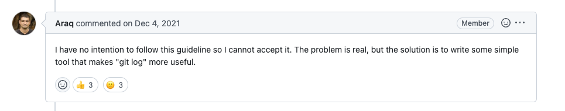

_First-timers can have a hard time getting started with open source. It doesn’t have to be that way._

Open source projects are dependent on an engaged community of contributors, but fostering that community comes with its challenges. Depending on what stage an open source project is at, what the community needs from contributors changes. The good news is that intentional coaching and engagement from project maintainers can work at any stage.

The common gripes with getting started as a new open source contributor usually center around how welcoming the project is and how easy it is to get your contribution merged. There are a few ways that projects can make it hard (both intentionally and not). Here are some examples:

### 1. Prickly maintainers

Imagine you submit [this pull request](https://github.com/nim-lang/Nim/pull/19211) to the Nim project:

Seems reasonable enough, right? Check out the project maintainer’s reply:

Ouch. To credit Araq, this PR did eventually get merged, but it’s a great illustration of how a project’s culture determines its accessibility to new contributors. This PR proposed a change that would make it easier for users to engage with the project, and it was shut down (at first) pretty abruptly. 

Actions like this prompted a handful of contributors to hard fork the project, creating [Nimskull](https://github.com/nim-works/nimskull). One of the new project’s contributors shared their motivations:

“At the moment we are focused on making it easier to work with the codebase - more documentation, cutting down on decades-old cruft and legacy features, unraveling mysteries of the commit messages that were written with [this attitude...](https://github.com/nim-lang/Nim/pull/19211#issuecomment-9859) (‘I have no intention to follow this guideline so I cannot accept it.’)” —[haxscramper](https://news.ycombinator.com/item?id=32023998)

Hard forking is one way to create the project environment you want for contributors, but it is extreme. The default perception of such a move is hostile, tending to assume that the creators don’t want to work on change from within and have an ax to grind with the original project’s maintainer. You can see this sentiment play out in the [Hacker News discussion about Nimskull](https://news.ycombinator.com/item?id=32021299). As one commenter pointed out though:

“If they had tried to alter the original project to suit themselves, you would have said ‘they can just fork if they don't like it’” —[Brian_K_White](https://news.ycombinator.com/item?id=32033998)

Whether Nimskull delivers on its promises is yet to be seen, but the example Illustrates how the maintainers and community of a project can impact contributions:

How easy do they make it to contribute?
How clear are the requirements?
How quickly are pull requests reviewed and merged?
How collaborative and patient are the reviewers?

All of these factors influence how likely someone is to become a contributor. A hard fork that does this better can be an incentive for the original project to do better, but there are other approaches you can take which I’ll explore in a moment.

### 2. An intimidating contribution process

Being realistic, it’s unlikely that a beginner will be submitting code to the Linux kernel. But it’s a good example of how the way a project accepts contributions can encourage or discourage new folks. Submitting a patch can be extremely intimidating—the [documentation](https://docs.kernel.org/process/submitting-patches.html) admits this in the very first line! It can feel like you’re presenting your work to a panel of faceless judges instead of sharing it with a group of your peers.

The kernel development community and other projects that operate this way (such as Postgres) have their reasons, which may even include not wanting to encourage rookie contributions! I’m not suggesting they change it, but for newcomers, submissions that feel more conducive to collaboration (such as a pull request) are likely to be less threatening.

### 3. An onerous Definition of Done

“It doesn't take egregious individual behavior to create a hostile environment.” — Dan Luu, [How to discourage open source contributions](http://danluu.com/discourage-oss/)

While early projects have few or no contributors, they may welcome almost any contribution in pursuit of building the community around the project. Even a bad contribution can lead to an interesting discussion and maybe a better idea.

As the project matures and the network grows, the overhead of handling contributions becomes a problem. Facing a backlog of hundreds of pull requests, projects may optimize for “good” contributions by implementing more stringent requirements. I know from firsthand experience as a longtime [FreeCAD](https://www.freecad.org/) contributor. As the project grew and matured, it became harder for amateurs to contribute. The Definition of Done became more demanding (for example we needed the right test cases and code formatting) and these more stringent requirements can be off putting or prohibitive, even without intimidating maintainers.

“The GitLab Definition of Done is now 30 items or something … so it’s harder and harder for people who are just starting to contribute.” — Sid Sijbrandij, CEO and co-founder of GitLab

This barrier to entry illustrates the tension between what the project needs to ensure the quality of its codebase, and what’s inclusive to new contributors. There is a balance to be struck between being welcoming to newcomers in your community, maintaining standards for contributions to your project, and the effort required to make the twain meet. It’s not always going to be possible or advisable to reduce the requirements for getting code merged.

You might imagine that having the resources of a for-profit company would help, but it’s no guarantee that they will invest in it. In [How to discourage open source contributions](http://danluu.com/discourage-oss/) Dan Luu shared an anonymized example of a project in which contributors get increasingly frustrated and discouraged when their PRs aren’t reviewed or merged, or when they have to jump through hoops to meet requirements. Although Dan didn’t put the project on blast, [Reddit users figured out what it was](https://www.reddit.com/r/programming/comments/1pczpr/how_to_discourage_open_source_contributions/): a library maintained by GitHub. We don’t know why GitHub employees weren’t engaging, but it demonstrates how simply having full-time staff isn’t enough to ensure an active project.

We can see from the examples I shared that these challenges plague projects wherever they are on the spectrum, whether they’re small and maintained by a handful of hobbyist contributors, large and prestigious, or stewarded by a big enterprise organization. If you want an active community where new and drive-by contributors are as welcome as your diehards (and most projects can benefit from a blend of both), you need to be intentional about fostering it.

### How to make it easier to contribute to your project (and why it’s worth the effort)

GitLab’s solution is a role called [Merge Request Coaches](https://about.gitlab.com/job-families/expert/merge-request-coach/). There is literally a line in the job description that says, “Make it easy to contribute to GitLab even for people who are new to Ruby, JavaScript, Golang, etc. or programming entirely.” Merge Request Coaches triage community submissions and enable new contributors by walking them through the process to meet the acceptance criteria.

The open core model makes it possible for companies to invest in the core project with the benefit of full-time engineers on payroll; formalizing a coach role goes a step further by making it someone’s job to foster new contributors to the core. It’s my hope to pursue this solution with [Ondsel](https://opencoreventures.com/blog/2023-01-ondsel-freecad-launch/), to make it easier for people to contribute to FreeCAD, on top of which Ondsel is built.

Paying people to assist newcomers requires will and investment, which is not always possible in OSS projects run entirely by volunteers. There are examples though of volunteer coaches or mentors in open source: Kubernetes has its [Contributor Experience Special Interest Group](https://github.com/kubernetes/community/blob/master/sig-contributor-experience/README.md), which states, “Developing and sustaining a healthy community of contributors is critical to scaling the project and growing the ecosystem.” [Mentoring new contributors](https://github.com/kubernetes/community/blob/master/sig-contributor-experience/README.md#mentoring) is part of the program. The [OpenStack](https://www.openstack.org/) project also has a [mentoring program](https://docs.openstack.org/contributors/common/mentoring.html), with a cohort dedicated to helping people get their first patch merged.

By directing some volunteers’ efforts towards coaching, they become force multipliers for the project, with an impact far beyond their own contributions. When you invest in mentoring efforts, you’re not only improving the quality of the contributions, you’re nurturing future contributors who are no longer adding to your overhead; now they’re helping to share the load.

  
Note...

  

    
I’m Brad Collette, longtime FreeCAD contributor and CTO of Ondsel, a new open core company built on top of FreeCAD. Ondsel helps you share useful aspects of your solid models without giving away your designs. We’re working on improving collaboration and feature accessibility and integrating with your existing tools. You can read more about my vision for FreeCAD and Ondsel <a href="https://opencoreventures.com/blog/2023-01-ondsel-freecad-launch/">here</a>
    

 
  

