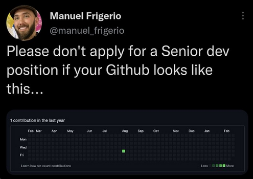

Should hiring managers base a decision on someone’s GitHub profile? No. But will it ever hurt to have a robust GitHub account? Also no.

I’m a hiring manager for a new open core company, and I watched the discussion under [@manuel_frigerio’s tweet](https://twitter.com/manuel_frigerio/status/1629059975418089474) blow up with amusement. The debate about using people’s GitHub profiles to make hiring decisions isn’t new. The typical backlash ensued and Manuel has since made his tweets private. And sure, using someone’s GitHub profile, particularly their contribution graph, to judge their skills as a developer is flawed.

# How _not_ to evaluate a candidate based on their GitHub account

Plenty of talented programmers are writing code that never makes it to GitHub[^1] because they’re working exclusively on closed source software or have climbed the ladder to a management position. There are also plenty of bad actors who can fudge their contribution graph by “[updating a readme file multiple times a day](https://twitter.com/pdtit/status/1629688787474481159)” or even [faking their Git commit history](https://twitter.com/dhruvdang/status/1629269041801211905).

This seems obvious, but based on the discussion from last week it bears saying again: If you’re a hiring manager and you’re judging an applicant’s skills and experience by how many green squares they have (or how dark they are), this is the most superficial way to look at it, and it won’t tell you anything about whether this person makes valuable contributions or is pleasant to work with.

But if you’re [recruiting engineers to work on an open source or open core project (as I am)](https://ondsel.com/careers/), engaging with open source is an intrinsic part of the job and someone’s GitHub account gives extremely valuable insight into a candidate’s suitability for that role. And if you’re in the job market and don’t have an active GitHub profile, you could be missing out on opportunities by overlooking FOSS.

# What you can actually judge from someone’s GitHub profile

### Do they have exposure to FOSS at all?

First, we have to acknowledge the difference between hiring for a closed-source, proprietary product and open source software: If you’re a hiring manager for the former, basing your hiring decisions on someone’s OSS contributions is short sighted and [could be harmful](https://about.gitlab.com/blog/2018/11/16/hiring-based-on-open-source-contributions-could-be-harmful/). (And if you’re a candidate with no interest in working full time on FOSS, by all means, focus on your proprietary work instead.)

If however you’re in the business of FOSS, and you receive applications from one candidate with a GitHub account and one without, you are going to have a lot more to go on when assessing the first. I am always going to lean towards working with people who already engage with open source in some manner and are used to working transparently and engaging with a community. Having a GitHub account and forking even one project is the bare minimum someone can do to show they have experience here. Of course that’s going to influence my hiring.

### What are their interests?

There are plenty of TikToks out there showing people how to optimize their resumes with keywords from the descriptions of jobs they’re applying for. It’s easy to stuff your CV with recruiter bait. Of course there are ways to uncover grifters in your hiring process. What is much harder to fabricate is a history of following open source projects, submitting issues, bug reports, and pull or merge requests, and engaging with communities. I’m looking for team members who share [my vision for making design tools accessible](https://opencoreventures.com/blog/2023-01-ondsel-freecad-launch/) and it’s much easier to establish whether someone cares about this mission if they’re following and interacting with related project.

If you’re hiring someone to do this kind of work on your project, you couldn’t ask for better signal than that.

### How do they collaborate with others?

Beyond any code they contribute, a candidate who participates in OSS will have a history of code review, discussion, and engaging with feedback. Do they take suggestions on board, do they offer feedback and coaching to others? Sure, this requires a bit more attention than simply scanning a contribution graph, but it’s hard to replicate this kind of window into a candidate’s experience and conduct from interviews alone.

### Do they have something to offer other than code?

Let’s revisit this idea of “updating a readme file” reflecting in someone’s GitHub graph. We’ll leave aside for now that they could automate updates using a cronjob or script (which, depending on the role you’re hiring for, could actually show the initiative and creativity that you’re looking for). Editing and updating documentation is a contribution that takes work and initiative, and we should encourage this too. Having non-programmers participate in your open source project is valuable and we only make it more intimidating when we assign greater value to code contributions than other activities that result in green squares.

# It’s never going to hurt to have a robust GitHub contribution history

I got applications from the US, India, Ukraine, South Africa, France, Paraguay… all over.  I found it interesting that there was a stark difference between US applicants and international ones. Almost all of the international applicants had active GitHub accounts while perhaps 1 in 15 of the US ones did. There are many reasons why this might be, including a lack of exposure to open source at schools and institutions where FOSS is not widely adopted.

If you’re a jobseeker reading this and feeling like I’m suggesting you do _more work_ because you aren’t active in open source yet, then the jobs I’m referring to are probably not for you. If the idea of participating in open source sounds burdensome, why would you seek out a full-time role in it anyway? If you are curious though, and want to give yourself the best chance of being considered seriously for work in FOSS, showing an active interest and engagement with projects is never going to hurt.

To help us make FreeCAD better and build the Ondsel product, consider [joining us](https://ondsel.com/careers/).

[^1]: Or GitLab for that matter, for the sake of brevity please assume I mean both throughout.

  
Note...

  

    
I’m Brad Collette, longtime FreeCAD contributor and CTO of Ondsel, a new open core company built on top of FreeCAD. Ondsel helps you share useful aspects of your solid models without giving away your designs. We’re working on improving collaboration and feature accessibility and integrating with your existing tools. You can read more about my vision for FreeCAD and Ondsel <a href="https://opencoreventures.com/blog/2023-01-ondsel-freecad-launch/">here</a>
    

 
  

