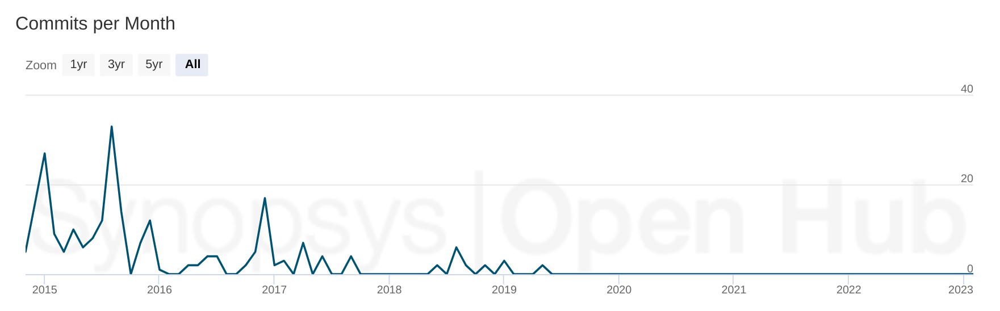
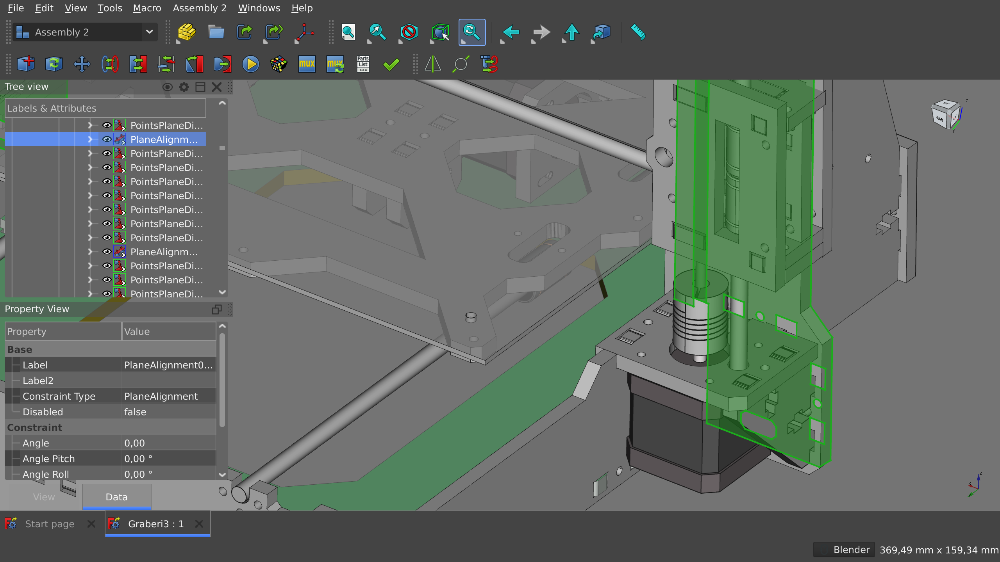
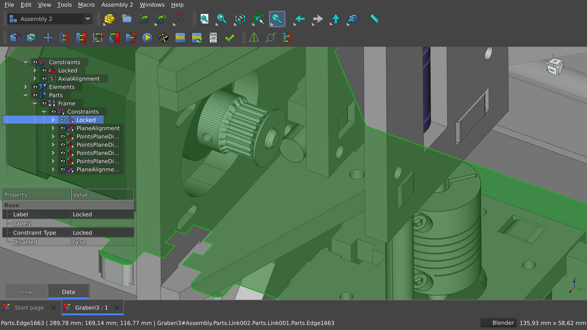

This is part two of our series on the need for an integrated default assembly workbench for FreeCAD. [Part One](/blog/default-assembly-workbench-1/) gives and introduction and explains our methods. In this part, we take a closer look at Assembly 2, one of the early approaches to adding this feature set to FreeCAD.

<!-- truncate -->

### History

A FreeCAD user publicly known as Hamish started this project in late 2014. This is the [original announcement](https://forum.freecad.org/viewtopic.php?style=4&t=8577):

>I have written an assembly workbench for FreeCAD v0.15, which I am posting here for everyone's perusal. [...] I realize that there is mostly likely heavy development on FreeCAD's inbuilt assembly wb, which i could have just used for my assembly needs.
However since FreeCAD provides such an excellent environment for building custom wbs, I decided to rather write my own wb exactly tailored to my needs [...]
Hope someone else finds the assembly2 wb useful

2015 was the most active year for the project. However, in 2016, the original developer [stopped writing new code](https://forum.freecadweb.org/viewtopic.php?f=17&t=16591) and the next maintainer, Roland Frank, [passed away in 2017](https://forum.freecad.org/viewtopic.php?f=8&t=25673). Hamish and another contributor, kbwbe, continued merging occasional pull requests: bug fixes, a Newton solver, and a port to Python 3 to make the workbench generally supported by newer versions of FreeCAD.

*Assembly2 Commit History*

However, in 2018, kbwbe started working on a [rewrite of Assembly 2](https://github.com/kbwbe/A2plus) and eventually dropped out of contributing to this workbench. There have been no changes in the git repository since 2019.

### Workflow and ease of use

[Assembly 2](https://github.com/hamish2014/FreeCAD_assembly2) only supports the bottom-up approach where you design and save parts as files and then import them for an assembly into a new FreeCAD project. It will read both FreeCAD, OBJ, IGES, and STEP files. The workbench expects that the user either enables the visibility of just one body in the design file or creates files with single-body parts. Sub-assemblies are possible, however.

*[Graber I3 model by Nemesis81](https://github.com/Nemesis81/GraberI3_Freecad/)*

After importing, spatial constraints need to be added and solved. Imported parts can be manually updated when the linked original file changes. Overall, it’s a straightforward workflow: import multiple parts from respective files, select parts’ features, add constraints, solve, done.

Problems begin to arise when a change is required. Assembly 2 does not have a dynamic solver. So once you change something like a distance or an angle, you have to create a constraint anew. Moreover, only some features in the workbench support undo/redo.

### Features

Constraints available in Assembly 2 are limited to circular edge, plane, axial, angular (for planes), and spherical surface. There are a few tools to work with constraints like flipping their directions.

Once constraints are done and solved, you can animate degrees of freedom to check for clearances and collisions in any combination of their respective positions. Additionally, it’s possible to check the entire assembly for overlapping parts.

Assembly 2 also allows creating a list of parts, for which it uses the [Drawing Dimensioning](https://github.com/hamish2014/FreeCAD_drawing_dimensioning) workbench by the same original developer. Which, in return, only works with page objects created with the Drawing workbench. It’s also possible to create one object from all or just the selected parts in an assembly to display them in a drawing. Notably, the [Drawing](https://wiki.freecad.org/Drawing_Workbench) workbench is now deprecated and replaced by the [TechDraw](https://wiki.freecad.org/TechDraw_Workbench) workbench.

### Consistency

The way the user interface is organized is in line with the rest of FreeCAD. However, for people new to assemblies, watching a few tutorials on YouTube will be really helpful. Unfortunately, the documentation on the workbench in the FreeCAD’s wiki is scarce: it only lists available features and doesn’t provide any information on them that you wouldn’t be able to see in the tooltips of the actual user interface.

Assembly 2 can work with parts created in other workbenches like [SheetMetal](https://wiki.freecad.org/SheetMetal_Workbench) or parts created with ‘importer’ workbenches like [KiCadStepUp](https://wiki.freecad.org/KicadStepUp_Workbench) or [Fasteners](https://wiki.freecad.org/Fasteners_Workbench). However, because it demands just one body to be visible in an imported project and does not allow choosing which body to import, placing an entire board into an enclosure will require a lot of time and patience.

The workbench also doesn’t follow the more recent trend of making 3rd party workbenches translatable.

*[Graber I3 model by Nemesis81](https://github.com/Nemesis81/GraberI3_Freecad/)*

### Stability

Because this assembly workbench is not maintained, the issue tracker has been deactivated on GitHub. So there’s no aggregated information on bugs and their severity. When used with a recent version of FreeCAD, the workbench has various glitches. The general recommendation appears to be keeping a copy of an older FreeCAD version (typically, v0.16 or v0.17) around to open old files that use this assembly workbench. For new users, the recommendation is to try one of the newer assembly workbenches.

### Performance

Despite its simplicity, Assembly 2 can be very slow on medium-to-complex projects. One of the recommendations to deal with that is by creating [sub-assemblies](https://forum.freecad.org/viewtopic.php?p=146813#p146813): effectively saving an assembly as a FreeCAD project, then importing it to another assembly. This removes some complexity from the project but reportedly [does not solve](https://forum.freecad.org/viewtopic.php?style=4&t=26803) all performance issues.

Moreover, the interference checker takes the simple road of trying all possible pairs, and this can go on for a very long time.

### Development Status

There have never been official versioned releases of Assembly 2. Active development on this workbench ceased in 2016-2017. This workbench has been unmaintained since 2019. One of its features (list of parts) depends on another unmaintained 3rd party workbench by the same original developer, and another feature (consolidation of objects) depends on a deprecated official workbench (Drawing).

### Summary
Assembly 2 is a fairly straightforward yet very barebone solution for creating assemblies. It imposes a particular way of organizing a project, has a limited set of constraints, requires either a lot of planning or a lot of manual work because of lacking a dynamic solver, relies on obsolete workbenches for some of its features, and has been unmaintained since 2019. As such, it has served its purpose well and is now generally considered superseded by A2plus, Assembly 3, and Assembly 4.

### Next up

In the next installment, we’ll take a close look at the major iteration of this workbench called A2plus.

  
Note...

  

    
I’m Brad Collette, longtime FreeCAD contributor and CTO of Ondsel, a new open core company built on top of FreeCAD. Ondsel helps you share useful aspects of your solid models without giving away your designs. We’re working on improving collaboration and feature accessibility and integrating with your existing tools. You can read more about my vision for FreeCAD and Ondsel <a href="https://opencoreventures.com/blog/2023-01-ondsel-freecad-launch/">here</a>
    

 
  

