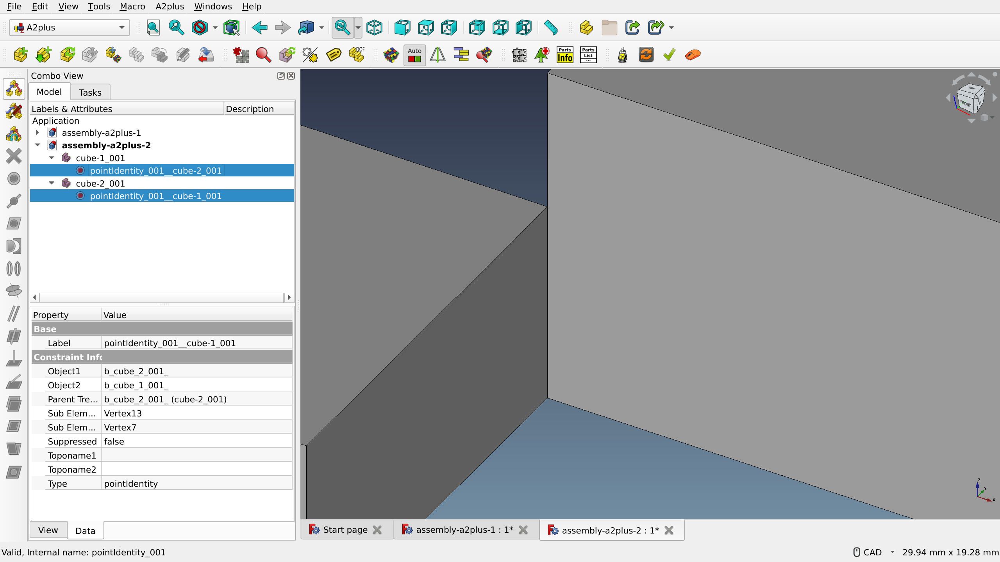
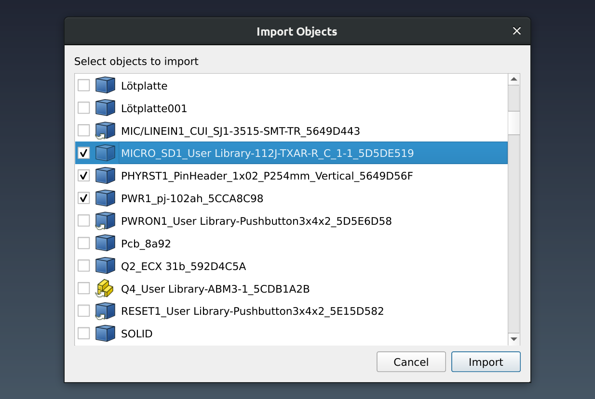
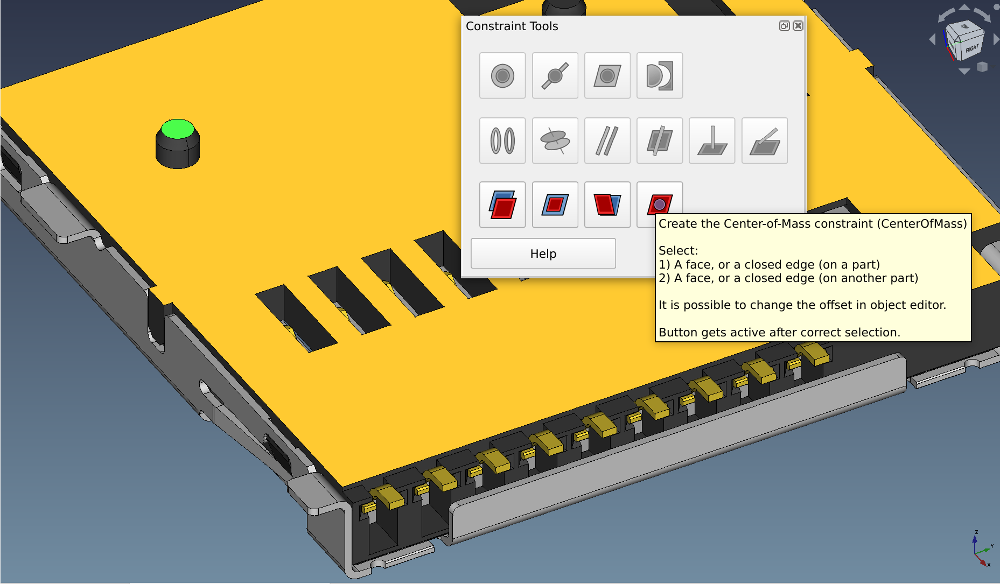
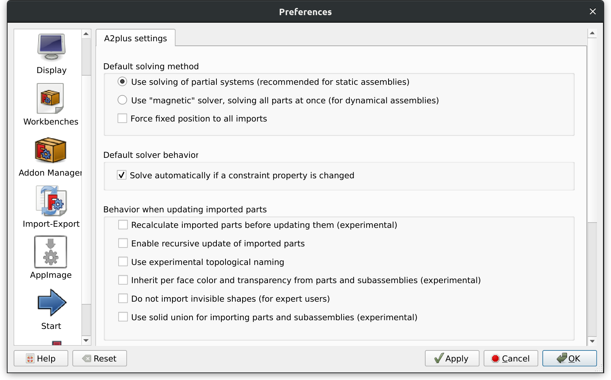
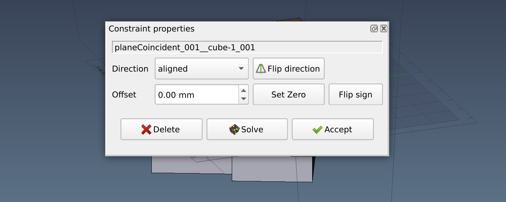

We’ve already talked about the need for a [default assembly workbench](https://ondsel.com/blog/default-assembly-workbench-1/) in FreeCAD and [reviewed Assembly 2](https://ondsel.com/blog/default-assembly-workbench-2/). Now let’s get into the nitty-gritty of the A2plus workbench.

<!-- truncate -->

## History

A FreeCAD user kbwbe started working on this project in 2018 following [experiments](https://forum.freecad.org/viewtopic.php?style=1&t=29207) with a new solver developed on top of the pre-existing Assembly 2 workbench:

> I developed a small prototype of yet another solver. It is in a very early state now and is only capable of handling plane/circularedge/axis-constraints. But it can easily be extended. It consists only of one file, which is attached. The base concept is inspired by physics. [...] It is just a prototype and many things are still missing. But the idea seems to work. I am working with a refurbished assembly2-workbench. I like the base concepts of it very much and did some bigger projects with it. 

Having received initial feedback, kbwbe created a [public repository](https://github.com/kbwbe/A2plus) on GitHub and continued hacking on the new workbench publicly.

Despite an activity plunge during the pandemic, A2plus is still being actively developed and receives new features and bug fixes.

## Workflow and ease of use

A2plus follows the same general idea as its predecessor: create parts as separate files, align them with constraints, solve. Just like Assembly 2, this workbench supports sub-assemblies.
There are some differences though. The one that stands out immediately is that, rather than creating one constraint object in the project tree, A2plus creates references to the same constraint in both involved parts.

Another difference is that a part in A2plus is a special type of an object. So it’s possible to create a new part from within the workbench and fill it with objects e.g. in the Part Design workbench. But the part will have to be manually converted to an A2plus part to become usable in the workbench. The caveat here is that even then such a part will not be added to the BOM: only the parts imported from external files will be displayed there. Overall, the top-down design approach is not favored by A2plus, as earlier [noted by kbwbe](https://forum.freecad.org/viewtopic.php?style=1&p=265666#p265666) in the FreeCAD forum:

> Leaving PartDesign bodies within the assembly is not the intended workflow. Best way is to import everything. Converting is also not the preferred way. Even all parametrics of the parts get lost.

Unlike Assembly 2, the A2plus workbench can also load user-selected objects from another FreeCAD project. In this case, the workbench will reference the object from the file, so FreeCAD will pick any changes made to the original project when you click the Update button.

In terms of general user experience, A2plus is a major improvement over Assembly 2. Here are some examples of user-visible changes:

- When features (points, planes etc.) of multiple parts are selected, the workbench automatically makes available only the constraints that can be used with these features. This removes a lot of guesswork for new users.
- Imported parts can easily be opened for editing as separate documents. All edited parts then can be updated with a single click.
- When cleaning up an assembly, it’s possible to easily delete all constraints associated with a part.

## Features

The workbench has a respectable set of constraints: Point-to-Point, Point-on-Line, Point-on-Plane, Sphere-to-Sphere, Circular-Edge, Axis-to-Axis, Axis-to-Plane, Axis-Plane-Normal, Angular Axis-to-Plane, Planes-Parallelism, Planes-Coincident, Angled-Planes, Center-of-Mass. This covers a variety of use cases.

A2plus comes with an autosolver. The way it works, however, is somewhat unreliable. Case in point: select two planes, create a Plane-Coincident constraint, solve, accept. Then select the constraint and change its Offset parameter in the Combo View. The autosolver will not update the position of the object that has the first plane, you will have to click the Solve button for this change to take effect.

There’s a number of convenience features specific to A2plus (as compared to Assembly 2) such as placing labels on parts in the viewport for easier navigation or making parts’ fills transparent.
The behavior of A2plus is configurable. Settings are available in the Preferences dialog:

Some features of the original Assembly 2 workbench are unavailable. Notably, the animation of the assembly for collision analysis is missing.

The A2plus workbench has a good [reference guide](https://wiki.freecad.org/A2plus_Workbench) on FreeCAD’s wiki but lacks official tutorials that explain the workflow. The community, however, stepped up and provided a sufficient number of YouTube tutorials on using A2plus for a variety of use cases: [mechanical design](https://www.youtube.com/watch?v=tI4trcyFwvs), [woodworking](https://www.youtube.com/watch?v=rIv15hX6Isw), etc.

**Update 2023-03-26:** There is at least [one documented case](https://forum.freecad.org/viewtopic.php?f=20&t=46024) where the precision of the A2plus solver was not sufficient to get the job done. The workbench developer [explained](https://forum.freecad.org/viewtopic.php?p=395617#p395617) this by having to find a compromise between speed (responsiveness of the WB) and accuracy due to limited calculation power available to a solver written in Python.[^1]

[^1]: This issue was raised in community discussion

## Consistency

A2plus does a few things differently from many other workbenches. The most user-visible difference is how constraint settings are displayed. When a new constraint is being added, FreeCAD displays a floating dialog:

Double-clicking the constraint in the project tree reopens this floating dialog. However, the very same information is displayed in the Combo View. So there’s two competing approaches to editing settings of a constraint.

Similarly, the first button in the Constraint toolbar opens another floating window that duplicates the list of constraints that is already available in that toolbar. This is not a common (although fairly optional-to-use) UI solution for FreeCAD.

As already noted, some objects require a conversion to an A2plus part, like the basic 3D objects created in the Part workbench. At the same time, this assembly workbench has no problem working with parts created in e.g. SheetMetal WB.

One important caveat of A2plus is that it doesn’t use the standard [App::Link](https://wiki.freecad.org/App_Link) machinery to reference objects in other documents. Parts added to the document this way cannot be used in an assembly. 

Some actions, like adding a part from an external file are not correctly added to the undo buffer so they cannot be reverted in the normal way.

## Stability

As of publishing this overview, there are no reported crashers that aren’t fixed. There haven’t even been many before: the issue tracker only lists 3 bugs in A2plus that ever crashed FreeCAD, and git log likewise lists only a few fixes for crashes. However, we were able to crash the program by pressing Ctrl+Z to undo while moving a part under constraints.

The main developer typically responds to bug reports within the first few days. There’s a small number of bug reports with mild severity from 2019 where either no detailed information was provided by the reporter, or the developer couldn’t replicate the issue, or the report slipped through developer’s fingers. The workbench occasionally exhibits inconsistent or glitchy behavior like failing to delete a conflicting constraint. Other than that, nothing particularly bad stands out.

## Performance

Assemblies are inherently complex beasts. It takes a substantial amount of talent, time, and effort to make a fast solver — a combination that not every volunteer has at their disposal. We’ve definitely seen complaints like [this one](https://www.hobby-machinist.com/threads/freecad-assembly-a2plus-v0-4-54b.97301/) about performance issues in the A2plus workbench even with fairly simple assemblies. However, in our limited testing, we were unable to come up with conclusive evidence for assemblies “blowing up” after changes. Simple assemblies (up to 40 parts) did not represent a major issue for A2plus. But there was noticeable rendering slowdown when moving parts under constraints.

At least one of the reasons for possible performance issues according to the main A2plus developer is the inefficient use of memory. This is how he [explains](https://github.com/kbwbe/A2plus/issues/378#issuecomment-612878010) it and goes on to give very useful hints about ways a programmer could deal with Python limitations:

> Memory management using Python as a programming language is not that easy and some memory leaks cannot be completely avoided. Python is keeping a lot of internal lists, which are immortal and their memory is not given back to the system during the lifetime of the program. So it is not possible to delete no more used objects from memory directly, as it is possible with "C/C++". Every object, which is not used anymore, is deleted (or sometimes it is not for various reasons), from Python's garbage collector.
> The code can only be optimized in order to reduce memory consumption. (using slots, avoiding string concatenation etc). I will have a look at this next time, where it is possible. But this is a bunch of work and will need a lot of time. And it will never be perfect.

## Development

The main developer responds to proposed contributions rather fast: many PRs by drive-by contributors are merged within days of submission, sometimes on the same day. Just 1 out of 452 pull requests is sitting unapplied on GitHub.

In the fall of 2022, a new regular contributor joined the project. His activity now rivals that of kbwbe.

Unlike with the original Assembly 2 workbench that had zero releases, the main developer of A2plus regularly tagged releases until November 2022 (a total of 101 tags so far). Releases mostly represent one or two bug fixes.

## Community

A2plus has one of the longest dedicated threads in the forum. However, since 2021, the activity of discussions has noticeably decreased: just 16 messages in the main thread in 2021, and 12 messages in 2022. The reason for this is unclear but might indicate that the interest towards the workbench has been decreasing as users move to other options.

## Summary

A2plus represents a major improvement over the original Assembly 2 workbench in terms of both workflow, features, and usability. It has more types of constraints, more convenience features, and better supports single-user workflows. It’s also sufficiently stable and has two developers who actively merge patches from other contributors. At the same time, the workbench has some unconventional UX/UI solutions and is reportedly prone to performance issues that are not easily resolved.

## Next up

In the next installment, we’ll take a close look at Assembly 3, a workbench that actively uses a solver from another free/libre CAD program, SolveSpace.

  
Note...

  

  I’m Brad Collette, longtime FreeCAD contributor and CTO of Ondsel, a new open core company built on top of FreeCAD. Ondsel helps you share useful aspects of your solid models without giving away your designs. We’re working on improving collaboration and feature accessibility and integrating with your existing tools. You can read more about my vision for FreeCAD and Ondsel <a href="https://opencoreventures.com/blog/2023-01-ondsel-freecad-launch/">here</a>

 
  

