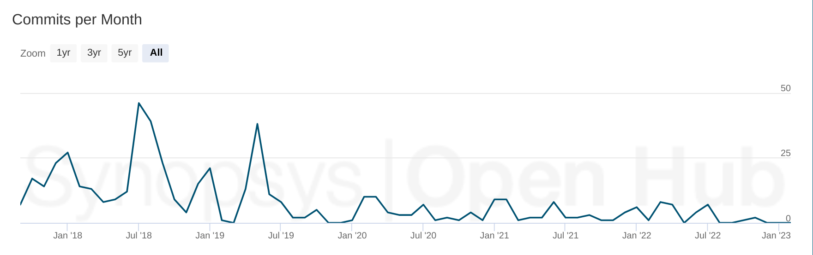
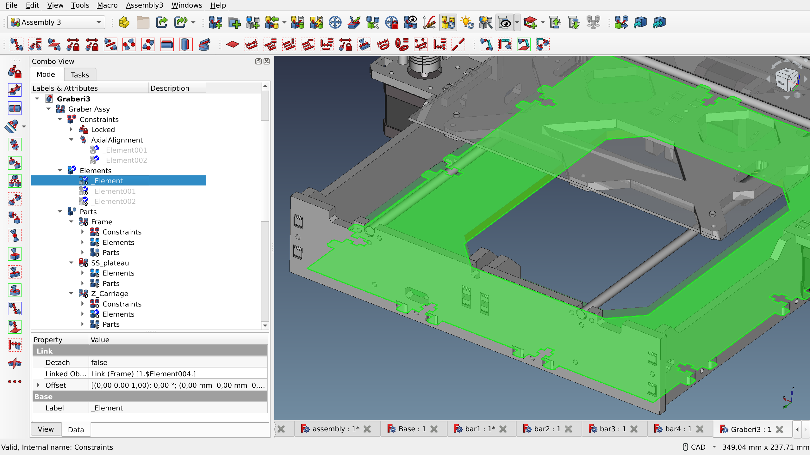
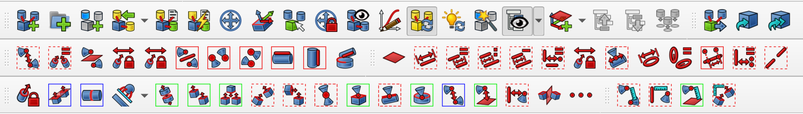
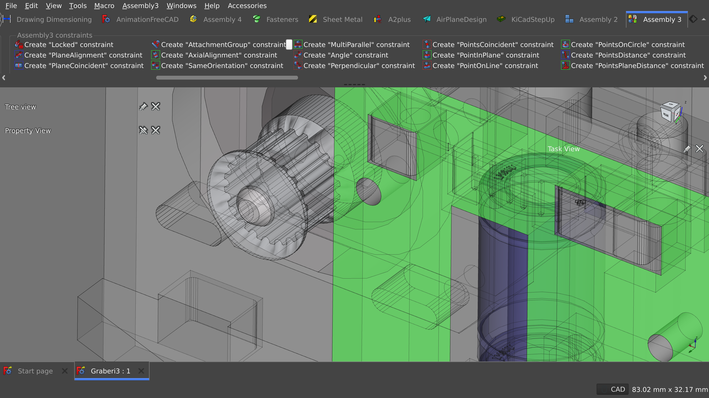
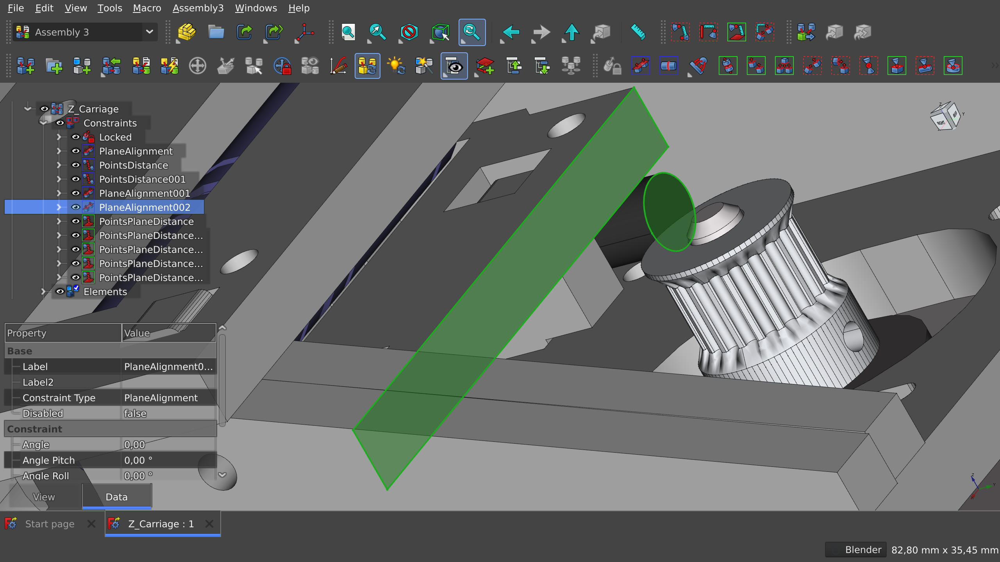

This is the fourth part in the series where we explore the possibility of creating a default assembly workbench for FreeCAD. We started out with a [conversation](https://ondsel.com/blog/default-assembly-workbench-1) about why we need a default assembly workbench in the program, then [reviewed Assembly 2](https://ondsel.com/blog/default-assembly-workbench-2) and [A2plus](https://ondsel.com/blog/default-assembly-workbench-3/). Now let’s talk about the Assembly 3 workbench.

<!-- truncate -->

## History

In 2013, Jonathan Westhues took the FOSS community by surprise releasing the source code of [SolveSpace](https://solvespace.com/index.pl), his parametric 2D/3D CAD software built around a very capable custom solver. Some 4 years later, Zheng Lei aka “realthunder” created a Python binding for the solver, then used it to create his own assembly workbench for FreeCAD.

Further changes in the workbench required [patching FreeCAD](https://github.com/realthunder/FreeCAD_assembly3/wiki/Link), so realthunder created a friendly fork of the entire program, which over time became his primary project with many other changes and add-ons not available in upstream FreeCAD by default: the pie menu, transparent docks, and others.

Some of the architectural changes have already been merged to upstream FreeCAD, others are getting there. The Assembly 3 workbench continues to be maintained and is available to users of upstream FreeCAD as an addon and is now part of this larger project, the ‘LinkStage’ fork.

## Workflow and ease of use

Assembly 3 is substantially different from other assembly workbenches in multiple aspects. Here are some of its most significant characteristics.

**Project hierarchy.** In A3, an assembly consists of constraints, elements, and parts. Elements are the features of parts that are used to create a constraint, e.g. a point of one part and a plane of another part. Assemblies can contain sub-assemblies, in which case each sub-assembly will carry its own set of constraints, elements, and parts. This approach makes navigating a complex project fairly straightforward.

[Graber I3 model by Nemesis81](https://github.com/Nemesis81/GraberI3_Freecad)

**Top-down design model.** This approach is technically available in A2 and A2plus, but it is not a recommended way of using those workbenches. Assembly 3 makes the top-down design model a first-class citizen. You can create new parts, then drag them into the Parts section of the project tree, then they will become usable in the assembly.

**Bottom-up design model.** This is likely how most A3 users approach creating assemblies. The workbench provides two ways to build an assembly from parts saved as external files: importing from STEP files or linking (see below) FreeCAD projects that are already opened in the program.

**Links.** A3 is not the only assembly workbench to rely on the [App::Link API](https://wiki.freecad.org/App_Link) to reference objects instead of copying them, Assembly 4 also does it. But A3 is what this API was designed for in the first place. The general idea is that if you have e.g. 4 screws of the same type to fix a motherboard to a plastic box, you don’t need 4 instances of the same screw geometry. You only need one part that you can reuse via links.

Creating a link, however, is all not at all obvious and requires performing a particular sequence of actions: selecting a part (Body object) in the project tree, then selecting an assembly document in the document tabs, then clicking a Link button in the toolbar. Figuring this out without reading documentation or watching a tutorial or asking on the forum is all but impossible.

**Fixing parts and freezing sub-assemblies.** While fixing a part in A2plus is a property of a part, the A3 approach is to select a feature and assign a “Locked” constraint to it to eliminate all or some degrees of freedom (this depends on the type of the selected feature). The idea of locking something entirely goes even further. When working on a complex assembly, a particularly useful way to simplify computations is to freeze a sub-assembly. Such a sub-assembly is considered fixed by the solver and is therefore excluded from update calculations.

## Features

Assembly 3 is the most feature-packed of all existing assembly WBs. It comes with over 40 constraint types, various helper tools, means to control workplanes, and more. It also has a dynamic solver, so you can move parts under constraints.

The workbench does its best to keep track of degrees of freedom to avoid overconstraining an assembly. However, in doing so, it doesn’t make it easy to indicate where the problem is exactly. All it does is notifying the user that there are inconsistent constraints. It is up to the user to locate the offensive elements and constraints.

There are more caveats. In particular, the vast amount of features in this workbench raises the expectations for UX/UI. Assembly 3 has an overwhelming UI. It comes with no less than six toolbars, three out of which are different groups of constraints.

There’s the main constraints group and two additional groups of constraints. This takes a lot of getting used to. We’ve seen experienced users of the workbench making really useful elaborate tutorials about it and yet failing to locate the constraint they need on the first attempt.

Things don’t get much better with the [ModernUI](https://wiki.freecad.org/ModernUI_Workbench) add-on that creates a Ribbon-like top toolbar. You get readable labels (something the late [Jef Raskin](https://en.wikipedia.org/wiki/Jef_Raskin) would appreciate), but you also get a large scrollable area:

[Graber I3 model by Nemesis81](https://github.com/Nemesis81/GraberI3_Freecad)

Assembly 3 is not uniquely complex here. Arch, FEM, TechDraw, and a few other workbenches also have a similar or even larger amount of UI to deal with. This suggests that there may be a need for a general UX/UI review and a better strategy for organizing the user interface and designing the interaction — something that would be solved on the core level and then propagated to all workbenches, default and 3rd-party alike.

Three sorely missing features are collision detection, visual control over degrees of freedom, and the generation of BOM. Collision detection was [planned](https://forum.freecad.org/viewtopic.php?p=253170#p253170) back in 2018, the idea was to use the [Bullet](https://pybullet.org/) physics engine, but this hasn’t materialized yet. Regarding DOF control, it is virtually impossible to find out how many degrees of freedom a part has without trial-and-error by attempting to transform it and — sometimes — looking at the output log in the built-in console (A2plus solves that by optionally displaying an indicator for each part in the viewport). And as for BOM, realthunder already [explored in detail](https://github.com/realthunder/FreeCAD_assembly3/wiki/Expression-and-Spreadsheet) the requirements for developing BOM generation two years ago, but there is no code yet.

The [wiki page](https://wiki.freecad.org/Assembly3_Workbench) for the assembly at FreeCAD’s website provides some basic documentation on features, and the project’s [own wiki](https://github.com/realthunder/FreeCAD_assembly3/wiki) explores basic concepts of A3 and provides several tutorials. However, neither can serve as a reference guide, hence finding out what some of the features do will require original research by users. Notably, there’s a lot of YouTube tutorials on using Assembly 3. Some of the most prolific A3 educators are [Oficine Robotica](https://www.youtube.com/@OficineRobotica/videos) and [Joko Engineeringhelp](https://www.youtube.com/@OficineRobotica/videos).

## Consistency

The workbench is generally consistent with how the rest of FreeCAD operates. In our testing, nothing stands out as particularly peculiar. A3 will also use parts created with other workbenches as long as the imported parts are moved into the Parts section of the assembly’s hierarchy.

[Graber I3 model by Nemesis81](https://github.com/Nemesis81/GraberI3_Freecad)

## Stability

Assembly 3 currently has over 300 unresolved bugs and feature requests filed to its [issue tracker](https://github.com/realthunder/FreeCAD_assembly3/issues). However, this cannot be used as a sole indicator of the maintainer’s responsiveness: for some reason, it’s fairly common for users to report bugs associated with FreeCAD itself rather than with the workbench in question. Given that the ‘Linkstage’ fork of FreeCAD also has over 300 unresolved bug reports and feature requests, this is obviously too much for one person to handle, even though he gets some help with triaging reports.

None of the currently open bug reports are crash reports for the Assembly 3 workbench. Having said that, we did experience a few random crashes when working with the WB. We also looked at workbench crashes reported in the past and found that realthunder pays a lot of attention to that and typically fixes those within several days.

## Performance

While it’s possible to exclude sub-assemblies from computation by freezing them and thus saving the resources for when they are needed, this will not be sufficient in all use cases. With complex assemblies (over a hundred parts), A3 can become really slow. 

Moreover, even in simple use cases (two parts, two constraints), Assembly 3 will often fail to perform an axial rotation smoothly with 1 DOF left, while the rotation increment is as small as 1°.

## Development Status

Although there have been contributions from at least a dozen more people, realthunder remains the author of 92% of all commits to the workbench since project’s inception. The project is maintained, however its active development phase ended in 2019. The last workbench release was tagged in 2020 and the latest internal version is 0.11.4 from November 2022. We also found that the development remains uncoupled from the upstream SolveSpace project: multiple changes and new features related to constraints appear to have never made its way to the workbench.

## Legal Status

Because Assembly 3 relies on a fork of SolveSpace’s source code, it’s available under the terms of GPLv3+. This makes its inclusion in the FreeCAD application problematic. Thus the workbench can only be installed separately in upstream FreeCAD as an addon.

## Summary

Assembly 3 is substantially more advanced than either A2 or A2plus workbenches: generally better workflow, better support for bottom-up design, better-designed project hierarchy, vastly more constraint options, and the list goes on. The project also has an avid user community and the developer is typically fast to respond to reports of severe bugs.

At the same time, A3 has a number of usability issues and important missing features such as BOM generation. The solver’s license also makes this workbench an unlikely choice for a foundation of a potential default workbench in FreeCAD.

## Next up

Now that we’ve explored Assembly 3, we are getting closer to the end of the series. In the next installment, we’ll take a close look at the Assembly 4 workbench developed by Zolko.
