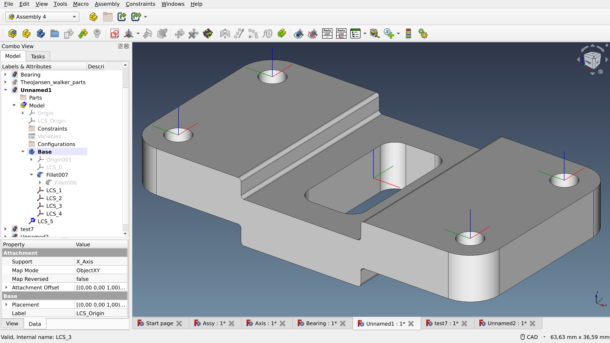
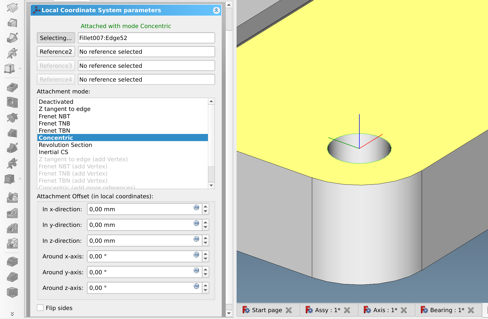
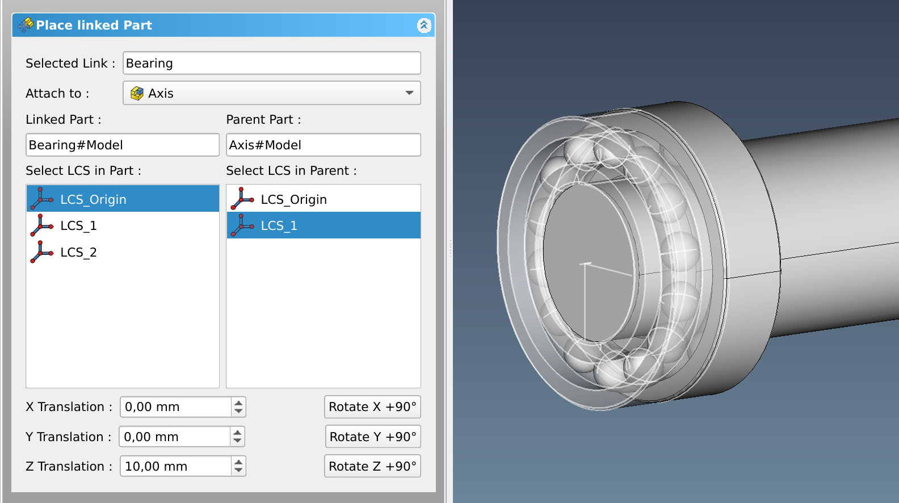
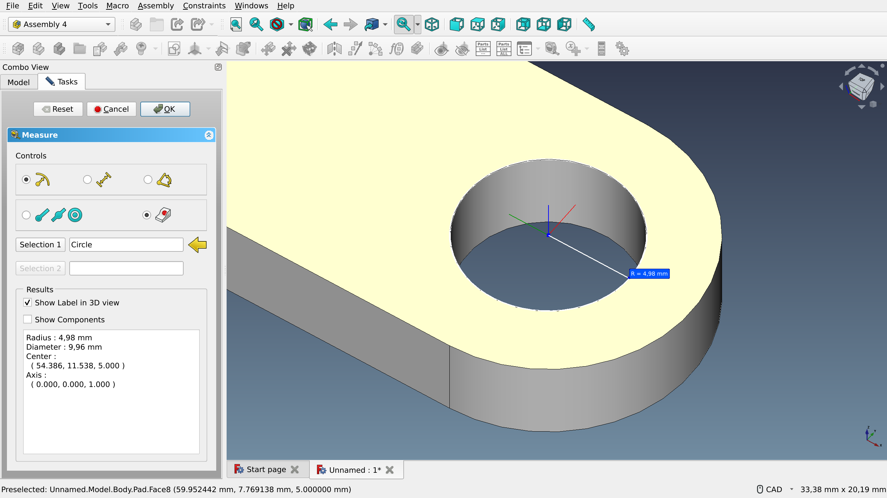
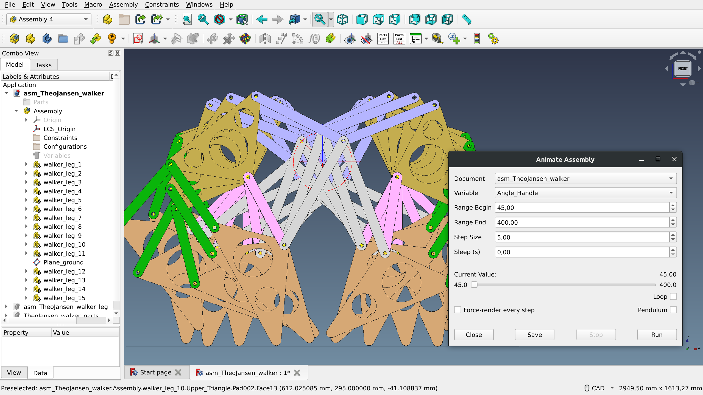

In the previous posts in this series, we talked about the need for a [default assembly workbench](https://ondsel.com/blog/default-assembly-workbench-1/) in FreeCAD and reviewed [Assembly 2](https://ondsel.com/blog/default-assembly-workbench-2/), [A2plus](https://ondsel.com/blog/default-assembly-workbench-3/), and [Assembly 3](https://ondsel.com/blog/default-assembly-workbench-4/). Let’s talk about Assembly 4.

<!-- truncate -->

## History

The project was started by Zolko in 2019 after some experiments with building assemblies without solvers. Zolko came to the community with extensive knowledge of other CAD programs such as Pro/E, Catia, and T-Flex, but he was very (and probably needlessly) humble about his programming skills.

Just like with other assembly workbenches, much of the development has been affected by the user community, and a number of features have been contributed by other developers. So far, A4 is the only assembly workbench where the development pace is about the same as it was when the project started, and Zolko isn’t done yet.

## Workflow and ease of use

Assembly 4 relies on several core principles.

First off, it is built around the [App:Link API](https://wiki.freecad.org/App_Link) that we already mentioned in previous posts in the series. In a nutshell, rather than creating a full copy of a part, FreeCAD will reference it. This makes models cleaner, and you always work with up-to-date geometry. The workbench also has the concept of a variant link which allows referencing the same object multiple times and using different parameters for each of the linked instances.

Secondly, rather than aligning characteristics of two parts (e.g. vertex to vertex), the workbench maps one local coordinate system (LCS) to another. Each body in a part can have multiple local coordinate systems. For example, the part on the screenshot below has 5 of them:

When an LCS is originally created, it is attached to a very specific feature of a part. However, if the geometry of that part changes, the LCS stays where it was. Which makes it unaffected by the dreaded toponaming issue (now being finally taken care of in upstream FreeCAD). The kind of a feature an LCS is attached to defines what attachment options are available.

Then when a new part is inserted into an assembly, the user specifies the parent part (which part to attach to), the source LCS (from the newly inserted part), and the target LCS (from the parent part):

Once both LCSs are aligned, all six degrees of freedom are fixed, and thus parts stay attached no matter what. It is, however, possible to “release” a DOF by using the attachment offset property and expressions.

We’ve seen multiple testimonials that the approach to assembling a model through LCS proves to be more predictable and robust. 

On the flip side, the process of setting all LCSs is rather tedious, and attaching one part to another means you have to make more clicks than what you typically get with regular constraints.

Finally, Assembly 4 supports both [top-down and bottom-up](https://caeuniversity.com/bottom-up-and-top-down-approach/) design models. We do need to point out though that with the bottom-up approach, it is impossible to insert a part from an external file without opening it as a document.

## Features

Because of how the workflow is implemented, Assembly 4 doesn’t have rows and rows of buttons to go through when you need to align one part with another. A large part of the feature set is about managing your assembly: creating new bodies and groups, inserting parts (there’s also a simple integration with the Fasteners workbench), mapping LCSs to each other etc. Apart from LCS, A4 allows creating more datum types: plane, axis, and point. Internally, those are all PartDesign objects.

A4 comes with its own tools for creating mirrored, linear, and circular arrays, as well as a measure tool:

For animation, Assembly 4 uses variables and [expressions](https://wiki.freecad.org/Expressions). For example, if you need to rotate a part, what you do is create a new variable and set it e.g. to 0, then use that variable in the _Angle_ placement property of your part, then open the animation dialog, select the variable to animate, set min and max values to feed into the variable, as well as the increment value, and run the animation.  

Theo Janssen’s [strandbeest](https://www.strandbeest.com/), [model by Zolko](https://github.com/Zolko-123/FreeCAD_Examples/tree/master/Asm4_Tutorial4) (CC0-1.0 license) 

The implementation is somewhat technical, but it works. The downside of all this is that due to the incomplete multithreading support in FreeCAD you can’t really stop the animation until the current cycle is over. Unfortunately, while animation does the trick in some cases, collision detection would still be really useful.

Despite the initial idea to not use a solver that got the entire Assembly 4 adventure going, Zolko did end up creating a solver to recompute all the links and placements in an assembly. In fact, as user ‘aapo’ [explained in a recent discussion](https://forum.freecad.org/viewtopic.php?p=670464#p670464), A4 has _multiple_ solvers and can use custom external ones. Even more, there’s a branch called [‘solver’](https://github.com/Zolko-123/FreeCAD_Assembly4/compare/master...solver) waiting to be completed and merged. It brings the A2plus solver to Assembly 4.

The workbench has good if somewhat scattered documentation. There are [instructions](https://github.com/Zolko-123/FreeCAD_Assembly4/blob/master/INSTRUCTIONS.md) for new users that explain features, basic concepts, and workflow. There are also [several tutorials](https://github.com/Zolko-123/FreeCAD_Examples) written by the principal developer in a dedicated GitHub repository. And some of the user documentation is in the [Examples](https://github.com/Zolko-123/FreeCAD_Assembly4/tree/master/Examples) folder of the main GitHub repository.

## Consistency

Assembly 4 does nearly everything in dialogs in the Combo View, which is a fairly standard practice. No surprises there.

The workbench can work with parts created by other assemblies, although in our testing it seems like a good idea creating local coordinate systems in those parts prior to inserting them for simplicity’s sake.

There have been [a number of problems](https://forum.freecad.org/viewtopic.php?style=10&t=40363) getting A4 to work well with the TechDraw workbench. Most of them reportedly have been fixed.

## Stability

From the Issues section on GitHub and the forum it appears that Assembly 4 is very stable. Users mostly have problems with the [Bill of Materials](https://github.com/Zolko-123/FreeCAD_Assembly4/blob/master/Examples/ConfigBOM/README.md) feature (there have been [recent fixes](https://github.com/Zolko-123/FreeCAD_Assembly4/pull/403) to address some of the issues). In our limited testing, A4 crashed a few times — mostly, when editing datum objects. The number of actual bug reports (rather than feature requests) on GitHub is very low (just 1 as of March 27). However, a number of bugs are known and reported to the forum.

## Performance

We found some complaints about A4 being slow with complex assemblies. One workaround that appears to improve the situation is disabling the preselection highlight (Edit > Preferences > Display > Colors).

## Development Status

Assembly 4 is an active project with a growing share of new contributors. There have been multiple tagged releases, and the latest internal version update was in February 2023.
Collectively, the community around Assembly 4 keeps the number of pull requests to an absolute minimum (just 3 open out of 245 ever submitted, as of March 27). Zolko responds to most of the bug reports within a day or two, although fixing some of the bugs may take longer than that.

## Summary

Assembly 4 relies on local coordinate systems to attach parts to each other. The workbench is fairly robust, there are very few severe issues reported by users. However, the LCS approach — as implemented in A4 — is low-level and implies a somewhat tiresome process of setting everything up.

The project has a small active team of contributors who keep the amount of unresolved issues and unmerged patches as low as possible. We also found the user community to be really enthusiastic and passionate about the project.

## Next up

In the next installment, we’ll take a slight detour and explore several assembly-like solutions: the Manipulator and Part-o-Magic workbenches, as well as the BodyBuilder macro.

