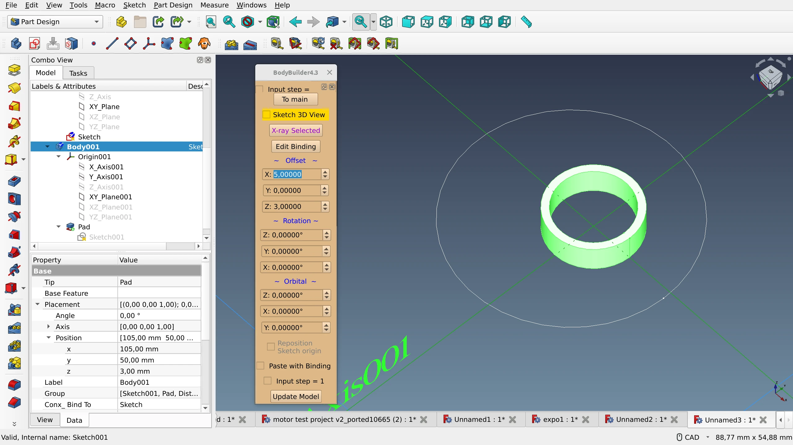
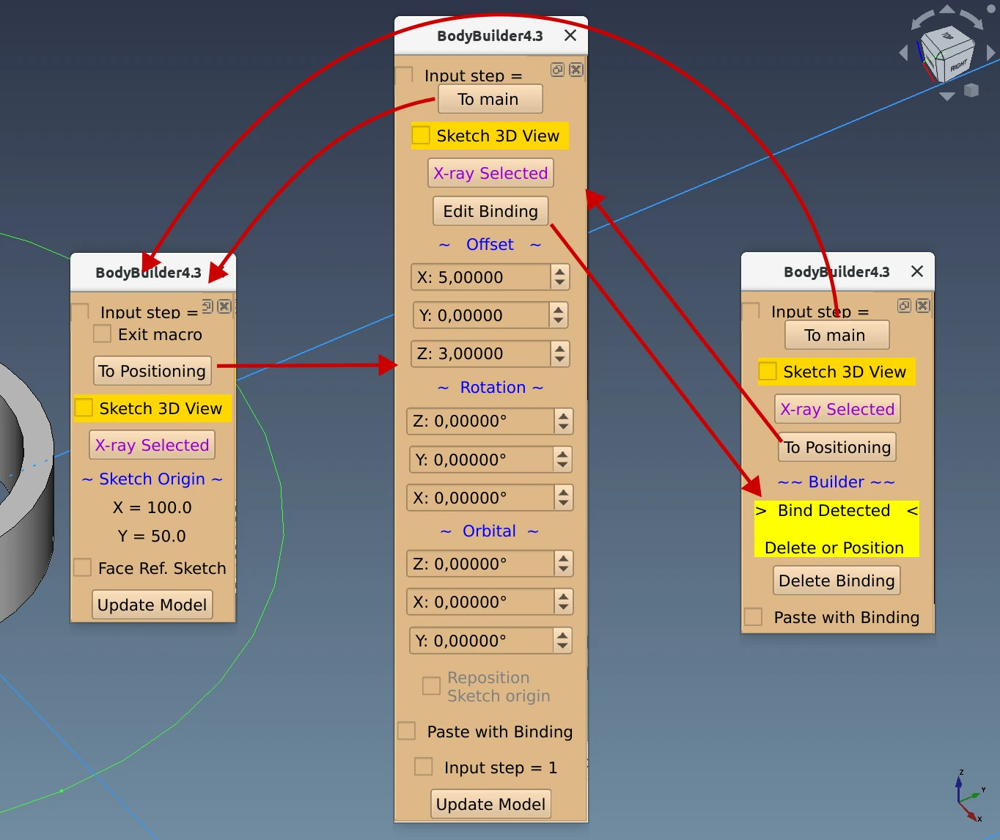
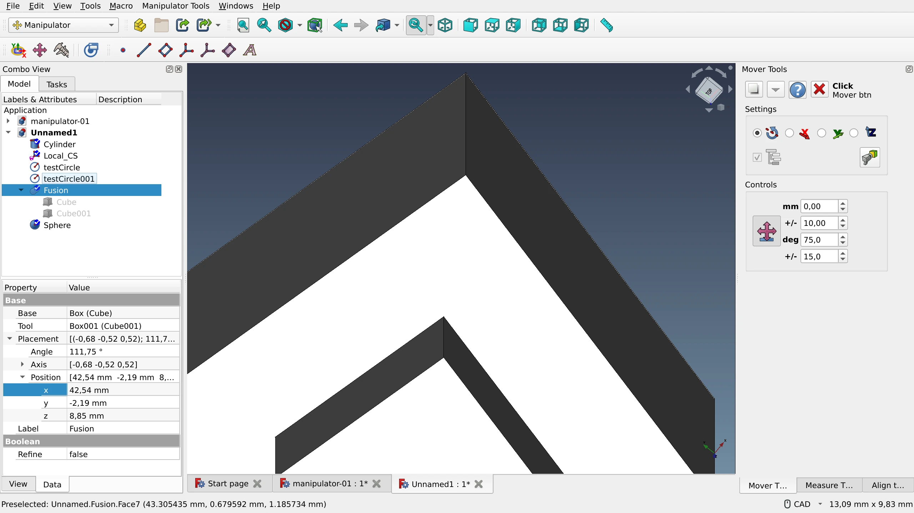
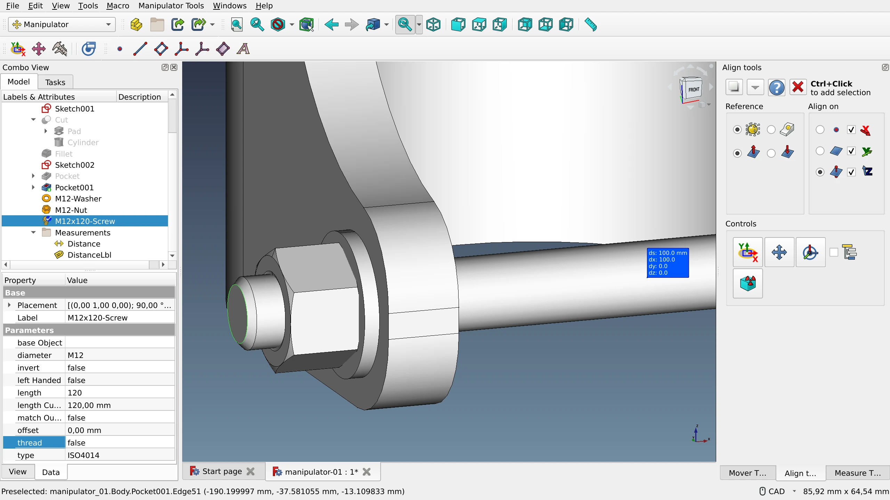
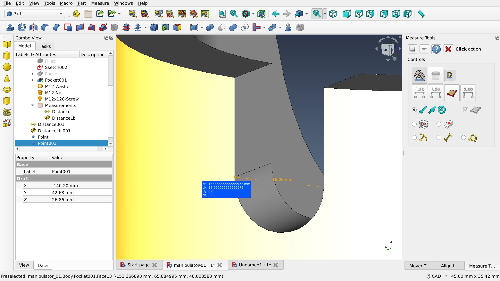
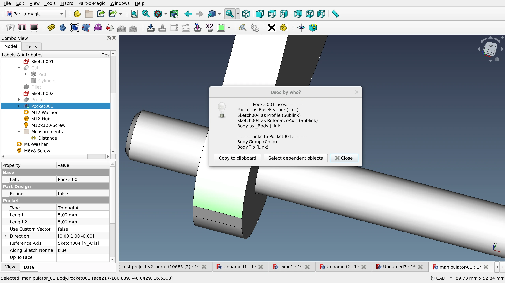

In the previous posts in this series we’ve already discussed reasons to create a [default assembly workbench](https://ondsel.com/blog/default-assembly-workbench-1) and then explored existing options: [Assembly 2](https://ondsel.com/blog/default-assembly-workbench-2), [A2plus](https://ondsel.com/blog/default-assembly-workbench-3), [Assembly 3](https://ondsel.com/blog/default-assembly-workbench-4), and [Assembly 4](https://ondsel.com/blog/default-assembly-workbench-5).

There are several more tools that provide a subset of their features, and these tools regularly come up in discussions on creating assemblies: the [BodyBuilder](https://github.com/Freedman-CB1/BodyBuilder) macro, the [Manipulator](https://github.com/easyw/Manipulator) workbench, and the [Part-o-magic](https://github.com/DeepSOIC/Part-o-magic) workbench. Since none of them can realistically serve as a foundation for a potential default assembly workbench, in this review, we’ll focus on their interaction models to see what we can learn from them.

But before we do that, let’s quickly discuss the topic of exploded assemblies — a representation of the assembly design where parts are roughly in the right position, but at a certain distance from each other. We considered looking at the [Exploded Assembly](https://github.com/JMG1/ExplodedAssembly) workbench in this post, because creating such a view is a very common use case. However, after a quick study we found the following.

First of all, it’s done differently across available commercial CAD offerings. It’s a part of the assembly toolset in Dassault Systèmes SolidWorks, Siemens NX, Ansys SpaceClaim, and BricsCAD Mechanical. It’s an additional default tool in PTC Creo and Onshape. And it’s part of the animation feature set in Autodesk Inventor, Autodesk Fusion 360, and T-FLEX CAD. So there’s no one right way to do that.

In FreeCAD, there are at least two 3rd-party workbenches for animation that have tools for exploding an assembly, Exploded Assembly and [Animation](https://github.com/microelly2/Animation). Another workbench, [Movie](https://github.com/Francisco-Rosa/FreeCAD-Movie), suggests using a [fork](https://github.com/Francisco-Rosa/ExplodedAssembly) of the Exploded Assembly workbench. And there are [other workbenches](https://jirivalasek.github.io/Animate/) that deal with animating moving parts.

On one hand, this indicates that the FreeCAD community is leaning towards seeing this as part of the animation feature set. On the other hand, there are perfectly sensible use cases like technical illustrations where you might want to place an isometric view of an exploded assembly onto a TechDraw page, and that’s probably outside the animation workbench’s jurisdiction. So it makes sense to revisit this topic later when we can give it our full attention.

And now let’s get on with additional assembly-like tools.

## BodyBuilder macro

According to the macro developer, ‘freedman’, the [rationale](https://forum.freecad.org/viewtopic.php?style=5&p=636992#) behind this project is this:

> I think many times new users and some of us need a model with just a few parts held together, we don't need the full assembler that does everything [...].

Getting started with this tool can be a challenge.  There is no step-by-step tutorial. There’s a [forum thread](https://forum.freecad.org/viewtopic.php?t=72997) with a couple of GIFs and a few test files, only. Here is how it works.

The general idea is that, while the BodyBuilder macro is [running](https://wiki.freecad.org/Macros), you select an object in the viewport, then a sketch in the tree view. As soon as you do that, the object in the viewport gets centered at that sketch’s origin.

But the points in sketches that you align objects to don’t all sit at (0;0;0) exactly, typically they are all over the place. So what you do when you create a sketch is you start it at the origin and then you use the Position property in Attachment Offset to move the sketch in the three dimensions. Once you set it up, you can align a body to that sketch.

Doing that means that the body’s Position (Placement) value changes to the point in space defined by the sketch's attachment offset.

You have several options for what to do next when you want to move that object.

* You can use the Positioning menu of the macro to set a relative offset that will increment the absolute values.
* You can set its position in absolute values, and for that the Properties dock is fairly sufficient.
* Or you can use the on-canvas Transform tool.

The macro has a kind of a menu, but really, it’s a different set of controls in generally the same space. The main menu allows looking at the reference sketch’s origin (has to be selected), setting X-Ray mode to the selected body to look through it, and switching to positioning settings. The positioning menu has offset, rotation etc. controls for the attached body. And the binding menu is where you initiate the binding of a body to a sketch or delete an existing binding.

Left to right: main menu, positioning menu, binding menu.

Once you get the hang of it, the macro works. It’s three clicks away if you have the Macro toolbar present, or a few more, if you have to use the menu. Workflow-wise, the main problem is repositioning the sketch origin, which takes some extra work. The trick is to open the macro menu, go to Positioning, double-click the sketch to start editing it, then add a point where the offset should be, enable the “Reposition Sketch origin” checkbox, then click on that newly added point. This will get you the desired attachment offset value.

So much like Assembly 4, BodyBuilder is built on top of existing core features, but it takes time to set everything up as compared to using constraints in Assembly 2/2+/3 workbenches.

## The Manipulator workbench

This workbench focuses on moving and aligning objects and does not allow creating permanent attachments with fixed degrees of freedom. The three major groups of tools are _Mover_ tools, _Align_ tools, and _Measure_ tools. All three have floating palettes that can be docked.

The Mover toolset is how you move and rotate selected objects along the selected axis using numeric input. All changes are relative and affect the absolute position of the object: e.g. if your part is already shifted and rotated, further changes will increment existing displacement and rotation.

If it wasn’t for the option to align the view to a selected face and then rotate around this custom axis, the entire set of Mover tools could be considered a duplication of the existing Placement functionality that allows to adjust absolute values with expressions.

The Align tools allow attaching objects by points, edges, centers, and planes to each other. The user has control over a number of options, such as:

* whether the bounding box or the center of mass of the reference object should be used;
* whether the alignment normal is inverted;
* which axis the object should be centered on (any combination is possible).

And then there’s the Measure tool that can get the radius of an arc or a circle, the length of an edge, the angle between two edges, and more. It works pretty much the same way as in other software: you need to select the first and the second elements when measuring distances between two objects or an angle between two edges. A single click on an arc or a circle will get you the radius, and a single click on an edge will get you its length. The extra label is optional and can be disabled.

This Measure tool has been modified and repurposed for the Assembly 4 workbench, so if you see similarities between them, this is not a coincidence.

The part of the feature set that deals with transforming and aligning objects has documentation and 3rd party video tutorials. Work with datum objects (points, lines, planes, LCSs), however, is entirely undocumented.

In a nutshell, despite its basic feature set and a certain overreliance on icons, the Manipulator workbench is a handy toolbox for making quick alignments. Moreover, the tools it provides are accessible in other workbenches like Sketcher, Part, and PartDesign. All you need to do is docking the floating palettes for your convenience.

## Part-o-magic workbench

The main point of this workbench is saner automatic management of the project hierarchy. PoM plugs into the core of FreeCAD and makes sure that all new objects are added to the active container no matter what workbench is currently used.

But there are other features like autohiding all parts and bodies other than the one you are currently editing until you are done. Or duplicating objects, transferring them from one container to another, locating dependencies etc. All that has its use when working on complex assemblies, particularly with the top-down approach to designing.

As FreeCAD starts gaining some of the features that PoM provides, the workbench is likely to grow obsolete.

## Summary

The main takeaway from exploring BodyBuilder and Manipulator is that there is a demand for making quick attachments of a small number of parts. So further work on a default assembly workbench should include research focusing on two things. First of all, it’s useful to understand the exact reasons people try to avoid using full-blown assembly workbenches for such tasks. Given that the UX/UI of BodyBuilder and Manipulator are not particularly easier than those of all assembly workbenches we reviewed earlier, this has to do either with project hierarchy, or with using constraints and solvers, or both. Secondly, the future default assembly workbench should be designed in a way that would keep the workflow lightweight and straightforward for these “simple” use cases.

As for Part-o-magic, some of the tools, like the deep copy of containers, look like features that belong to upstream FreeCAD.

## Next Up

We are concluding the series. In the next post, we will summarize our findings, as well as the takeaways from the public discussion, and suggest a way forward.	

