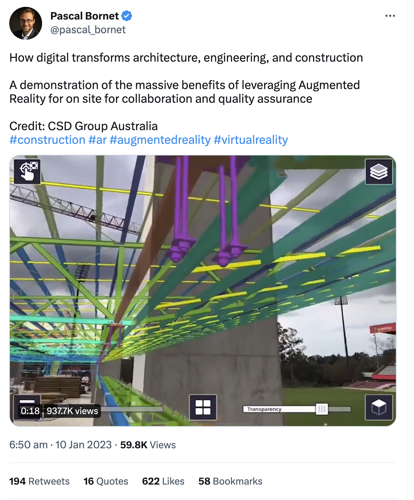

Summary/meta: We already have great tools for design. Where VR can really shine is in creating environments to experience those designs in context. 

VR CAD is usually portrayed like Tony Stark designing Iron Man suits, putting the emphasis on VR as an evolution of design tools. This is Hollywood stupid. VR design/UI isn't mature enough for that. Instead, we should be thinking about VR as a sharing environment where a designer can demonstrate a model in context. 

## VR for design is a long way from being useful

The current discourse around VR and CAD potential focuses too much on using VR for design: gamifying the experience and building things with goggles on. Design takes time—sometimes a LOT of it. Wearing VR gear for any period of time gets uncomfortable quickly and is both physically and mentally fatiguing. 

We do however have existing tools and applications for design work that already work well (and have decades of investment and optimization to leverage). Our keyboards, mouses, and monitors are still the best tools for this job and still have their place. 

## The real opportunity: Experiencing design in the metaverse

By getting swept up in ideas about moving to VR for design work, we risk overlooking the more realistic, near-term potential of VR: creating an environment to experience a design in context.

### Beyond visual twins

A digital twin is a virtual copy of something physical: an environment, system, asset, or process. It’s also dynamic, connecting real-world data to the twin, to help not just with visualization but with understanding and forecasting how the real thing will interact with its environment. For example:

>“Leaning on Omniverse, Ericsson created a digital twin of an entire city to determine the optimal deployment for their 5G rollout, using Omniverse to judiciously select and configure sites to maximize coverage and signal quality with minimal cost and complexity. To do so, Ericsson’s digital twin city tracks the physical world, with buildings and foliage 100% accurate, down to their surface materials and texture. In that world, Ericsson can accurately assess signal quality at any point in the city with a given deployment. And re-working sites— either upfront or at a later date for upgrade—can easily reveal how the coverage would improve (or not) in real time.” — Alex Herrera, [The Metaverse: Separating the Wheat from the Chaff, from a CAD Perspective](https://www.cadalyst.com/collaboration/digital-twin/metaverse-separating-wheat-chaff-cad-perspective-78906)

So far though, the concept of digital twins tends to be limited to what we see, but with VR and AR (augmented reality) there’s great potential to take the concept of a digital twin beyond the visual. 

>“What I've always been interested in is this idea of, how do we experience more of the things we're designing when it's on the other side of the glass? … What I long for is, for example, taking the many facets of a design and being able to see them work together … we should be able to take an object and, for example, turn it on. And we should see lights flash and you press a button and you understand how it operates. You should hear what it sounds like. … If I was a designer, I want to really understand the scale and proportion. I want to understand what it feels like, I want to see what happens as I interact with it. So these products that we design and make are so much richer.” — [Carl Bass, former President and CEO of Autodesk](https://cesium.com/open-metaverse-podcast/cad-and-the-metaverse/)

Where VR and AR really shine is in providing _context_ for what the user is experiencing when previewing or interacting with a design. The obvious use case is architecture, where you would be able to walk through a design in scale:

The same is true for other physical designs. You could show how a part fits into a model (think about an exhaust system under a car). 

You don’t just see the thing, you see the thing _in context_. You hear ambient sound, feel immersed, and can even interact with other people in a shared context. This is an ideal environment for discussing physical designs. 

### Immersive remote collaboration

There’s also an obvious use case in enabling the people working on such designs to collaborate remotely with one another in a shared context. Site visits and to get stakeholders in the same room to look at a prototype, while still useful, would no longer be necessary. 

This benefit extends beyond design though, to any remote collaboration. Imagine a FreeCAD HQ room in VR, for contributors to meet, have [discussions](https://forum.freecad.org/), and make plans in real time. Whiteboards and issue boards on the walls would add context to those meetings in a way that is otherwise hard to recreate with remote meetings. 

## Making 3D designs more accessible

3D designs are like the source code of the design world: read much more than they are written. While source code is mostly read by programmers and compilers though, 3D designs are read by many different people across many roles… and other systems. Because 3D designs need to be read by so many, the long-term opportunity here is to make them more accessible by enabling people to experience them from anywhere, _in_ context, and _outside_ of a dedicated application. 

If done well, the user experiencing the context doesn’t need to understand the controls of the software. They can look behind them by moving their head. They get an intuitive sense of scale because it’s related to their own bodies. The design becomes more useful by enabling people to access and experience it easily, in a range of different contexts. 

This is another area of rapid innovation and Ondsel doesn’t have all the answers. What we want to do is enable the community of FreeCAD users to explore these ideas—o find new ways to collaborate, create, and share their designs with each other.
