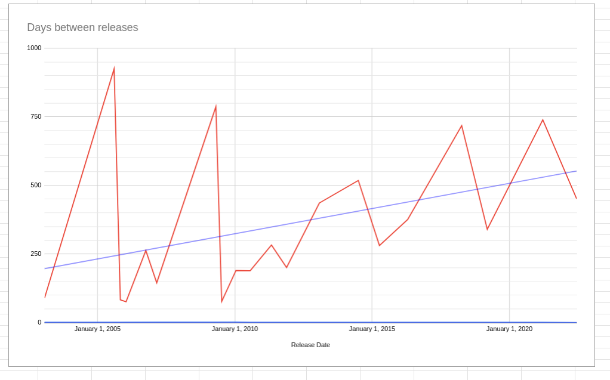

Historically, the development process in the FreeCAD community has been entirely volunteer-driven. This approach served the community amazingly well — up to a point. We got a very capable 3D CA* program out of it, but as the project grew, it became harder and harder to make significant changes. 

Case in point: the entire toponaming fix is going to span two major releases (0.21 and 1.0). Why? It involves patching a lot of code and writing a lot of unit tests. It also requires knowing the internals of FreeCAD very well and communicating well with lots of people. It takes a particular kind of mind to sit quietly for weeks on end and hack on a boring architectural fix. 

Similarly, improving UX/UI requires specific hands-on experience, as well as ability to cooperate. Fixing one task panel or layout is easy.  Making the whole application feel consistent and polished is quite another. And developing a default assembly workbench implies not only being great at many things at once (math, data structure design, UX/UI), but also encouraging a consensus among multiple stakeholders.  Doing your own thing is infinitely easier.

Many developers, especially volunteers, join FOSS projects for fun, to learn something new, and to improve their skills.  These people play an incredibly important and central role in FreeCAD’s future.  Sadly, being an individual contributor has become less fun and harder for these same reasons. 

The project is at an inflection point where the old way of working is stifling improvement and new methods are needed. The project is also large and mature enough to attract professional development. Ondsel is only the first company to do so, we have no doubts that more will follow.
What’s needed now is an approach to software development that lets commercial partners add value quickly but still lets individuals make significant contributions, influence the overall direction, and most importantly, have fun. 

As a commercial company with paid developers, we have the opportunity to encourage a different way of working. We see five areas where the project has outgrown its historical development approach.  These are all areas that formally served FreeCAD well but are now holding it back.

1. Project has historically had no roadmap. We introduced a global roadmap and have our own plan.

2. Project works in features. We're beginning to work in the CI methodology.

3. Project drives from pull requests. We drive from issues.

4. Project discusses important topics on the forum. We are using our blog and our GitHub tools to communicate and seek feedback.

5. The project community is mostly individual developers working independently. We work collaboratively and integrate multiple skill sets.

Some of these changes are already finding their way into the upstream project, others will hopefully be adopted by the larger FreeCAD community too. We hope these changes not only speed up the pace of development but also make it easier for volunteers to contribute effectively.

## Roadmap

As a commercial partner, Ondsel isn’t focused only on the short term features and bugfixes.  We’ve also got our eyes on the long-term vision. We started by stepping back and looking at the big picture. What are the fundamental limitations that are holding FreeCAD back from widespread adoption?

We strongly believe that working off a roadmap will help the entire community to focus on important things and make faster progress by planning features and setting priorities. So we proposed a [roadmap](https://freecad.github.io/DevelopersHandbook/roadmap/) for the core project that covers major topics that are universally acknowledged: model stability, integrated assembly workbench, better UX/UI and streamlined workflow, easier extensibility, better documentation etc.

Some of those items will be picked by volunteers For others, a team like Ondsel will have a better shot at completing a particularly sophisticated task.  In the latter case, we can communicate our proposal to the broader community and solicit input from users and contributors to shape the plan.

To that end, we are encouraging the use of [Projects](https://github.com/orgs/FreeCAD/projects) functionality on GitHub to keep track of the progress on larger issues that are part of that roadmap.

## Continuous Integration

The project typically moves forward one feature at a time. A developer gets an ‘itch’ that they’d like to scratch and works on a feature until it’s complete. They do this work in a dedicated feature branch and then submit a PR to merge the feature branch. There’s two problems with this.

First, this approach doesn’t work for features or fixes that imply either cooperation of many volunteers or a long solo effort by one contributor. Especially in the latter case, there’s a huge risk that work will be abandoned before it’s completed.

Secondly, complex features and large changes result in massive pull requests that must be evaluated. Going over commits in a large branch can take a long time. Meanwhile, those feature branches must be continuously rebased until they are accepted and merged. All this means extra work for both the project maintainers and contributors. The FreeCAD community has grown to accept this reality as the normal state of affairs, “it’s done when it’s done”. The outcome of this, however, is that contributors burn out and release cycles grow longer, from an average of 200 days to almost 550 days.

A better approach is to work in a continuous integration methodology. We can break up large features into many small, atomic commits that don’t break the master build. We can send pull requests for each of them allowing the work to be merged until the final feature is enabled. This will make the entire process far more manageable, which is especially important for modules where maintainers are volunteers. Here at Ondsel, we have already switched to this methodology as part of the work on fixing the toponaming issue.

## Driving from Issues

Ondsel has been working with the FreeCAD developer community and the FPA to formalize the contribution process. The [Developers Guide](https://freecad.github.io/DevelopersHandbook/) is one of the outcomes of that. 

Unfortunately, many contributions are still received as PRs that have had no prior discussion. The way it usually works is that someone finds a bug or identifies a missing feature and sends a PR to fix the bug or add the feature. This may be the first time ever that the community has heard of it.

Out-of-the-blue patches like that can cause problems: 

* The community agrees that the problem exists but disagrees about the solution.
* Sometimes a lengthy debate ensues, whether the feature should be accepted at all, whether the assumed bug is actually a feature etc. 
* Sometimes a valid solution needs to be implemented elsewhere in the application but the contributor isn’t interested in doing that work because it doesn’t affect them personally.

There are ways to manage development communication better.

Ondsel will drive from issues. We’ll submit issues for discussion ahead of time to verify that the bug or feature is legitimate. We can use the input provided by users and other contributors to figure out the best way to achieve the goal before we do the actual work. Then when the PR is finally submitted, the only remaining discussion should be about the quality of the code. We believe this will eliminate some conflict as well as late-stage user feedback, result in less patches sitting in the limbo and half cooked features, and let the entire upstream project move forward even faster.

We already started doing so, one example is a proposal for making assembly workbenches [compatible](https://github.com/FreeCAD/FreeCAD/issues/9278) on the data structure level.

## Moving important conversations off the forum

The FreeCAD forum has long been the center of the FreeCAD ecosystem. It is where development discussion has happened side-by-side with user support, general community discussion, and work coordination for translation, wiki, etc. As the project has grown, we’ve started to outgrow the forum, and communication has become less productive.

First, the amount of traffic means many important topics get lost. A topic about a bug can rapidly grow to multiple pages and dozens of replies. The conversation often gets off-topic, so it becomes impossible to keep up.

The same topics can get discussed many times in unrelated threads and multiple languages. Useful and important information becomes difficult to extract, and decisions never get recorded or followed up on.  Most troubling for a software project, the discussion never gets linked to the source code or a pull request discussion.

The forum still serves an important role but it is less and less effective for technical discussions about the source code and related topics. We think the project should embrace a wide set of communication tools that are each appropriate to the type of conversation needed.  Video meetings via Zoom and Jitsi are great for making plans. Real-time chats via Telegram, Gitter, Matrix, and Discord are great for working collaboratively on technical issues. 

We encourage the project to keep technical discussion as close to the source code as possible. GitHub issues and pull requests allow a richer conversation in context with the source itself. Using labels and projects keeps conversations relevant and organized. This should help eliminate duplicate discussions and make useful input from users and contributors easy to locate and analyze.

Additionally, we use this blog for sharing ideas that are too broad for issues and pull requests but could serve as a reference on GitHub. The blog lets us take the conversation “up a level” and reflect on topics that deserve more time to consider.  We mostly rely on the traditional “problem statement -> research -> analysis -> proposal” approach.

## Collaboration

Most FreeCAD contributors work independently. From time to time, they coordinate their efforts and work together to achieve a larger goal. This requires agreeing on a number of things: what work should be done exactly, who will do which part of it, what time frame for completion should be set etc. This is hard to do as there is little infrastructure or established processes for team work.

Ondsel engineers can work together in a more organized manner. We can set priorities and goals that are consistent with FreeCAD direction and also work with Ondsel’s product strategy. We can include outside experts and volunteer developers when required.

We think this kind of collaboration is the most important thing because it flows from doing all the other things better.  By planning, communicating, and working in small discrete steps we can share the burden and collectively move much faster.  We also avoid relying on [one or two people with special skills to keep the project afloat.](https://en.wikipedia.org/wiki/Bus_factor)

## In Conclusion

Since much of the work we do directly affects the upstream FreeCAD project, we expect that the proposed work methodology changes — planning the work, atomizing large changes, and keeping discussions structured — will result in a more streamlined development process overall. 

It is our hope that at least some of these changes will prove to be efficient and will eventually become the standard for the larger FreeCAD community.

As we flesh out the details of new work processes, we will document them in [Ondsel’s own developers’ handbook](https://ondsel.com/docs/handbook/).
