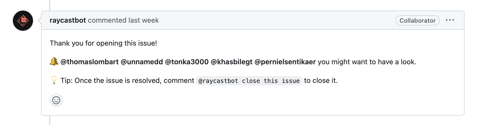

Discussions about FOSS issue practices often center around getting issue creation right. Have we set contributors up for success with guidelines and issue templates? Are we asking them to look at existing issues for their proposal first? These are bare minimum requirements. 

We act like someone creates an issue and throws it over the wall, after which someone else picks it up to move it forward—all of which hinges on writing a good issue. If the issue goes stale, it wasn't a good issue, right?

But issue creation should be _the start of a conversation_, and for that, maintainers should be heavily involved in collaborating on issues. [Stale PRs](http://danluu.com/discourage-oss/) get a lot of airtime, but issues habitually going stale is just as bad for open source project velocity.  Effective issues—the ones that actually result in meaningful change—invite conversation and encourage action, and maintainers can play more of a role in fostering that type of issue than you might think.

## What makes a good issue?

[FreeCAD's contributing document](https://github.com/FreeCAD/FreeCAD/blob/master/CONTRIBUTING.md) and [process for contributions](https://github.com/FreeCAD/FreeCAD/blob/master/CONTRIBUTING.md#6-process) serve a number of [goals](https://github.com/FreeCAD/FreeCAD/blob/master/CONTRIBUTING.md#1-goals), such as providing transparency and fairness, and enabling faster inclusion of contributions while preserving code quality. We can extrapolate a lot about what makes a good vs bad issue from the [Contribution Requirements](https://github.com/FreeCAD/FreeCAD/blob/master/CONTRIBUTING.md#5-contribution-requirements). 

| What is a "bad" issue?                                                                                      | What makes a "good" issue?                                                                                                                      |
|-------------------------------------------------------------------------------------------------------------|-------------------------------------------------------------------------------------------------------------------------------------------------|
| Raises a suite of problems                                                                                  | Focuses on one problem to solve                                                                                                                 |
| Focuses on the desired feature or functionality, what it looks like, how it behaves, what options it offers | Describes the user's goal and what is standing in the way                                                                                       |
| Tells the developer what to do                                                                              | Tells the developer about the problem the submitter is trying to solve (including current workarounds that help devs to understand user intent) |
| Requires maintainers to visit external links and read other material to gain context                        | Is complete and self contained                                                                                                                  |
| Proposes something that's out of scope for the project/doesn't seem to fit with roadmap                     | Fits naturally into project roadmap and can be justified by it                                                                                  |

Well defined issues are like [Nerd Sniping](https://xkcd.com/356/). They're hard to ignore and inspire creative problem solving. We can expect issue authors to at least familiarize themselves with a project's contribution guidelines and issue templates and make an effort to provide a complete issue. If an issue isn't getting continuous attention though, that's a sign that the issue needs improvement.

## The role of maintainers

Beyond the usual [expectations of maintainers](https://ondsel.com/blog/contribution-barriers/) (engage kindly with contributors, respond in a timely manner, give regular updates), we can think about maintainers' responsibilities in two stages:

### Before an issue is created

The discourse around open source project issues tends to focus on this stage, and the common advice is to provide adequate guidelines and issue templates to help contributors create issues that meet requirements. 

### After an issue is created

Beyond contribution guidelines, maintainers should use automations to streamline the contribution process and encourage momentum. [raycastbot](https://github.com/raycastbot) automatically @ mentions contributors who have worked on that specific Raycast extension in the past:

VS Code has a host of [Issue Triage GitHub Actions](https://github.com/microsoft/vscode-github-triage-actions) that perform housekeeping tasks like [closing stale issues](https://github.com/microsoft/vscode-github-triage-actions#stale-closer) or [requesting a translation of issues not written in English](https://github.com/microsoft/vscode-github-triage-actions#english-please).

These practices can relieve some of the burden on maintainers so they have more time to dedicate to the more impactful, vital part of a maintainer's role in issue management:

#### Proactive involvement and collaboration on issues

Even with the above practices in place, sometimes even a well defined issue goes stale. It might represent an extreme edge case or an inconvenience that users have found ways to work around. These issues often get overlooked because they aren’t seen as part of a bigger initiative. Maintainers can help by tagging these issues appropriately and adding them to projects where they form part of a bigger context. 

For example, an issue describing a minor UI tweak might be widely regarded as a good idea and still might be ignored because it’s always judged as less important than something else. But if the same issue is put into a project for general UI improvements, then its relevance and potential impact is more pronounced.

This is one example of how maintainers can help by making a conscious effort to review and revise issues. Holding regular meetings to walk through and refactor issues can turn non-starter issues into active and actionable discussions, just by:

* Improving the titles to make them more clearly describe the problem to be solved
* Proposing solutions and workarounds
* Requesting clarification from the submitter
* Writing user stories
* Narrowing the scope or splitting the issue into multiple, more manageable ones
* Merging duplicates
* Tagging and labeling
* @ mentioning the right people to get conversation going
* Closing issues that are out of scope or stale

Some of these actions can be automated as described above, but meeting regularly to review open issues lets you catch ones that have slipped through the cracks.

### Thinking beyond bugs and problems to solve

For maximum effect, the scope of issues should extend beyond new features and problems to solve, to housekeeping and project maintenance.

FreeCAD's issue requirements may be thorough, but there are other aspects of the project that aren't managed as well. For example, the project's backporting requests are currently managed in a [forum thread](https://forum.freecad.org/viewtopic.php?t=69437&start=70), which isn't great for organization or visibility. 

If backporting was managed via issues grouped into a project, we'd have better visibility into progress and the status of the release as well as the ability to build release notes easily.

Giving greater status and attention to issues as a primary vehicle through which discussion happens and progress is made also has the effect of bringing forward discussions and debates about value judgments. When these discussions happen early in the cycle, rather than at the PR stage, you're more likely to get changes and new developments that align with your roadmap and move your project forward.

## How you can help

You don't have to be a maintainer to be part of the solution. [FreeCAD](https://github.com/FreeCAD) is experimenting with GitHub projects and could use a lot of help with organizing the issues in line with [the improvements outlined above](#proactive-involvement-and-collaboration-on-issues). Your contributions are welcome!

