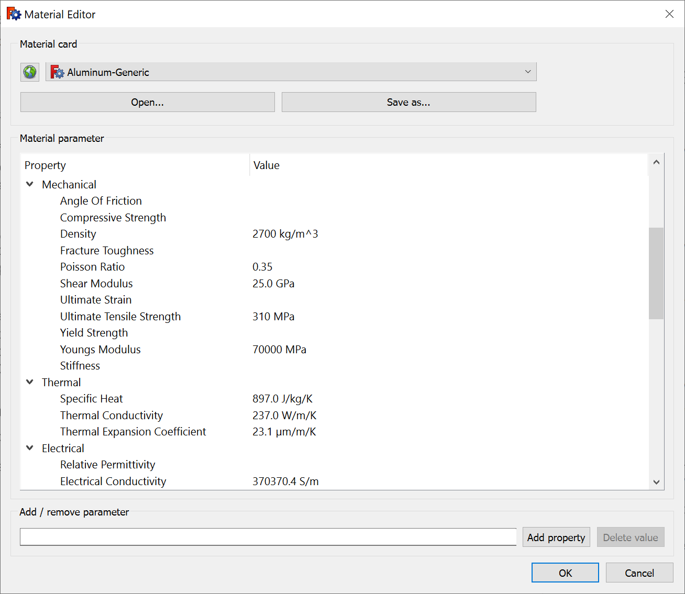
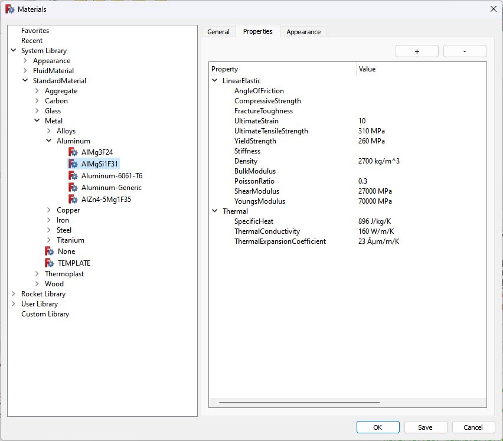

FreeCAD has a basic implementation of a materials system. While it works in some scenarios, we think it can be vastly improved to become a lot more useful. Let’s discuss what’s already available, what’s missing, and what’s a possible way forward with this. But first, why are we even discussing it?

<!-- truncate -->

We are introducing a new co-author in this post. Dave Carter has been a FreeCAD user since v0.16 (primarily for rocketry and 3D printing). He worked over 40 years as a software developer in government, supply chain, and automotive industries. He is the main person behind the [Rocket](https://github.com/davesrocketshop/Rocket) workbench that helps design model and amateur rockets and components for them. Dave volunteered to lead the effort creating an updated materials system for FreeCAD and has been actively working towards that goal for the past several weeks.

## Why A Good Materials System Is Important

Materials are a lot more than the color of solids in the viewport. As engineers, we need basic mechanical properties like density to calculate mass. We need advanced mechanical properties, as well as thermal and electrical properties to run various simulations (think finite element analysis). We need vendor-specific data to make an estimation of material cost. We also need materials to make commercial-grade rendering easy.

So a good materials system needs a database of materials with mechanical, thermal, electrical, architectural, and other properties. But it goes even further than that.

We know that materials behave differently depending on environment conditions. For example, we know that Young's modulus of metals decreases when temperature increases. So a materials system has to provide tools to build relationships between different material properties. Otherwise simulations won’t provide usable results.

Is that all? Nope. A concrete wall will have a first coat and then a finish. A model rocket will have a primer paint on top of the body, and then a coat of spray paint on top of parts of the primer paint. So a good materials system has to be able to deal with compound materials / multi-materials.

It’s also a great idea to have a more or less uniform UX/UI for working with materials in different scenarios. An architect by trade can be a tinkerer in their spare time, making Arduino-based devices, small home automation projects, and the like. They would appreciate not having to re-learn everything just because it’s a different set of tools in the same CAD system they use.

## So What’s Wrong With What We Already Have?

Let’s take a closer look at what’s currently available in FreeCAD. A major part of the existing materials system is the Material Editor:

It relies on a small catalog of materials (slightly over 100) available throughout FreeCAD. For each material, it’s possible to set properties in several categories:

* Mechanical
* Thermal
* Electrical
* Architectural
* Rendering
* Vector Rendering (hatching)
* Cost (vendor-specific)
* User-defined

Custom properties can be added to the user-defined category to accommodate for workflow specifics.

The existing materials system is currently used in FEM and Arch workbenches that are available by default, as well as in 3rd-party workbenches like [Rocket](https://wiki.freecad.org/Rocket_Workbench) and [Render](https://github.com/FreeCAD/FreeCAD-render).

All this is a great start. But there are also various issues. Here are just some of the more obvious ones:

* It is impossible to set a different material to every face of a part. You can have a piece of metal or block of concrete with a coating on one side and nothing at all on the other one.
* Multi-materials are only possible in the Arch workbench, but that is not enough. Any metallic or plastic solid and a paint job already make it _at least_ two materials.
* It should be possible to override properties set in the material card in a more or less uniform way. Maybe a variation of a material has slightly different mechanical or thermal properties, or maybe a building materials supplier is setting a different cost on a per-project basis.
* Material cards do not account for real-life behavior of materials, e.g. some physical properties may vary with temperature. A common use case is [describing different CTEs at different temperatures for FEM](https://forum.freecad.org/viewtopic.php?p=461640&sid=cb795e11170e14ba824af3b437645500#p461640). Moreover, the existing system only allows for isotropic materials that behave consistently regardless of direction. Orthotropic materials, such as wood, have different characteristics depending on direction: against the grain is stronger than with the grain.
* Texture mapping is separate from the material settings and only allows loading a texture file, with no positioning settings.
* Material information is not accounted for when importing/exporting from/to some file formats.
* There are no built-in functions to use the material data to make basic calculations such as weight, or cost.
* There’s no easy way to tell which part of an assembly doesn’t have an assigned material.
* The material editor has no UI for categories. It works as long as the list of materials is relatively small, but this will become a problem once the list is expanded.

This is just scratching the surface.

## Previous Attempt at Fixing The Materials System

The topic of improving the existing materials system has been brought up before. Around 2016, a contributor named Eivind Kvedalen attempted to fix some of the issues, in particular: arbitrary properties, per-face materials, infrastructure for a material database. He made two commits in a public fork on GitHub, and continued the discussion. But eventually this initiative went into slumber. Right now, the fork needs further work to even compile.

As is usual in the FreeCAD ecosystem, people also attempted to come up with various workarounds. The 3rd-party [Arch Textures](https://github.com/furti/FreeCAD-ArchTextures) workbench exists solely to work around the limitations of the built-in texture mapper. The [FCinfo](https://github.com/andreasBihlmaier/FreeCAD) macro helps make basic calculations based on mechanical properties.

## What The Updated Materials System Should Be Like

Having studied the subject, here’s the gist of what we think the new system should be like.

FreeCAD needs a **way to store materials data** in the project. If you created an assembly and used materials with custom properties (even if it’s just the material cost because you got a discount from your supplier), your team or contractors should be able to open that file and see assigned materials and related data.

There have to be **per-face / per-solid materials and multi-materials**. This shouldn’t be an Arch-specific feature like it is now, it has to be available for all workbenches.

There needs to be a **more uniform UX/UI for selecting material and overriding its properties** one way or another. The set of properties may vary between workbenches, but UI for overriding should follow the same design pattern.

It would be an absolute must to have an easily** accessible calculation of basic part properties**. Users should be able to easily see the weight of one part or an entire assembly.

We definitely see interest in having **texture mapping and probably hatching** as part of a material, with advanced settings. Advanced UV editing could be done by 3rd-party tools, but the basics of texture mapping should be there.

The **material editor has to be enhanced**: materials should be pre-organized into categories, have tags, rendering preview etc. The list of materials should be searchable.

There’s a strong requirement to be able to **set relationships between properties for realistic simulations**. There are multiple approaches to do that. We can do it with curves (like SolidWorks does) or by making multiple entries with an associated temperature range (or pressure, or whatever).

It’s generally a good idea to have **easy access to up-to-date vendor data on materials** where possible. There are many existing materials systems, [here](https://github.com/Moult/IfcClassification) are just some of those in the architecture department. We know that accessing up-to-date information won’t be easy. When APIs even exist, they are typically not public or documented. And even there we’d be extremely cautious, because setting cost implies responsibility, and FreeCAD needs to be very clear where that responsibility is.

## The Way Forward

Because of how far-reaching the implications of the materials system are, we think bringing it to the state of the art needs to be a community project with all major stakeholders involved.

There’s a small task force building around this project.

Ondsel made a start on analyzing what makes a materials system great, explored implementations in various other CAD programs (SolidWorks, Inventor, Onshape, Revit, Archicad), studied the existing implementation in FreeCAD, and put together an initial list of requirements.

Dave Carter, the developer behind the Rocket workbench, volunteered to lead the effort and already [made good progress](https://forum.freecad.org/viewtopic.php?style=4&p=685834#p685834) towards designing a better material editor and replacing the old material cards storage system with human-readable YAML files.

The first stage of this project is just that: new materials editor UI, new file format for material cards, and over 600 categorized materials. It’s a work in progress, you can see the updated material card UI on the screenshot above. 

The second stage will involve physical properties, relationships between those, and appearance settings.

After that, work has to be done on finalizing the UI, polishing icons, writing documentation etc.

There are also a number of considerations to be made, depending on feedback from users and developers. More on that below.

Once we collect more information, we will analyze it and submit a public proposal in FreeCAD’s issue tracker for everyone to see and comment on. We’ll then do our best to help all interested parties to complete this project. We discussed it with the FPA, and a grant is possible.

## What’s Ondsel’s Interest In A Materials System

There are multiple reasons for Ondsel to be involved with (and lead) this initiative.

Ondsel’s platform is primarily FreeCAD users, so the better FreeCAD is, the more users it has, the more customers the company gets (and thus the more Ondsel can invest into improving FreeCAD further). So the company needs FreeCAD to be excellent in every aspect. A great materials system is part of that.

Ondsel is also considering implementation of some features like commercial-grade ray-tracing in the online service that will directly depend on a materials system.

Thus the company is interested in working with anyone willing to implement a better materials system and support them as much as we can. Dave made an impressive start on revamping the entire system, but he will need help.

## What You Can Do

There definitely are ways you can be part of this initiative.

If you are a user, we are interested to know more about your workflow specifics:

* How do you use materials in FreeCAD or elsewhere?
* What materials-dependent simulations do you run? What material properties do they rely on?
* What type of materials do you deal with on a daily basis? What’s their variety? How often do you add custom materials?
* Are there specific material vendors you deal with? Do they make it easy to access materials data?
* Do you use the Appearance dialog to change the look of parts? How would replacing it with something actually based on materials’ appearance settings affect your workflow? 
* What file formats do you import/export that require materials support?
* What are your appearance/texturing requirements for materials?
* What are your sources of material physical properties?
* Would you be more comfortable with a purely offline materials database, an online materials database like [Materials Project](https://materialsproject.org/), or a combination of both?

If you are a workbench/macro developer, what specific requirements for a materials system does the materials team need to know about? If you are a developer with experience programming materials’ look and feel, please contact Dave.

We’d love to have you join the [discussion](https://forum.freecad.org/viewtopic.php?style=4&t=78242). If you agree that better materials will help make FreeCAD great and don't have any feedback to offer, please consider [donating to the FPA](https://wiki.freecad.org/Donate) so that more contributors get support for improving FreeCAD.

And last but not least, Dave Carter’s initiative to take matters into his own hands is precisely the kind of practical approach to improving FreeCAD that we’d love to see more of. If you are a user who shares this view, please consider donating to FreeCAD Project Association’s [developer fund](https://fpa.freecad.org/programs/fpadf-announcement), so that active contributors getting funding would become the norm.
