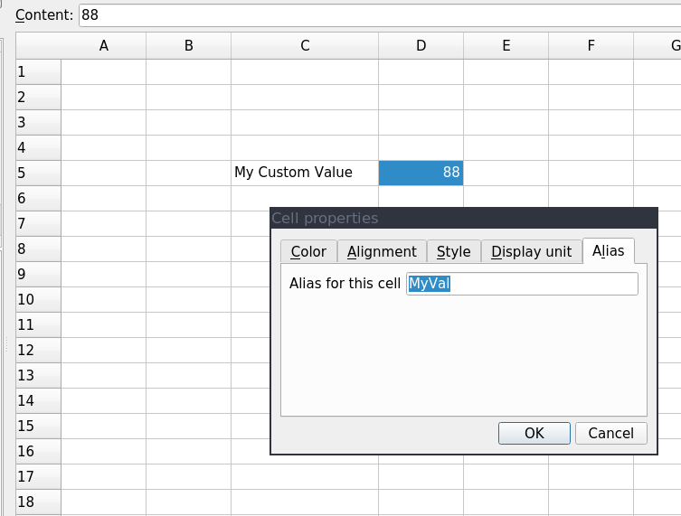
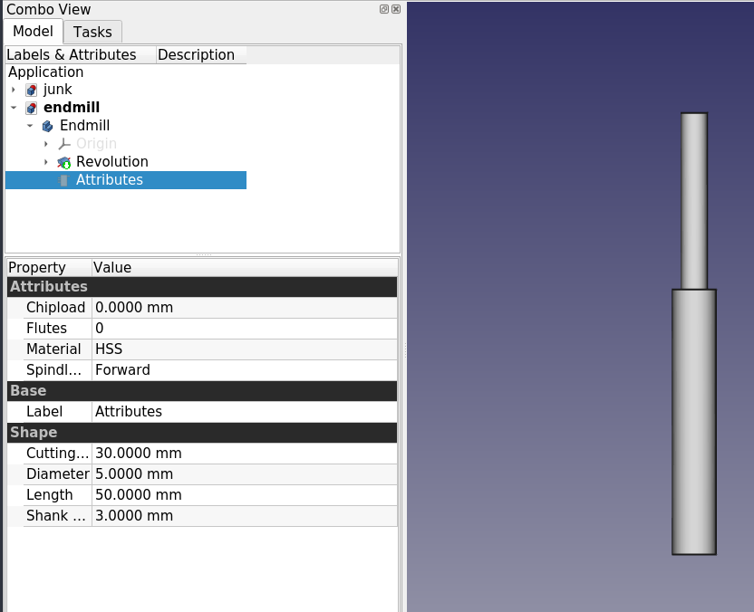
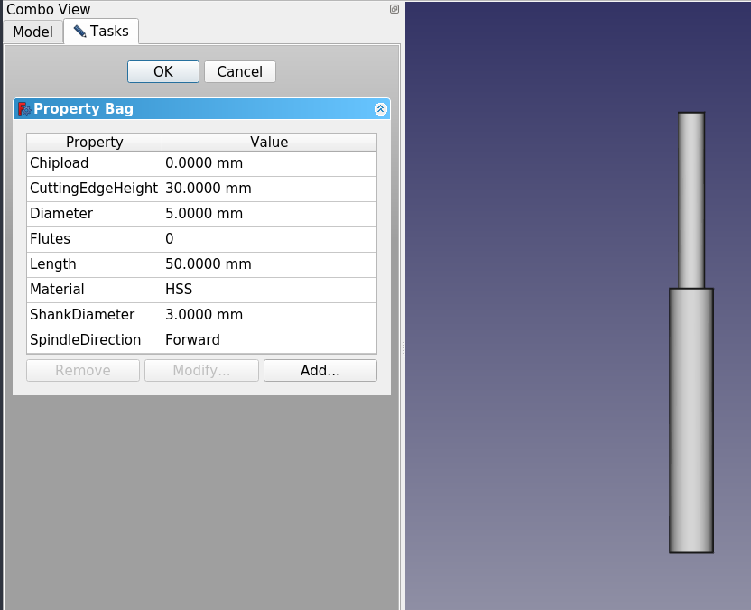
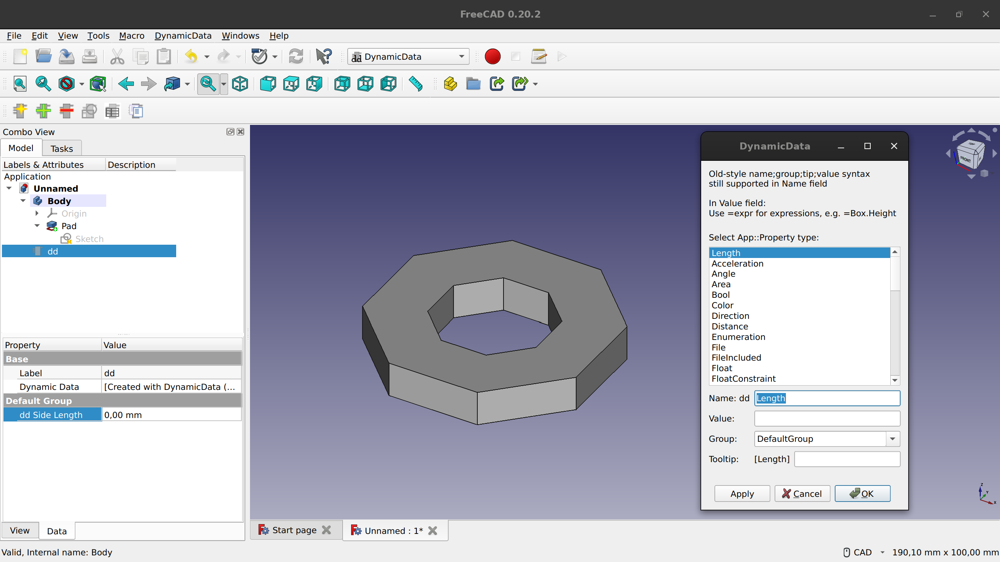
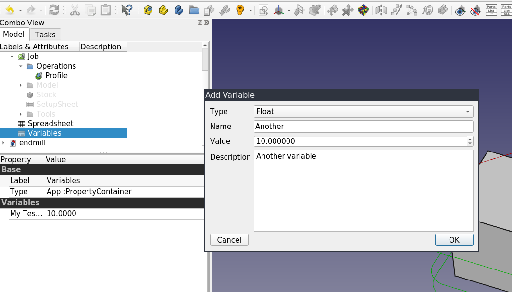
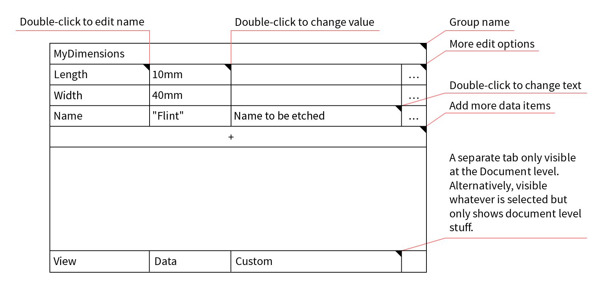

One of the sorely missing features in FreeCAD is a convenient system for creating custom data elements and interacting with them.

A common use case is constraining multiple features in a sketch to the same value. Instead of tweaking every instance of a horizontal distance constraint, you would create a custom data element (or property) called “Length” and then reference it via the Expression Engine. Then every time you change the value of that custom element, the entire sketch is updated automatically.

This is an extremely handy feature, so there is a strong community demand for this. Most recently, it was brought up twice during the ["Complaint Session"](https://forum.freecad.org/viewtopic.php?t=75768) at FOSDEM. And even a quick glance at the larger CAD market suggests that it’s useful for more than just a group of FreeCAD users: Inventor, SolidWorks, NX, Creo all have a way to create a custom data element and use it with expressions.

Much like with [assemblies](https://ondsel.com/blog/default-assembly-workbench-1), the community made several attempts to create a solution, but all of them have various shortcomings which we’ll discuss below.

Fixing this benefits the entire FreeCAD ecosystem. Users would get a convenient tool for manipulating their designs, it would be immediately available and maintained as an inherent part of the project. For companies like Ondsel who want to build around FreeCAD, this system is the prerequisite for integrating it into external services.

A large part of this system is therefore parameters introspection. This is a complicated topic that probably deserves a separate discussion. But the basic idea is this. When you design a real-life part, some of the custom data elements you create are convenience tools like in the use case above. They contribute to making the design truly parametric yet do not need to be accessed and manipulated externally. But when FreeCAD is used in headless mode in a pipeline, whatever external tools you rely on better be able to tell which properties they need to expose to the user (dimensions, color, material etc.) and which ones have to be omitted. Essentially, custom parameters need to carry some useful context.

So let’s talk about existing options, where they shine and fail, and what we think a sensible solution would look like based on what we learned.

In this post, we are also introducing another new author. Ajinkya Dahale has been a FreeCAD contributor since 2016. His contributions are mostly in the Sketcher, PartDesign, and FEM workbenches. Ajinkya’s latest major involvement, improving B-spline [constraints](https://forum.freecad.org/viewtopic.php?t=71130) and [construction](https://forum.freecad.org/viewtopic.php?t=75950), was sponsored by the FreeCAD community both directly and [via the FreeCAD Project Association](https://blog.freecad.org/2022/09/26/first-fpa-sponsored-development/). He also received a [grant from the Open Toolchain Foundation](https://opentoolchain.org/2023/02/26/FOSDEM-2023/). Since early 2023, he has been working for Ondsel and continues hacking on FreeCAD.

## Elements or Properties?

Before we get to the gist of the topic, we need to explain why we use the terminology “custom data elements” and not “custom properties” when we talk about the future system. Calling this type of data a property implies a particular solution — storing this data in the project tree and making it accessible for editing in the Combo View dock. But we are not yet certain this is exactly the way to do this. For now, we are using the term “custom data elements”.

## Benchmark

To understand how well various existing solutions work, we need a kind of a benchmark — a realistic workflow that allows working with custom data elements efficiently. We can describe it with a [user story](https://en.wikipedia.org/wiki/User_story):

1. The user begins to set the constraint and realizes they would like to make the value a custom field. The constraint panel would have a button to add a custom field.
2. The button would allow the user to add a new item to a collection of custom data elements.
3. The result would be returned and inserted via the Expression Engine.

This workflow obviously applies to the Sketcher workbench, but there are many more use cases for custom data elements. You could be using them when designing a house, a 3D-printable part, or a part for CNC milling, or a thousand more things. So this better be a core feature.
There are multiple possible approaches to exposing custom data elements to users in the UI — pressing a shortcut to activate a floating window, editing an object in the document tree, or editing a value in a new tab in the property viewer. But for now, let’s call this a benchmark and see how existing solutions stack up against it.

## Existing solutions

We found 4 attempts to implement this feature.

### The Spreadsheet workbench

This WB was designed for many uses, so it’s not entirely fair to call it a custom data elements system. The workbench has two major benefits: it’s both powerful (e.g. cells in the spreadsheet can contain expressions) and it’s already part of FreeCAD, available immediately after program’s installation.




The way spreadsheets work in FreeCAD, this is the assumed workflow:

1. The user exits Sketcher
2. Switches to the Spreadsheet workbench
3. Creates a spreadsheet
4. Double-clicks the spreadsheet in the tree
5. Selects a cell and enters a value
6. Selects the cell a second time
7. Clicks the button to set an alias
8. Types in the alias name and presses OK
9. Double-clicks the sketch icon in the tree to reopen Sketcher
10. Selects the constraint and uses the Expression Engine to reference the aliased cell

Compared to the benchmark above, this isn’t very user-friendly. FreeCAD contributors attempted to make their life easier by [simplifying alias creation](https://wiki.freecad.org/Macro_EasyAlias), but that fixes only a small portion of issues with spreadsheets. While we definitely can improve its subpar performance and UX/UI, tables are still not very convenient for extracting values without launching FreeCAD and using its GUI.

### Property Bag in Path

This feature is part of the default FreeCAD’s Path workbench. You can create groups of properties, which is convenient when you have a lot of those, and there is a sensible choice of property types available.




But while custom properties in the “bag” are perfectly accessible from other workbenches via the Expression Engine, you can only create and modify properties when you are in the Path workbench. So it’s not competitive against the benchmark. This feature is also written in Python, so it’s entirely possible it would have to be ripped out of Path and rewritten in C++.




### The DynamicData workbench

This is a [3rd party add-on](https://github.com/mwganson/DynamicData) that allows creating project-level custom properties accessible through the Expression Engine from any workbench. You can create any number of containers of properties, one per each object if you like. There is a very long list of property types available.



Workflow-wise, this is not a very convenient solution. There are some cosmetic UX issues (e.g. you have to switch to this workbench first for the toolbar to show in other workbenches), but we can deal with those. What’s worse is that properties can’t be added on the fly, while you are sketching in 2D.

Theoretically, DynamicData could work as a foundation for a better solution. However:

- The WB is written in Python, but FreeCAD needs this as a core feature, hence it should most likely be C++ code.
- The entire feature set is only accessible via GUI, which is not great for running FreeCAD in headless mode.

### UserData in Assembly 4

The variables system in the Assembly 4 workbench is designed primarily for creating animations in the viewport. Here is how it works:

1. Create a variable like “rotation”
2. Pick a part, set its rotation value to use the variable via the Expression Engine
3. Open the animation dialog, set start/end values, set step size
4. Run the animation




The core system behind this feature is capable. The list of possible data types can (and should) be extended, but it’s good for a start. There are some small issues. E.g. there’s no way to edit an existing variable, the user can only create and delete them.

A much larger issue is that the feature is workbench-specific and written in Python. Thus, it would have to be extracted from the Assembly 4 code and most likely rewritten in C++. Then we’d have to write an entirely new UI on top of it.

### Summary

Reusing any of the existing solutions we explored seems unlikely for the following reasons:

1. For the most part, they are not part of the FreeCAD core. The DynamicData and Assembly 4 workbenches need to be installed separately, and in case of Property Bag, the functionality needs to be moved out of the Path workbench and generalized.

2. None of the 4 solutions here are accessible from C++ code, so no core feature can use custom data elements. So far, this hasn't really been an issue, but it’s best to build future-proof core features.

3. For the Python interface, there should be some sort of keyword-based system to set these values to these custom data elements. This way users can skip certain parameters like description.

4. Custom data elements in existing solutions carry no context. This makes it difficult for an external tool to sift through available parameters and pick the ones that should be exposed to users in the UI of that external tool. This can be resolved by making the user create a specific kind of document object or name it a certain way, but it would put an unnecessary cognitive burden on users.

5. The Spreadsheet workbench is the only core feature among the ones we studied. Spreadsheet serves and important role and isn’t going anywhere.  However its UX is so far from the assumed workflow and so inaccessible from CLI that we shouldn’t try to force it to serve this purpose.  In fact, Spreadsheet may be come even more useful in conjunction with a core data element feature.

In a nutshell, there’s no existing solution that can be used as-is.

## What The Solution Should Look Like

After analyzing existing solutions (including those of proprietary CAD programs), some obvious use cases, as well as user requests, we came up with the following list of requirements for a native custom data elements system in FreeCAD.

Architecturally, there should be a single container with a possibility to create groups of data elements inside it.
Secondly, there’s the topic of element types. The system should support all core data types: Length, Angle, Enum, String etc.

When we start thinking about this from users’ standpoint, this is where things get a little vague. There are benefits to having elements as properties in the project tree, but a kind of a dedicated registry or central management tool  (SolidWorks-style) makes about as much sense. What we are certain of is that:

- Adding new data elements from Sketcher and other WBs should be simple and obvious.
- Tooltips for data elements should be possible so that collaborators could figure out your project easily.
- Expression Engine should be supported.

When we talk about adding data elements easily, what we mean is that users should be able to create those from anywhere in the application and in the middle of a transaction like editing a sketch. Think of the way you can create named parameters in Inventor by just typing “Length=530mm” in the constraint input box to create a linked “Length” property and setting it to 530mm.

Moreover, users should be able to create and access custom data elements through CLI so that models could be adjusted when FreeCAD is running remotely, and possibly automated as macros. Example: load a gridfinity template, set the number of height units, choose a color, output an STL, send it to OctoPrint.

Finally, on a more technical note, users should be able to create and access custom data elements from code in either C++ or Python. That is, the feature should be accessible for core features, default workbenches, and 3rd party workbenches. This can be ensured by creating the framework in C++ and adding Python bindings.

## Our Proposal

We see this as a multi-stage project with work on expanding the FreeCAD file format accordingly, programming a C++ class and Python bindings, as well as designing and implementing the user interface. We have already settled on the document structure for our proposal — a single container with custom data elements, just like we mentioned above.
3rd-party developers would be able to use C++ or Python to access custom data elements: get a list of them, create a new data element, or get an existing one and then set a value to it. This is how we picture the custom data elements can be accessed through Python:

```
my_doc = App.ActiveDocument()
my_doc.CustomData # The container for Custom Data elements
my_doc.CustomData.setProperty(“App::PropertyFloat”, name=”myDim”, 1.23) # Setting a double
my_doc.CustomData.getProperty(“myDim”) # Getting the value of the property
my_doc.CustomData.setProperty(“App::PropertyString”, “myText”, “hello”, desc=”Text to be printed on name plate”) # Setting a string with description
my_doc.CustomData.setProperty(“App::PropertyEnum”, “myEnum”, value=0, enum_values=[“Option1”, “Option2”, “Option3”]) # Setting an enum along with the values it can take. Selected value is “Option1”.
my_doc.CustomData.setProperty(“App::PropertyEnum”, “myEnum”, value=”Option1”, enum_values=[“Option1”, “Option2”, “Option3”]) # Setting an enum along with the values it can take (alternative)
```

An (incomplete) example implementation is available in [this branch](https://github.com/Ondsel-Development/FreeCAD/tree/core-custom-data).
We think that users who rely on external tools for interacting with FreeCAD projects should be able to make a choice which custom data elements should be seen as private and which should be seen as public. This distinction is somewhat artificial, because everything is open in FreeCAD files. But it provides a simple way for external tools to expose only a subset of custom data elements — the ones that are supposed to be interacted with in UI. This is what we want Ondsel’s cloud service to do when it comes to mass customization of designs.
 
We are still figuring out the interaction model and the UI. The quick and dirty solution is to add those to a new tab called “Custom” right next to “View” and “Data” in the left dock. This can work as a simple temporary solution, but we think the View/Data separation is a superficial one and needs to be done away with (a story for another day). When a user uploads a document to our web view and sets only one dimension of the project to ‘public’ (e.g. only the length of a box but not its width or height), we expect that other users viewing this document would get to control only that dimension.

Here is an early UI wireframe:



There are other approaches to designing the interaction, like what Inventor and Fusion 360 do with the properties table.

## How You Can Get Involved

We are interested in general feedback about our proposal, but we are also specifically looking for your input on these two topics:

- What are your use cases for custom data elements? What kind of problems do you try to solve with those?
- What are your frustrations with both existing solutions in FreeCAD and other CAD programs?

This would help us build a sensible interaction model and user interface for custom data elements in FreeCAD. Please provide your feedback in the [issue tracker](https://github.com/Ondsel-Development/FreeCAD/issues/5).
