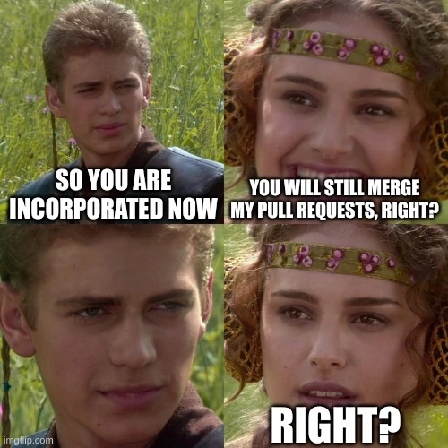
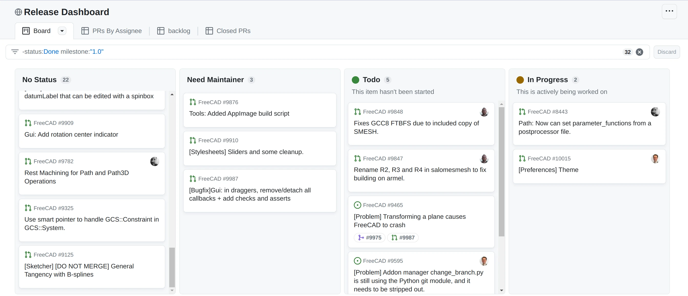

FreeCAD 0.21 has just been released with numerous new features and improvements. Some of the Ondsel team members have been regular contributors to FreeCAD for many years, but this is the first time we participated in a development cycle as a commercial entity. Let’s take this opportunity to step back and reflect on it.

## Working with the FreeCAD community

We’ve known people who are active in the community for many years, and our interactions have been great for the most part. But at the back of our minds there was this nagging thought: can we keep it that way as a company?

Now that we’ve had this (however short) run with 0.21 development and release, it looks like the answer is a very definite ‘yes’. The user community has been nothing short of awesome. The maintainers have been professional, supportive and responsive, same as usual.

## Concerns and Response

As a commercial company, our biggest concern was predictability in the development process.  We wanted to know … _needed_ to know… that effort we spend on development wouldn’t be wasted. We also had to have some assurance that releases would happen in time to support our corporate goals. 

Early on, we raised our concern that the development methodology was too unpredictable.  It wasn’t clear which pull requests would be accepted or even who would make the decision. Pull requests would often get stuck in limbo or even denied after significant work was done. For a new startup, the risk of that happening was too great. The core developers and maintainers responded by implementing a [clear policy for contributing](https://github.com/FreeCAD/FreeCAD/blob/master/CONTRIBUTING.md) to the FreeCAD source and defined how those contributions would be handled.

Another major concern was how dependent the project had become on individual expertise.  Many important things were not documented and only lived in the minds of key people. In some cases only a few people knew how to do key tasks, and losing those people from the project was a major risk. The community agreed, and that’s one of the reasons we are heavily invested in building the [Developer’s Handbook](https://freecad.github.io/DevelopersHandbook/) in collaboration with Chris Hennes, WandererFan, and other FreeCAD contributors and members of the [FreeCAD Project Association](https://fpa.freecad.org/).

> I think as a team we made tremendous strides during the 0.21 cycle, particularly in formalizing the role of a maintainer and setting clearer expectations about what maintainers are responsible for. The creation of the Developer Handbook was a major step forward for all of us, as was the creation of CONTRIBUTING.md. We still have more work to do actually implementing the ideals in those documents, but at least having the goals written down is a big step forward. — Chris Hennes, FreeCAD maintainer, the FPA board member and founder

Implementing the policies and starting the handbook helped, but even with the best intentions and tools, development is _hard_. The FreeCAD project has a lot of contributors, just keeping track of the release, issues, and pull requests was taxing everyone.  

We started investigating the functionality GitHub provides to manage [projects](https://docs.github.com/en/issues/planning-and-tracking-with-projects/learning-about-projects/about-projects) and [discussions](https://docs.github.com/en/discussions).  We used this first for the [toponaming project](https://github.com/orgs/FreeCAD/projects/2) and then, with the addition of Milestones, we started the [Release Dashboard](https://github.com/orgs/FreeCAD/projects/4) to give everyone a clear picture of where we are on the current release.

The dashboard is helping to focus attention but PRs still sit too long.  Even with clear accountability for maintainers, it is often difficult to know if a given PR _should_ be merged. Nobody is expert on everything, and merge decisions often come with a certain amount of risk. Lately the maintainers have started addressing this by reviewing the outstanding PR queue as a group in live meetings. Individual PRs are discussed and decisions made in realtime. Often PRs get merged immediately. Others get flagged for followup or moved to a later milestone. The decision about how to proceed is shared with many people contributing wisdom.  

> Now we have a much, much clearer, predictable, foreseeable and transparent process that can be (and has been) undertaken by more people. This is a very important step towards having more regular releases in the future. — Yorik Van Havre, Arch and BIM maintainer, the FPA chairperson and founder

## What FreeCAD truly needs is… a shared vision

FreeCAD development still has its challenges. We still don’t have broad consensus on where the application goes from here. Since its beginning, the project has proceeded forward with developers working on whichever features they were interested in. That’s part of the appeal of an open-source project, and we hope it never changes. A clear roadmap, however, would give some structure and help avoid conflict. There are some humble beginnings of a [roadmap](https://freecad.github.io/DevelopersHandbook/roadmap/), but it still needs further work.

Lots of discussion happened during the 0.21 development cycle that helped clarify the road to v1.0. Some of these topics we’ve already written about extensively on this blog, including [assembly](https://ondsel.com/blog/default-assembly-workbench-7/) and [materials](https://ondsel.com/blog/freecad-needs-a-better-materials-system/). Other ideas, like a first-run wizard, have gotten some preliminary attention but need more planning and discussion. We are looking forward to the upcoming hackathon in Vancouver as an opportunity to further refine the roadmap.

## Wins and challenges for the entire FreeCAD team

**The FreeCAD community is getting bigger and more spread-out.** We now have a wide range of experts on many topics, which is great for a better understanding of problems users have and thus finding better solutions. At the same time, it’s now harder to get consensus and to get the word out about initiatives.

> There were several high points for me in 0.21. One of those was the help I got from members of the community: some contributed code, some did testing, some explained the arcania of technical drawing. — WandererFan, TechDraw maintainer, the FPA board member and founder

**The FPA really came into its own.** Donations from end users have been strong and reflect how much the greater community wants to see FreeCAD succeed. But an important challenge for the FPA going forward is managing these donations effectively. There’s no doubt that paid-development and contract work will be part of the future.

> I think we are making a better work of organizing for a release. The presence of the FPA and the development grants are opening up opportunities that where previously not there and it’s giving some good initial results, I expect this to only get better next cycle! — Adrián Insaurralde Avalos, maintainer and release manager of FreeCAD

**The project is getting better at taking feedback.** Improving the contribution process made us focus much more on getting good feedback from users: Conversations are now happening increasingly often in pull requests and issues on GitHub. The team also did a very successful [complaints session](https://forum.freecad.org/viewtopic.php?p=658200#p658200) at FOSDEM this year. Overall, the improvement is in the quality of discussions. Once you formulate an issue as a problem to be solved, you end up with atomic tasks that are easier to accomplish. The inevitable challenge here is that now the project has a backlog of existing issues that need to be refactored and tailored to this new way of dealing with issues.

## What Ondsel is doing and what’s next

Ondsel is building a service that makes FreeCAD more usable and useful to commercial users and teams.  We absolutely need FreeCAD to be the kind of software that people rave about and can’t recommend enough. So we spend a lot of time improving it for users.

Our visible contributions to v0.21 were mostly improving the user interface and workflow.  We made contributions to the Preferences dialog, improved the UX/UI of Fillet, Chamfer, Draft, and Thickness tools in the Part Design workbench. We redesigned the image plane settings and fixed bugs in the core and the Path workbench.

Many of our contributions are less visible.  We have also been working on larger projects that will also benefit the entire ecosystem but will take longer to bear fruit.

We’re leading the project to integrate RealThunder’s fix for the notorious toponaming issue. The first 2 phases out of 5 are now complete (see this [recent blog post](https://ondsel.com/blog/milestone-toponaming-fix-phase-2-done) about it).

After [researching existing options](https://ondsel.com/blog/default-assembly-workbench-7) for creating and solving assemblies in FreeCAD, we settled on writing a solver of our own. Dr. Aik-Siong Koh has made significant progress towards a assembly solver based on his existing code originally written in Smalltalk. So far, the new solver can create an assembly and perform kinematics of a piston-crank system. We are also looking for ways to integrate [MBDyn](https://www.mbdyn.org/) for multi-body dynamics.

Ajinkya Dahale has a working prototype of a native custom data elements system, one that doesn’t require using 3rd party workbenches or abusing PropertyBag from the Path workbench (see our original research for an [overview of available options](https://ondsel.com/blog/build-system-for-custom-data-elements)).

In conclusion, what we can say with absolute certainty is that, as a company, we feel that working on FreeCAD is fulfilling and rewarding. We hope that more companies creating FreeCAD-based products and services will join the development. There is no shortage of things to do and a lot to gain for everyone.

## How you can contribute to v1.0 development

There are many ways users, developers, and companies which rely on FreeCAD can help make the next phase possible: 

- You can [donate](https://fpa.freecad.org/#donations) to the FreeCAD project association. Funds will be spent on getting grants to developers who improve the software and its ecosystem.
- If you are a developer in the Vancouver area, interested in making FreeCAD better, please come to the [hackathon](https://blog.freecad.org/2023/05/24/freecad-hackathon-11-13-august-2023/) that is taking place on August 11-13.
- There’s always a lot of work to moderate discussions in the community, translate and test the program, write documentation, and make video tutorials. Here is an [introduction](https://wiki.freecad.org/Help_FreeCAD) for people who can provide non-programming help.

Finally, if you are a company that uses FreeCAD, you can join the community. Much of FreeCAD’s progress until now has been made by individuals. Commercial users are becoming increasingly important. Their needs and expertise will drive the next phase of development even faster.

At Ondsel, we  would be excited to talk to you and better understand what problems and frustrations you have with the software. Please reach us at contact@ondsel.com.
