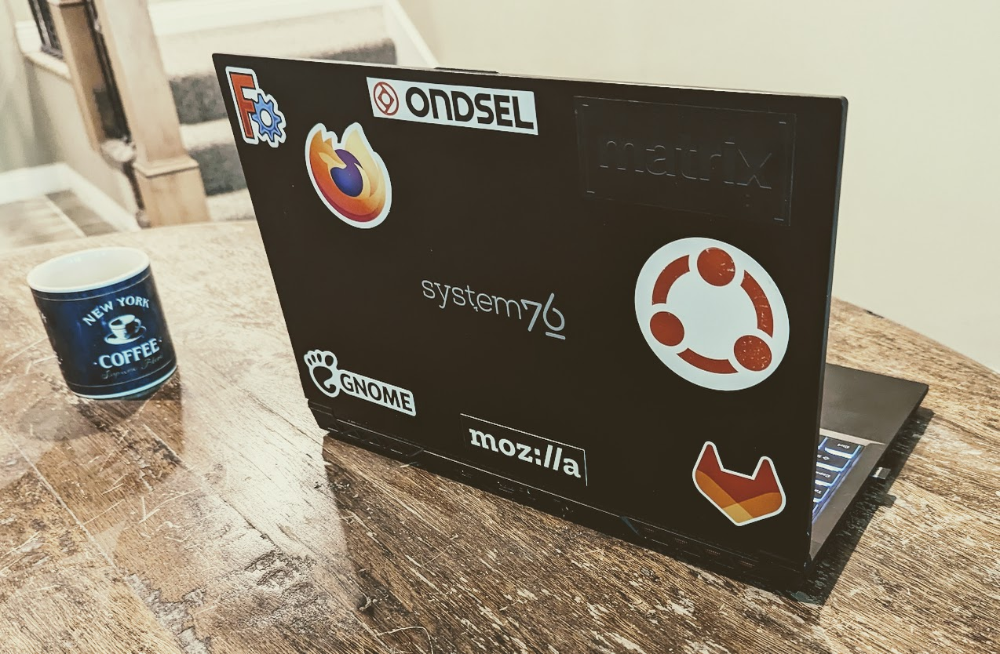

## Why do we see a lot of first-time contributors to the Path Workbench?

Besides working on [Ondsel](https://ondsel.com/), I mostly work on the [Path Workbench](https://wiki.freecad.org/Path_Workbench). Path has a unique user base made up of hobbyists and machinists. These people are using Path to generate G-code for the CNC machines and the code almost always has to be tailored for a specific machine. Once you’ve edited the G-code once or twice, it’s natural to want to customize your postprocessor and that means editing a little Python code. Occasionally, one step leads to another and the user wants to contribute their changes ‘upstream’ so they can be used by others. It’s a common story and is, in fact, exactly how I got involved in open-source development.

As a maintainer of FreeCAD, I’ve spoken to lots of first-time contributors. I generally coach them through the PR process rather than doing it for them. Once they get a PR merged, they get a real thrill from it. It feels good to contribute something to a project.

Open-source projects are always encouraging users to step up and become contributors. Getting a contribution merged as an amateur or hobbyist is no small feat, and yet we rarely take the time to acknowledge and celebrate when this happens.

## You pay time for free software

> “I sometimes have the feeling that far too much work went into explaining things to people who did not want to learn FreeCAD, but who wanted to have FreeCAD be like their favourite CAD system, which they were not willing to pay for.”—[chrisb on the FreeCAD forum](https://forum.freecad.org/viewtopic.php?p=577071#p577071)

FreeCAD is not just a free to use version of your preferred CAD system. By choosing open source, especially younger projects, you accept that the product or tool may not be fully formed yet.

The experience of using an open-source alternative like FreeCAD vs. a proprietary product can be frustrating. The common objections are the absence of a slick and intuitive UI, and missing documentation. The nature of open-source projects is that they aren’t optimized for attracting new users:

> “FreeCAD has no goal of market penetration or profit, nor of training neophytes. FreeCAD has always been a sandbox. What the user sees is the current culmination of sandcastles people have built over the years. It is organic, so the sand castles aren’t necessarily designed to be completely stand alone … There is no holistic design or guidance...it is organic. Many see this as something built on a shifting base, but, somehow thousands of people around the world manage to get things done.
>
> For better or worse, there are no bounds on what or how the sandcastles are built. It takes some time and effort to learn how to navigate the sandcastles, and in some cases the moats around them. Some are willing to put in this effort, others chafe, for many reasons.”—[drmacro on the FreeCAD forum](https://forum.freecad.org/viewtopic.php?p=577121#p577121)

When you get software for free, you pay in effort and time instead. What do you get by making that trade? Whether you’re a hobbyist creator or trying to adopt FreeCAD for your workplace, the greater benefits of FreeCAD include:

- Not being [locked into a subscription](https://ondsel.com/blog/freecad-adoption) model from a capricious vendor
- Complete transparency to both inspect the code and see the roadmap for future developments
- You can work on your local machine instead of being tied to a web application
- _You can influence the product_ 

You can have an impact on the velocity and trajectory of the project. The inconvenience of an immature feature set or lack of finesse might be uncomfortable at first, but the things you create with FreeCAD are yours, forever. Beyond the practical and tangible benefits, you also might get:

- A sense of ownership
- A sense of accomplishment
- Your name written into the Git history of the project

## Contributing to open source isn’t easy

It’s not my intention to downplay the effort required. Contributing to open source and shaping the direction of a project can be fun and rewarding, but it’s also difficult and [can be intimidating for newcomers](https://ondsel.com/blog/contribution-barriers). A lot of open-source contributors are professional, formally trained developers. As an amateur or hobbyist, contributing is both technically challenging and a feat in overcoming imposter syndrome. 

It takes courage to propose changes and improvements, especially to code contributed by people who do it for a living. Nobody wants to be shot down and told to go fork the project. We’ve discussed [the responsibility of project maintainers in fostering a more welcoming environment](https://ondsel.com/blog/better-github-issues) on this blog before, and there’s an equal responsibility on the contributors to be humble and receptive to feedback. 

Still, I have seen firsthand [how meaningful and satisfying it is for newcomers to get their contributions merged](https://news.ycombinator.com/item?id=24514839).

## Come to solve your own problems, stay for the legacy

For people used to working with proprietary software and hardware, it’s novel to be able to contribute a solution to a problem you’re having, and also make that solution available to others. Beyond the immediate dopamine hit of getting your fix merged for you and other FreeCAD users to enjoy, there’s a lasting impact. 

For most of human history, when people worked together to build something, they had to be in the same place at the same time. They [left behind](https://historycollection.com/not-average-neighborhood-graffiti-12-mysterious-graffiti-works-history-mean/9/) [traces of their work](https://en.wikipedia.org/wiki/Adventure_(1980_video_game)#Easter_egg) and archeologists study those traces to understand what life was like. We’re in the very earliest days of remote collaborative work—where hundreds or thousands of people contribute to creating something. They span cultures, languages, time, and place.

The nature of the Git repo is that the commit history is permanent and there’s a million copies of it. We’ve only been working on software like this for a few decades and with the millions of copies, some of them are likely to survive for a very, VERY long time.

In the far distant future, the equivalent of archeologists will sift through old data to reconstruct the history of what happened in the past. Just like [William Rathje studies modern garbage](https://en.wikipedia.org/wiki/Garbology), someone will eventually get the idea to systematically study Git histories to understand the culture of distributed work and collaborative software development.

Our contributions may be more timeless than we realize.

## Addendum: Here’s something I would love to see...

If there’s anyone from GitHub or GitLab reading, you could make it easier for open-source projects to reward contributors. As a maintainer of FreeCAD I would love to be able to push a button and send a coupon to a first-time contributor. They could redeem the coupon for a sticker with the FreeCAD (Ondsel) logo. This sticker wouldn’t be available to just anyone. Nope. The only way to get one is to contribute to the project. It’s special.
