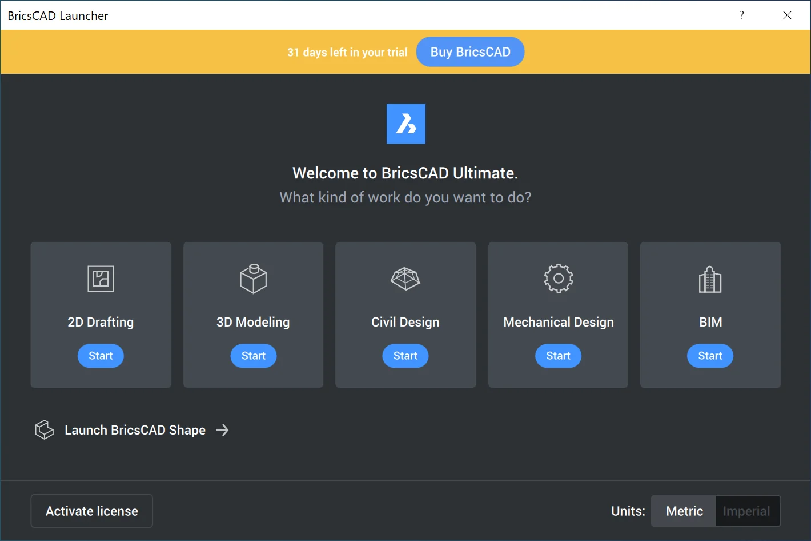
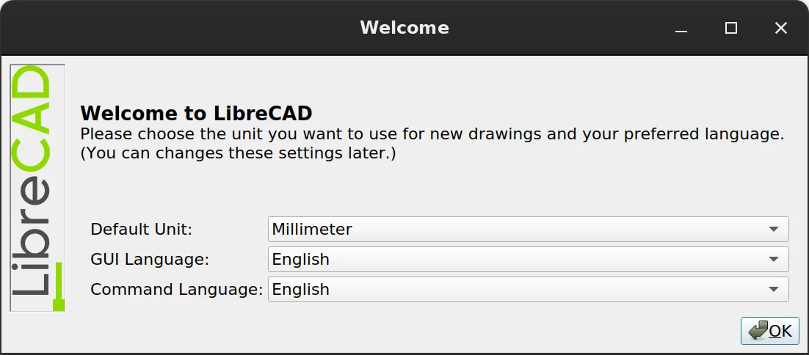
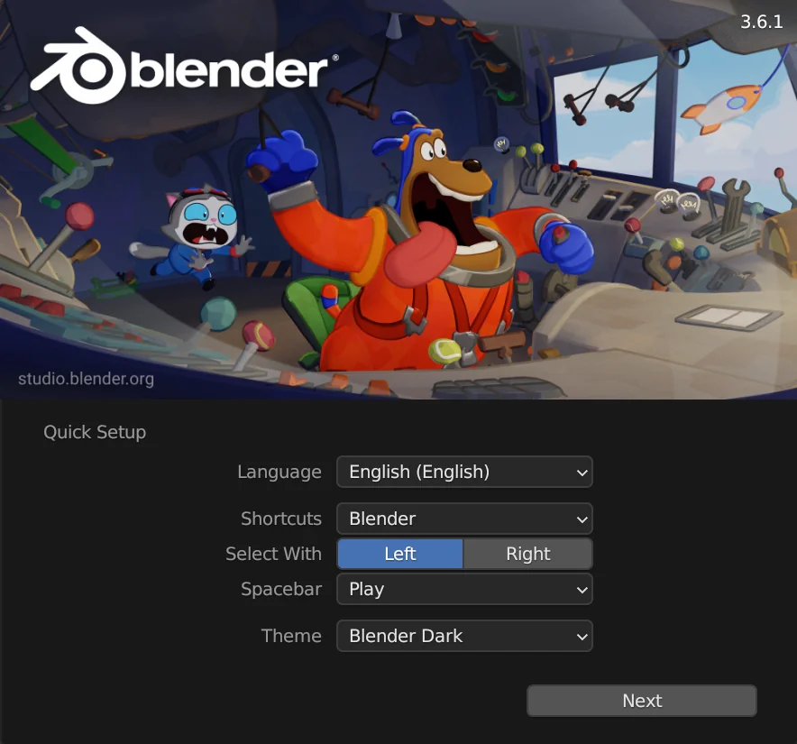
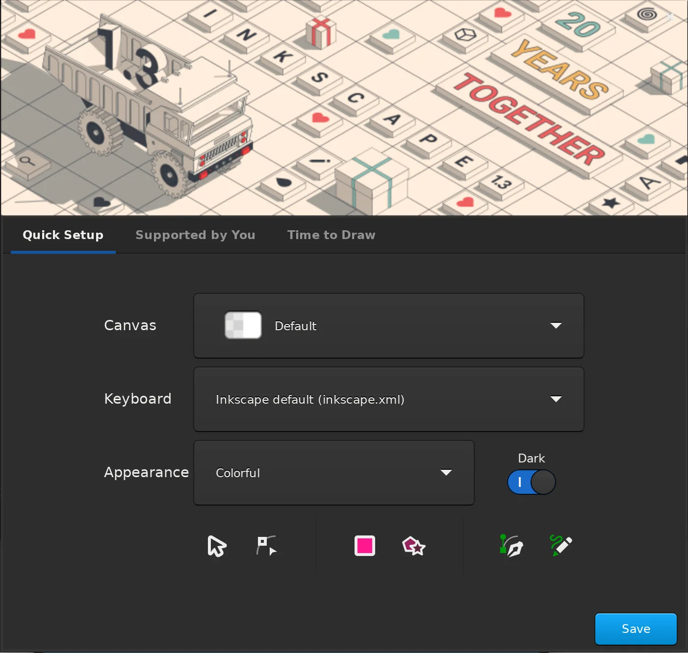
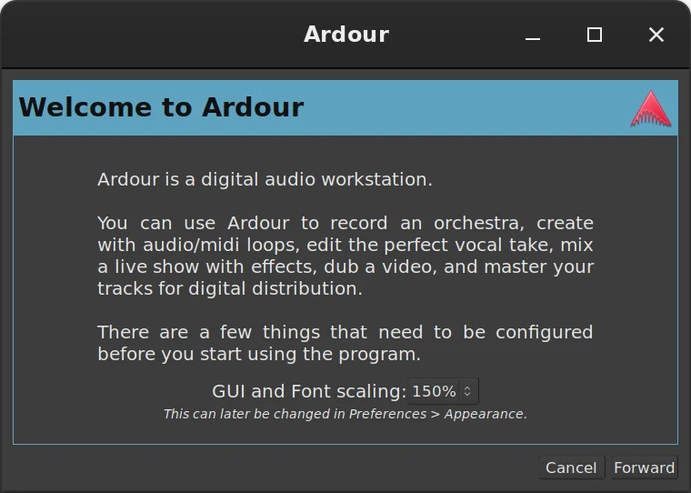
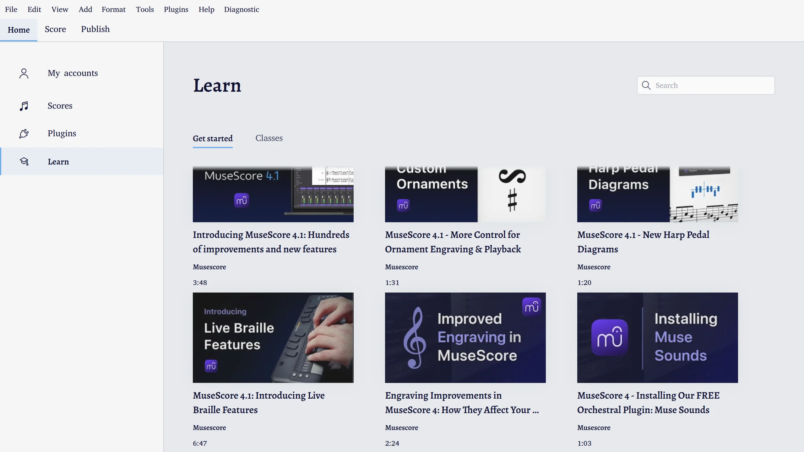
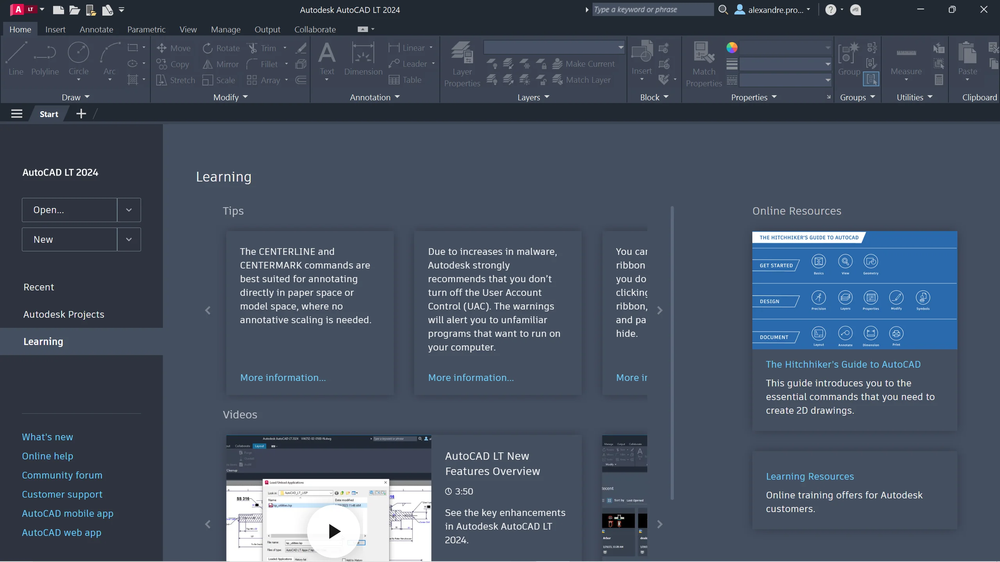
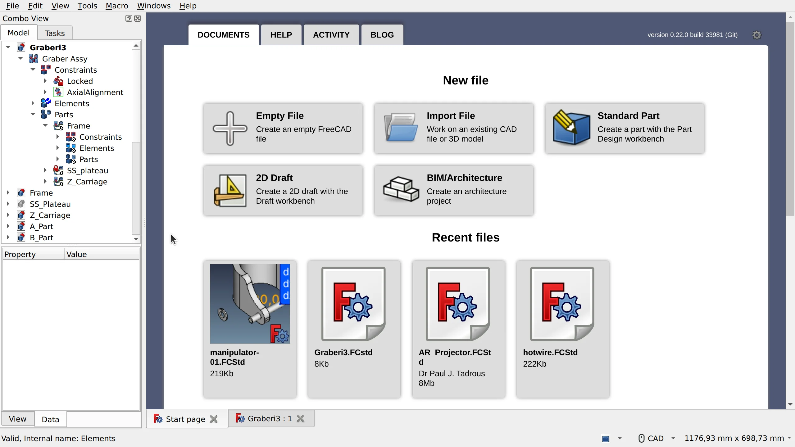

FreeCAD is commonly criticized for being difficult to get started with. 

This criticism, while possibly overstated, is valid.

- Features get more development attention and the UX/UI design is usually an afterthought and “anything goes”. As a result, there’s not much consistency across the program.
- The learning curve for modern CAD systems is a wall. There is even occasionally pushback against simplifying UX, because “CAD programs are _supposed_ to be difficult and take a lot of time to learn". Effort to improve UI is seen as "dumbing it down”.
- The program is trying to be many things at once: a 2D drafting program, a 3D design program, an Arch/BIM program, a CNC program, a structural analysis program — and that’s just a subset of workbenches available by default. All the while not much thought has been given to help users navigate the options when they see it for the first time, or customize FreeCAD for their use cases.
- Terminology used in the program is inconsistent and confusing. Part vs PartDesign is one of the recurring topics in the community. But also “path” could mean a toolpath, a sweep path, or a file path depending on where in the program the word is used. These are just a couple examples.

For a long time there have been calls for a first-run wizard (FRW) as the way to fix some of these problems. If you are not familiar with the concept, the idea behind FRW is a feature that runs the first time a user launches a program and helps orient the user to the software by allowing them to choose how the program will look and behave or by onboarding them in other ways.

While investigating this feature request, we looked into what other programs have to offer, and our conclusion is that while something is needed, this request is problematic and the specific solution has poor consensus.

## What’s wrong with the feature request?

First and foremost, the [issue](https://github.com/FreeCAD/FreeCAD/issues/5772) is poorly defined. This issue predates the current contributing policy, it doesn’t start by identifying the problem but jumps immediately to the solution. People have seen similar solutions in other applications and have an intuition about them. But the notion of a first-run wizard brings different ideas to mind. In fact, our research showed that these tools are employed to address at least three different problems:

- User preferences make a big difference to usability but the settings are difficult to find or scattered in many places.
- The optimum configuration of the software varies depending on the specific task the user is undertaking.
- Important features are occasionally overlooked by users leading to frustration and increased support demand on the forum.

These are three very different problems and their solutions are unlikely to be the same thing. It makes sense to address them independently.

Even if we narrow the focus and assume the feature request is only about customizing the software for the user’s needs, we still have a challenge. Consider this bewildering list of things that people have suggested should be configurable when you first run FreeCAD. We call it The Problematic Wishlist:

- Simple vs advanced layout (e.g. don’t show FEM workbench to a newbie, show less buttons in toolbars etc.)
- Which workbenches (WBs) should be visible in the UI, with presets (Mechanical CAD, Arch/BIM etc.)
- What WB is selected on startup
- UI language
- Units and unit schemes
- Theme (dark/light/classic)
- Enabling/disabling Treeview Glass theme
- Icon theme
- Highlight color
- Icon size
- Font size
- Viewport background color
- Navigation style
- Enabling/disabling warnings in weekly builds
- Enabling/disabling “What’s This?” button
- Monitor aspect ratio selection for optimized layouts
- Panel layout options
- Default file storage location
- Autosave and backup policy
- Authoring and license info

While it may be technically possible to implement all this in a first-run wizard,  it would be a perfect example of creating a bigger problem by trying to fix a smaller one.  It would be overwhelming to the user trying to get started and would complicate development since configuration would have to be maintained in both the FRW and the system preferences.

## What other programs do

As part of the research phase, we looked at what other programs offer in terms of customizing UX the first time you run a program. The question we asked was just this: do other teams solve the same issues by offering a first-run wizard or do they do something else?

We started with CAD programs and then moved to other kinds of applications (3D modeling, image editing, vector graphics editing, audio production). Basically, any sophisticated program with lots of configuration options, aimed at professionals and designed for multiple use cases is worth looking at.

Right off the bat, among non-FOSS **CAD** packages, only BricsCAD provides something that vaguely approaches a first-run wizard. Every time you launch the program, a dialog asks what kind of work the user wants to do: 2D drafting, 3D modeling, mechanical design, or BIM. The same launcher window also asks whether the user wants metric or imperial units. And this is it. 

But you don’t even need a dialog for that. Multiple programs provide a simple choice over the type of project you create. In some cases, it’s just a drop-down list of project types or a library of templates.

The only two programs that do have a first-run wizard are FOSS programs. LibreCAD asks for the default unit, GUI language, and command language. QCad asks for GUI language, default unit, default paper size, decimal point, and background color (black or white). Not too surprising, as the former is a fork of the latter.

The situation is pretty much the same across other industries we looked at.

Blender seems to be the only major **3D modeling** package that has a first-run wizard. You can set UI language, shortcuts preset, right-click vs left-click for selection, spacebar behavior, UI theme.

None of the big boys in **image editing**, like Adobe Photoshop and Affinity Photo, have a first-run wizard. Ironically, GIMP is the program that used to have one, got rid of it, but is likely to have one again. In short, the original wizard asked questions that could be automatically detected from various system settings, and users found it annoying. But then developers made changes to defaults (enforced default dark theme and symbolic/colorless icons, as well as grouped tool icons in the toolbar), and that, too, annoyed half the user base. So they want to reintroduce the first-run wizard at some point in the future.

Similarly, Inkscape seems to be the only **vector graphics** program with a first-run wizard: you can choose canvas look (transparent checkerboard, white opaque etc.), shortcuts theme, icons theme, dark vs system UI theme.

Among proprietary **digital audio workstations** Cubase seems to be the only one that bothers users with questions, and even that during installation when you need to select a preferred audio interface. Once again, a FOSS program is an exception: the first time you run Ardour, a wizard asks for GUI and font scaling and the default folder for new sessions. The first part of that, however, is a toolkit limitation. Ardour still uses GTK2 for some part of its UI, and GTK2 is notoriously oblivious of HiDPI displays.

Across many industries, developers recognize that learning to use their software efficiently takes time, so they build links to training materials into the user interface. This is something FOSS developers are beginning to do, too. For example, MuseScore has links to educational videos on YouTube, and FreeCAD has links to the wiki.

So what did we learn from this?

- **Very few programs actually provide a first-run wizard.** Proprietary programs typically enforce a certain choice of defaults even for controversial things like the look and feel, but, to their credit, usually make it rather easy to customize certain things.
- **There are obvious polarizing topics.** Some of the defaults are things that users just can’t stop arguing about. This is exactly what first-run wizards in FOSS programs like Blender and Inkscape focus on.
- **Measure units surprisingly do not cause all that much controversy.** Figuring out the right units from locale settings is perfectly doable, so it’s possible that this is why very few CAD programs even bother exposing those when you run them the first time or create a new project. Typically, there is a global configuration that applies to new projects and a simple way to override it on a per-project basis (an unfinished patch for the latter [exists](https://github.com/FreeCAD/FreeCAD/pull/9521) for FreeCAD).
- **There’s usually a very obvious way to get to the right tools.** Applications like Inventor make it very easy to create a 2D design or a 3D model. Usually, it’s just one or two clicks away, and the UI for that is in a very obvious place.
- **CAD programs usually have a learning center for newly arrived users.** This is something FreeCAD already does, but there are ways to improve it. A topic for another day.

## Our proposal

Based on our findings, we think it’s best to attack the issue of suboptimal first user experience from three angles: minimal first-run wizard, better defaults, and continuous UX/UI improvement.

### Minimal first-run wizard

Let’s learn from the experience of other projects. Right-click selection in Blender was a huge annoyance for new users right up to the point where left-click selection was finally implemented and the first-run wizard started offering the choice between the two options. The lesson here is that there will always be things that users are split over, we are not going to change everyone’s mind, ever.

Therefore the first part of the solution is to build a minimalistic first-run wizard that will cover just that: visual style, navigation style, units, GUI language. We can further refine the wizard based on feedback from users. Designing and implementing the dialog is not too complicated, and there have been several approaches to do so already.

### Better defaults

Certain things on the wishlist above could absolutely be better defaults. For example, we can enable backups by default and set a sensible number of versions to be saved.

The tricky part here is coming up with a definition of what constitutes a sensible default. This is something we will have to further explore.

In our experience, it’s useful to keep each conversation about defaults narrowly focused. For example, we’ve already had a lively if slightly heated discussion over disabling some of the workbenches in the workbench selector by default. Breaking that conversation into several dedicated GitHub issues has helped to keep the discussion productive, so now there is a [GitHub project](https://github.com/orgs/FreeCAD/projects/16) for cleaning up the workbench selector.

This task of making good defaults will likely never be 100% completed as FreeCAD keeps changing. So we should treat it as a continuous effort.

### Continuous UX/UI improvement

This last part of the solution is a lot more interesting. Let’s analyze the rest and see how we can improve the UX/UI to deliver a better initial user experience and maybe remove the need for configuring certain things when users run the program for the first time.

Here is an example. One of the ideas for the first-run wizard is to allow users to configure what workbenches they want visible by default. To reiterate, someone who, for all we know, is probably looking at the program for the first time, is supposed to somehow guess what workbenches they actually need without having ever used them. That doesn’t sound like a very likely scenario.

And then some experienced users could have different uses for the program. You can be an architect who needs Draft, Arch/BIM, and just a few more WBs. But you also tinker with stuff in your spare time, so PartDesign and Path are no strangers to you.

Basically, FreeCAD needs to adapt the UI based on context. There are several established approaches to deal with that. Named workspaces is one of them. But another approach is to improve the start screen. If you create an architectural project, you automatically get a certain set of workbenches available to you. You can further refine that selection, if you want to, but the default user experience will already be streamlined for you to a large extent based on the type of a project you create.

The first step towards that has already been done. Thanks to [Qewer](https://github.com/FreeCAD/FreeCAD/pull/10171), v1.0 will be coming with an update start screen listing several typical new projects that are basically a fast track to a particular workbench.

The full implementation of that would eliminate two items from the wishlist: 1) what WBs should be visible in the UI, and 2) what WB is selected on startup.

This kind of a holistic approach to designing UX/UI should serve the project much better than what we have had so far. We also don’t have to deliver the full UX/UI redesign of FreeCAD for v1.0, this kind of refinement can go on for as many development cycles as we can handle.

## What’s next

Improving the user’s initial experience of FreeCAD is not a single work effort.  There has been good work done in this area already including an [ongoing discussion](https://github.com/FreeCAD/FreeCAD/issues/5772) about the first-run wizard in the issue tracker, but discrete, solvable issues need to be extracted from that and solutions built for each of them.

The first issue to address is the narrowly defined set of configuration options  which users routinely disagree about: language, units, navigation style, and theme.

Tailoring the application to the task should be addressed by improving the start page and providing better defaults whenever possible.  As noted above, some work has already been done.

That leaves the more subjective work of explicitly educating the user about FreeCAD conventions, UI tools, shortcuts, and the general UX/UI improvements.   Both of these need more research and feedback from the community. This is an area where we need better and more actionable data from community power users and moderators about where users are confused.

There will likely be a GitHub project focusing on UX/UI cleanup. Stay tuned for more news on that.
