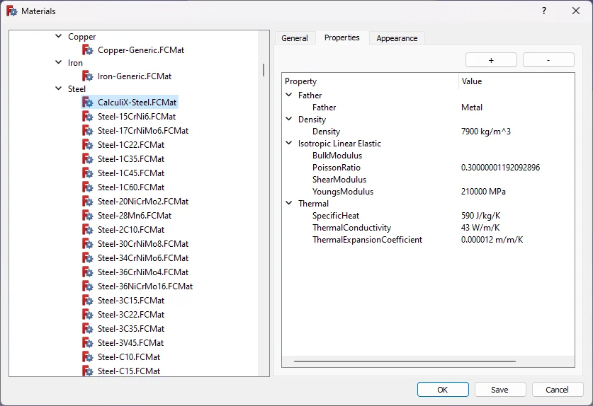
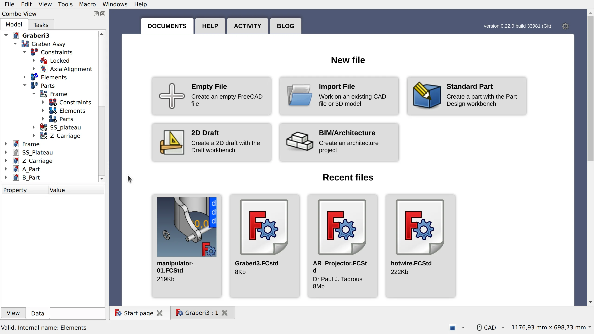

Historically, the duration of FreeCAD development cycles has been uneven, anywhere between a few months and 2+ years.

We already talked about reasons and ways to make releases more predictable in [one of the recent posts](https://ondsel.com/blog/freecad-unpredictable-release-schedule-hurts-users-and-developers). But the truth is, this is a much older conversation that has been going on in the community for years now: at FOSDEM, in the forum, and in various other venues and social channels. The hackathon in Vancouver was a perfect opportunity for the developers community to set some boundaries for v1.0.

<!-- truncate -->

We ended up formalizing a list of [4 major items](https://freecad.github.io/DevelopersHandbook/roadmap/next.html) for the v1.0 roadmap that we think are a must-have to constitute the next release. None of these items are big news, we’ve all known about them for a while: the complete topological naming fix, a default Assembly workbench, a new implementation of a materials system, and the first-run wizard.

So let’s cast a quick glance at these items and talk about respective challenges.

## The toponaming fix

We’ve already discussed this topic in the past, the [latest post from July](https://ondsel.com/blog/milestone-toponaming-fix-phase-2-done) covers the current state of affairs in detail. It looks like we’ve already done a very difficult part of this project. Further work is not going to be easy, but the foundation for the next phases of the fix is sound.

The team is now approaching the third phase of the fix (out of five), there’s an [initial plan available](https://github.com/FreeCAD/FreeCAD/issues/8432#issuecomment-1676433915). As the third phase is where FreeCAD actually starts using the new toponaming infrastructure, this will be a perfect opportunity for new contributors to get involved. The [dedicated Telegram chat](https://t.me/toponamingchat) is the right place to start.

## The default Assembly workbench

This is one of the more challenging items on the list of v1.0 deliverables. We think FreeCAD should have a capable assembly workbench and that really means two things:

1. A workbench where the user configures the assembly, adding parts and establishing relationships between them.
2. A solver capable of resolving those relationships and moving the parts of the assembly appropriately.

All that should be the default experience, no third-party add-ons.

Dr. Aik-Siong Koh, who is an employee at Ondsel, published the [source code of his solver](https://github.com/Ondsel-Development/OndselSolver) during the hackathon. This will be one of the foundations of the coming Assembly workbench.

For the user-facing assembly workbench, a lot of work remains. One of the challenges will be coming up with a user interface and workflow that are both discoverable, straightforward, and expandable. It doesn’t need to cover every use case.  Remember that the existing assembly options are still viable and may serve different users well. Rather the integrated solution should strive to be robust, simple to use, consistent with the rest of FreeCAD, and an excellent platform for future expansion.

The main challenge here will be building a team similar to the one we have for the TNP fix — a mix of Ondsel employees, FreeCAD maintainers, and 3rd party contributors. This has proven to be a great balance between interested parties, and we want to replicate that success.

The project will be managed as a [GitHub project in the FreeCAD organization](https://github.com/orgs/FreeCAD/projects/7/views/1), with cards and issues.  Similarly to the toponaming project, we’ll work in small incremental pull requests and merge the changes directly to the master branch rather than wait until the workbench is fully functional. An initial barebone implementation has already been merged to the main development branch.

## Materials

The existing materials system in FreeCAD is overly simplistic, all over the place, and doesn’t even scratch the surface of what users really need it to do. So the program absolutely needs a solid foundation.

Earlier this year, we posted an [implementation proposal](https://ondsel.com/blog/freecad-needs-a-better-materials-system/) for a new materials system written in collaboration with Dave Carter who volunteered to actually do the work. Dave is, in fact, knee-deep in that project and has made a lot of progress (the branch with his code is [public](https://github.com/davesrocketshop/FreeCAD/tree/post_21)). Moreover, users have been [very supportive](https://forum.freecad.org/viewtopic.php?t=78242) of his effort.

The first pull request [has already been filed](https://github.com/FreeCAD/FreeCAD/pull/10368) and is undergoing review. Further plan with materials is to apply the toponaming development model: break all further work down into small pieces, so that any developer could be part of that effort. Once the initial patch has been merged and further work has been decomposed into small items, more developers can join the effort. All further work will be done in pull requests. This will make it possible to deliver the minimum viable implementation in time for v1.0.

## First-run wizard

FreeCAD has a difficult learning curve. Improving the initial user experiences is a topic that resurfaces regularly. We even covered that in a recent blog post. Here is the gist of the issue.

First of all, people can’t really agree on the scope of the first-run wizard. There are literally dozens of settings that users requested to be editable when you run the program for the first time. But when you dig deeper into the reasoning, several things become obvious.

First there are configuration settings for which a single default will never suffice. Language and the unit system are the two that come to mind.

Some configuration options appear to be personal preference but might also have more significant usability implications. For example themes and colors are personal preference, but they become extremely important if you suffer from color deficiency.  Users will never agree with each other about that, so those have to be easily configurable. 

Other things that people want to configure should probably be solved in other ways. A great example of this is configuring which workbenches are available and active for a new user. 
Should the system present a bewildering array of workbenches to a new user or should it hide potentially useful tools in an effort to be streamlined? Reasonable people disagree. In this case, the right answer might be to improve the Start workbench. This would provide a fast track to the workbench based on that task that they need to accomplish. Initial mockup was created and then turned into a [pull request](https://github.com/FreeCAD/FreeCAD/pull/10171) by Qewer during the hackathon. This patch has already been accepted and will be part of v1.0.

On yet another level, this is a conversation about terminology. A much-discussed example here is the distinction between Part and PartDesign — users inevitably learn to understand the difference, but they are off to a rocky start, and there are some technical issues to take care of on the developers’ part.

Hence the plan is to come up with a minimal implementation of the first-run wizard, one that would deal with things that users are split over regardless of how sensible defaults are, and then see take a holistic approach to dealing with the rest.

## And now the fun part: can we get v1.0 out by FOSDEM 2024?

We think that these goals are within reach and it should be possible to release FreeCAD 1.0 in time for the next FOSDEM. Here’s our thinking behind this goal.

The TNP fix and the new Materials system are at the stage where the nature and the amount of work yet to be done are fairly predictable, and a large part of the heavy-lifting has already been done.

The initial Assembly workbench will be a challenging project, but now that we have a solver, we can start working on designing UX/UI around common use cases.

The design and the implementation of the first-run wizard itself would be a minor development effort, and there are people in the community who already spent a considerable amount of time creating mockups and even writing code. The challenging part will be taking a holistic approach to dealing with configuration and improving initial user experience, but we can make this effort span across multiple releases, there is so much to improve anyway.

To reiterate, v1.0 will definitely have changes apart from these 4 items. What we are aiming for is to start making development more predictable. Gaining some focus will help the team with both planning their work and managing expectations of FreeCAD users.
