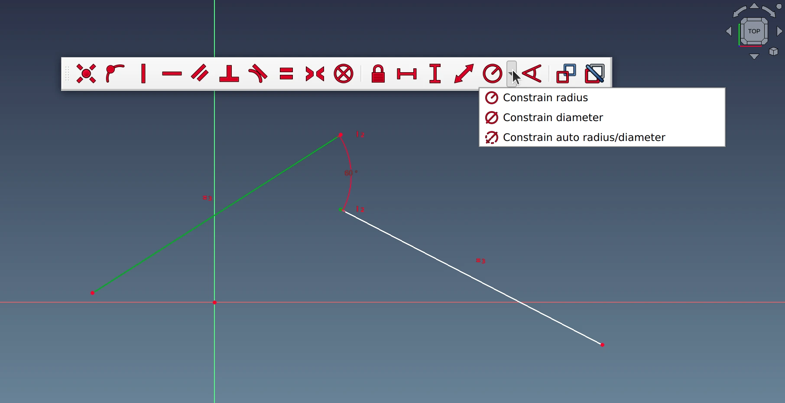
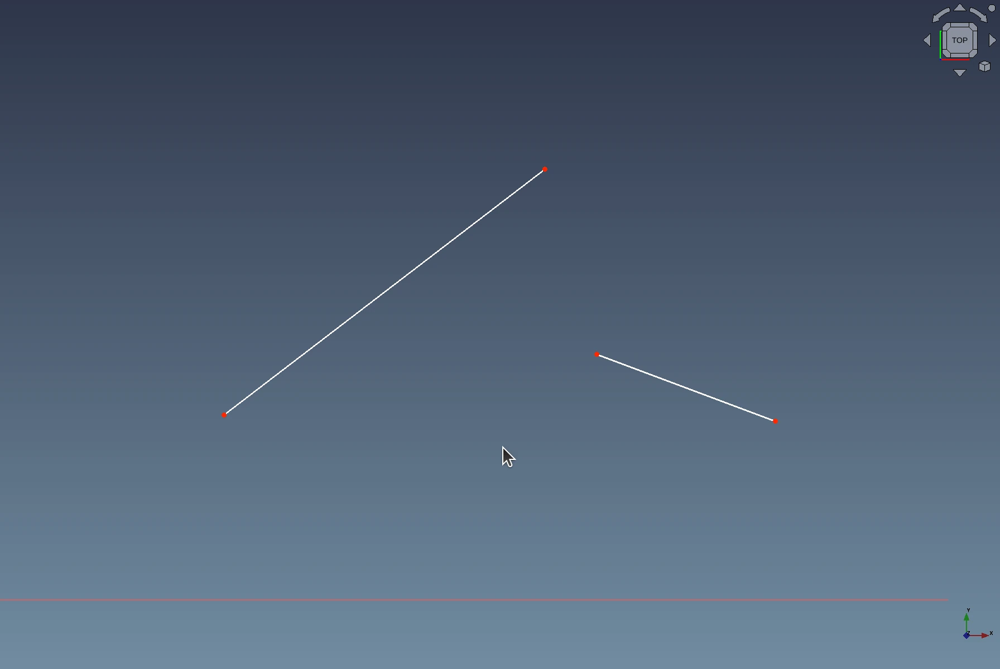
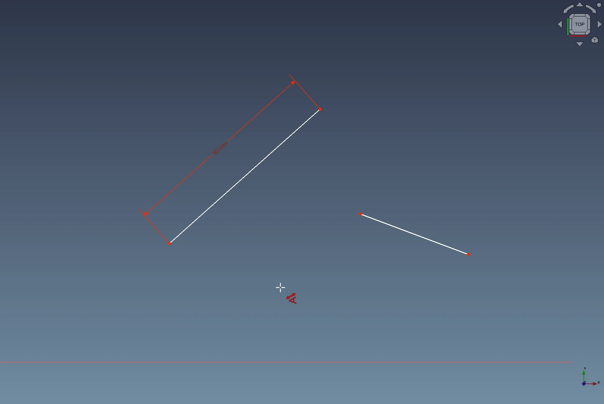
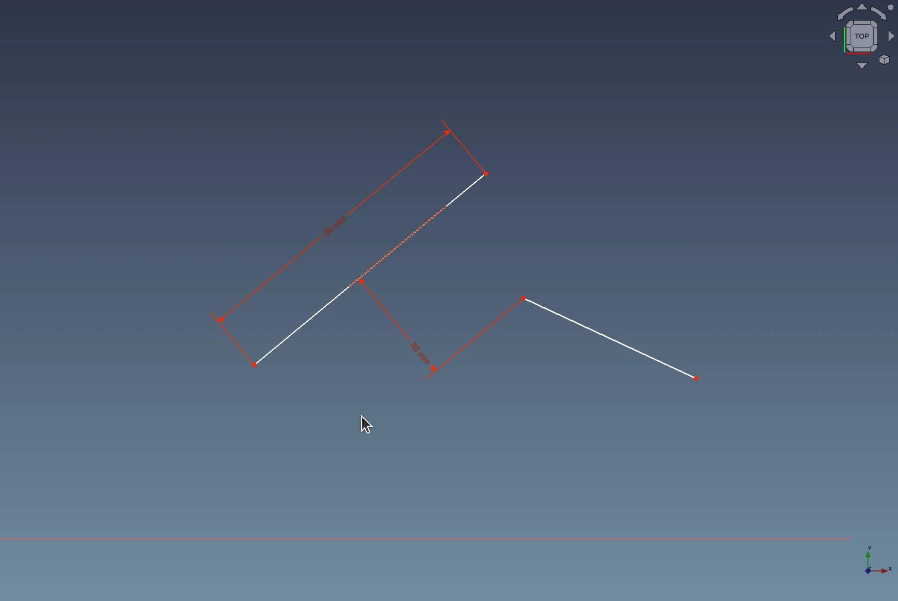
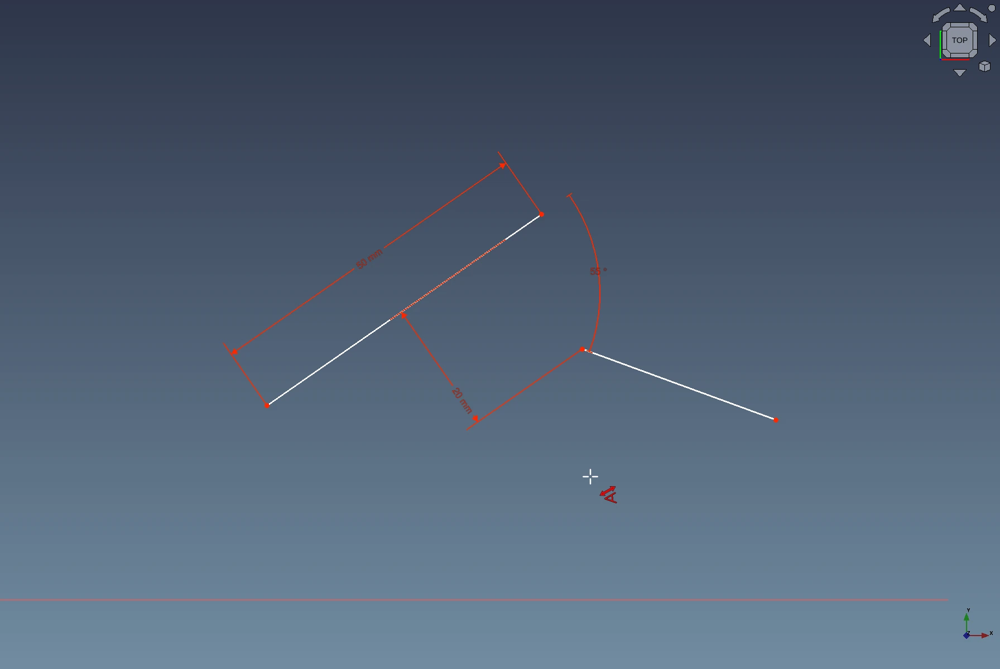
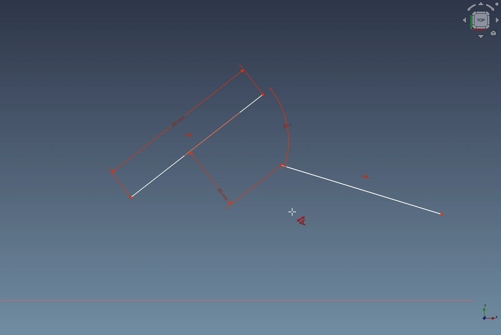
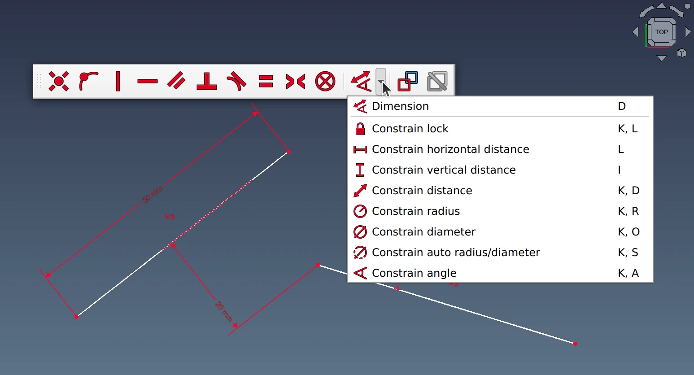
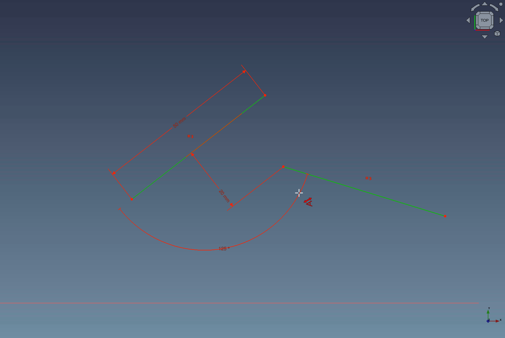

One of the hallmark features of FreeCAD is that various parts of its UI have a lot of similar options, which means a lot of cognitive load, especially for beginners. A very popular “offender” here is the geometry constraints toolbar in Sketcher. It has 18 different constraint options, more than most popular commercial CAD offerings like Fusion 360, Onshape, and Creo. That's not a bad thing on its own, but it adds a lot of mileage when you need to dimension an entire complex sketch.

Before joining Ondsel, Pierre-Louis Boyer (@paddle) started implementing a feature called _contextual constraints_ to help users constrain faster. Since joining Ondsel, he has finished the [patch](https://github.com/FreeCAD/FreeCAD/pull/9810), and after some discussion and code review it was merged to become part of future FreeCAD 1.0. So let’s talk about this feature.

When you select a geometric feature in a sketch, there’s a finite number of constraints you apply once you select the second feature. For example, if you select a line and then an endpoint of another line, your most meaningful option is a distance constraint. But if you select a line and then another line that’s at an angle to the first one, the angle constraint is the most meaningful option, and your other option is to make those lines equal.

Once you know that, you can devise a system that looks at the selected features, suggests the most sensible option by default, and allows switching between possible options easily. This is what the new contextual constraints system does. It helps apply constraints based on the context of what the user has already done.  You select the new Dimension option (**D** shortcut) and go over your entire sketch to constraint and dimension various parts of it.

The new option combines various pre-existing other ones: constraining distances, radii, diameters, angles, and a constraint lock.

Here is a quick example. Take two lines that have different length and are at a random angle and distance to each other:

Then select the Dimension option and set the length of the first line:

Set a distance between the two lines by clicking the line and then the closer endpoint of the second line:

Constraint their angle by clicking the first line and the second line:

And finally make both lines equal by clicking the first line and the second line and then pressing **M** to switch to the second contextual constraint option:

You can constrain this sketch further by clicking on an end point of one of the lines and setting a lock, all with the same Dimension option. Most importantly, all of the steps above are completed without needing to choose a different tool in the toolbar.

For cases, when you absolutely need to have quick access to individual constraint options (just like in v0.21 and earlier), you can continue using keyboard shortcuts or selecting those options in the drop-down list:

[Preserving that possibility](https://github.com/FreeCAD/FreeCAD/pull/10463) was one of the requests from users.

The new option also allows switching between complementary angles depending on the position of the mouse:

This implementation was possible thanks to active discussions both [on the forum](https://forum.freecad.org/viewtopic.php?style=4&t=65521) and in the issue tracker. More improvement is still possible.  Join us if you want to be part of making FreeCAD awesome and many thanks to users and contributors for their input!
