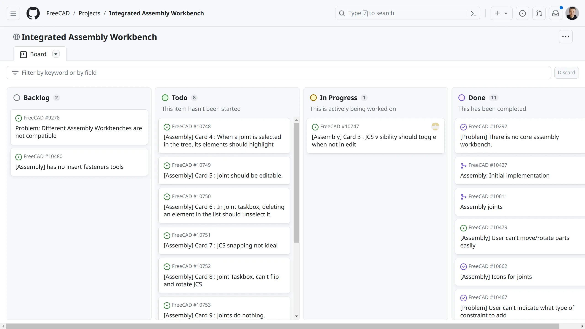

The basics of an integrated assembly workbench in FreeCAD are now functional and ready for wider testing. This means you can play with it now in the development version of FreeCAD and  when version 1.0 is out, you will be able to create or link parts, create joints between them, and solve the assembly — in just a few clicks, out of the box, without installing any add-ons.

This quick video by Pierre-Louis Boyer demonstrates all that:

<iframe src="https://www.youtube.com/embed/mFsieFzOPls?si=oQG4TjMe6wY_dLzv" title="YouTube video player" frameborder="0" allow="accelerometer; autoplay; clipboard-write; encrypted-media; gyroscope; picture-in-picture; web-share" allowfullscreen></iframe>

This is by no means the complete implementation that we have in mind for FreeCAD, but it’s a solid foundation. And because we like to be open about our process, let’s talk about how we got to this point, how we made design decisions, what’s already available, and what else is in the pipeline.

## The research

Users have been asking for an integrated assembly workbench for a very long time. And because writing add-ons has always been the preferable way to implement major new features in FreeCAD, people did just that: multiple 3rd-party options, each with its own workflow, incompatible with one another.

Doing extensive research of multiple assembly workbenches is really a lot to ask. And thus, users got more than what they bargained for: a solution wrapped up in confusion. Whenever a new user arrived and asked for recommendations, a very common response would be along the lines of “I don’t really know about those other workbenches, I only bothered to learn this one”.

This gave us three basic options:

1. Pick one existing workbench, improve it, make it the default
2. Create a new workbench based on one or more of the existing alternatives
3. Create a new workbench entirely from scratch

We started with a deep dive into four popular workbenches — Assembly 2, A2plus, Assembly3, and Assembly4 — and then looked at a few assembly-like add-ons. If you missed that series, [this final post](https://ondsel.com/blog/default-assembly-workbench-7/) has all the links and discusses our plan forward at the time.

The most important takeaway from the research was that every available option had some kind of workflow and/or UX/UI problem deeply rooted into its design. So we came up with the following recommendations:

1. Agree on the data structure with stakeholders to help making all assembly workbenches mutually compatible
2. Create or reuse an existing performant 3D solver
3. Build a clean new solution that could be iterated upon later to add advanced features
4. Ship a working basic implementation as part of the next big release after v0.21

## Assembly data structure

After the research, we proceeded with standardization of the data structure. So far, only Zolko (Assembly4) has been up to discussing this. Both A2plus and Assembly3 developers haven’t yet responded to an invitation to talk about it. With luck we’ll get all major stakeholders to agree on something and/or provide conversion scripts for existing assembly projects.

We ended up designing the assembly as a Part container, just like in Assembly 4. However, multiple assemblies can be created in one document. We are not married to this design decision though and will happily reconsider if users speak up.

## Workflow considerations

Before designing the new workbench, we looked at existing implementations in various proprietary CAD programs. We were mostly interested in how the workflow is organized and what program demands the least amount of clicks and learning from users.

There are two major approaches to constraining parts in 3D: either you select geometric features and mate them directly, or you create a local coordinate system (LCS) per each feature involved and then align those LCSs. Our implementation is a bit of both: the user does choose a pair of geometric features to connect, but FreeCAD also creates (and displays) a local joint coordinate system (JCS) for each feature.

We also found that, regardless of the workflow approach, developers of other programs indeed try to reduce the amount of clicks to an absolute minimum and make it easy to move parts under constraints.

Since we decided in favor of LCS (kinda), we’d be better off looking at something like T-FLEX CAD rather than Assembly4 for workflow tips. And in most proprietary CAD programs, moving a part means you just grab it and then drag it, whereas in Assembly3 you have three movement options in the toolbar (and it’s the least of your problems there).

The most approachable assembly workflow that we discovered was the Onshape’s one, hence much of our interaction design is loosely based on it.

## So what can the integrated assembly workbench do?

Our intention with this project is to create a solution that Just Works™ nine times out of ten. For the things it can’t do, the addon workbenches are still available and still good choices. The current state of the integrated workbench is a lean, minimally functional solution. It is, however, a solid foundation for building future functionality.

First off, it will support both top-down and bottom-up design approaches. Right now, you can create the assembly project, then proceed linking parts from existing FreeCAD projects. Or you can switch to Part Design and start building your parts, then go back to Assembly to constrain those parts.

Once you have all the parts you need in the project, choose a joint type in the toolbar.

So far, available joint types are:

* Fixed joint: zero degrees of freedom, parts are permanently locked together
* Revolute joint: allow rotation around a single axis between selected parts
* Cylindrical joint: allow rotation along one axis and movement along the same axis between two parts
* Slider joint: allow movement along one axis between two parts
* Ball joint: allow unrestricted movement of two parts as long as their connection points remain in contact
* Planar joint: two selected features must be in the same plane, movement is restricted to that plane
* Parallel joint: constrain relative movement of selected features to parallel translations
* Tangent joint: forces two geometric features to be tangent, restrict movement to smooth transitions along their contact surface.

When you select a joint type and hover a geometric feature of a part, FreeCAD displays a joint coordinate system for that feature:

So all you need to do is click on the hovered feature to add it to the selection (displayed in a floating dialog on the right), then pick a geometric feature of the second part and click OK.

Once all parts are connected with joints, you can move them under constraints. You don’t need an extra tool for that. Just grab a part and drag it.

## Project organization

We were really pleased with the way the [TNP project](https://github.com/orgs/FreeCAD/projects/2) operated, so we decided to model the assembly workbench project after it: public project board on GitHub ([done](https://github.com/orgs/FreeCAD/projects/7)), a mix of Ondsel employees and FreeCAD contributors (done), and atomic pull requests into the main development branch (done).

Our lead developer for the assembly workbench project is Pierre-Louis Boyer (‘Paddle’ on the FreeCAD forum) who already has a lot of experience improving UX/UI in FreeCAD.

Something we were missing was expertise in 3D solvers. We hired Dr. Aik-Siong Koh who has decades of experience in programming kinematic and multi-body dynamics solvers. He also has an existing solver originally written in Smalltalk. Dr. Koh ported his solver to C++ and made it [available](https://github.com/Ondsel-Development/OndselSolver) under the terms of LGPL 2.1+.

Another Ondsel employee (and co-founder) John Dupuy contributed to turning Ondsel Solver into a shared library and fixing build issues on supported platforms.

Outside of Ondsel, FreeCAD maintainers Werner Mayer and Chris Hennes have been doing code review of all the pull requests we submitted.

We were also fortunate to receive contributions from the design review team early on: Qewer [contributed icons](https://github.com/FreeCAD/FreeCAD/issues/10662#issuecomment-1716991225) for joints and [improved](https://github.com/FreeCAD/FreeCAD/pull/10767) the appearance of JCS previews. Additionally, Tobias Falk and howie-j have been participating in the UX/UI discussions and providing [patches](https://github.com/FreeCAD/FreeCAD/pull/11158).

Based on our experience with the TNP and the assembly projects so far we are confident suggesting that this collaboration model should be used more in FreeCAD. Hopefully, more companies will adopt it.

## What’s next

Our attention right now is focused on [completing](https://github.com/FreeCAD/FreeCAD/pull/10764) the use of Ondsel Solver and cleaning up the rest. If the intention to release FreeCAD 1.0 around FOSDEM 2024 is still strong among maintainers, that gives us close to three months of leeway.

Implementing major new features in the workbench in time for v1.0 seems unlikely to happen, although minor enhancements like easily inserting fasteners is a possibility. So we will mostly be finishing what we have already started to deliver a lean, minimalistic, well-tested integrated assembly workbench in the v1.0 release.

After that the floor will be open to all sorts of things: BOM generation, collision detection, assembly explosion, animation etc. We are particularly excited about the possibilities that the new materials system by Dave Carter will bring to us. If you ever needed to calculate the weight of an entire assembly or locate its center of mass, you definitely know why.

We invite everyone to help us test and improve the new workbench. There is a [public kanban board](https://github.com/orgs/FreeCAD/projects/7) on GitHub where assembly-specific tasks are managed. Right now, we need testers even more than we need programmers. So come talk to us. Report a bug or  pick a card you would like to work on and comment on the related issue to get things going.

And finally, we believe this workbench will become an important part of the FreeCAD design kit.  We are confident that many great things can be built on top of this foundation and we’re not wasting time. We have already started an internal project to expand the feature set beyond what you would expect from an assembly workbench with a kinematic solver. Stay tuned for updates!
