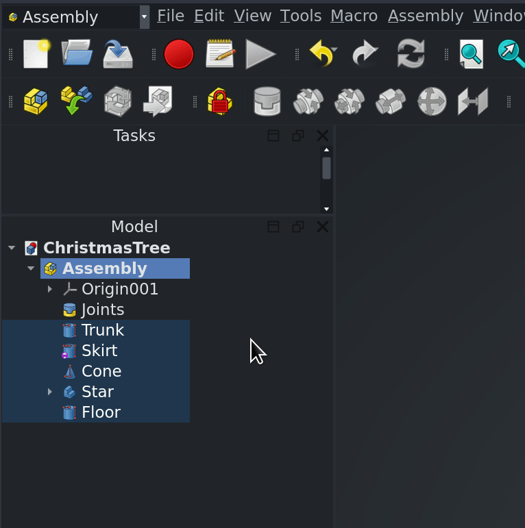

We have just published our own build of FreeCAD with built-in Ondsel Solver and the new integrated assembly workbench. Now everyone can take an early look at the assembly workflow coming in FreeCAD v1.0. 

[Download the Playground](https://github.com/Ondsel-Development/FreeCAD/releases/tag/Assembly_Playground)

[Download a completed assembly to test](https://github.com/Ondsel-Development/FreeCAD/releases/tag/Assembly_Playground)

In this post, we’ll guide you through the workflow and set some expectations.

For starters, we’ve prepared a short video that demonstrates the workflow. 

<Youtube v="MI2JMm__bkM" />

## Quick FAQ

### What is it? 

This is the Ondsel build of FreeCAD with the new Ondsel Solver and the WIP assembly workbench enabled.

### What can I do with it?

You can create assemblies, either by linking existing parts from other files or by creating new parts using Part Designer.

### What to expect?

Bugs! Seriously, this is very ‘fresh’ code. Bugs are a certainty.

Confusion. Documentation hasn’t been written yet, and it’s likely too early for that. Some things that look like bugs might be correct behavior and vice versa.

Missing functionality. Some basic things work, some basic things don’t, and all advanced features simply haven’t been developed yet. Exciting times!

## Concepts

Assembly introduces some new concepts and re-uses some concepts from other parts of FreeCAD. Let’s learn them in a tutorial fashion.

### Assembly container

The assembly is a top-level object. It contains:

- the parts that are assembled together,
- the joints (see below) that establish relationships between parts,
- a local coordinate system.

Let’s switch to the Assembly workbench and create a new assembly:

For now, you can have multiple assemblies in a document but, at most, only one can be active at a time. Activating assemblies is just like activating bodies — double-click or right-click and choose ‘Toggle Active Part’ at the top of the menu:

### Adding parts to an assembly

Before you can assemble a set of parts, you have to add them to the assembly. Select them in the tree and drag them onto the Assembly node:

### Dragging parts around

The workbench introduces a new interaction in the GUI window. It is meant to simplify repositioning parts within an assembly. Rather than using the transform tool or other positioning tool, you can just single click them in the 3D window and drag them:

A few things to remember:

- Dragging only works inside an **active** assembly.  
- You can’t drag parts that aren’t part of the assembly
- The more joints you add to a part, the less degrees of freedom it has

### Joints
The heart of the Assembly WB are the joints. These define how parts are connected together.  Right now, the workbench offers only a small subset of joint types that will become available over time.

### Grounding a Part (GroundedJoint)

A grounded part or body is one that cannot translate or rotate; in other words, it has zero degrees of freedom. The solver will not execute if there isn’t at least a single grounded part in the assembly. Select a part and toggle the GroundedJoint by clicking the respective button in the toolbar.

### Adding a Joint

Select the type of joint you want to create from the toolbar. This will open a task panel. Then select geometry from the parts. Apply the joint by clicking OK.

### Joint Coordinate System (JCS)

When a joint is being added, you’ll see the Joint Coordinate System overlaying the part. You can toggle the visibility of these off by selecting the joint in the tree and pressing the spacebar.

When you’re selecting the geometry for a joint, pay attention to where the joint indicators land. This depends on the mouse position.  If you are applying a cylindrical joint, for example, you probably want to make sure the JCS is in the center of the circle and not on the edge.

### Available Joints

Only a small number of joints are currently working. This will increase in time.

|  | Grounded |
| --- | --- |
|  | Fixed |
|  | Slider |
|  | Revolute |
|  | Cylindrical |
|  | Ball |

### ASMT files

There’s a tool on the toolbar to export an `.asmt` file — an internal file format used by Ondsel Solver.

It’s a very simple plain-text file format that represents the assembly structure. Right now, we need it to help us debug the solver, because it allows us to look at how the assembly is constructed without asking for the entire project file (which could be someone’s intellectual property). Once both the Assembly WB and Ondsel Solver are stable, we will likely remove this feature entirely or reduce it to a menu item.

## Known bugs and limitations

This wouldn’t be an early preview if it wasn’t for bugs, quirks, and other slightly annoying things!
Here are the things we already know about!

- So far it only works on simple solids from the Part workbench and Bodies.  Other types of geometry like Part,  groups, 2D geometry, etc are untested and likely to break.
- You can’t delete joints from an active assembly.  To delete it, you have to deactivate the assembly, delete the joint, and then reactivate (bug)
- Part links work, but links in a link group don’t.
- Distance Joint is currently disabled, re-enabling it requires a newer version of the solver, this is work in progress.
- Assembly doesn’t work on Part object containers yet.
- There’s no visual indicator of which part in the assembly is grounded.
- To ground a part you need to select it first, then click the toolbar button. It’s the other way round for all other types of joints.
- Transforming an assembly causes an error.
- It’s very easy to break the assembly by dragging parts around in the tree.
- Dragging a part out of the assembly does not automatically remove the related joints. 

## Where to report your findings

This is definitely not a one-off build, we have a lot more things in progress (think of recent Sketcher improvements, some of them still pending review). We’ll soon start adding more of those changes for early preview. Hence it makes sense to have a convenient communication channel where you can poke us about bugs or things we probably missed. So we created a [Discord server](https://discord.gg/agrE9e49) where you can discuss bleeding edge changes in our build of FreeCAD. Come join and talk to us!
