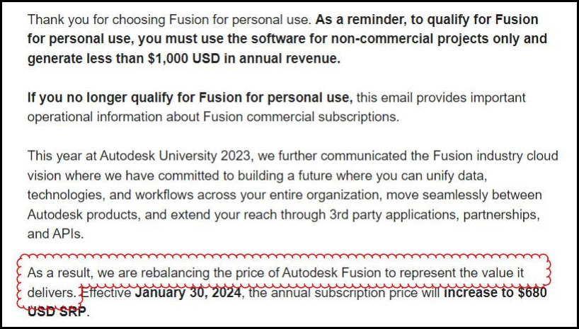
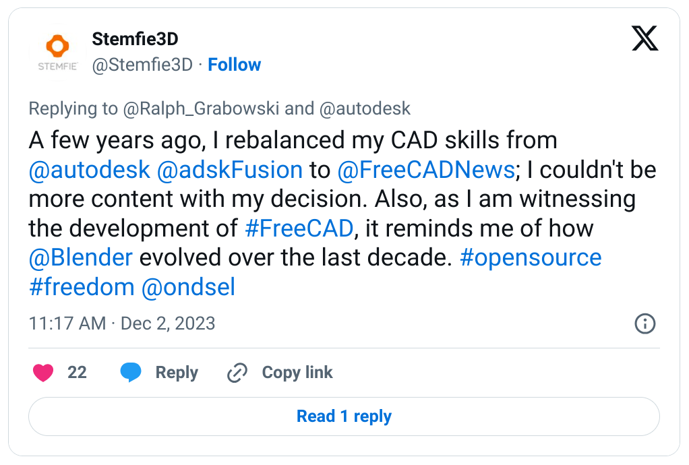

Look, there are good reasons why the price of a software product could go up: rising R&D and maintenance costs, market saturation, rising inflation rate etc. But Autodesk’s latest announcement of bumping the Fusion 360 price yet again makes people—especially small businesses—cringe and it’s easy to see why. It’s about what you do and how you communicate that to users:

Source: [Lemmy.World](https://lemmy.world/post/9022106)

Isn’t it just a fancy way of saying “We know you love Fusion, so we think we’ll get away with making you pay more for it”?

This isn’t the first time. In 2020, they ripped useful features out of the free tier and moved it to the paid tier while promising to “continue to make Fusion 360 the most affordable end-to-end product development tool in the market”. Or, as one user at Lemmy.World said:

> [They pulled the rug out from underneath users years ago with F360.](https://lemmy.world/comment/5739138)

This was later followed by a price tag bump from $495 to $545. And now come January 1, 2024, Fusion users will start paying $690, a 130% increase over 10 years.

Removing features from the free tier and continuously raising the price of the paid tier — it’s a hard pill to swallow. People have a deeply rooted desire to be in control of their life in general, and their software and data in particular. And this is where free and open-source software has the upper hand. Hence the influx of Fusion refugees that the FreeCAD community has been seeing since September 2020.

We think the industry is tired of playing by Autodesk’s rules. There are dozens of big and small software vendors that are chipping away at its market domination. Ondsel is happily contributing to the effort of making CAD software actually affordable for students, hobbyists, and professionals alike. We are pretty open, if not vocal about the work we do, and now you can [test the latest and greatest by downloading our ‘playground’ build of FreeCAD](https://ondsel.com/blog/assembly-wb-prerelease).  When you get tired of Autodesk’s ‘rebalancing’, why not see what life is like for our users?  

