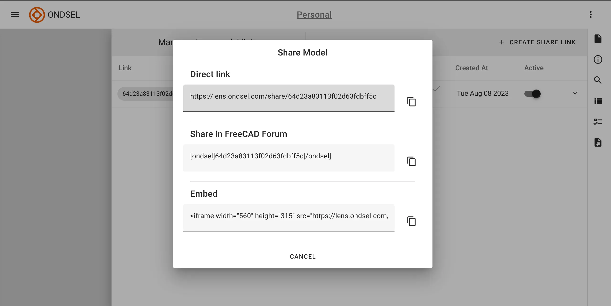

We are happy to announce the release of Ondsel Engineering Suite 2024.1, our integrated solution for collaboration on 3D CAD designs. 

<Youtube v="x2F1A0MYhMk" />

<!-- truncate -->

## Introducing Ondsel ES

Back when we launched Ondsel, we looked at what’s going on with the CAD market and how open-source alternatives can play a role. We came back with several important takeaways:

* **Licencing policies of proprietary CAD vendors annoy users to no end.** Even some of the more affordable mainstream 3D CAD solutions, while rather powerful, drive users nuts: more and more limitations to what you can do, vendor lock-in, formerly free features disappearing behind paywalls etc.
* **FOSS tools are usually rejected by professional users unless they are mature..** Many users flee from those mainstream CAD platforms to open-source, but they have to deal with various technical limitations, missing features, and general lack of UX/UI polish.
* **Collaboration is really important.** A lot of users need a convenient platform to upload and share/visualize a project (vaulting) or even work together on a project (PDM).

So our thinking was: we should focus on a polished user experience and features that are essential to professional use. Let’s build something we feel good about recommending to someone working on a deadline. And let’s build a service for vaulting and collaboration.

Enter Ondsel ES. Building on FreeCAD, Ondsel ES is integrated with Ondsel Lens, an online vault for 3D CAD files with elements of a PDM system.

Our primary objective is to provide polish and sorely missing features — that’s a large part of the added value. We’ve made big and small changes in the upstream project, but the four vital projects for us have been toponaming, integrated assembly workbench, UX/UI, and collaboration.

The work on the toponaming problem is an ongoing project, and we are very grateful to the FreeCAD community for contributing a lot to that effort. But it’s not complete yet, there will be much more to say when it’s largely done. So let’s focus on the other three.

## Integrated Assembly workbench

Ondsel ES is shipping with an early preview of the integrated Assembly workbench that is being built for the upstream project.

The workbench provides a simple workflow: create new or link existing parts, ground one part, select a joint type, select two geometric features, confirm. That is all it takes to attach one part to another.

The Assembly workbench features direct dragging for moving parts around before and after joining them. Within the assembly, there’s no need to use a transform tool. You just grab a part and drag it where it belongs.

Even though we have been testing the assembly workbench mostly on simple projects, users of the pre-release have been making impressive things and stress-testing it which helps us a lot. The community is simply the best.

[Kwahoo's tweet](https://t.co/UeGP5PVjcr)

Most of the work on the integrated Assembly workbench has been done by Dr. Aik-Siong Koh and Pierre-Louis Boyer, with some contributions from developers in the FreeCAD community. The assembly example project we ship with Ondsel ES originally comes from Jose Gabriel Egas Ortuño.

## UX/UI and Sketcher

Before joining Ondsel, Pierre-Louis spent some time developing various improvements for the Sketcher workbench, [largely supported by the community](https://forum.freecad.org/viewtopic.php?t=65521). With Ondsel backing his work, he completed these patches and got most of them merged into the upstream project.. You can try them for yourself today in Ondsel ES.

**Smart dimensioning.** Once you select two geometric features, the Dimension tool will figure out what the most applicable constraint for that combination is and apply it. This new tool effectively replaces half a dozen separate constraint tools: horizontal and vertical distance, distance, radius, diameter, angle. You can pretty much dimension an entire sketch with just one tool.

<video width="100%" height="100%" controls>
  <source src="/video/smart-dimensions.mp4" type="video/mp4" />
  Your browser does not support the video tag.
</video>

**Floating input widgets help quickly constraining sketches.** When you have a pretty good idea of what you are drafting and what all the dimensions are, this new way of drawing a sketch is a huge productivity booster. Select a tool, hover the mouse pointer over canvas and input numbers, press **Tab** to go from one parameter to the next one.

**Tool settings reduce toolbar bloat and introduce new features.** Now you can easily enable/disable the rounding of rectangles, set how many sides you want in a polygon, or which method you use to construct an arc — all instead of extra buttons.

**Automatic horizontal/vertical constraint tool.** This new tool helps fixing sketches where straight lines are not quite horizontal or vertical. You can use it to point and click on the lines of interest, or you can pre-select entire shapes and then click on the tool to automatically apply contextually relevant constraints.

<video width="100%" height="100%" controls>
  <source src="/video/auto-hor-vert-constraint.mp4" type="video/mp4" />
  Your browser does not support the video tag.
</video>

**More sketching tools: Translates, Rotate, Scale, Offset.** It’s what users have been asking for since the early days of Sketcher. The tools are finally available and do just what it says on the label and then some. For instance, the _Rotate_ tool has a _Copies_ option that allows creating polar patterns.

**Copying and pasting in Sketcher.** Now you can select geometry in Sketcher and cut or copy and paste it using conventional shortcuts or the main menu.

## Collaboration with Ondsel Lens

Ondsel ES integrates with Lens — our digital vault for your 3D CAD files, with elements of a product data management (PDM) system. You can upload and explore 3D CAD designs, create multiple workspaces for yourself or for your collaborators.

<iframe width="560" height="315" style={{maxWidth: '100%'}} src="https://lens.ondsel.com/share/65af04b361821ca0c25d2afc" title="Ondsel"></iframe>

Lens will be available in three tiers to meet the most common user needs.

### Solo

This is the free tier of Lens. It’s a great way to experiment with what a PDM system does without spending a lot of money. In the solo tier, all designs that you upload are public. If you’re working on a project that you want to share or where privacy isn’t a concern, the solo tier may be all you need. Simply upload an FCStd or an OBJ file, create a public link, and share it wherever you like. Your shared model will also appear in [the public gallery](https://lens.ondsel.com/public-models). 

We implemented link unfurling in Lens, so social networks that also support unfurling should be able to render a preview of your model in a post. And if you are a member of the FreeCAD forum, Lens is a convenient place to store models that you want to embed in your posts. Or you could embed your models on a website or an online shop.

### Peer

If privacy is important or if you need  to control what the viewer is allowed to download, the Peer tier is for you. Specifically designed for professionals who work independently, it provides privacy and control over your models, offers more storage space, and allows for parametric models that can be updated on the server. You can keep project files in the default workspace or organize different projects as multiple workspaces.

When you have something to show your customer or a manufacturer you work with, you can create open links for your private designs and set what types of files are downloadable. 

Just because you work independently doesn’t mean you work alone.  We’ve heard from professionals who are collaborating with others on projects that are being built in the ‘open hardware’ model. The Peer tier also allows you to create ‘open’ organizations, invite collaborators, and control write access.

### Enterprise

For larger teams working on proprietary designs, we will be introducing the Enterprise tier.  Enterprise gives full control over model visibility, read/write access, and group management. Many more features are planned for the enterprise tier that will make Ondsel a powerful addition to your toolkit.

Ondsel Lens also has some extras that you do not typically get in affordable 3D CAD vaults.

For engineers who design inherently customizable things (think [Gridfinity](https://gridfinity.xyz/)), Lens provides a user interface for **custom properties** made with the PropertyBag feature of the Path workbench. This means a user can open someone else’s model in Lens, change some attributes to their liking, then download and 3D-print an STL file. This opens quite a few possibilities for makers and hackerspaces.

PropertyBag is not the greatest solution out there. We are working on a replacement that won’t require switching to Path and will play well with FreeCAD’s [expression engine](https://wiki.freecad.org/Expressions) (see our earlier [blog post](https://ondsel.com/blog/build-system-for-custom-data-elements/) with preliminary research).

And because we are building PDM functionality, Ondsel Lens supports **versioning**. You can create multiple timestamped revisions of design files, add revision comments (messages), make a particular version an active one (i.e. displayed by default), and download specific versions.

Most work on Ondsel Lens has been done by Amritpal Singh and John Dupuy.

The integration layer between Ondsel ES and Ondsel Lens is an [open-source addon](https://github.com/Ondsel-Development/Ondsel-Lens). We ship it as part of Ondsel ES, but it’s also available for upstream FreeCAD via the Addon Manager.

You can log into Lens, browse available workspaces, open files that you previously uploaded into your vault, switch between available versions, modify them, and then commit these revisions as new versions. You can also use the addon to generate open links and set download permissions without opening Ondsel Lens in your browser.

The addon was created by Pierre-Louis Boyer and Pieter Hijma.

## Respecting your digital rights

The source code of Ondsel ES is [public](https://github.com/Ondsel-Development/FreeCAD) and available under the same license as upstream FreeCAD, which is LGPLv2+. The same applies to the Lens addon.

We contribute our changes to the upstream project. The Ondsel team is relatively small, we wouldn’t be able to maintain a hard fork. It’s in our best interests to play fairly with the community.

Files created by Ondsel ES are FreeCAD files. Anything you create with Ondsel can be opened in FreeCAD and vice versa.  This compatibility is important to us and we know it’s important to our users. One caveat: Ondsel ES includes the new Assembly workbench because we think it’s important to get feedback early and to let users build the most common kinds of assemblies that they need.  But this workbench functionality is still being reviewed by the upstream project.   Assemblies you create in Ondsel can be opened in FreeCAD but will not have the full assembly functionality until the entirety of the workbench has been accepted..

As for the files that you upload to Lens, your original 3D CAD designs will always remain your property.

## What’s next

We expect to spend the next few months polishing features that we have already implemented in both Ondsel ES and Lens, and exploring our next steps based on your feedback, as well as the results of the recent user survey. Some of our immediate plans for Lens include displaying assemblies, ability to control visibility of parts, support for colored bodies.

There’s an active [chat on Discord](https://discord.com/invite/7jmzezyyfP) where many early adopters provide feedback. You can [grab the release](https://ondsel.com/download), [create an account](https://lens.ondsel.com/signup) at Lens, and tell us how it works for you!
