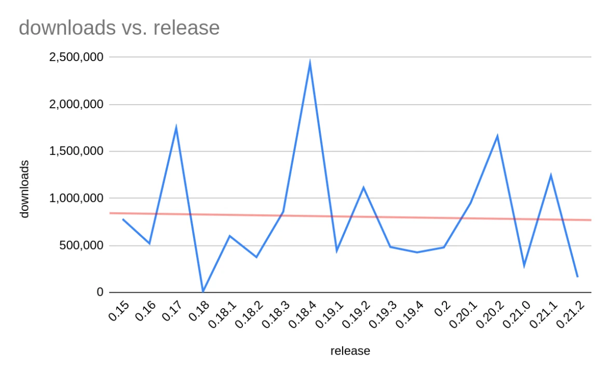
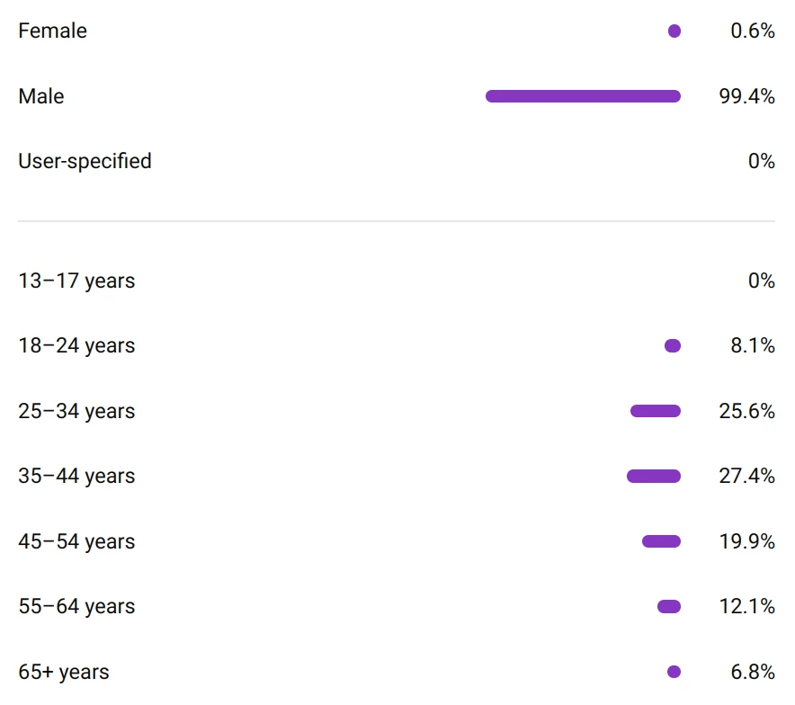
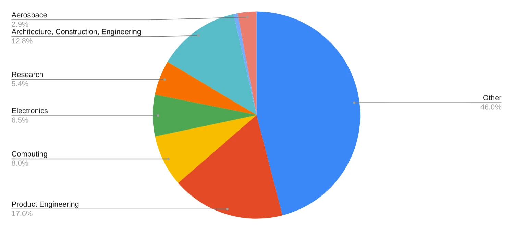
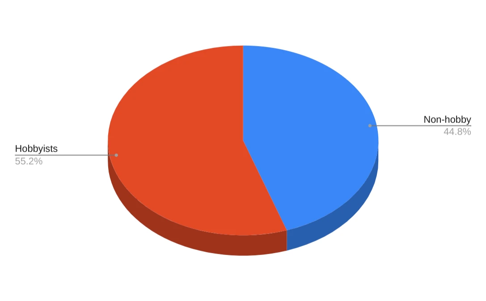
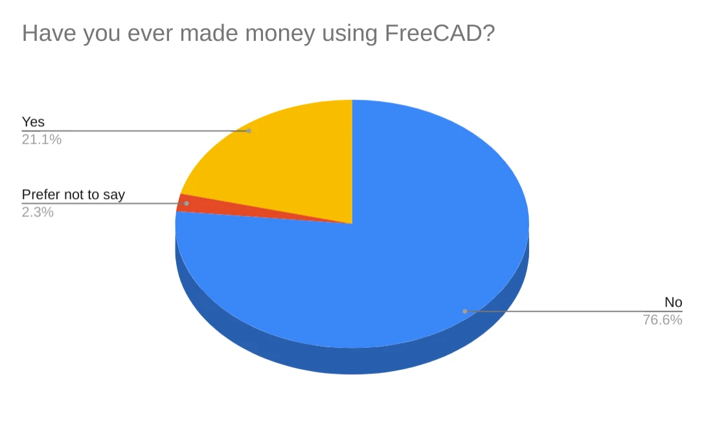
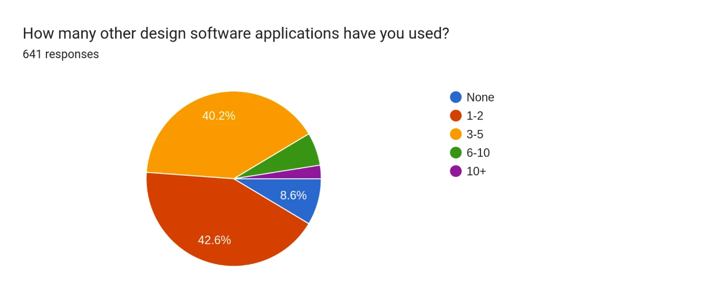
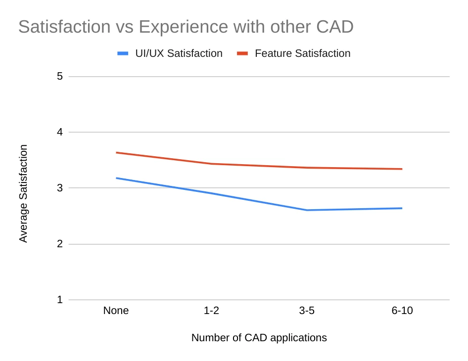

Last month, we ran a user survey to better understand who FreeCAD users are: how they use FreeCAD, what they do at work, what major gripes with the software they have, and more. Over the course of one week, 650 people answered our questions and provided extended insights. They learned about the survey and came to it from more than ten different websites and social media platforms.

<!-- truncate -->

We combined that data with information we got from other sources, such as YouTube analytics, GitHub downloads data, and membership on various social platforms.

Our takeaways from studying the results and matching datasets against each other fall under three general categories: demographics, addons ecosystem, major issues users have with FreeCAD. This is the first post in the series, let’s focus on demographics here.

## Essential demographic data

Is it possible to estimate the entire user base of FreeCAD at all? It’s not going to be easy. We know the data on all social platforms (as of early February):

| Platform                  | Count  |
|---------------------------|--------|
| FreeCAD Forum             | 51433  |
| /r/FreeCAD subreddit      | 18800  |
| LinkedIn FreeCAD group    | 4140   |
| FreeCAD Facebook Group    | 20100  |
| FreeCAD Powerusers        | 4700   |
| X @freecadnews followers) | 15900  |
| Total                     | 115073 |
But obviously, there are limitations: there is an overlap between those platforms, some users never follow FreeCAD on those social platforms, and there are inactive forum users and Twitter followers. The forum consistently has more anonymous visitors than registered users active at any time.

We can also look at downloads:

But we don’t know how many of those downloads are automatic and how many are repeated downloads by the same people. We also don’t know how many users downloaded, tried using it a few times, and then moved on. Nor do we know how many users get their downloads from their Linux distributions.

The only way to have a better understanding of the user base size is to build a ‘phone home’ feature to tell us if a user sitting on a particular IP address loaded the program at least once in a week (or month). However this likely won’t sit well with many users over privacy concerns. And as this has to be an opt-in feature, it’s possible that most users will not enable it, which will render the collected data useless. So why bother?

:::info
While we don’t have reliable data about the size of the user base, our educated guess based on downloads and community membership is somewhere between 850K and 1.25 million. 
:::

We didn’t ask basic questions like age or gender, because we already have this information from YouTube analytics for our channel:

We discussed this with a few youtubers who run popular channels for FreeCAD users, and the situation is more or less the same: very few student-aged users and older people, almost no women, virtually no 13-17 aged kids.

## Who are the users?

Let’s take a quick look at the following general datasets: “Industries“, “Hobbyists vs pro users”, “Jobs”, and “Making money with FreeCAD”.

Industries:

We combined some of the responses into larger categories:

* Architecture, Construction, Engineering — essentially, everything that has to do with buildings and civil engineering.
* Product Engineering — designing physical products, primarily using mechanical design tools.
* Computing — people working in software development companies as solution architects, developers, consultants etc.

One thing that we could have done better here is separating “hobby” industries from “pro” industries, because a number of people use FreeCAD both at work and for hobby, and those aren’t necessarily the same industries. Much of the “Other” category is actually all kinds of use for hobbies like woodworking (with CNC), designing small appliances for fun, 3D printing etc.

Hobbyists vs professionals:

This is somewhat surprising: we had very modest expectations for people using FreeCAD professionally. Actual numbers surpassed our expectations. In hindsight this makes sense. The ‘non-hobby’ group includes users who are using the software professionally as well as those who use it at work but not as their primary role or in a revenue-generating way. For example, researchers and students wouldn’t be in the hobby category but also wouldn’t consider themselves ‘professional’ CAD users. This became clearer when we asked them about making money with FreeCAD.

Making money with FreeCAD:

We are pleasantly surprised to see that more than one in five users has used FreeCAD to make money.

## Experience with CAD

People who have used either lots of other CAD programs or none whatsoever are both minorities. Most users have experience with 1 to 5 other programs:

There is a somewhat expected correlation between experience with other programs and satisfaction with FreeCAD:

There are two noteworthy things here. First, the feature satisfaction trend line is not as steep as the one for UI/UX satisfaction. This suggests that for experienced users, features are less of a problem as compared to UI/UX.

Secondly, note that the trend line for “UI/UX satisfaction vs Experience with other CAD” flattens out at 3-5 and actually goes back up a little. It looks like FreeCAD doesn’t stack against competition very well. But some of the users who truly have seen it all are more likely to cut FreeCAD developers some slack.

## Takeaways

### The user base is highly diverse in industries

There’s just no way around it: FreeCAD users are all over the map. This is not a problem per se, but it means that we need to pay a lot of attention to how well FreeCAD works for very different groups of users. For instance, there might be a need for fine-tuning the user experience for architects or mechanical engineers one way or another.

The survey gave us a glimpse into the variety of uses that FreeCAD gets from its community. We need more and better data on that to make good decisions, feature- and UX-wise.

## People are using FreeCAD for Real Work™

As we have already mentioned, we expected fewer people to be using FreeCAD professionally. It’s a good kind of being wrong, but it also means that we need to prioritize development for professional use. We’ve said it before and we’ll say it again: if FreeCAD gets the job done for a professional working on a deadline, it will likely get the job done in the prosumer market as well. In that sense, FreeCAD might not be ready for every professional need, but there are many tasks for which it is a great choice.

## Demographic disparities

The audience data form YouTube analytics was sampled two weeks after publishing the Ondsel ES 2024.1 video, when there were ca. 20K views of it. Shortly before that video, the 18-24 age range accounted for mere 2% of visitors. Now, a month after that screenshot was taken, this age group is hovering between 8% and 9%.

The lack of 13-17 kids is not surprising: we upload our videos as not targeted at kids, and so do many other youtubers. No surprises there. But this only accounts for users who would see our videos suggested by the platform. That means that there are also virtually no 13-17 users in the core FreeCAD audience. This is hardly an age-specific thing: so far, there have been over a million 3D printing related videos published on TikTok, accounting for over 18bln views ([source](https://tiktokhashtags.com/hashtag/3dprinting/)). Is FreeCAD too messy for the younger generation?

We don’t have survey data supporting the staggering disparity between males and females that we see in YouTube statistics. What we do know is that it’s common for other FreeCAD channels on YouTube, as well as for FOSS-related websites. We also know that women made 16.7% of the engineering workforce in the U.S. in 2023 [as per U.S. Bureau of Labor Statistics](https://www.bls.gov/cps/cpsaat11.htm) — much more than what _we_ see. This kind of disparity [has been studied](https://www.toptal.com/open-source/is-open-source-open-to-women) in other FOSS communities and generally attributed to unwelcoming culture. We don’t know if that’s the case here but it’s worth considering.

## In conclusion

We spent many years trusting our guts instead of studying the community. While some of our assumptions turned out to be right, some of the results challenged our understanding of who FreeCAD users are and what they want.

Let’s hear your thoughts about the takeaways. Stay tuned for the next post in the series that covers the importance of addons for FreeCAD users!
