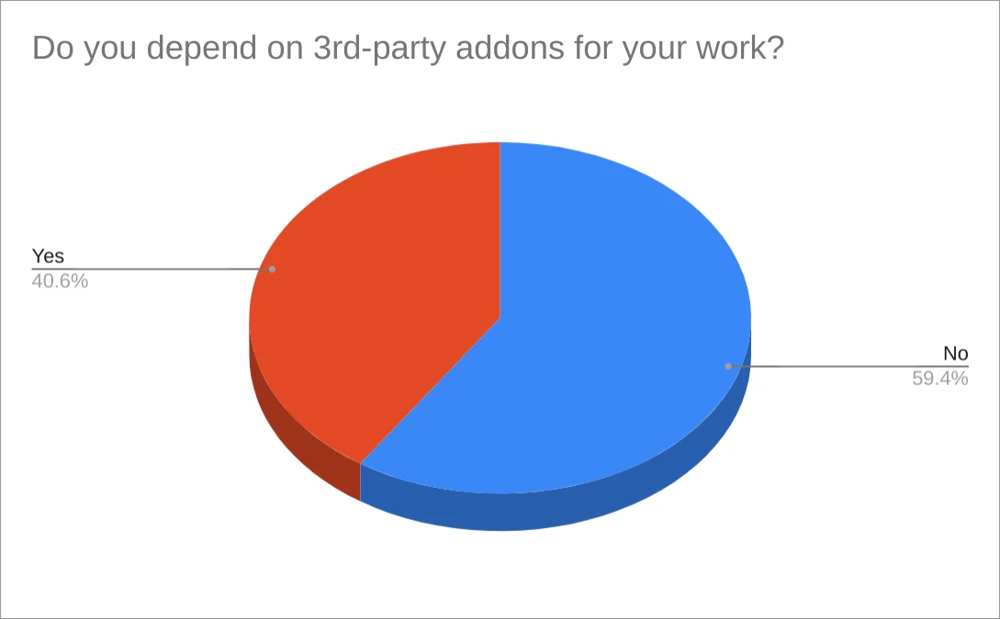
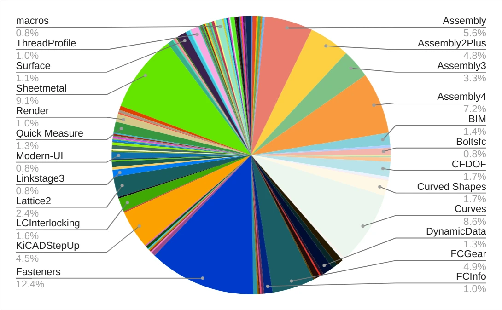
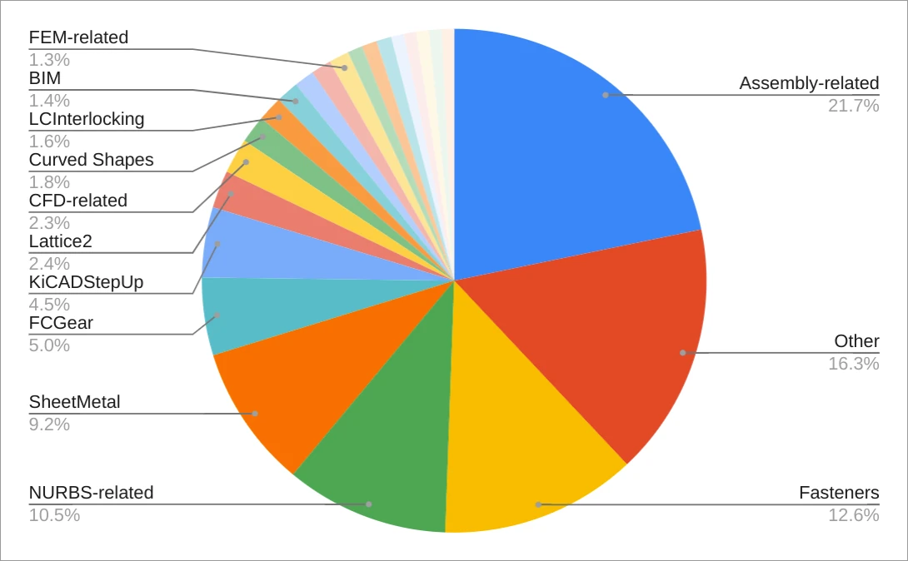
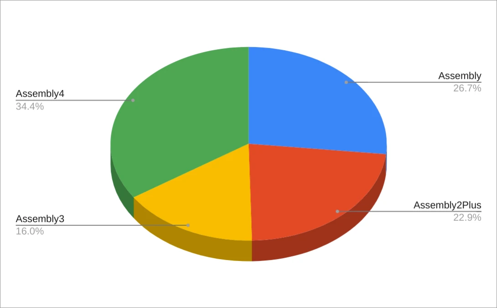
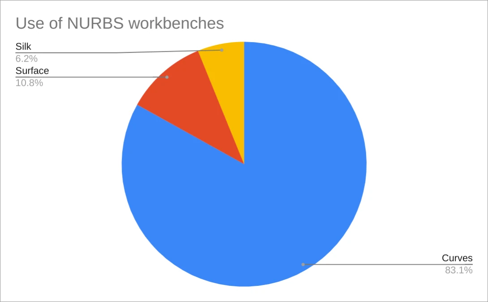

FreeCAD has been designed as an extensible CAE platform from the ground up. There are currently more than 200 addons available through the Addon Manager alone, ranging from large workbenches to simple macros designed to do one job.

As part of the user survey, we looked into the use of addons. This is the second part of the series. If you missed it, you can also read what we found about [user demographics](https://ondsel.com/blog/freecad-user-survey-results-part-1/).

<!-- truncate -->

## The addons landscape

We first looked at the percentage of people who rely on 3rd-party addons to do their job. This is a nearly 40/60 split: 40.6% absolutely need addons, while 59.4% do just fine without them.

With almost 60% of users making do without addons at all, it suggests that the core product is powerful and capable. The rest of the users need something that isn't in the core and we wanted to know what that is.

We asked users what addons in particular they use. Here is a more verbose chart that lists most common options out of the 111 that users listed. This is consistent with our previous conclusion that the FreeCAD user base is incredibly diverse.

A few addons like Fasteners and Sheetmetal stand out reflecting their overall popularity but we also saw some redundancy.  We grouped related addons together to see if we could spot some patterns.

Assembly addons are the largest group followed by NURBS-related addons. Seeing FCGear and Lattice2 in TOP10 (when grouped) is also an eye-opener.

Let’s quickly focus on two of the groups in the previous pie chart.

## Assembly workbenches

Here is how the “Assembly-related” group breaks down:

Note that nearly a quarter of respondents didn’t specify the specific assembly workbench they rely on, we don’t know how those 26.7% are distributed across the three actively developed 3rd-party workbenches.

The overall interest in assemblies is hardly surprising, and since the [research last year](https://ondsel.com/blog/default-assembly-workbench-7/) we did expect a split between available options. After all, they all have their pros and cons:

* A2plus is easy to get started with, but has less features than A3 and is prone to the toponaming issue.
* A3 has more features but is also harder to master and prone to the toponaming issue unless used as part of the LinkStage fork of FreeCAD by RealThunder.
* A4 works around the toponaming limitations nicely and has some interesting features, but has a convoluted workflow, especially for beginners.

We expect that the new integrated assembly workbench will appeal mainly to users who stayed away from using existing options due to analysis paralysis, as well as to users who mastered one of the existing workbenches but weren’t really happy with what they got. All three 3rd-party options have users who are dedicated enough to stick with their choice going forward.

## NURBS workbenches

Going forward, it’s interesting that people use three different NURBS-related workbenches: Curves, Surface, and Silk.

There are some users who use more than one NURBS workbench, but the overlap isn’t huge: 4 people use Curves and Surface, 2 people use Curves and Silk, 1 person uses Silk and Surface, and the same 1 person uses all three.

Overall, the NURBS situation is very similar to that of assembly workbenches: useful features are spread across numerous addons. Are we serving users well by keeping things as they are? It’s entirely possible that there should be more consolidation. We think more research is needed.

## Takeaways

Much of what we find in this data just confirms what we already know. But some of it is surprising and puzzling. There's a lot more we can learn from how users are building and using addons. When addons like Lattice2 and KiCADStepUp show unexpected popularity, we need to understand whether it reflects a missing core feature or a different demographic of our users than we thought.

We also need to keep track which addons users rely on and what they use them for. If a particular addon is really popular with many different kinds of users, that’s a good reason to sit down and evaluate whether it should be part of the core user experience.

SheetMetal is a good example of that. Its popularity is hardly surprising as this functionality is typically built into proprietary options, and approx. 90% of respondents are familiar with at least one other CAD program (going as far as 6-10 other applications).

With that in mind, we asked the design group to look into this and come up with a UX review and begin the process of a long-term strategy towards SheetMetal in FreeCAD. They’ve already done amazing work towards that. We’ll report on their findings separately.

## What’s next?

In the next installment in the series we’ll look into the features that FreeCAD users need so much they are willing to pay for. Stay tuned!
