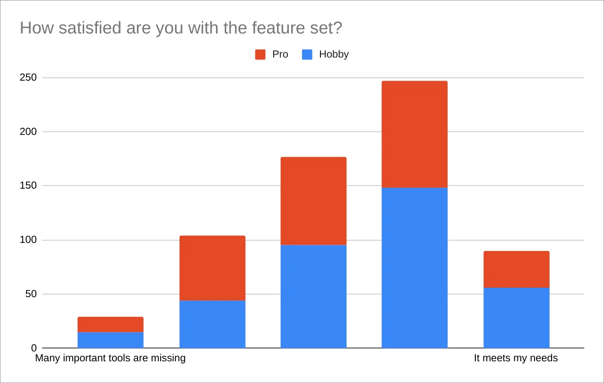
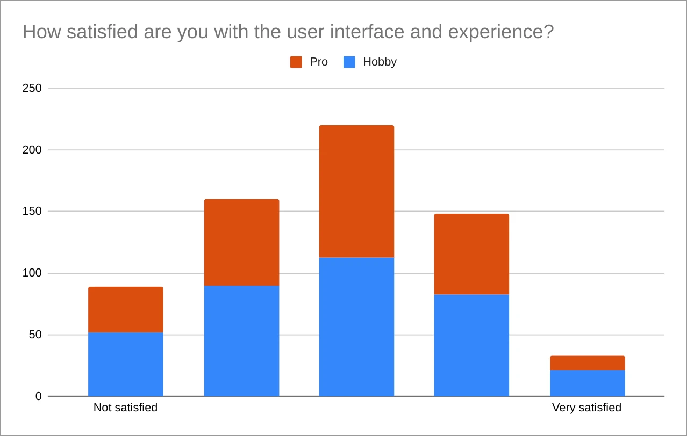
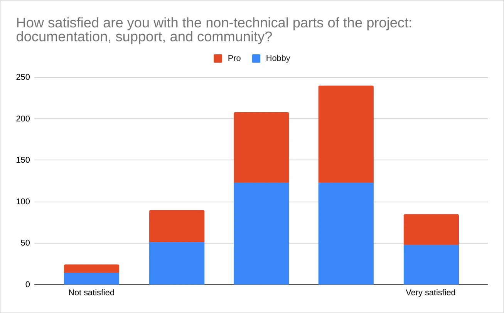
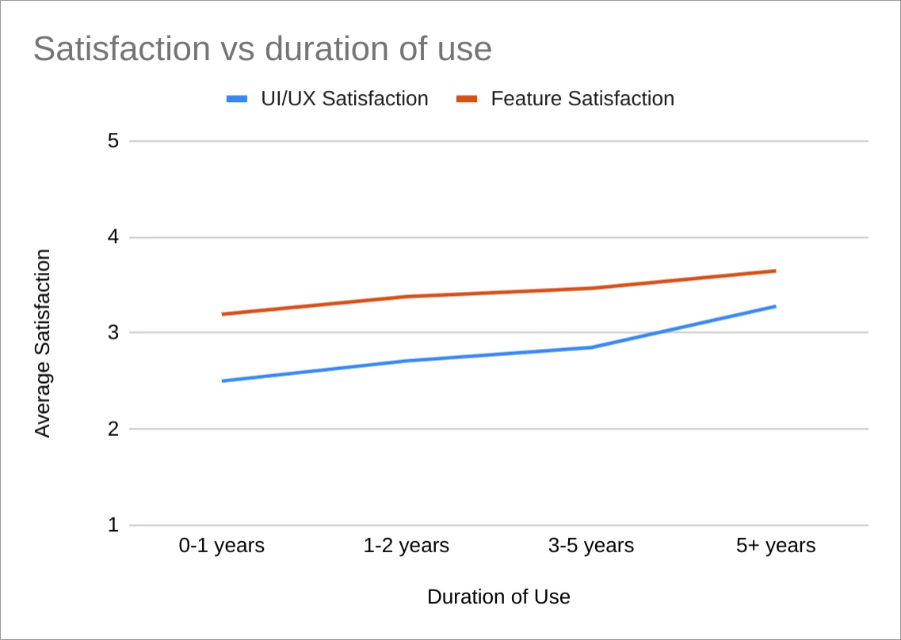
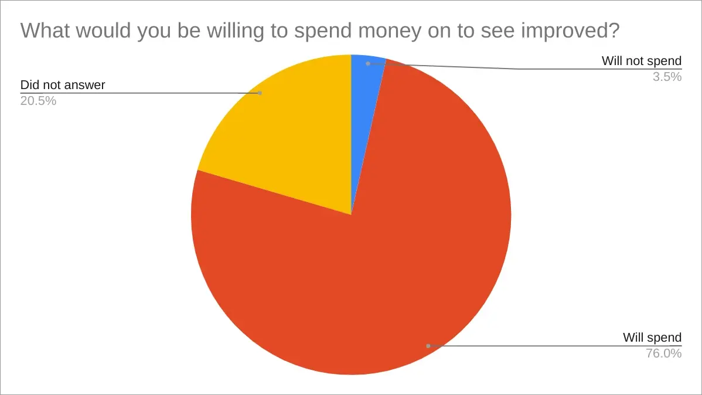
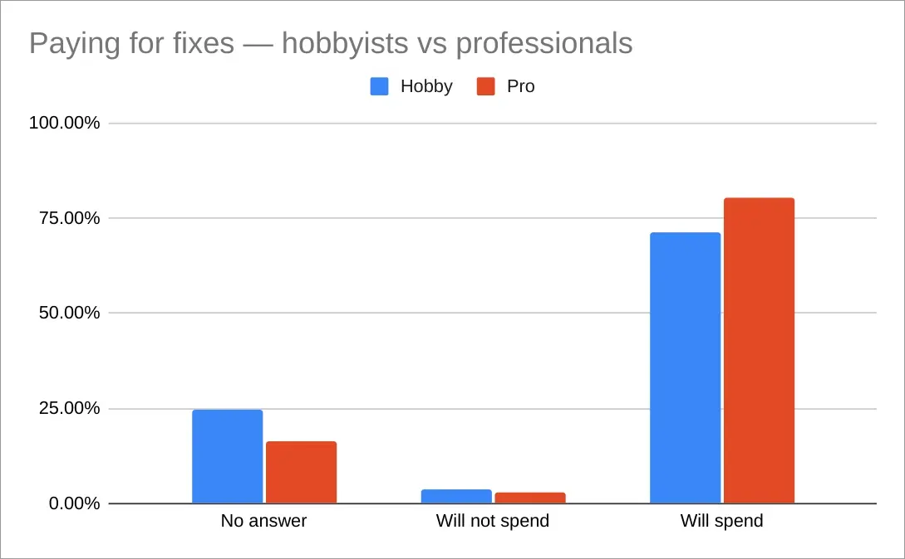
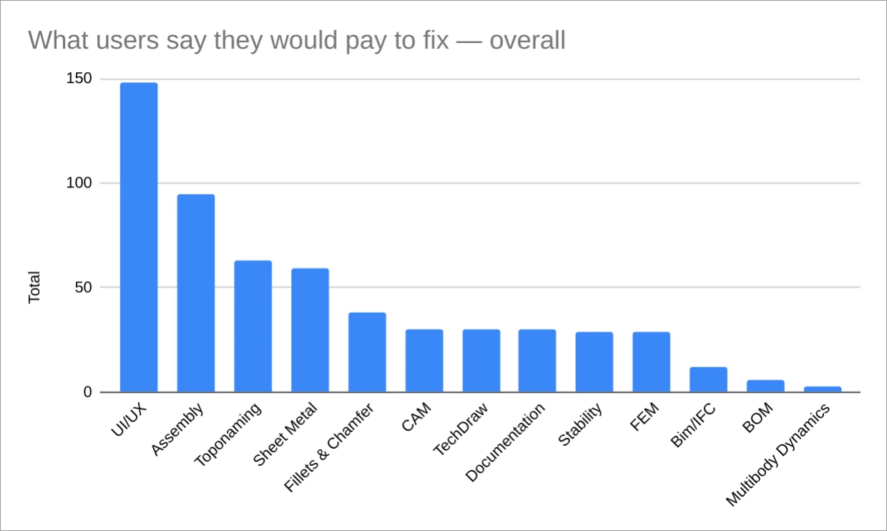
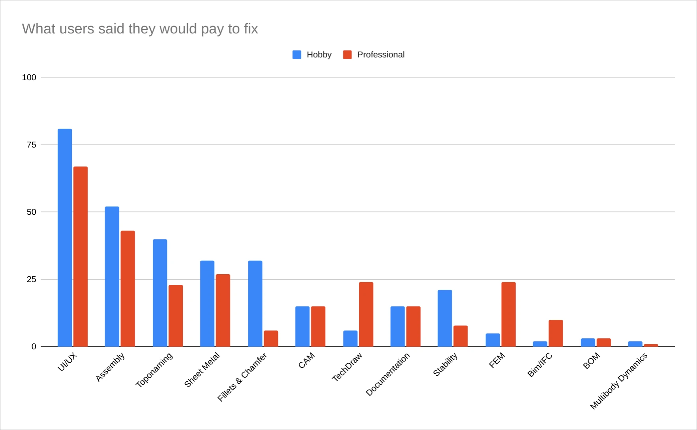

This is the last post in the series where we discuss the takeaways from our recent user research. We already looked at [basic demographics data](https://ondsel.com/blog/freecad-user-survey-results-part-1/) and the [use of 3rd-party addons](https://ondsel.com/blog/freecad-user-survey-results-part-2/) for getting a job done. Now it’s time to talk about things that annoy users so much they are willing to pay to get these issues nuked from orbit.

Note: as a for-profit company, we are certainly interested in knowing what users are willing to pay for. If we’re going to survive, we have to do that.  But that was not our primary motivation in asking these specific questions. FreeCAD is not only free-as-in-speech, it’s also free-as-in-beer.  We wanted to know if that was the main reason that people use it. 

Our thinking is that if users are willing to sacrifice financially to make the software better, then it means they value the ‘free-as-in-freedom’ aspect of FreeCAD even more. It would give us confidence that we can build a business model that gives users real value and is also financially sustainable. We were blown-away by the results.

## Where the pain is

We started the last series of questions in the survey with measuring users’ satisfaction with the feature set, UI/UX, and then non-technical parts of the project like docs and community. Let’s have a look.

The situation is not too bad feature-wise. There is a very obvious and somewhat predictable dissatisfaction of pro users with what FreeCAD is capable of.

The UI/UX response is substantially different though, the largest group sits exactly in the middle between “Not satisfied” and “Very satisfied”, and the number of people who are not satisfied at all is substantially larger than that of people who are completely satisfied with FreeCAD’s UI/UX:

Then when we look at satisfaction with non-technical aspects of the project, we see that users are not completely happy with what they got, but they are mostly in the “OK” and “good enough” categories, so, again, not bad at all!

We also looked at how that data looks when stacked against other data. Seems like the more time people spend using FreeCAD, the more they are fine with both features and UI/UX.

Finally, to figure out what’s most painful for users, we asked them: “What would you be willing to spend money on to see improved?”. We got 517 responses (out of 650 overall). A small number of responses were negative — people were either unwilling to pay for features and fixes in a free and open-source project, couldn’t afford it, or simply didn’t give us their reasons. The overall split is in favor of donating:

Now, here is an interesting question: are professionals more likely to pay for improvements in FreeCAD? Because of the 45/55 split between hobbyists and professionals, we measured this in percentages rather than in absolute numbers. The answer is a definite ‘yes’, but hobbyists feel almost as much involved.

494 out of 650 people mentioned various causes they would choose for donating. Sometimes it would be just one thing, sometimes it would be multiple things. If one person mentions UI/UX, Assembly, and CAM, all three get one vote each. We distributed all replies across a dozen categories.

To get a better sense of who’s requesting what, we also looked at how those votes are distributed between hobby and pro users.

## Key takeaways

Over 75% of users surveyed said they were willing to spend money to improve it.  That’s an amazing number.  It speaks volumes about how important the software is to people. It also means these complaints aren’t just people whining. These things affect them and their work significantly.

Our goal here was to discover what irritates users so much that they are willing to put money where their mouth is.

Overall, people are really concerned about UI/UX. We’ve done some work on that in Sketcher (that we are proud of), more changes have already landed or are coming from community members, in particular, from the established design working group. There is a lot more to be done, but this is progress!

Assembly remains #2 popular concern, and we are happy that the integrated assembly workbench is shaping up nicely to address that.

Toponaming and SheetMetal are almost equally important to users — this is really interesting, we already covered the importance of SheetMetal in the previous post. Both are currently being worked on by community members.

We found that professionals are relatively less concerned about toponaming in comparison to hobbyists — a point some users are very vocal about on the forum. But pro users are also less concerned about UI/UX than hobbyists are — this is actually interesting.

On the other hand, professionals are more concerned about CAM, TechDraw, user documentation, FEM, and Arch/IFC than hobbyists are. In fact, pro users are about as much concerned about FEM as they are about TNP, SheetMetal, or TechDraw! So it’s good that there is some activity there lately — thanks to Mario Passaglia who is working on electromagnetic simulations via an FPA grant, as well as to NewJoker who contributes with both code and management.

## What this means for you

FreeCAD has a lot of problems, many of which are serious and will take concerted effort over a long time to solve. But users value the project enough to be ready to financially support the development. Some of the replies we got from the respondents have actual dollar value attached to features and fixes they are missing.

If you find yourself in agreement with our data and want to see FreeCAD improved and are willing to act on it, you have two options.

### The FreeCAD Project Association’s [grant program](https://fpa.freecad.org/programs/fpadf-announcement).

The FPA is continuing to improve its processes for funding development. This is a good thing. It’s already bringing important improvements to Sketcher, FEM, and other parts of the program. This program will expand as donations increase, so giving here means the FPA can tackle more projects at the same time.

### The Ondsel Product [Ondsel ES & Lens](https://ondsel.com/pricing/)

There are some problems, however, that are difficult to solve with one-off grants and part-time developers.  We started Ondsel with the desire to hire full-time professionals to work on FreeCAD as a career.  We think this is essential for the long-term sustainability of the project and the resolution of the most intractable problems. If you agree with what Ondsel does, you can help make more improvements possible by using Ondsel's version of FreeCAD and subscribing to a paid tier. You’ll get advanced features, a polished user experience, and faster updates. And you’ll help us build FreeCAD into a world class engineering suite for everyone.
