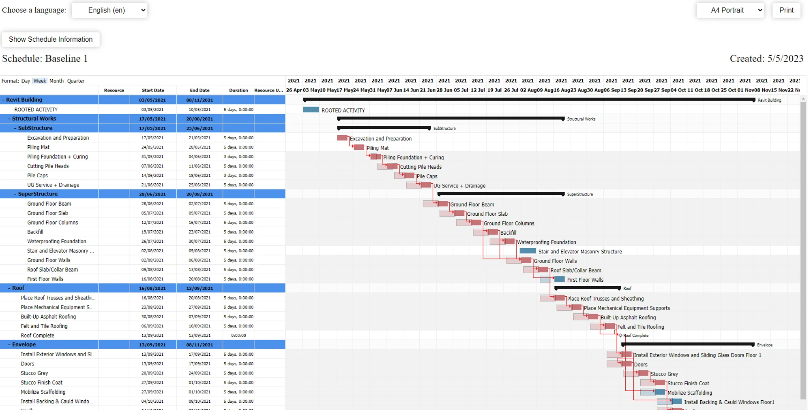
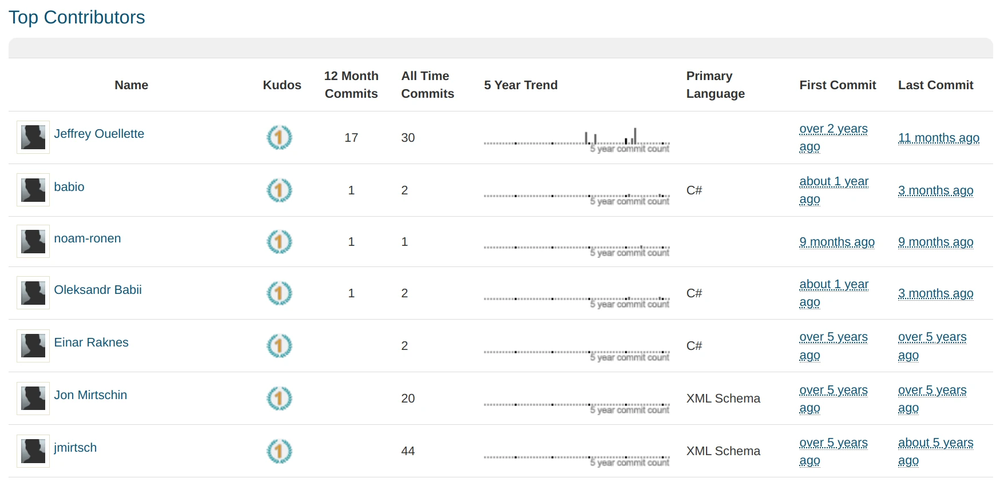
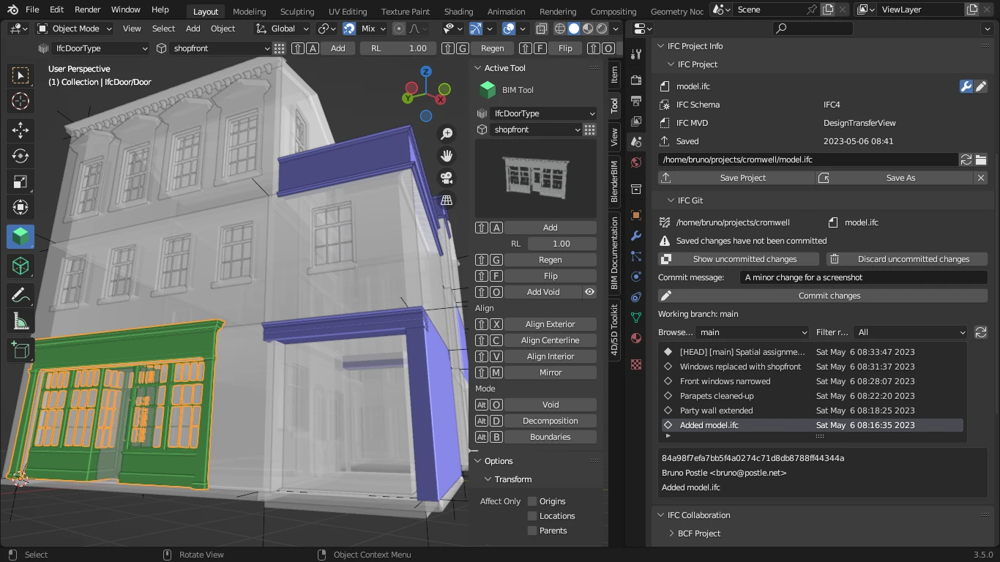
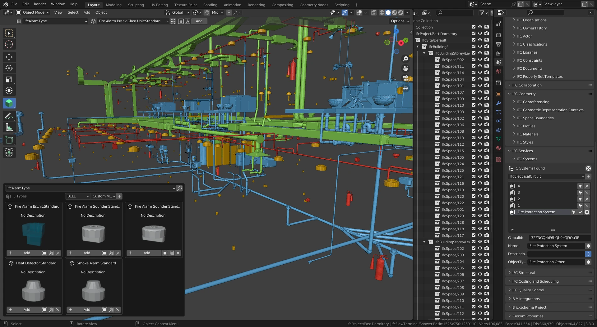
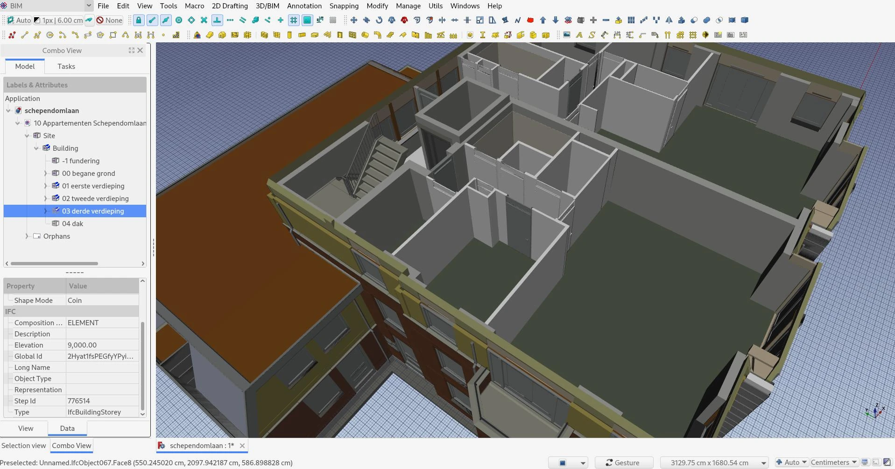

Even calm and steady professionals can get to the point where they’ve just had enough. And for many architects out there, having to use Autodesk Revit on a daily basis is really that kind of a frustrating experience.

Revit is what most architects learn at school and then use at work. To give credit where credit is due, it has many fine points. You don’t get to be #1 if you don’t get the job done. However, it’s really slow, there are data intellectual property concerns, the subscription price is rising year over year, Autodesk management doesn’t seem to have a coherent vision for the product’s future and they don’t listen to customers nearly as much as they should have, and that’s not even the entire list of issues.

In this post, we’ll focus on just one aspect of this love-hate relationship: interoperability. Let’s talk about IFC and why Autodesk should take notes from emerging free and open-source tools for building information modeling (BIM) authoring.

<!-- truncate -->

This post was written in collaboration with Yorik van Havre, maintainer of the Arch and BIM workbenches. To add context to this article, we’ve also included insights from Ryan Schultz, a US-based architect with 20+ of experience, founder of [OpeningDESIGN](http://openingdesign.com/) and active member of the [OSArch](https://osarch.org/) community.

## IFC? BIM?

If you are new to the topic, here is a quick introduction. In “traditional” architecture you have multiple plans of a building. Structural engineers have their own plan, and so do [MEP](https://en.wikipedia.org/wiki/Mechanical,_electrical,_and_plumbing) engineers and [HVAC](https://en.wikipedia.org/wiki/Heating,_ventilation,_and_air_conditioning) people. And because plans go through revisions, they don’t necessarily match by the time construction starts. And so you could get issues like beams going through ductwork (not great at all), electric wires running near water pipes (really messed up), or natural gas pipes interfering with ventilation ducts (‘holy mother of god’ bad). Which sounds like a comic exaggeration except when it’s not.

Building information modeling, or BIM for short, is a design methodology that assumes having a full model of a building, both geometric data (walls, slabs, ceiling etc.) and all the engineering systems. This allows analyzing the full model for clashes like the ones mentioned above. It’s [a lot more than that](https://bimcorner.com/benefits-of-using-bim-technology/) though. Because it’s all one model, there’s easier generation of bill of materials, finer cost calculation, better scheduling of the life cycle etc., but above all — better communication between all involved parties.

This is where the Industry Foundation Classes standard, or IFC, becomes important. It’s the way you exchange project data between collaborators, especially when they use a different BIM authoring program like ArchiCAD or Tekla Structures.

IFC is first and foremost a data schema that describes what kind of information can be represented, what metadata can be attached to that information, and how different bits of information are connected to each other. As demands grow, the IFC schema changes over time, with each major revision including something new. So BIM software has to adapt.

Somewhat confusingly, there is no single file format for IFC. It’s many file formats that represent the same information in different ways, each suitable for a particular application. Perhaps, the most commonly used file format is IFC-SPF. It’s a text format based on STEP as defined by [ISO 10303-21](https://en.wikipedia.org/wiki/ISO_10303-21).

## What’s up with Revit’s interoperability and IFC support?

For Revit and other similar BIM authoring applications, there are two major workflows that involve exchanging data and IFC. The less popular workflow is exchanging full models, which only works for smaller projects. The more popular workflow is exporting one part of the entire project to IFC, handing it over to e.g. a MEP engineer, then getting back the revision and linking that file in the master project.

For the company that actually kickstarted IFC back in 1994, Autodesk is handling its support in a rather unusual way. IFC linking and exporting in Revit is implemented as an [open-source plugin](https://github.com/Autodesk/revit-ifc) that has been available for over a decade. Releases are regular, they are managed by an Autodesk employee, but a large part of development is still done by the person who wrote the original code in his Autodesk years and then went to work at a different company. It’s not a terribly active project either:

Nor is there a lot of active contributors:

Revit-ifc is not a code dump, but it doesn’t have great leadership either. Of course, there could be a case made for the availability of the source code for modifying and distribution (LGPL 2.1). After all, if regular open-source projects are allowed to say “if you don’t like it, patch it” (which tends to be frowned upon), doesn’t it apply to Autodesk as well? But if you are an architecture bureau that pays a hefty, ever-increasing subscription fee to a software vendor, doing the vendor’s job is likely not on your TOP10 list of things to do.

The net outcome is that Revit’s interoperability with other applications is not great, to put it mildly. It was one of the main subjects raised by architects in multiple open letters in 2020 and 2022.

The [original open letter](https://letters-to-autodesk.com/letter-to-autodesk.pdf), signed in 2020 by [some of the big companies](https://www.architectsjournal.co.uk/news/big-name-architects-hit-out-at-cost-and-performance-of-revit) in Great Britain, mentioned “insufficient interoperability between programs, especially when exchanging IFC” and then requested “a commitment to continuously improving [..] industry interoperability (including IFC) as well as expanding geometry support and alignment to international data standards”.

To Autodesk’s credit, they [admitted](https://adsknews.autodesk.com/en/views/reply-to-open-letter-on-revit/) they could have done a much better job and started more actively engaging with customers.

Two years later, an [update](https://letters-to-autodesk.com/) of the open letter was published. While the authors applauded the creation of a [public roadmap](https://blogs.autodesk.com/aec/roadmap/) and other changes, they also felt that the company wasn’t interested in foundational changes:

> The feeling remains that Autodesk has deliberately avoided investment in appropriate tools, instead expanding their compliance staffing and revenues. … The need remains for a strategic re-boot in order to create a platform that is fit for purpose for the interoperable design and delivery of the next generation of global projects. Clearly this is a difficult thing to do whilst tied to the RVT file format.

This sentiment was largely shared by a large group of architects from Norway, Denmark, Finland, and Iceland, who wrote [The Nordic Letter](https://the-nordic-letter.com/) (signed by 326 architectural bureaus representing over 14,000 architects) also in 2022. The authors of The Nordic Letter went even further, citing insufficient interoperability between Autodesk’s own products, Revit and Civil 3D:

> The experience, however, is that interoperability and subsequent workflow between these two Autodesk owned programs is poor to say the least, requiring several workarounds just to be able to exchange vital project data.

So it seems like a substantial part of the global community feels like Autodesk isn’t interested in investing into interoperability, even if we are talking about its own products.

> As a user you can drum the beat about wanting a certain feature. But if the company doesn’t want to do it, your hands are tied. However with open-source, the more drumbeats you have, the more users say “we want this”, the more likely it is that you can organize financing for development of a feature. It’s a beautiful feedback loop — Ryan Schultz

## Native IFC and FOSS

So how do emerging free and open-source BIM authoring tools change this picture?

The important thing to understand here is that proprietary BIM authoring applications are not IFC editors. When they import an IFC file, they convert it to its own document object model. When they export an IFC file, they convert internal representation of the building information to STEP geometry and IFC metadata. The consequences of that are multifold.

First of all, they insert vendor-specific metadata that effectively creates a superset of the standard. This metadata doesn’t travel well across BIM authoring applications. And then some non-specific data gets lost because of roundtripping errors.

Secondly, there’s [a lot of extra work](https://wiki.osarch.org/index.php?title=Revit_setup_for_OpenBIM/Revit_and_IFC_classes) involved to create a mapping between IFC classes and Revit objects when importing and exporting.

And lastly, you can’t have a workflow with atomic changes between revisions. And the latter means that you can’t easily locate the difference between two data points or, better yet, make a sensible visualization of changes. This is one of those cases where something is technically correct to do, but really isn’t helpful at all.

And it’s precisely where free and open-source applications are beginning to show their teeth, because [BlenderBIM](https://blenderbim.org/) and FreeCAD are switching to the [Native IFC methodology](https://github.com/brunopostle/ifcmerge/blob/main/docs/whitepaper.rst).

<Youtube v="Ooh05WF__80" />

In a nutshell, Native IFC is a way for a BIM authoring application to introduce extremely small changes to pre-existing IFC files. The basic rules are simple:

* Never change ID of an IFC entity when you edit its attributes 
* If you remove an entity, don’t reuse its numeric ID 
* Always write entities in the same format that was already used in the IFC file

All that means that original data is mangled as little as possible. Which allows putting IFC files into a version control system. And _that_, in return, makes it possible to create sensible diffs between revisions and perform audit ([git blame](https://git-scm.com/docs/git-blame)).

> There’s a lot of potential in being able to pull, review, and merge someone else’s changes, although very few people in architecture do it right now. If the software industry was more like the AEC industry, everyone in the IT industry would be in their own silos — unable to share the true fidelity of their code with each other. — Ryan Schultz

And because both BlenderBIM and FreeCAD rely on the [IfcOpenShell](https://ifcopenshell.org/) library, they write geometry and metadata the same standard-compliant way. Which means that you can exchange data between users of both applications and get atomic, trackable changes that can be visualized. BlenderBIM already comes with [IfcMerge](https://github.com/brunopostle/ifcmerge), a tool by Bruno Postle for managing IFC files in a git repository, and an initial implementation of a visual difference visualization:

The implementation has some issues, but unless we are missing something, this is pretty much the first visual diff tool for IFC in the entire industry, proprietary applications included.

As a BIM authoring application, BlenderBIM is growing at an incredible pace and comes with both architecture and MEP tools, has means for planning, cost calculation, generation of 2D documentation, its own materials library etc.

And, which is also important for architectural visualization, BlenderBIM is built on top of Blender with its rich 3D animation and rendering capabilities.

FreeCAD’s [NativeIFC module](https://github.com/yorikvanhavre/FreeCAD-NativeIFC) is a work in progress. This project is being worked on by Yorik van Havre, original Arch and BIM workbenches developer. His work is sponsored by the [Open Toolchain Foundation](https://opentoolchain.org/) and [NLnet Foundation](https://nlnet.nl/).

While BlenderBIM has already switched to using IFC-SPF as a native file format instead of .blend, Yorik’s approach is slightly different. Once the module has been merged, you will have two options. FreeCAD will be able to open IFC files directly and save back to them, but it will also be able to store original IFC data in a container inside a regular FreeCAD file.

The Native IFC module also plugs into FreeCAD’s existing set of architecture modeling tools that have already been used in production in smaller projects.

While neither project is currently polished enough to be used for a large-scale architecture project on a deadline, their foundation is exactly what 21st century BIM authoring tools should be based on. They are treating IFC the way it's supposed to be treated. And with a solid foundation like that, getting mature is a ‘when’, not an ‘if’.

---
Screenshots courtesy by Dion Moult (BlenderBIM) and Yorik van Havre (FreeCAD)
