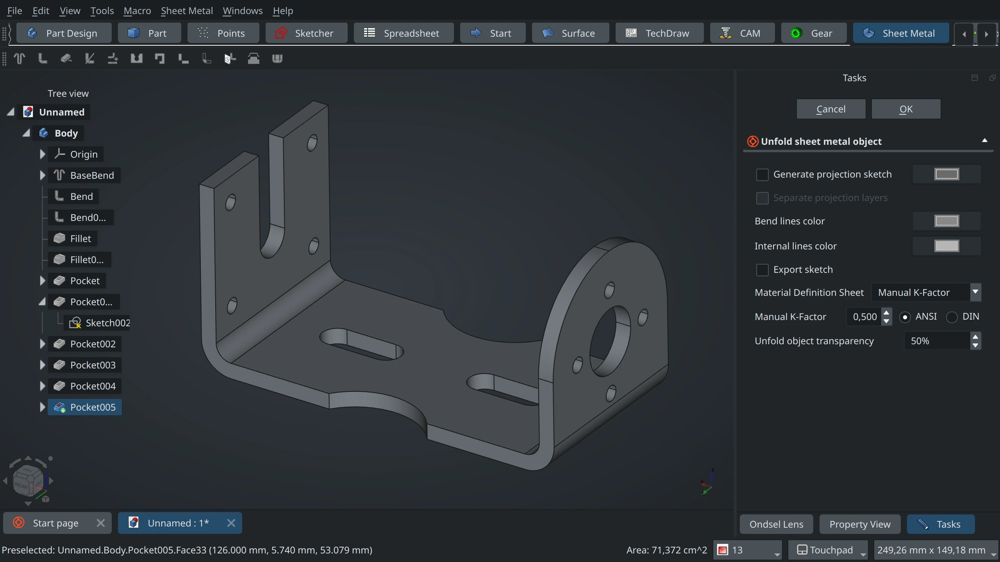

One of the conclusions in the [user survey series](https://ondsel.com/blog/freecad-user-survey-results-part-2/) is that the SheetMetal workbench is really important for users. 9,2% respondents rely on this addon to do their job, it’s also the third most popular choice for what to pay money for by professionals and the fourth most popular choice overall, after UI/UX, TNP, and Assembly WB.

<!-- truncate -->

The sheet metal functionality is commonly included in proprietary CAD products — Solidworks, NX, Onshape, and Fusion 360 to name just a few. Users expect that this workbench should look and work as an integral part of FreeCAD — if not actually be shipped by default.

Ondsel strives to make the out-of-box user experience as good as possible and also to meet the most common needs of commercial users. For us, having Sheetmetal installed by default is an obvious choice. We can’t force this workbench on the upstream project, but we can help improve it to the point where it’s consistent with the rest of the program and performs even better than today. We can encourage some long-term thinking about this great workbench and start contributing to it the way we contribute to the core project. So we started with a technical review of SheetMetal and then asked the FreeCAD design working group to do the UX review.

Let’s talk about what a long-term strategy might involve and what the technical and the UX reviews looked like and what their outcome is.

This post is made in collaboration with Joe Sardos (Obelisk), one of the participants in the 
design working group and author of the excellent OpenDark theme used in Ondsel ES.

## Technical review

Brad Collette, Ondsel’s CTO, did the first technical review of the SheetMetal WB during the summer of 2023. He ended up [refactoring](https://github.com/shaise/FreeCAD_SheetMetal/pull/280) some of the code to separate UI from logic and make the workbench scriptable.

A more thorough look revealed some of the things we still need to change to make SheetMetal feel like core functionality.

### UI/UX that is consistent with FreeCAD norms

Many of the functions that a user can initiate in the workbench result in objects in the tree. For example the user can select a face of a solid and ‘make a wall’. This immediately modifies the shape in the 3D window and adds a ‘Bend’ object to the tree. The user can select the Bend object and adjust many properties of it. To be more consistent with the overall program’s workflow, creating a wall should open a task panel that allows the user to set the properties directly. Double-clicking the Bend object should re-open the task panel and allow the user to change settings. 

### Parametric unfold object

An important feature in the workbench is the ability to select a shape and ‘unfold’ it to create a flattened representation that can be cut from sheet stock. However, the unfold object isn’t parametrically linked to the original shape. So if the original shape changes — perhaps because the user adjusted an important dimension — the unfolded version has to be deleted and manually recreated. That’s why the unfold object needs to become parametric by design.

### Better unfolder
 
The logic for converting a folded shape into an unfolded representation is complex and computationally expensive. It’s currently implemented in Python. Re-implementing this logic in C++ would provide substantial performance improvements. However, workbenches implemented as addons can’t have C++ logic, so this change would mean that at least some parts of the workbench, such as the unfolder, need to become part of the FreeCAD.

### Cleaner, refactored code

In general, the SheetMetal workbench is well written and the code is well organized. There are some areas where refactoring would be beneficial, especially to allow sheet metal functions to be used in scripts or headless operation.

### Unit tests

Like in much of FreeCAD, unit tests don’t exist in SheetMetal. Implementing these would make it easier for contributors to add new features without breaking core logic.

### Translation support via Crowdin

Some parts of the workbench source have already been written to support internationalization and translation. The workbench has gotten some well-deserved love from translators. A thorough review of the UI and source code with an eye towards translation is needed.

With the UI/UX  in mind, we approached the design working group in February this year to ask them for a full review of the workbench. Over to Joe Sardos.

## Design review

First we, the design working group, studied sheet metal production basics (some of the design group members had some professional experience in this area) and terminology. This resulted in a review of function naming, with some suggested changes in order to support clarity and better differentiation between functions.

The second part of the design review process was to understand what the current workflow was. In a nutshell, we used the workbench extensively ourselves and watched YouTube videos of other users interacting with the workbench. We looked for things that were particularly deficient/inefficient. The main takeaway was that everything was manipulated from the property panel. While concise, it was not particularly well-organized or efficient.

The next aspect was approaching if/how the workflow or modeling process could be improved or streamlined. One example here is our recommendation for a new container which is effectively a Part Design Body container with added properties related to sheet metal materials. Once those settings are defined at the very start of the modeling process, this absolves the user from needing to manipulate this at any time later.

The recommendation for a container does not mean the container will be required, the intent is not to restrict existing workbench combinations, but encourage a specific approach.

After establishing some important fundamentals about sheet metal design and a proposed workflow, we evaluated each function and what its intended purpose was. We also looked into reports that users of Sheet Metal have to jump over to Part Design for some common functions (the reports were also supported by some of the YouTube videos we watched and forum threads we reviewed). This led us to a full reorganization of the toolbars and recommended improvements to the toolbutton icons.

At this point, we had an interesting debate to determine some best practices for task panel layout, use of widget types, and visual/behavioral consistency. For example, we needed to figure out whether we should recommend static width of panels, how to manage single vs dual column layouts. Among other considerations — accounting for language translations with much longer words than what is found in English (we heard you, Polish speakers!).

After this, we developed mockups of panels and discussed them in the open on FreeCAD's Discord server. We debated pros and cons, and eventually patterns and norms began to develop. These will eventually translate into the [Design Guide](https://freecad.github.io/DevelopersHandbook/designguide/) section of the handbook to establish standard guidelines for how task panels should be constructed.

I expect that this is just the beginning though, and these guidelines will continue to evolve and improve as we review/develop more task panels in the future. Particularly paying attention to user feedback on the new tasks. Understandably in its current state, the new guidelines would most likely not account for the needs of all existing functions throughout the entirety of FreeCAD. 

## Strategy

Thanks to Joe for the insight on how the design working group operates! Back to Ondsel now.

The strategy here is two-fold. First off, we intend to improve SheetMetal and integrate it into Ondsel ES. This will have to happen in multiple stages.

**Stage 1: Revamp the UI/UX, move the translation to Crowdin.** This is where we are right now. The design working group has already started contributing to the SheetMetal WB. In particular, maxwxyz has already submitted [updated icons](https://github.com/shaise/FreeCAD_SheetMetal/pull/313) for the workbench to follow the new design guideline, and this change will be part of the next SheetMetal WB release. Both the toolbar reorganization, functions renaming, and switch to using the Task panel will happen here as well.

**Stage 2: Hook up the new materials system.** The existing implementation of materials in the workbench is not very efficient. On top of that, it would be great to be able to use different types of materials (think parametric cardboard designs).

**Stage 3: Rewrite the unfolder in C++ and get it included in FreeCAD core.** This is one of the major takeaways of the technical review. As of today, unfolding is rather slow and would benefit from being written in a more performant programming language such as C++.

**Stage 4: Rewrite the SheetMetal WB to use the core unfolder.** Once the unfolder has been rewritten and moved to FreeCAD, we can go on and rewrite the workbench to use it.

While we are going to make SheetMetal part of the core Ondsel ES experience, we think upstream FreeCAD should consider the same thing. We also want this project to serve as an example of how core upstream developers, commercial development, the design working group, and addon developers can work together to achieve a common goal. 

We know from the user survey that addons are an important part of meeting user needs. We know from personal experience that addon developers are building great functionality but don’t always have the skills or resources to fully develop it for production use. We believe that the larger community should regularly evaluate how addons are being used.  Work to identify functionality that has a broad appeal and then work to make the addon feel like part of the core experience both in functionality and in how it is maintained.  

## What’s next

The design working group isn’t huge, so there’s enough work for everybody to improve FreeCAD and addons. If you feel like you have great expertise in UI/UX to lend, please join the [Discord server](https://discord.gg/8UTs35WE) and chat to people in the #design-working-group room. If you want to contribute to improving the SheetMetal workbench’s source code, you can already pick some tasks in the [issue tracker](https://github.com/shaise/FreeCAD_SheetMetal/issues).

