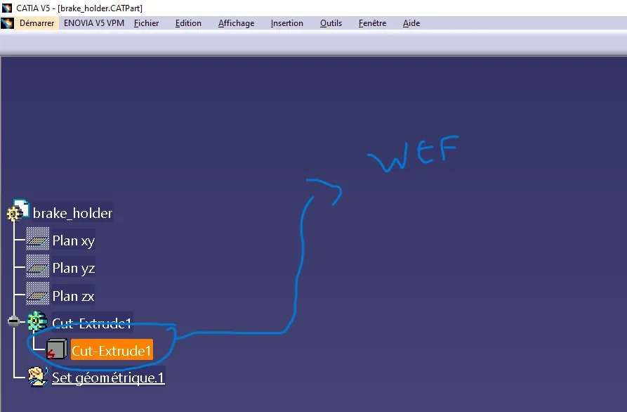
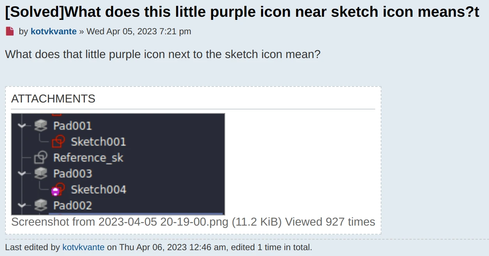
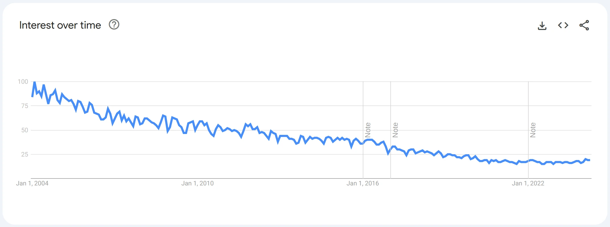
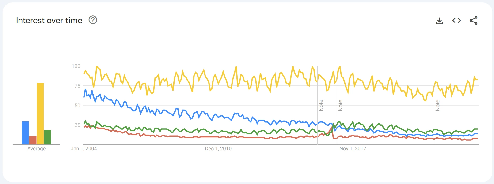
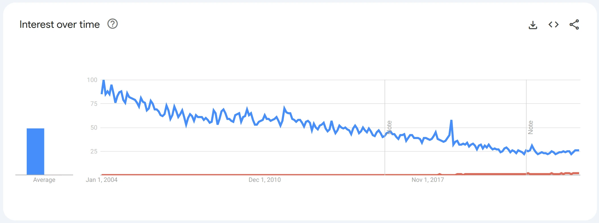
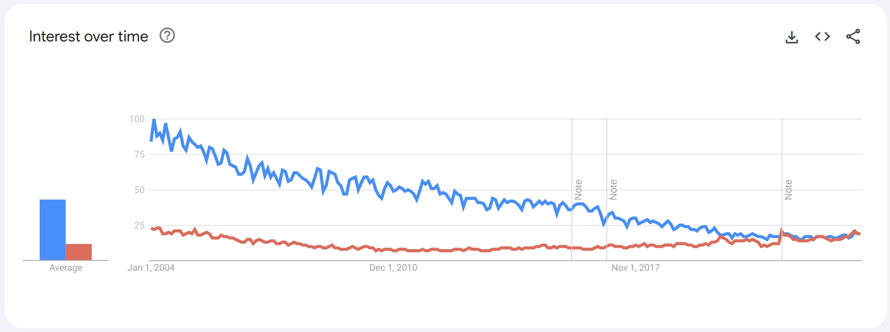

> “Once you get past the part design workbench in [software], it becomes apparent that [software] is like 10 different software packages integrated into one.” — [r53toucan on Reddit](https://www.reddit.com/r/engineering/comments/djj2q9/comment/f45ikk9/).

if you think this user is talking about FreeCAD, you're wrong. It’s CATIA — a generations-old 3D CAD program that served as an inspiration in the early days of FreeCAD. The two programs share more than just some core concepts: they’ve been struggling with many of the same issues and went in different directions to fix them.

A lot of companies that use CATIA are interested in migrating away and are looking at open-source alternatives. It's a good time to look at the reasons why and consider what they could be looking for in an open-source program such as Ondsel ES.

<!-- truncate -->

## A bit of history

First off, CATIA isn’t just old, it’s _ancient_. The project was started in 1977 by Dassault Systèmes for designing fighter jets. That was back when Jimmy Carter was president, and disco was all the rage. Even today, when you ask which Dassault’s software you should pick, CATIA or SolidWorks, you are likely to hear something along the lines of “if it has wheels or wings, go CATIA”. Many big names in the automotive and aerospace industries rely on this software, both in the US and the EU.

Dassault has been very conservative about updating the software, and users are equally conservative about upgrading. They released v5 in 1998, then v6 in 2009. Both are still widely used.  Since 2014 they’ve been trying hard to get everyone to switch to 3DEXPERIENCE CATIA.

> “...in aerospace most projects are decades old at this point, so you must learn the older version in order to support them.” - [XAeroR35](https://www.reddit.com/r/engineering/comments/51rnly/comment/d7ebs0k/)

## Advantages and struggles

For the original desktop software (v5 and v6), some of the benefits (e.g. over SolidWorks) are very decent performance when handling large assemblies, stability, and great surfacing tools. More than that, CATIA v5/v6 comes with a file-based product lifecycle management (PLM) system.

But software packages don’t get to be 47 years old and retain their users without making some serious trade-offs. In the case of CATIA, that seems to be largely about user experience. Both v5 and v6 are difficult to master. They have a dated UI that clearly shows its design origins in the 1990’s. Some of these issues will look painfully familiar to users of FreeCAD:

Source: [what is this icon?! How can I access the sketches on this element?](https://www.reddit.com/r/CATIA/comments/1bd27vs/what_is_this_icon_how_can_i_access_the_sketches/)

Source: [What does this little purple icon near sketch icon mean?](https://forum.freecad.org/viewtopic.php?t=77373)

As software goes, CATIA v5/v6 is unforgiving. You have to use the functions exactly as they're made, and you don’t have the luxury of shortcuts and keyboard accelerators for tools. UI customization is limited or non-existent.

It’s not that the original CATIA is poorly designed — it isn’t. It simply hasn’t kept up with the times.

## Collaboration

Dassault clearly understands the importance of collaboration and has for a long time.  They included a native PLM solution long ago. A while back, Dassault started to work on their UI/UX problems and they started by updating their collaboration tools. 3DEXPERIENCE is a newer cloud-based suite that includes a PLM platform and a modernized version of CATIA.  Unfortunately, both the new CATIA and the underlying platform arrived with their own quirks that have alienated many customers.

Users commonly cite frustrations with frequent crashes especially when performing complex operations, and documentation never catching up with development etc. The database approach to organizing projects (you need to tag files) and managing revisions sometimes leads to loss of important data. The experience is sufficiently infuriating that some users want to go back to older PDM/PLM solutions by Dassault or switch to newer ones by other vendors.

## The cost

And let’s take a minute to talk about the cost. The pricing varies a lot year to year, but also depends on what modules you need and other factors that Dassault doesn’t disclose openly. You need to request a quote from a distributor. But there’s no arguing that CATIA is expensive — really expensive. It’s at least in the early 5 figures for the one-time payment and at least $2,000 for further annual license maintenance — per seat.

Pretty much the same goes for 3DEXPERIENCE CATIA. At this price point the product still causes a lot of frustration with frequent bugs and lukewarm customer support (a thread like [this one](https://www.reddit.com/r/SolidWorks/comments/1al1jtr/3dexperience_really_that_bad/) will give you a pretty good idea).

## Putting things in perspective

While some customers need the stability of this old software and its proven performance, many are looking at the rapidly improving landscape of alternatives — including open-source ones — and are interested in migrating. This is evident even by looking at this Google Trends chart:

Let’s put things in perspective and compare that to some other commercial offerings:

Blue: CATIA. Red: NX. Yellow: SolidWorks. Green: Inventor. 

Did the new 3DEXPERIENCE platform help things along? If you trust Google Trends data, it appears that the new platform hasn’t succeeded in picking up the waning interest in CATIA.

Blue: CATIA. Red: 3DEXPERIENCE

## How Ondsel/FreeCAD is handling the same issues

Comparing CATIA and Ondsel/FreeCAD is comparing apples and oranges. They have different users, history, architecture and geometry kernels. But FreeCAD was [heavily inspired by CATIA](https://wiki.freecad.org/History) and shares many core concepts. FreeCAD’s UI borrows ideas from CATIA and, subsequently, suffers many of the same shortcomings. It’s enlightening to see how the open-source community addresses the same problems.

For the UI/UX challenges, the larger FreeCAD community is doing something that Dassault isn’t doing. Rather than scrapping everything and starting all over again (with mixed results), it is working to resolve the problems incrementally: mitigating the toponaming issue, improving UX/UI, building a better materials system, adding an integrated assembly workbench, and more. 

At Ondsel, we’re working to address the collaboration piece. Our PDM system (Lens) integrates directly into the desktop software. We’re also shipping our own flavor of the desktop software with Lens integration and an even more polished user experience.

## Do users care?

The recent user survey came with several eye-openers, one of them being a [larger percentage](https://ondsel.com/blog/freecad-user-survey-results-part-1/) of professional FreeCAD users than we expected — nearly 45% of the sampling (650 respondents). This doesn’t mean that FreeCAD could be a drop-in replacement for any other commercial CAD program (it simply doesn’t work that way). But, again, once you put things in perspective, things have been changing…

Blue: CATIA. Red: FreeCAD.

It’s easy to argue that the price point of either FreeCAD or Ondsel ES + Lens makes them a more favorable choice as compared to Dassault’s offerings. But that is not the only decision factor, and for a good reason.

## Is it right for you?

Ondsel probably isn’t the right choice for the most demanding engineering tasks yet but it is moving in that direction.  In the meantime, Ondsel users are enjoying a powerful, efficient, and attractive design tool at a fraction of the cost of commercial tools like CATIA.  And it comes with an enthusiastic community and new updates that happen more frequently than the US census.

You can follow our progress in the [blog](https://ondsel.com/blog) and on [social media](https://ondsel.com/contact/) or [try the software](https://lens.ondsel.com/download-and-explore) for yourself today.
