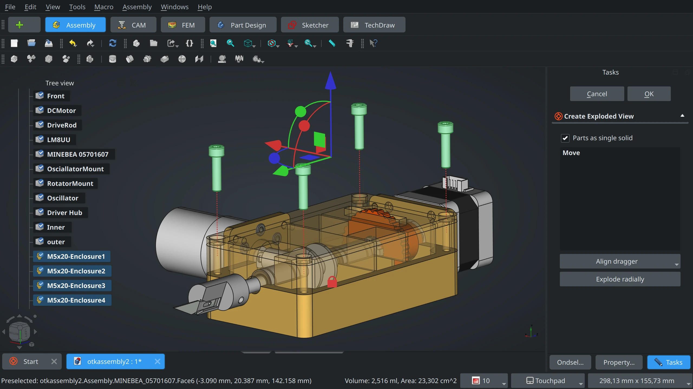
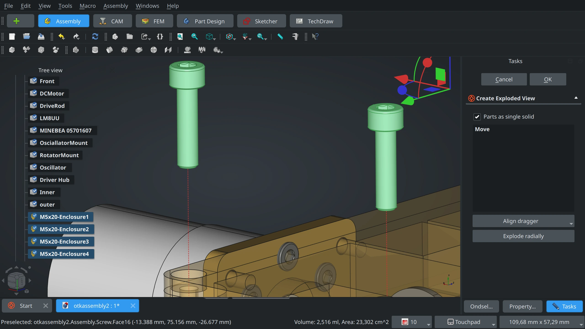
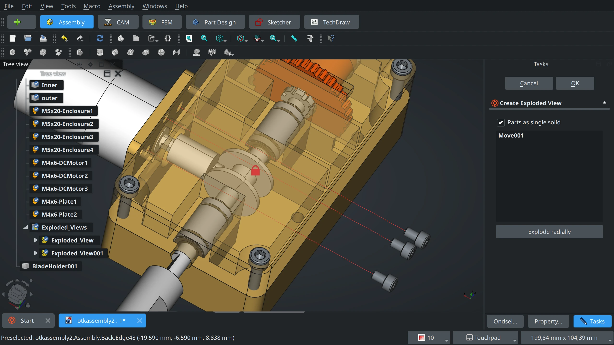
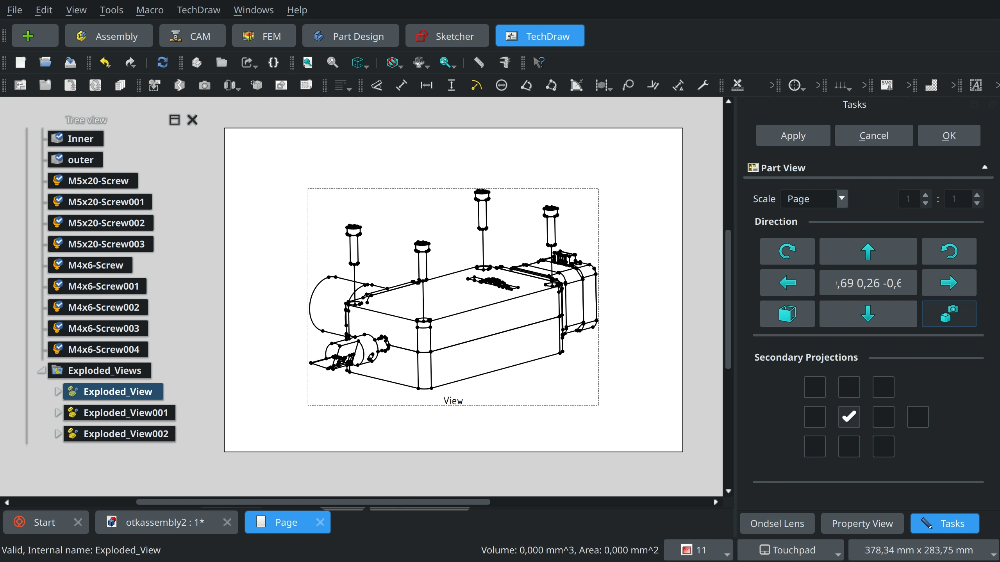

Now that the basic assembly workflow is mostly complete and operational in Ondsel ES, we are beginning to add new tools. One of the features coming in the next release are exploded views.

<!-- truncate -->

Proprietary software vendors typically ship exploded views as part of either the assembly feature set (e.g. SolidWorks) or the animation environment (e.g. Fusion 360). Either way, you typically get controllable transitions from one explosion step to another.

For Ondsel ES 2024.2, we are aiming for a minimum viable product: a tool that creates exploded views and a possibility to place an exploded view on a TechDraw page.

## Creating exploded views manually

Open an assembly project, double-click the assembly object in the tree, and select the ‘Create Exploded View’ tool in the toolbar or press **V**.

Select a part or several parts in the assembly and use the transform gizmo to move them away from the rest of the assembly. You can move it along one axis or all three, if you like:

You also have control over the position of the transform gizmo: once a part is selected, the Task panel displays an ‘Align dragger’ drop-down menu with three options: aligning to the center of a part, to its origin, or to arbitrary geometry that you can select:

<video width="100%" height="100%" controls>
  <source src="/video/integrated-assembly-explosion-align-dragger.mp4" type="video/mp4" />
  Your browser does not support the video tag.
</video>

Once you move a part, the tool will render a trace for each movement as a dashed line:

You can also create multiple exploded views, e.g. first you take screw out of an enclosure, then you move the cover:

## Exploding radially

Depending on the model and use case, you might want to simply move all parts away from each other as if an explosion happened in the middle of an assembly, and the shock wave moved parts in different directions.

To do that, you can use an experimental tool for radial explosion. Simply initiate a new exploded view and click the ‘Explode radially’ button on the task panel. This will select all parts in the assembly and display a transform gizmo in the 3D view. Dragging it by any of the three axes will “explode” the model radially.

<video width="100%" height="100%" controls>
  <source src="/video/integrated-assembly-radial-explosion.mp4" type="video/mp4" />
  Your browser does not support the video tag.
</video>

Please note that for now, we are using a simple implementation where the radial explosion is calculated from the assembly’s 3D bounding box. This is not set in stone.

## Generating technical documentation

Placing an exploded view on a TechDraw page works just as expected: you simply switch to the TechDraw workbench, add a page, select the exploded view object in the tree, and click ‘Insert View’:

## What’s next?

Of course, we have lots of ideas on how to improve the Exploded View tool further. We could be creating radial explosions from the center of mass or from the fixed part. We could be adding a simple animation system based on keyframes. So this is one of the cases where we rely on user feedback.

We are shipping the minimal implementation in the next stable release of Ondsel ES for wider testing. We’ll adjust development plans for exploded views based on the feedback we receive from you.
