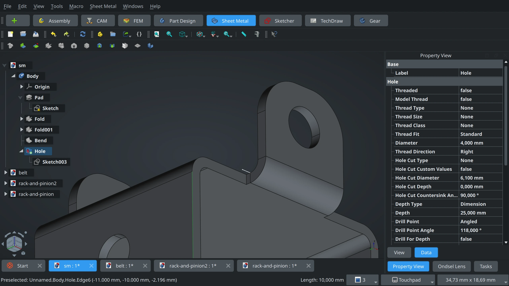
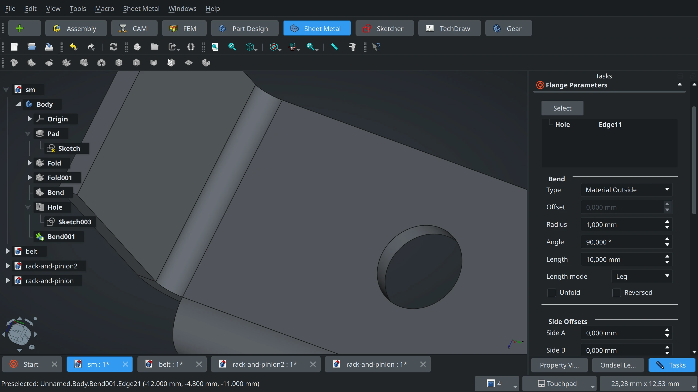
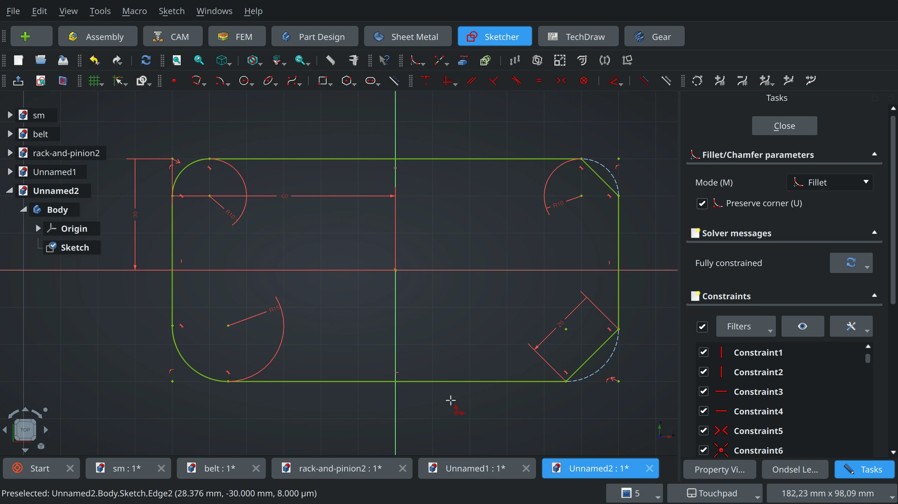
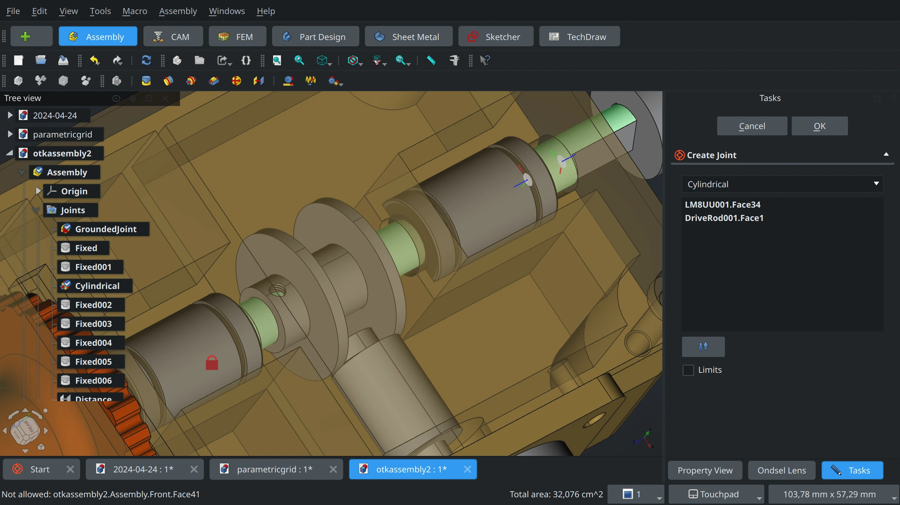
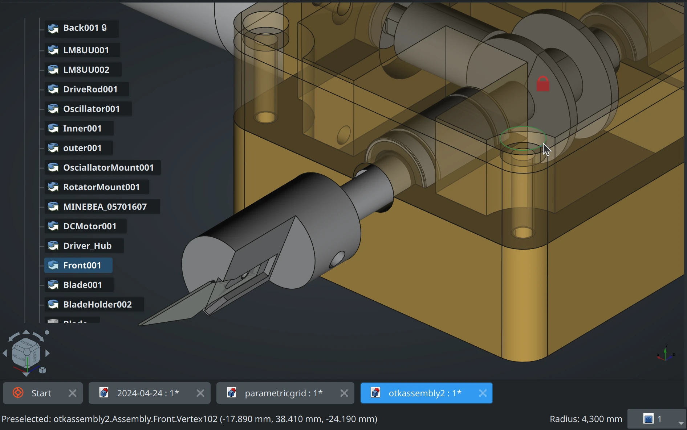
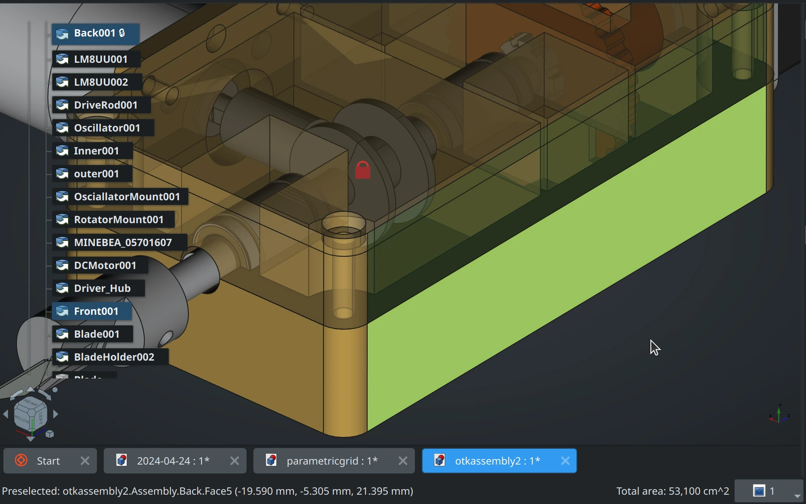
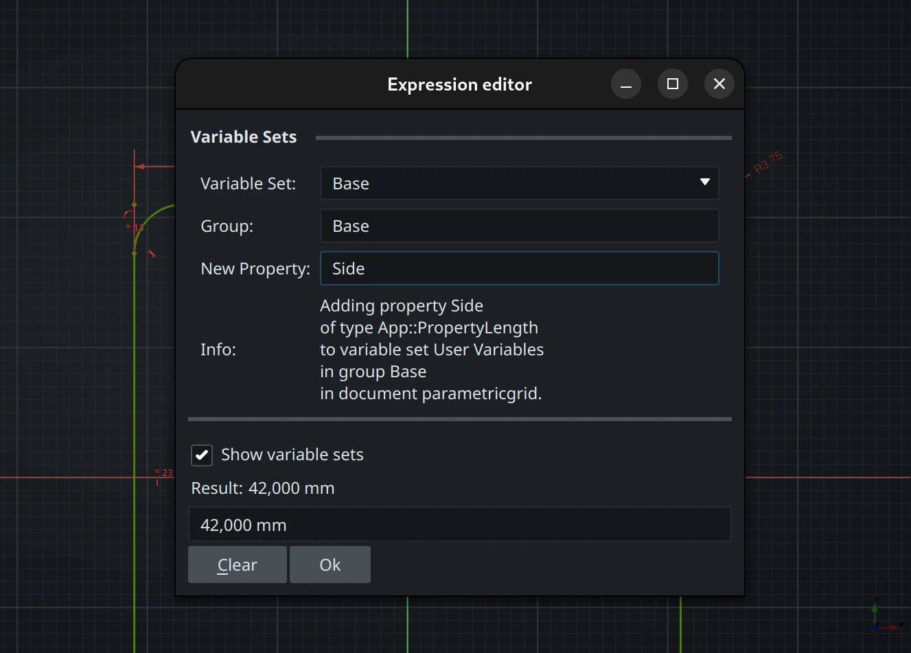
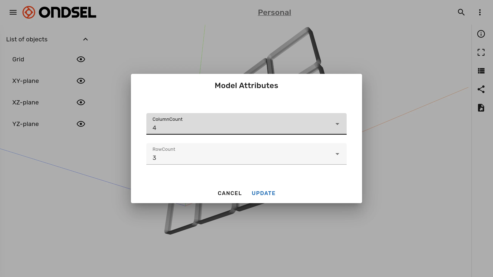
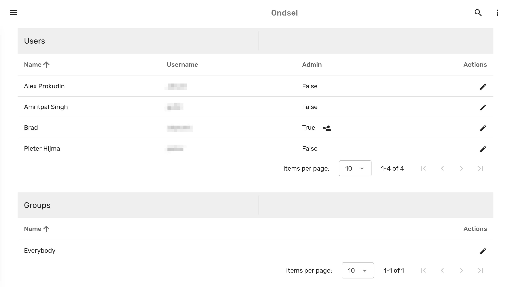
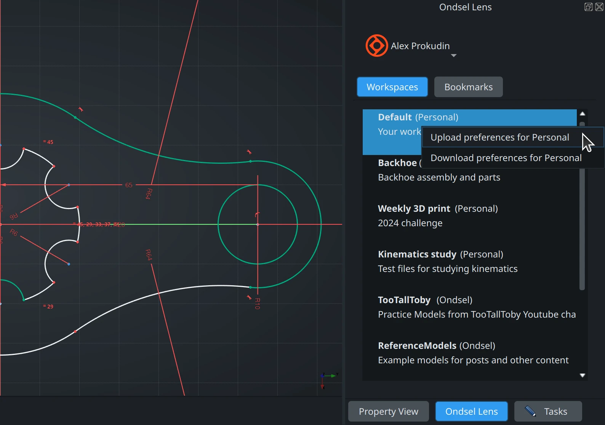

We’ve just released Ondsel ES 2024.2, the second public version of our flagship desktop CAD application with built-in collaboration tools.

<!-- truncate -->

Highlights:

* New assembly features and stabilization
* Inclusion of the improved SheetMetal workbench
* Further Sketcher improvements
* TechDraw cleanup and new features
* Quick Measure
* New workbench selector
* Initial implementation of custom properties
* Ondsel Lens improvements

<Youtube v="LNd_elOE9Cg" />

This release is based on the latest development code of the upstream project and contains many more features and improvements from the FreeCAD community, both developers and members of the design group. In the release notes here, we only cover changes that the Ondsel team implemented. Some of them have already been merged to upstream and some are pending review.

## Assembly: Explosion tool, new joint types, limits, and stabilization

For this release, we focused on bringing a more complete and polished experience to users of the integrated assembly workbench.

The first major change is an initial implementation of an **explosion tool**: open and activate an assembly, switch to _Create Explode View_ tool, select a part or several parts, then use the transform gizmo to move them in 3D space. 

Once you’ve done dragging parts out, you can place the exploded view into a TechDraw page. You can create multiple exploded views of an assembly, e.g. to demonstrate stages of assembling some complex piece of machinery. For simple assemblies, you can use a radial explosion mode. 

We covered this new feature in more detail in a [recent blog post](https://ondsel.com/blog/exploded-views-in-assembly-workbench/).

<video width="100%" height="100%" controls>
  <source src="/video/oes-2024-2/oes-2024-2-assembly-exploded-view.mp4" type="video/mp4" />
  Your browser does not support the video tag.
</video>

Another new feature was directly requested by users on Discord: **limits** to available degrees of freedom in _Revolute_, _Cylindrical_, and _Slider_ joints. This allows defining a range of motion for objects under constraints.

<video width="100%" height="100%" controls>
  <source src="/video/oes-2024-2/oes-2024-2-assembly-limits.mp4" type="video/mp4" />
  Your browser does not support the video tag.
</video>

The next batch of new features is a series of new joint types that are useful in mechanical design and were requested by users: Rack and Pinion, Screw, Gears, and Belt.

**Rack and Pinion** simulates the conversion from linear motion to circular or vice versa. To create it, you need a part with a sliding joint and a part with a revolute joint.

The **Screw** joint simulates the motion that is both sliding and revolution:

<video width="100%" height="100%" controls>
  <source src="/video/oes-2024-2/oes-2024-2-assembly-screw-joint.mp4" type="video/mp4" />
  Your browser does not support the video tag.
</video>

The **Gears** joint helps simulating a gears system:

<video width="100%" height="100%" controls>
  <source src="/video/oes-2024-2/oes-2024-2-assembly-gears-joint.mp4" type="video/mp4" />
  Your browser does not support the video tag.
</video>

The **Belt** joint allows simulating transmission of power multiple shafts using pulleys or gears and an elastic belt or a gear chain.

The new joint types are less tested and should be considered experimental.

Finally, we fixed a number of bugs in the assembly workbench and improved overall user experience: added dragging to the _Distance_ joint to simulate motion, clarified terminology.

New and improved icons were contributed by members of the upstream design working group.

## Sheet Metal workbench now shipped with Ondsel ES

Following the user survey, we [started](https://ondsel.com/blog/sheetmetal-strategy/) shipping the [SheetMetal workbench](https://github.com/shaise/FreeCAD_SheetMetal) by Shaise as part of core Ondsel ES experience. 

We also resumed implementing both core and UX/UI changes in the workbench: refactored the code for better core and user interface separation, added a parametric unfold object, as well as a task panel for the _Bend_ command. More interfaces for various task panels have been created based on the proposal by the design working group at FreeCAD, actual code is to be written.

We’ll continue revamping the Sheet Metal workbench after this release. All changes are being submitted for review to the upstream project.

## Further Sketcher improvements

We’ve added several major improvements to the Sketcher workbench. One significant workflow improvement is the new **automatic midpoint constraint**. It was made specifically in response to [his video](https://www.youtube.com/watch?v=MVp8fF2LmM8) by Teaching Tech where the lack of this feature significantly increased the amount of time to accomplish a task.

We timed ourselves completing the task — and even though we knew exactly what to do (use a symmetry constraint), we confirmed that a basic operation was indeed taking more time and wasn’t obvious. So we implemented a new midpoint constraint. There are multiple uses for it, but for the sake of a closure let’s illustrate it using the exact scenario in the Teaching Tech video — the entire model:

<video width="100%" height="100%" controls>
  <source src="/video/oes-2024-2/oes-2024-2-sketcher-midpoint-constraint.mp4" type="video/mp4" />
  Your browser does not support the video tag.
</video>

The next major change is the **Symmetry tool** rework. Now you can just select your Sketcher object, select the _Symmetry_ tool, and then hover geometry that you want to mirror the selected object over. This will render a preview that you can confirm with a single-click. Not only that, any line or a point can be a reference object for symmetry now.

<video width="100%" height="100%" controls>
  <source src="/video/oes-2024-2/oes-2024-2-sketcher-symmetry.mp4" type="video/mp4" />
  Your browser does not support the video tag.
</video>

We also reworked the **Fillet** tool and added a basic **Chamfer** tool. Rather than having two Fillet tools, you now have one where _Preserve Corner_ is an option in the _Tasks_ panel.

The new _Chamfer_ tool works similarly: click a point in a polyline or a rectangular geometry object to create a chamfer, optionally preserving the corner. The tool will automatically create a chamfer with two equal angles. To control the chamfer’s size you can add a dimension to either the arc or to the edge.

Furthermore, we extended the **Trim** tool to support continuous trimming. Select the tool, hold the left mouse button, and start dragging. All the lines you cross in that mode will be deleted.

<video width="100%" height="100%" controls>
  <source src="/video/oes-2024-2/oes-2024-2-sketcher-trimming.mp4" type="video/mp4" />
  Your browser does not support the video tag.
</video>

Finally, we improved default toolbars, as well as visualization of various geometric features:

* Construction lines are now displayed with dashed pattern and in blue, thanks to newly added geometry rendering customizations.
* The rendering of arc angles and line angles, as well as the rendering of distances between arcs has been improved.
* The points’ colors are now more meaningful and reflect their actual nature: normal vs construction vs internal etc. Also points now become red when all the stacked points are coincident, enabling users to spot easily opened wires.
* Angles now have arrowheads.

## TechDraw cleanup and new features

Implementing support for exploded views in TechDraw gave us an incentive to start hacking on that workbench. The first major change is a **Smart Dimension tool** that works similarly to the one in Sketcher. With the usual workflow, you select a geometric feature in a view and then use a dedicated tool, then select another feature and use a dedicated tool again, and so on.

The Smart Dimension tool workflow is superior in many cases: you simply select the tool and click on geometry features. The tool will change the type of dimension depending on the type of the feature you click on. And when multiple dimensions are possible, you can switch between those using the **M** shortcut — same as in Sketcher.

And just like with Sketcher, you can choose whether you want both the smart dimension tool and dedicated dimension tools to be displayed grouped or next to each other in the toolbar.

<video width="100%" height="100%" controls>
  <source src="/video/oes-2024-2/oes-2024-2-techdraw-smart-dimensioning.mp4" type="video/mp4" />
  Your browser does not support the video tag.
</video>

Snapping has been introduced for the dimensions, letting you position them in an easier fashion. It has also been added for views, in particular for section views — to align them with their base views.

Instead of dedicated buttons for inserting different types of objects from the tree (View, Project Group, Spreadsheet, Arch WB Object, SVG, Image) you now have just one button. If a project tree object is selected, the command will insert that object. If there is no selection, it will prompt you for an SVG file or an image.

We did further cleanup: removed _Cosmetic eraser_ (selecting and pressing **Del** already does the job) and _Project Shape_ from the toolbar, fixed the dragging and dropping of views, and added auto-switching to TechDraw when double-clicking a page in the project tree.

## New workbench selector

We implemented **TabBar** — a new way to switch between workbenches that makes things more discoverable to new users and more convenient to a subset of existing users. The idea is loosely based on the [SelectorToolbar](https://github.com/triplus/SelectorToolbar) addon by triplus. We also disabled less popular workbenches by default, so users will get a more polished experience.

The tab bar is configurable. First off, you can add workbenches that we disabled by default by simply clicking the **+** button and choosing a workbench of interest. The pre-existing “Workbench selector position” applies to TabBar as well. You can also choose the style: icons, icons + text, or just text.

Lastly, you can easily go back to using the combobox list for switching between workbenches. The option is on the _Workbenches / Available Workbenches_ page of the _Preferences_ dialog. Alternatively, you can get there by clicking the **+** button and selecting _Preferences_ at the bottom of the list of workbenches.

## Custom first-run wizard vs upstream solution

In version 2024.1, we introduced a custom first-run wizard made in anticipation of a better upstream solution. This solution is now available and built into the new Start page thanks to the work by Chris Hennes. So we removed the custom wizard.

While at that, we shipped the updated OpenDark theme by Joe Sardos, as well as his new OpenLight theme, both being parts of the [OpenTheme](https://github.com/obelisk79/OpenTheme/) project.

## Quick measure

While we are shipping the new upstream measurement tool, in many cases it’s really convenient to have basic measurements readily at hand at any time. So we added a new feature called **Quick Measure**. It sits on the right side of the sidebar and displays context-sensitive measurements: length for edges, radius for circles etc. You can double-click to select the entire measurement and press **Ctrl+C** to copy it to the clipboard.

While it works in Sketcher, it’s most useful in Part Design, because in addition to basic things like length and radius  you can see angles between adjacent edges, nominal length (distance between two selected faces or two parallel lines), area for a face or entire body, or total area for multiple faces in different bodies.

## Core support for custom properties

This new version of Ondsel ES introduces variable sets, or VarSets — a brand new system for creating custom properties (or [data elements](https://ondsel.com/blog/build-system-for-custom-data-elements/), if you will). The intention is to provide functionality for custom properties in core to support this functionality out-of-the-box, without relying on 3rd-party solutions such as the Dynamic Data workbench and CAM (Path) PropertyBag. It also improves the experience for users who are not happy with the Spreadsheet workbench for creating parametric models.

VarSets store variables that can be used to parameterize your designs, for example in the expression editor. So whether you are sketching and dimensioning or filletting or making arrays, you can create some custom variables (in multiple custom groups, if you like), set values, do math with them in your design, and then adjust variables’ values in the _Property View_ panel as you see fit. And since the panel sits right next to the viewport, you can see your design update live. 

<video width="100%" height="100%" controls>
  <source src="/video/oes-2024-2/oes-2024-2-varsets-desktop.mp4" type="video/mp4" />
  Your browser does not support the video tag.
</video>

When you design a parametric model with VarSets and store it as a public model on Lens and share a link, other users will be able to customize your design with variables that you defined, download an STL file, and 3D-print it.

## Ondsel Lens changes

We’ve accumulated a lot of improvements and fixes in Lens since January.

The service now renders colors of parts and applies finer tessellation to original geometry for smoother look and feel. It also lists available parts, so you can toggle their visibility while exploring designs.

<video width="100%" height="100%" controls>
  <source src="/video/oes-2024-2/oes-2024-2-color-bodies-list.mp4" type="video/mp4" />
  Your browser does not support the video tag.
</video>

Managing organizations is now possible: you can add users to organizations and workspaces, organize them in groups with read/write access, edit descriptions of both org and workspaces, check out versions of design, and more.

It’s now possible to promote content on your public organization’s page: pick models you like, or even entire workspaces, organizations, and users, and feature them by clicking the bullhorn icon.

<video width="100%" height="100%" controls>
  <source src="/video/oes-2024-2/oes-2024-2-promotions.mp4" type="video/mp4" />
  Your browser does not support the video tag.
</video>

You can also bookmark public (models with share links) and private models for your organization, so only you and your teammates will see those bookmarks. The Lens add-on for Ondsel ES and FreeCAD has been updated to list available bookmarks for all organizations you belong to. You can also open respective CAD designs directly in Ondsel ES.

<video width="100%" height="100%" controls>
  <source src="/video/oes-2024-2/oes-2024-2-bookmarks.mp4" type="video/mp4" />
  Your browser does not support the video tag.
</video>

It’s also possible to store your Ondsel ES preferences on Lens now. This is done on a per-organization basis. There are two common use cases here.

The first one is where you are planning to move your work along with preferences to a different computer, so you right-click on any workspace that belongs to your personal organization and choose _Upload preferences for Personal_. Then on a new computer you install Ondsel ES, log into Lens, right-click again, and choose _Download preferences for Personal_, then restart Ondsel ES for changes to take effect.

The second use case is rolling out the same preferences for an entire team. In that case you do the same, but when uploading preferences, you right-click on any workspaces belonging to an organization that your team is part of. Then when they download preferences from that organization, they all get the same settings.

In the future, it will be possible to roll out preferred 3rd-party addons for the entire team the same way.

## What’s Next

You should expect further improvements in Assembly, Sketcher, TechDraw, Sheet Metal, as well as in the Lens service.  The Lens service will become an increasingly useful and important part of the Ondsel experience with more features for professional users. You can [follow us on social media](https://ondsel.com/contact/) where we regularly cover recent developments. You can also [join our Discord server](https://discord.gg/7jmzezyyfP) to provide feedback on new features.
