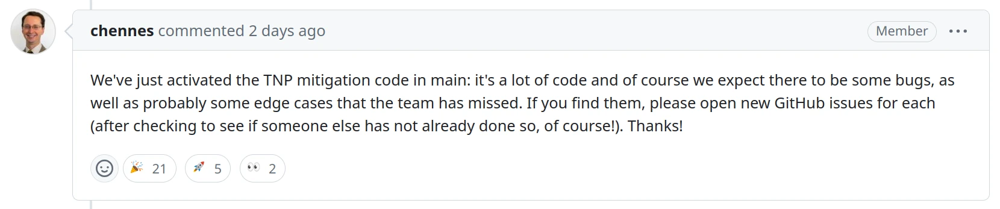

One of the questions we've been getting from users regarding the release of Ondsel ES 2024.2 is whether we are shipping it with all the recent toponaming fixes enabled. The answer is 'no'. While most of the work in the TNP project is done, the code is largely untested by the larger community, so we don't feel comfortable shipping it in an actual release of Ondsel ES. However, let's take this opportunity to talk about TNP and the amazing work that the community did there.

<!-- truncate -->

## What has been done

Just to reiterate, the toponaming problem is an inherent side effect of parametric modeling. Models are built up progressively with later features depending on the geometry from earlier steps. If the user goes back to an earlier step and changes it, later steps can break because the base feature they depend on changes. To avoid that, the CAD software needs to keep track of all geometry features you create and provide a way to recover when a certain geometry feature is taken from under another one. 

RealThunder developed a solution for the toponaming problem in his own fork of FreeCAD, known as the LinkStage branch. While the code worked (and continues to work), there were two major problems with it: 1) the fork went out of sync with upstream FreeCAD, so LinkStage users couldn’t benefit from newer FreeCAD features, and vice versa, 2) the code wasn’t written in a way that was maintainable by anybody other than RealThunder. So a task force formed to migrate RealThunder's patches back to the upstream project. If you’re curious to learn more, we [wrote about the problem and the solution](https://ondsel.com/blog/freecad-topological-naming/) last year.

After more than a year of work, the last phase of the toponaming project is now complete. While the team is still finding missing bits of code for Sketcher and PartDesign and adding them, anyone can rebuild the program with the toponaming fix and see that things are beginning to work as expected.

Because the application is doing more work to keep track of the geometry, we expected some performance impact. The team has been watching this closely and investigating potential performance regressions. So far, things actually look really good. Performance impact appears to be negligible. Much of that is thanks to RealThunder's extensive optimization.

The upstream team will not ship FreeCAD 1.0 without TNP fixes enabled. On Monday, they [enabled](https://github.com/FreeCAD/FreeCAD/issues/8432#issuecomment-2121349967) the mitigation patchset in weekly builds by default to start getting the new code to a wider user base (as compared to the team that worked on the toponaming code).

## What we have learned

FreeCAD hasn’t had to tackle very many large-scale initiatives like this in the past. Only two come to mind: the Python3 port and the Qt5 port. So this was also an opportunity to learn and improve. Big projects like this aren’t sexy. They don’t add cool new features or UI/UX polish that thrills users. They are often bigger than a single contributor can achieve working alone and carry a lot of risk. All that means that big projects tend to languish. One answer is professional, paid development.

The model where paid contributors _and_ volunteers work on the same project actually works. In some ways it provides the best of both worlds. We get an army of volunteers who can bring domain expertise, testing, and many small contributions while also encouraging a professional style of development, consistency, and scale.

We also witnessed just how much FreeCAD needs paid contributors. This might seem obvious to you, but there's a lot of FOSS lore around the idea that business interests and paid development corrupt free software projects. It doesn't have to be the case! 

Paid development opens up a lot of possibilities for the project. While a team of volunteers might be able to deliver good results while working in their spare time, there is no guarantee that solutions will be forthcoming or that contributions will be maintainable when they arrive. We think a hybrid solution is the best way forward and we congratulate the entire team on their success: both RealThunder, Chris Hennes, and Pesc0, who contributed uncountable hours as volunteers, and bgbsww, CalligaroV, and John Dupuy (Ondsel), who did paid development. 

But we also should be thanking the legions of users who donated to the FPA and made the FPA grants for CalligaroV and bgbsww possible. Without financial resources, this kind of development is really hard and often impossible. 

Finally, starting to use [GitHub projects](https://github.com/orgs/FreeCAD/projects/2/views/1) was a rather smart move to improve how larger projects are managed. This brought clarity and better organization. The FPA is continuing to [expand the use of grants](https://fpa.freecad.org/programs/fpadf-announcement). Supported projects now include work on Sketcher, a brand new components library, better infrastructure for the project, and more.

## What's next

For Ondsel ES users, we will enable the TNP code in the next stable release, 2024.3, as well as in weekly builds leading up to that.

Meanwhile, let's remember that model stability is a complex topic, and TNP mitigation helps only for a specific kind of model breakage. Models can still break for reasons that have nothing to do with topological naming. That's not even FreeCAD-specific. SolidWorks does that, Siemens NX does that, and so do other CAD programs: all CAD software can be used to design brittle models and there’s no substitute for good design principles.

If you are interested in learning more about those principles, you can start with [this list](https://wiki.freecad.org/Feature_editing#Advice_for_creating_stable_models) of suggestions. Following them might sound like doing things backwards, but it will actually make you a better designer.

Finally, we encourage you to [donate to the FPA](https://www.freecad.org/sponsor.php) so that more complex projects could be tackled, there is no shortage of those in FreeCAD.
