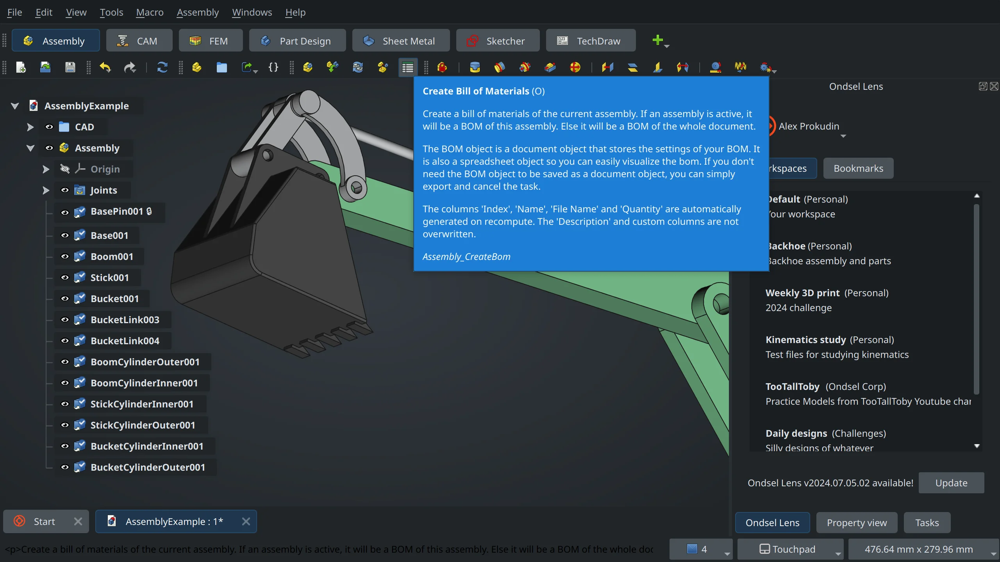
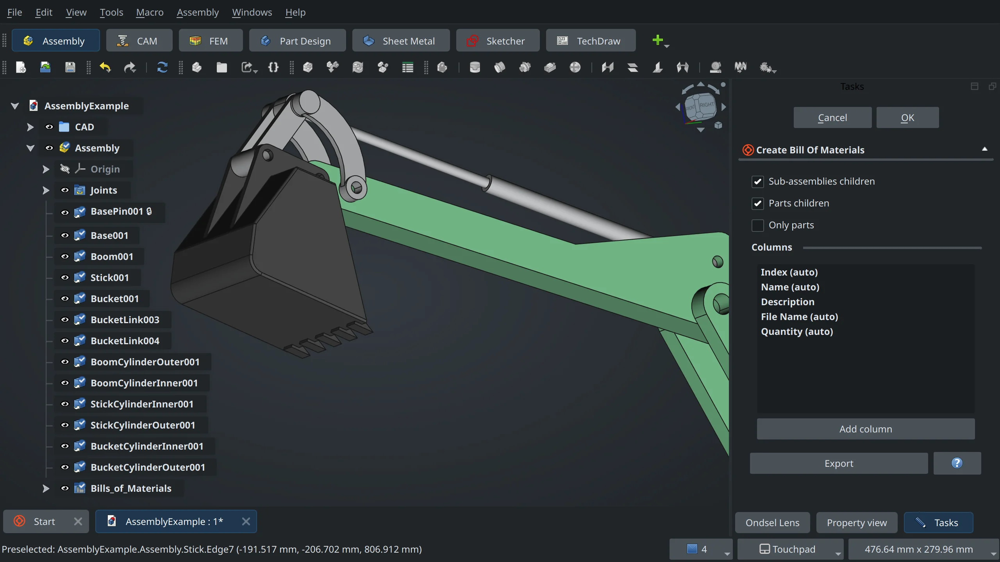
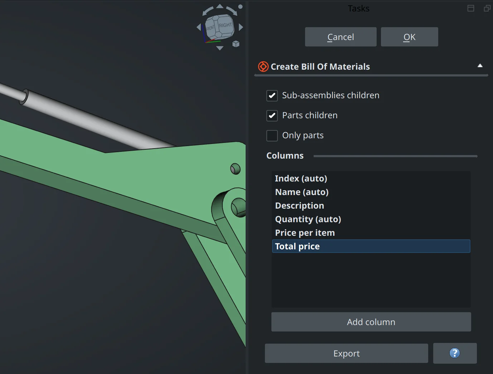

Back when we did the [user survey](https://ondsel.com/blog/freecad-user-survey-results-part-1/), the generation of bills of materials (BOM) was the next important thing after the ability to create assemblies. People don’t even need collision detection as much as they need their BOMs. Based on this data, Pierre-Louis Boyer (Ondsel) recently added a Bill of Materials tool to the Assembly workbench for the upcoming Ondsel ES v2024.3 and FreeCAD v1.0. It is already available in weekly builds of Ondsel ES and the upstream project. 

<!-- truncate -->

<Youtube v="K0Ggtt2eTjQ" />

The implementation differs from that of other existing BOM solutions for FreeCAD. Let’s talk about why we did it that way and what the future might bring.

## BOM? Which one?

First of all, there isn’t just one kind of BOM. “Bill of materials” is a rather generic name for any list of parts. In fact, BOMs differ in type and structure depending on their use. Sure, you can generate a spreadsheet that lists all the parts in a project, lists part numbers, and says how many of each there are, and what the cost is. Well, that would likely be a flat engineering bill of materials: 

 

_Source: [Design of A Fluidized Bed Reactor For Biomass Pyrolysis, by Alaba Bamido (ResearchGate)](https://www.researchgate.net/publication/330335978_Design_of_A_Fluidized_Bed_Reactor_For_Biomass_Pyrolysis)_

If you want to represent the structure of the product and list out components per each part, that’s a multi-level, or indented BOM. Or maybe you are fine with just a list of sub-assemblies. That’s a single-level BOM.

If we want to show how to assemble the product, then we need a manufacturing BOM with a list of parts next to a drawing, with numbered parts. So we are talking about a BOM on a TechDraw page and automatically numbered parts in views.

_Source: [Wikipedia](https://en.wikipedia.org/wiki/Bill_of_materials)_

Or we could be talking about service BOMs where a technician has no use for a BOM of an entire product and only needs to know about parts where the repair will be happening. So you need to generate a subset of the original bill of materials.

There are [even more types of BOMs](https://www.optiproerp.com/blog/10-types-boms-explained/) out there. Is it possible to handle this variety of use cases with existing implementations? Not really, and here is why.

## The problems with existing implementations

With just one exception (more on that below), existing BOM generators for FreeCAD are workbench-specific:

* The built-in BOM generator in Fasteners WB collects information on all nuts and bolts inserted into your project but disregards the rest of the objects. It also uses extended names of bolts rather than names of objects visible in the project tree — a nice touch.
* The [Reinforcement](https://github.com/amrit3701/FreeCAD-Reinforcement) workbench has a tool for creating rebar-specific bills of materials, with dimensions data, as well as total length, diameter, and weight of reinforcement.
* The BOM generator in [Woodworking](https://github.com/dprojects/Woodworking) WB is more like a cut list really and is similar to the one in Reinforcement: it also inserts specific data such as dimensions for pieces of wood and sorts them by thickness.
* Both [A2plus](https://github.com/kbwbe/A2plus) and [Assembly4](https://github.com/Zolko-123/FreeCAD_Assembly4) have BOM generators that are specific to those workbenches as well.

The recent [Bill of Materials](https://github.com/APEbbers/BillOfMaterials-WB) workbench by Paul Ebbers is interesting because it seems to be the first attempt to create a more generic BOM functionality: it supports multiple existing assembly workbenches, as well as the Arch/BIM workbench.

Alas, it suffers from the same issue as other existing solutions we mentioned above: as soon as you make changes and trigger the tool again, it will simply overwrite the existing BOM. So if you insert any custom data (such as price per unit), you will have to add this data once again.

## Design and workflow

This particular design flaw — completely overwriting spreadsheets — is why the BOM tool developed by Ondsel creates a new parametric object in the project tree every time you use it. Internally, the BOM object is a subclass of spreadsheet, so it has its features like columns, but also some special features to generate spreadsheet data.

Creating parametric objects in the tree has two major benefits:

1. You can have as many bills of materials as you like — single-level or multi-level, each with a different set of columns, etc.

2. Your custom data doesn’t get overwritten when you recreate the BOM.

The workflow is simply this, as seen in the video at the beginning of this post:

1. Double-click on an assembly object

2. Choose the BOM tool icon in the toolbar

3. Select the type of the BOM

4. Add and reorganize columns

5. Click OK to confirm

This creates a BOM object in the tree…

…and a spreadsheet that you can edit and export.

At any point in time, you can double-click the BOM object in the tree and change some settings. E.g. you can add a new column and update the spreadsheet without losing all the custom data that you added previously.

We also made it possible to use the BOM tool outside of assemblies. All you need is to switch from any other workbench (e.g. Rocket) to Assembly and click the BOM tool button on the toolbar. The workflow is the same.

## Known limitations

The initial implementation has several limitations, most of them stemming from underlying issues in the core of FreeCAD.

When you make multiple links to the same object in an assembly, the program will add numbers to their names and increment them as you add more links. The BOM tool handles that well. However, when you select multiple pockets and insert screws from the Fasteners WB, you get copies rather than links, and the BOM tool cannot handle this. The solution is likely to improve Fasteners, but there’s also a [core issue](https://github.com/FreeCAD/FreeCAD/issues/12139) to fix here.

Secondly, it would be rather useful to have customizable object names in the tree, this is also a [core issue](https://github.com/FreeCAD/FreeCAD/issues/12141).

Contributor ‘pierreporte‘ also makes a good point that FreeCAD in general and the BOM tool, in particular, would greatly benefit from a better metadata implementation, as outlined in [this core feature request](https://github.com/FreeCAD/FreeCAD/issues/12136). 

Finally, there is currently no way to make a regular flat bill of materials. This is on the radar and will be implemented.

## What’s next

The initial implementation has been merged into upstream FreeCAD and is available in weekly builds of both Ondsel ES and the upstream project. We think this minimal implementation should work for starters, but there’s more that can be done:

* We think that the BOM functionality should be a core feature ready to use by bundled and 3rd party workbenches alike. So we likely need to move the tool to the core. Workbench developers then can use the new API in scripts and reuse the parametric object for their purposes. 
* It would be great to be able to generate a BOM directly from a view on a TechDraw page. 
* BOM generation from a view on a TD page typically involves numbering parts on views as well, this might mean that we need to implement auto-ballooning in TechDraw (it’s a useful feature regardless).

For now, we are shipping the BOM tool as part of the Assembly workbench, but the plan is to make it a feature that looks and behaves more like a core feature. You can already use it even if there is no assembly in your project, but you have to switch to the Assembly workbench to use it. And that is one of the things where we want your feedback. 

We requested a conversation with the upstream design working group, and for that, it would be great to have more use cases readily available to discuss. So we are looking for feedback from developers and users alike to tell us if our approach is sound and allows for the possible use cases we listed above. You can drop by the upstream [issue tracker](https://github.com/FreeCAD/FreeCAD/issues) and file a request or a bug report or you can join our [Discord server](https://discord.gg/7jmzezyyfP) (the #assembly-wb chat) and tell us what you think.
