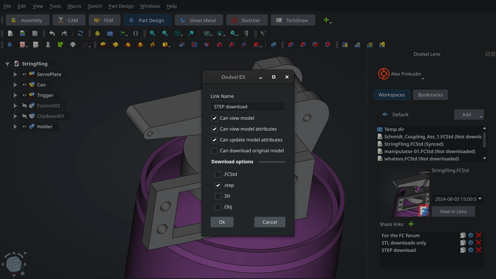

With [Ondsel Lens](https://lens.ondsel.com) you can publish your 3D CAD designs privately or publicly and you can do it directly from the Ondsel Engineering Suite. Let’s learn how to do that.

<!-- truncate -->

<Youtube v="8L0jRRfUzsE" />

Once you have a revision of your design ready, go to the Lens sidebar on the right. Click on the button with the Ondsel logo to log into your Lens account and submit your credentials.

Now that you are logged in, you will see the list of workspaces belonging to various organizations you are part of.

The Default workspace belongs to your personal organization. If you are on the free Solo tier, all your models published there will be public. However, if you are on either of the paid tiers, you can make that workspace a private one. So make sure you choose the right workspace with the right privacy settings.

Double-click on the workspace of your choice. This will give you a list of folders and files that you already uploaded. 

Click ‘Add’ and choose ‘Current file’ in the menu. Give the file a name and click 'Save'. It will be saved to a local folder representing a mirror of your online workspace and uploaded to Lens. 

Now you can either go to lens.ondsel.com in your browser or click the ‘View in Lens’ button, which will open your default browser on that model.

You can open the model information dialog by clicking the 'i' icon on top right…

… and go to the model page with basic information about the model you uploaded: Date, Committer, Message, count of revisions.

Click 'Explore' to open the 3D view again.

You can rotate the camera around the model and zoom in and out. You can also see the list of parts and toggle their visibility.

You can create share links to make this model accessible to other people and control what they can do with your model. It's best to do that from the model information page.

You can do the same directly from Ondsel Engineering Suite. Just click the '+' above the list of share links.

Once you created a new share link, click the 'clipboard' icon next to the name of the link to copy either the share link or the embed code to the clipboard.

Because your model is stored on the Lens cloud service, you can also open and edit that file from a different computer.

Just open Ondsel ES elsewhere, log into your Lens account, go to the workspace this file is in, double-click the name of the file, and it will open for you to pick up where you left off.

