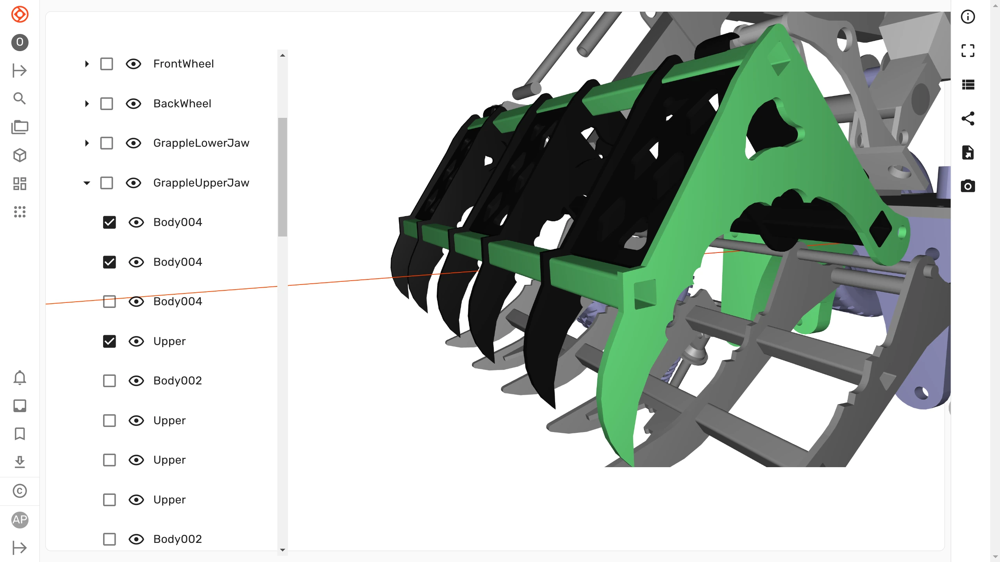

We launched Ondsel Lens in 2023 as a FreeCAD-first product data management system. But there is one thing we cannot deny: STEP is a hugely important standard in the industry. If you go from one 3D CAD program to another, more often than not it’s what you use for model exchange. Even if you go from KiCad to SolidWorks, STEP is how you store your PCB designs for use in assemblies.

<!-- truncate -->

So we’ve just added support for STEP files in Ondsel Lens. You can upload, version, visualize and explore STEP geometry, you can also create share links for it and allow downloading the original file and STL and OBJ versions of it.

<Youtube v="Rk0QE-YZoqw?" />

For STEP files, we also display the entire model hierarchy in the tree view. This is new, it's something we are not doing for FreeCAD files yet, although we are planning to.

The tree view interface also uses checkboxes for selecting objects in the tree. This is a temporary solution, but if the majority of users end up loving it, we might keep it, so we are looking for your feedback.

You can already try yourself: [sign in](https://lens.ondsel.com/), upload a STEP file, and look around.

Many more exciting changes are coming, stay tuned! 
