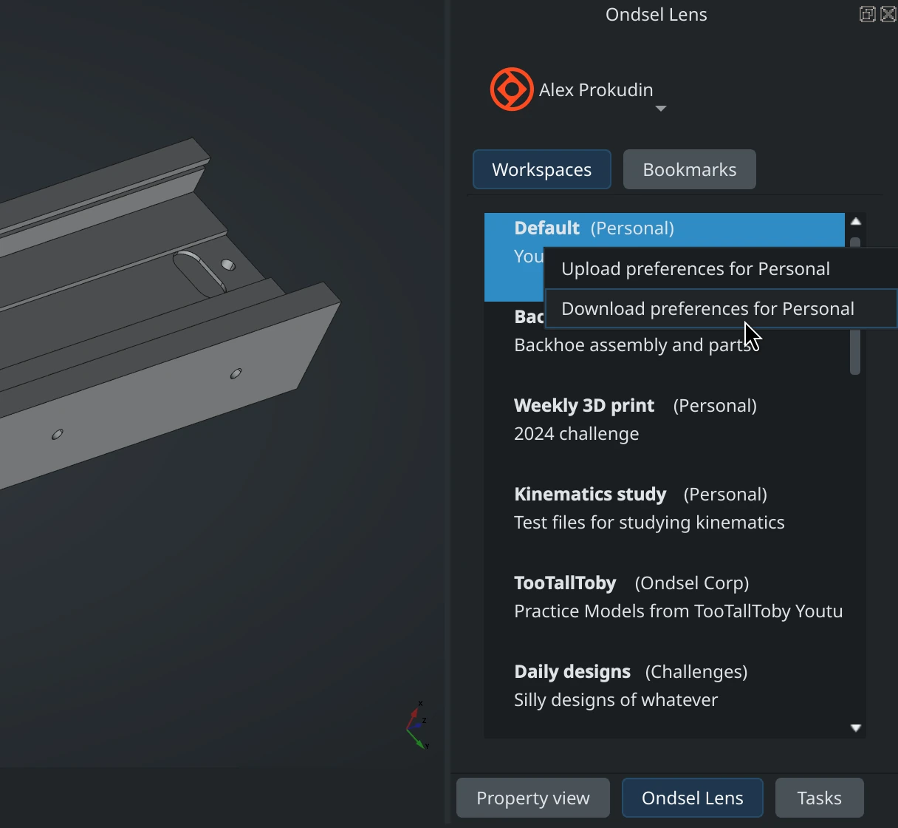
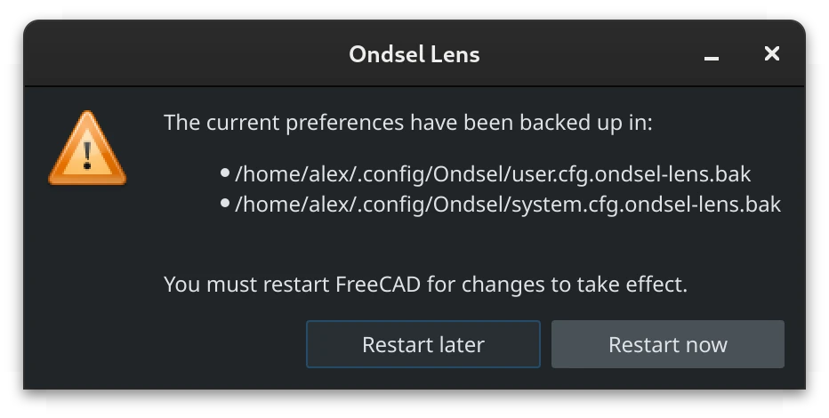
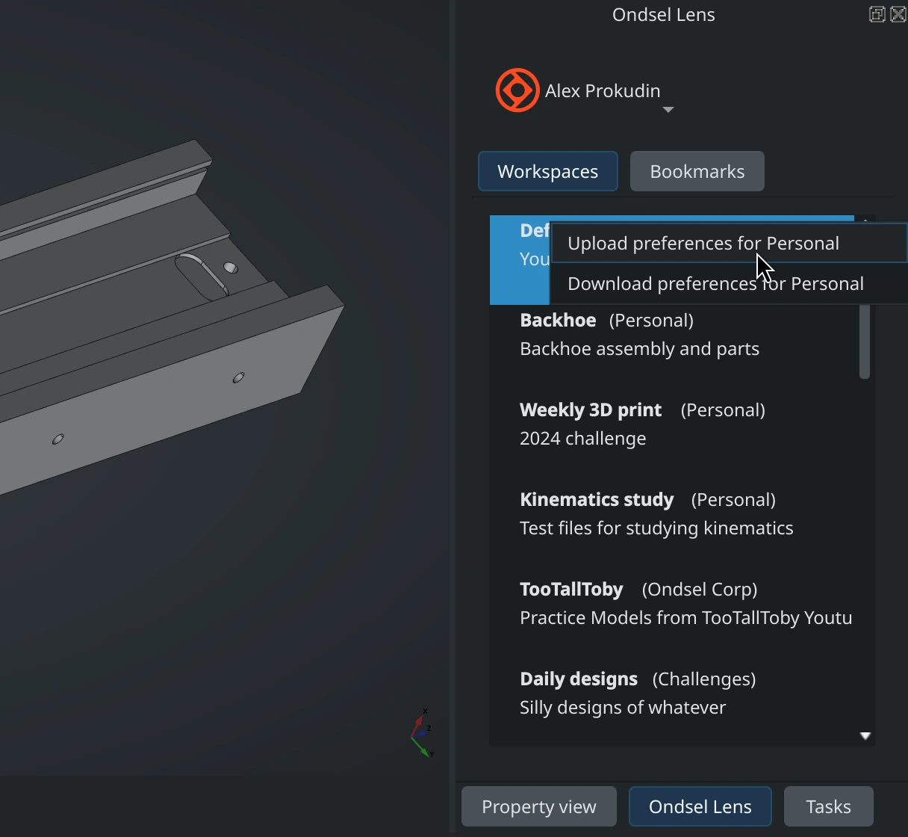
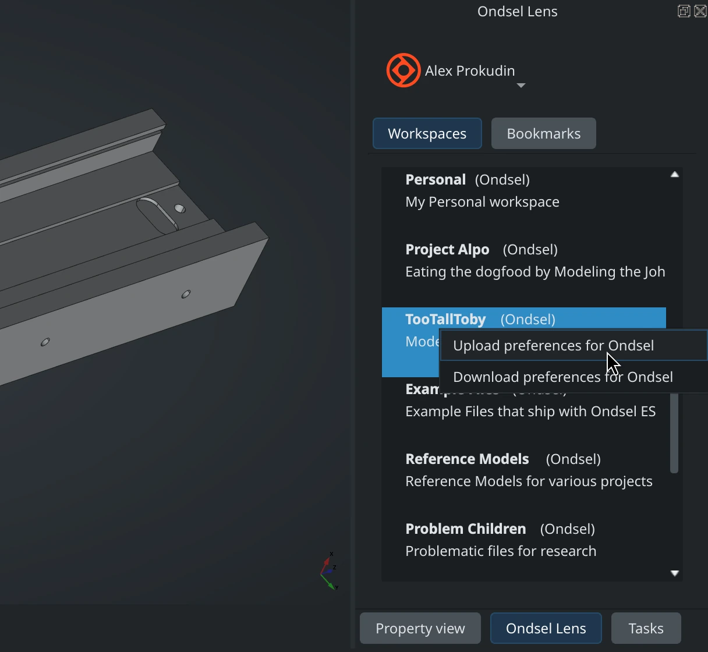
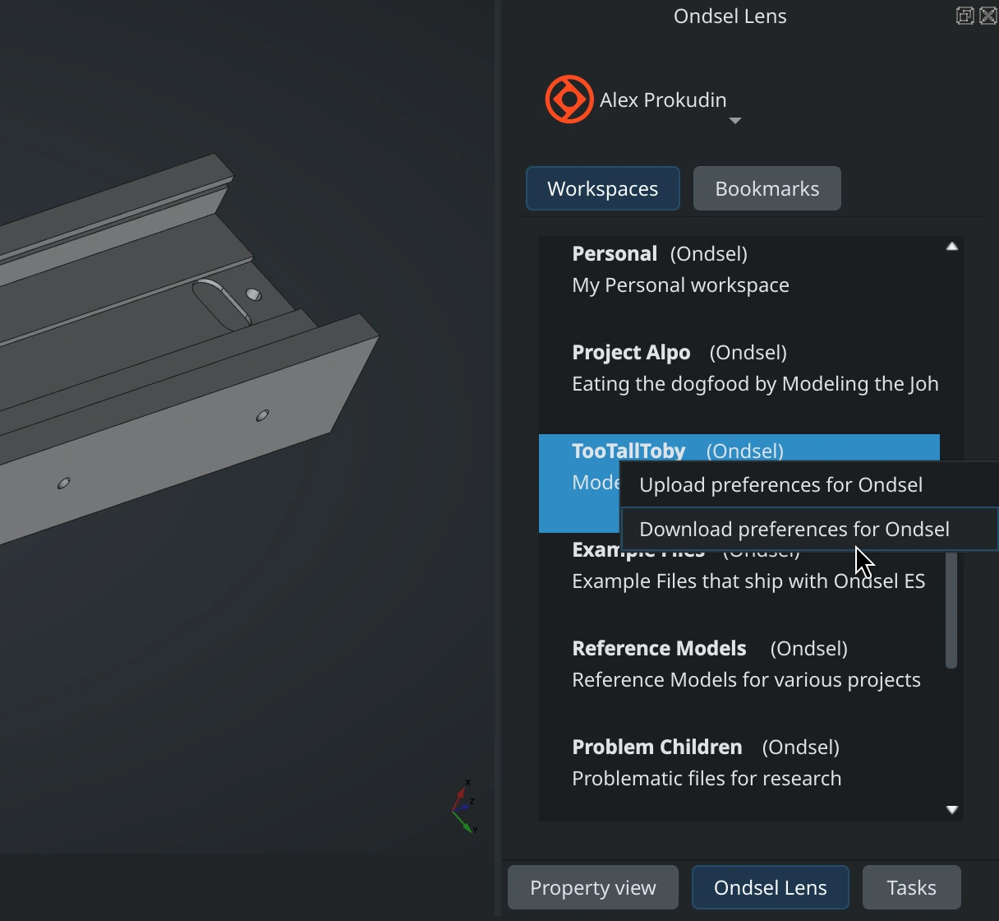

Earlier this year, we shipped Ondsel ES 2024.2 with a small nifty feature: backing up your entire Ondsel ES preferences to Lens and then restoring them. Here is a quick guide on how to do that.

<!-- truncate -->

## The “Why”

There are two main reasons why you might want to do it.

As Ondsel ES is based on FreeCAD, it inherits the ultimate configurability of the original application. But it also means that sometimes customization experiments can go wrong and you might want to revert to defaults. However, since Ondsel ES builds on top of FreeCAD, reverting to defaults means you are getting the default FreeCAD look and settings, which isn’t necessarily a desirable thing.

Secondly, if you customized Ondsel ES just the way you want it and you need to apply the same settings across multiple computers, you might want an easy way to do that — one that doesn’t involve emailing yourself or your teammates a [preferences pack](https://wiki.freecad.org/Preference_Packs).

## The “How”

To **revert to personal Ondsel defaults**, all you need to do is go to the Lens panel, log in, right-click on the “Default (Personal)” workspace and select “Download preferences for Personal”. 

Ondsel ES will apply changes and ask whether you want to restart now or later to see the defaults in action. This is pretty much it.

To **create new personal Ondsel defaults**, do the same, but instead of downloading, select the “Upload preferences for Personal” option. This will rewrite Ondsel ES defaults on your Lens account. Now every time you download preferences from your personal organization, your own defaults will be used.

Do you want to **create new defaults for a team**? Do the same, but this time right-click over any workspace that belongs to your team’s organization and select the “Upload preferences for ORGANIZATION_NAME” option.

Do you want to **apply the same defaults to an entire team**? Get them to log in with their accounts on Lens, then right-click over any workspace that belongs to the team’s organization and select the “Download preferences for ORGANIZATION_NAME” option.

It’s that easy.

## The “What’s Next?”

This simple idea could be extended later on. Perhaps, it would be useful to not only distribute preferences for a team, but also easily roll out 3rd-party addons and your own custom scripts? Or do something else? [Talk to us!](https://ondsel.com/contact/)
