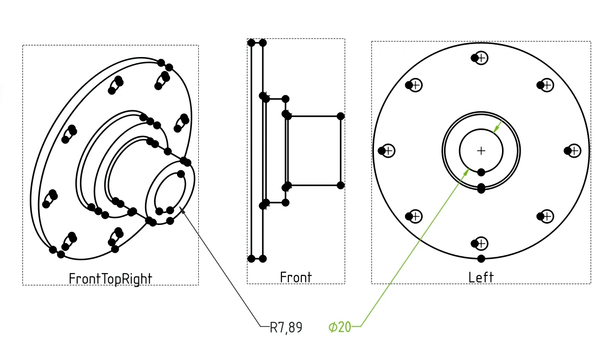

Many people in the Ondsel/FreeCAD community started out as hobbyists and eventually turned their passion into a business. A common story we hear is the frustration they faced getting real-world parts made from their digital designs. It’s understandable. For many people, their first experience of fabrication is the 3D printer. You design the part, push a button, and get your part.  It’s easy, right? Except that hole that you designed to fit a bolt is just a little too small or the tab that should fit into the slot is a little too tight and breaks the part when you force it.

<!-- truncate -->

What these users experienced was their first taste of _tolerance_. While the design may be perfect, the real-world manufacturing process never is. The part is only as perfect as the manufacturing process permits. 

Modern manufacturing processes can achieve impressive dimensional accuracy but it comes at a cost. The closer you want the part to conform to the designed dimensions, the more expensive the manufacturing process is.

Experienced designers and engineers know this. They design the parts to have tight tolerance requirements only when strictly necessary. More importantly, they communicate those requirements to the manufacturer explicitly because neglecting to specify them means the requirement is ambiguous. You may pay too much for the part or you might get a part that doesn’t work.

Traditionally, tolerance requirements were captured in the technical drawings. As CAD matures, these requirements are being captured in the design itself and that is called Geometric Dimensioning and Tolerancing (GD&T) — a set of rules that communicate the intent behind design and what tolerances are acceptable.

Let’s discuss what GD&T is and what it isn’t, what’s currently available in FreeCAD to support this standard, how the program currently stacks against competition with regards to GD&T, and what we think the plan forward should be.

## The basics of GD&T

Geometric Dimensioning and Tolerancing works by attaching constraints to features of a part. These constraints communicate the acceptable deviation in form, size, orientation and location of the feature and are displayed with a set of standardized symbols which can be shown on screen or depicted in a technical drawing. 

The key symbols in GD&T fall into five categories:

- **Form Control**: this includes symbols like flatness, straightness, circularity, and cylindricity, which ensure that the shape of the part meets specific requirements.
- **Profile Control**: profile of a surface and profile of a line are used to control the shape of a feature and ensure it fits within the specified tolerance zone.
- **Orientation Control**: symbols like parallelism, perpendicularity, and angularity define the orientation of features relative to each other.
- **Location Control**: this includes position, concentricity, and symmetry symbols, which ensure that features are located in the correct place on the part.
- **Runout Control**: circular and total runout control the roundness and surface rotation of cylindrical parts.

There are also modifiers such as **Maximum Material Condition** and **Least Material Condition** that describe the condition of a part when it contains the most or the least material possible within its specified tolerance limits. They are commonly used with the true position symbol applied to the diameter of a pin or a hole.

This video works as a very good introduction to the topic:

<Youtube v="G7wnGeR_69k" />

If you want to take an even deeper dive, the [GeoTol channel on YouTube](https://www.youtube.com/@GeoTolPro/videos) provides very useful information that is not tied to a specific CAD.

While we specifically refer to ASME GD&T in this post, this is not the only standard that deals with dimensioning and tolerancing, as well as with the use of gauges, acceptance testing etc. Another common option is ISO’s Geometrical Product Specifications. GD&T and GPS have an overlapping scope and a few fundamentals differences (you can use [this guide](https://www.gdandtbasics.com/iso-vs-asme-standards/) for reference). The two standards also use different terminology for the same tolerances and _mostly_ the same symbols. In the future, it would be useful to provide means to work in either GD&T or in ISO-GPS context.

From users’ perspective, any GD&T implementation should allow doing three things: attaching tolerance constraints to features, displaying them on the screen on a 2D drawing, importing and exporting GD&T data from and to STEP files. Let’s see what’s available in FreeCAD.

## Attaching tolerances to features

This is currently implemented in a 3rd-party workbench called FreeCAD-GDT. The workbench was [originally](https://github.com/juanvanyo/FreeCAD-GDT) developed by Juan Vañó Cerdá, but the most recent work was done in a [fork by 5axes](https://github.com/5axes/FreeCAD-GDT), so that’s what we are looking at here.

Juan intended the workbench to cover GD&T use in both 2D and 3D, but so far the existing feature set is 3D-only. There isn’t much documentation available on the workbench, nor are there any YouTube videos. The only explainer is [in the forum](https://forum.freecad.org/viewtopic.php?p=171564#p171564).

The general workflow is this: create an annotation plane, then create a datum reference or a geometric tolerance, set its properties, and then point where you want it placed.

Overall, while the workbench provides an initial implementation of GD&T, there are several things that need attention: incomplete coverage of the standard (e.g. material modifiers don't seem to be implemented), no way to export annotations along with STEP data, and a number of UX issues including broken undo/redo. At the moment, the workbench doesn't even render data correctly inside control frames.

It is obvious though that the feature is all but trivial, so it's supposed to take time and effort to complete it.

## Support for GD&T data in STEP loader/saver

There are multiple reasons why you would want this.

First and foremost, you do want that for metrology. When engineers do the inspection, they need reference data to compare the measured data against what’s within the acceptable range of values and what’s out of the range. They can enter that reference information manually or they can load it from a STEP file. Since you create the annotations anyway, why not save them into STEP as well?

Secondly, there is this blasphemous thought that a model that is 100% defined can replace 2D drawings. If you collaborate on projects with people who used other CAD software, STEP is likely the file format you use. Besides, as 2D drawings are prone to misinterpretations, you likely want to submit STEP files to your manufacturer to clear any possible confusions.

Currently, the most up-to-date version of STEP that supports GD&T annotations is [AP242](http://www.ap242.org/). FreeCAD / Ondsel ES can export that, but the code needs to be enhanced to include GD&T data. The same applies to the loading of STEP files.

The obvious prerequisite for loading and saving GD&T data from/to STEP files is being able to store this information natively in FreeCAD files. It isn’t currently supported.

## Displaying annotations on TechDraw pages

You can create GD&T annotations in 2D drawings with TechDraw. However, the workflow is not amazing:

1. Add a view of a part.
2. Use the Balloon tool to add a balloon to a geometry feature.
3. Change the balloon’s settings to use a rectangular frame.
4. Use a different tool to construct balloon's label from presets.
5. Copy/paste that label into the balloon's text box.

This is covered in the following video tutorial by MangoJelly:

<Youtube v="7GwaIpJgp1Q" />

The workflow assumes a lot of manual work — more than what you get in some of the proprietary tools. If you do your dimensioning in Sketcher (and you likely do that), you can’t use that information in TechDraw, you have to use the Smart Dimension tool in TechDraw to attach dimensions to views again. And when you add GD&T annotations, you have to manually place all that information next to each other, as there is no automatic alignment and grouping.

Moreover, even after manual work annotations are not great visually, as is evident from the screenshot above. The centering of labels inside frames is not correct (you have to use whitespaces to make it better), datum features are attached to geometric features in a strange way etc.

Suffices to say that even WandererFan who is the principal developer and maintainer of TechDraw is [not very fond](https://forum.freecad.org/viewtopic.php?p=594813#p594813) of this:

> I'm not in favour of hacking balloons to better simulate Feature Control Frames. I would much rather introduce a dedicated function.

The competition is currently one step ahead. E.g. in SolidWorks you do the dimensioning when sketching, then you can bring those dimensions into a view on a drawing page with literally just one click. After that you can attach the GD&T data to an existing dimension, and once you do that, all the metadata will be combined, and you can reposition it all without doing a multiselection.

The problem here is that getting geometry information to create dimensions seems to be impossible in FreeCAD at the moment. All the dimensioning you do in TechDraw happens on views rather than on the original geometry. The most obvious case where it breaks are axonometric views: TechDraw will never get dimensions right, because it has no concept of original geometry in perspective.

This larger issue has been discussed in [this issue report](https://github.com/FreeCAD/FreeCAD/issues/12383). So that likely needs to be fixed first.

## What we think should be done

Let’s zoom out a little here. GD&T is essentially a kind of metadata. The main friction with all metadata is that it’s typically designed as an afterthought. You do something, then _maybe_ you add metadata. And much of that is manual work.

Right now, if you want GD&T annotations both in 3D view and on TechDraw pages, you have to do the dimensioning three times:

1. When you sketch your part
2. When you create GD&T annotations in the FreeCAD-GDT workbench
3. When you add the same annotations to views in TechDraw

But what if FreeCAD was capable enough to automatically or semi-automatically capture much of the data as you design a part?

When you constraint the length in Sketcher, can it automatically add GD&T metadata that can be updated with limits immediately or later on?

When you create a circular pocket in Part Design, can it give you an option to automatically add cylindricity?

In that case you wouldn’t be starting from scratch when annotating, you would likely have to do some refining and add missing properties.

The first step in designing such a system should be updating the file format to allow storing GD&T metadata so that the program had somewhere to store the captured data in.

Once that is done, it’s possible to implement some basic capturing of the GD&T data. Then you can start adding GD&T visualization, as well as manipulation tools to refine captured data and add more annotations.

Finally, once _that_ is done and users have full control over annotations, STEP loading and exporting code can be updated to match the existing feature set.

We can (and likely _should_) argue on implementation details, but let's agree on the general proposal first.

## What the next step should be

While maintainers are busy getting FreeCAD 1.0 out the door, let’s discuss the plan and flesh it out so that real work could start. There's a [dedicated GitHub board](https://github.com/orgs/FreeCAD/projects/23), but right now it only has one issue card related to inefficient GD&T workflow in the TechDraw workbench. Let’s use it to plan further work.
