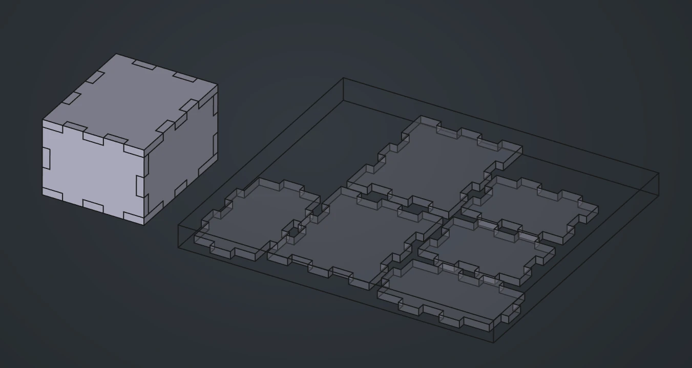
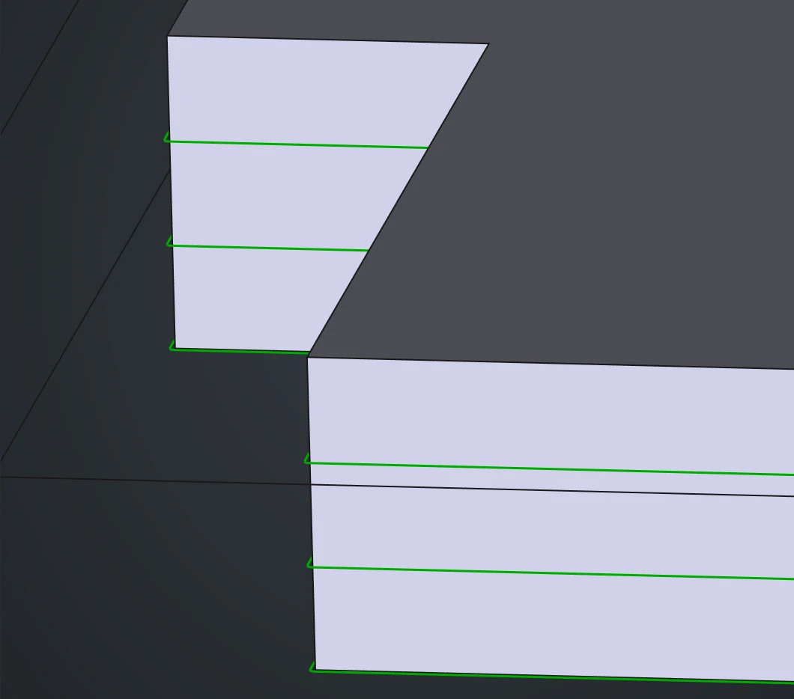
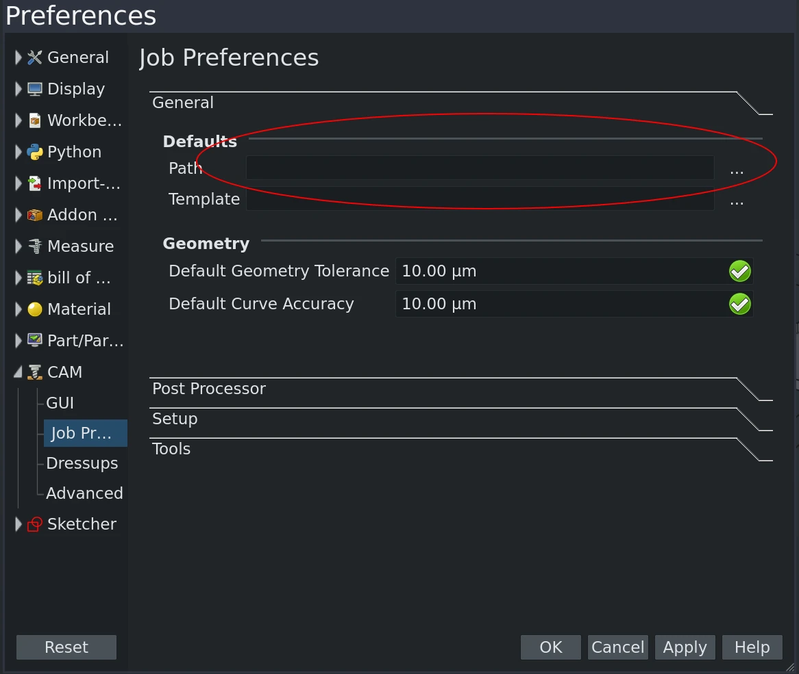
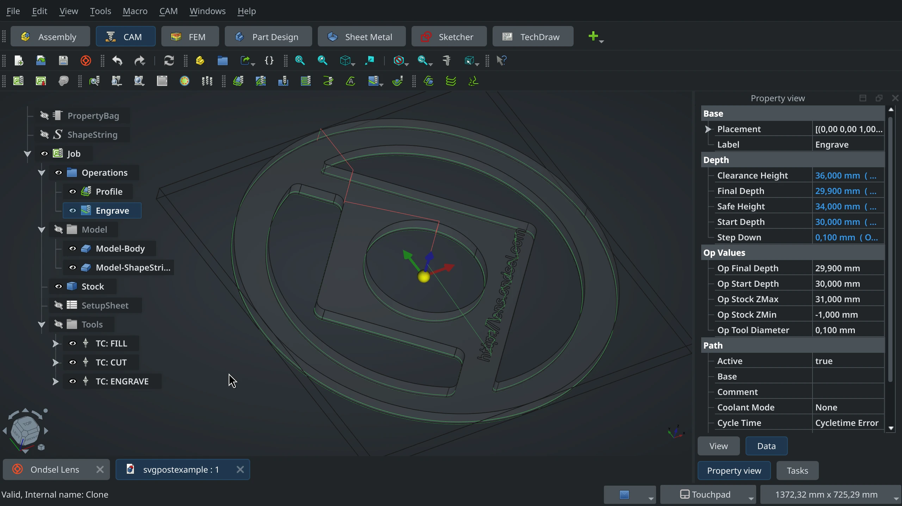

Laser cutters are a staple in maker spaces and are often the first exposure users have to CNC equipment. They are fast and accurate. They produce usable parts from inexpensive materials. They can cut and engrave and are intuitive to use. 

However, laser cutters typically have a different workflow compared to other CNC machines. Instead of G-code, the input for laser cutters is usually 2D geometry files such as SVG, DXF, or image files. The control software then automatically generates the G-code internally. This means that users need to prepare their SVG files before feeding them to laser cutters, and the procedure is different for every cutter.

To make things easier, we developed a post-processor for the CAM workbench that generates SVG files automatically. It helps streamline the workflow and cuts down the time it usually takes to go from design to product.

<!-- truncate -->

SVG isn’t intended for machine control. Using it for that purpose is convenient but introduces some problems that the user needs to resolve. Let’s take a look at them.

## Typical challenges

### Offsetting

With an SVG, the geometry describes the desired part. If we push the laser beam along that line, the kerf (material removed by the laser) will be divided on either side and the final part will be slightly smaller than designed. Interior holes will be slightly larger. Laser cutter beams are usually very narrow and, for some applications, the user can simply ignore the kerf. But if the user wants highly accurate parts, the SVG has to be scaled up or down to account for it.

CAM tools like FreeCAD’s CAM workbench handle kerf automatically. They offset the toolpath from the part model by the radius of the cutter. The resulting parts and holes are accurately cut. 

### Feed Rate and Laser Power

In CAM tools, controlling the feed rate and the spindle speed is done with explicit G-code commands. SVG and DXF files don’t have such commands so the desired feed rate and laser power settings are implied through layers and colors. The user makes certain lines red and other lines blue. The laser control is then configured to interpret a red line as a cutting line and runs the laser at a pre-specified feed rate and power level. There’s no universal standard for these colors. Some laser cutters ignore color entirely and instead use different layers of the SVG file to correspond to different operations. It falls on the user to know what the laser controller needs and to carefully create the image accordingly.

### Part Placement

The ideal position of a part for fabrication is seldom the same as the ideal position for modeling. Consider a simple box where the user has designed cut pieces to fit together. The assembly position is radically different from the cut -sheet. CAM tools allow for creating cut sheets and optimizing the cut layout without disturbing the original assembly.

### Multiple Passes

There are times when the user wants the laser to follow the same pass multiple times. Cutting through particularly thick material is one. With an SVG file, this is done by having multiple identical edges. It works but is impossible for a human to see and verify. With CAM, passes are shown as distinct tool paths. As long as the Z-depth value is different, the user can see them.

Unfortunately, CAM tools usually produce G-code. Wouldn’t it be nice if the user could set up a traditional CAM job, lay out the parts the way they want for cutting, configure the feed rate and power, and then automatically produce an SVG file that the laser cutter could read?

## Existing solutions

The [LasercutterSVGExport](https://github.com/FreeCAD/FreeCAD-macros/blob/master/TechDraw/LasercutterSVGExport.FCMacro) macro available in the FreeCAD Addon Manager is one solution that a lot of people turn to. It works well but still requires repositioning the parts for cutting on a TechDraw page.

## Ondsel SVG Postprocessor

To simplify working with laser cutters while leveraging the regular CNC workflow, we’ve developed a new SVG-specific postprocessor. This tool streamlines the process and integrates seamlessly with the existing CAM workbench.

**Available for download**: The Ondsel SVG postprocessor is now available in our weekly builds that you can [download from Lens](https://lens.ondsel.com/download-and-explore) and will be part of the upcoming v2024.3 release.

## Setting it up

Once you created your design as usual, including assemblies, do the one-time setup:

1. In the CAM workbench, create a 'Toolbit' to represent the laser. Since the beam is cylindrical, use the end mill tool shape.
2. Set the diameter to the beam width of your laser.
3. Add the tool bit to your tool library
4. Download the postprocessor and put it with the other posts or in your CAM default directory.

The postprocessor is a single Python file and can be edited in any text editor. You might not need to do this unless you need to customize the colors for your laser. The post-processor has some simple global variables at the beginning. If you need to configure which colors are assigned to the different operations, you can easily edit these values.

To give you something to play with, here is a simple FCStd file you can export from Lens:

<iframe width="560" height="315" src="https://lens.ondsel.com/share/66f6c7b3b3ad9c1ce78e03b5" title="Ondsel"></iframe>

It's completely set up for the CAM job:

And here is the post-processed SVG file:

You can right-click and download it as a file to inspect.

## How to use the SVG post-processor

Here are the steps when you are using the post-processor for the first time:

1. Create a CAM job and select the SVG post-processor.
2. Set the file output name, ensuring the extension is .svg.
3. Position the parts within a stock boundary. CAM can automatically generate a stock, or you can configure a custom stock.
4. Create a Tool Controller for each way you want to use the laser (e.g., Cutting, Engraving). Name the tool controllers appropriately (e.g., TC: CUTTING, TC: ENGRAVING).
5. Create a profile operation to cut out the parts. If multiple passes are needed, configure the step-down values to create multiple toolpath passes. Use the cutting tool controller.

For engraving, create an engraving operation and select the engraving tool controller.

Optionally, save the job as a job template for future use.

Once you’ve done it the first time, every other time just do this:

1. With the tools and operations set up, select the job and post-process to output an SVG file.
2. Options include creating multiple layers in the document, with each layer corresponding to an operation and having a similar name.

By following the steps, you can streamline your laser cutting process, making it more efficient and integrated with your existing CNC workflows. The Ondsel SVG postprocessor ensures a smoother transition from CAD to laser cutting, enhancing your productivity and precision.

We would love to hear how this works for you. If you have ideas for further improvement, let us know by joining our [Discord server](https://discord.gg/7jmzezyyfP) or opening an issue in [our tracker](https://github.com/Ondsel-Development/FreeCAD/issues).
