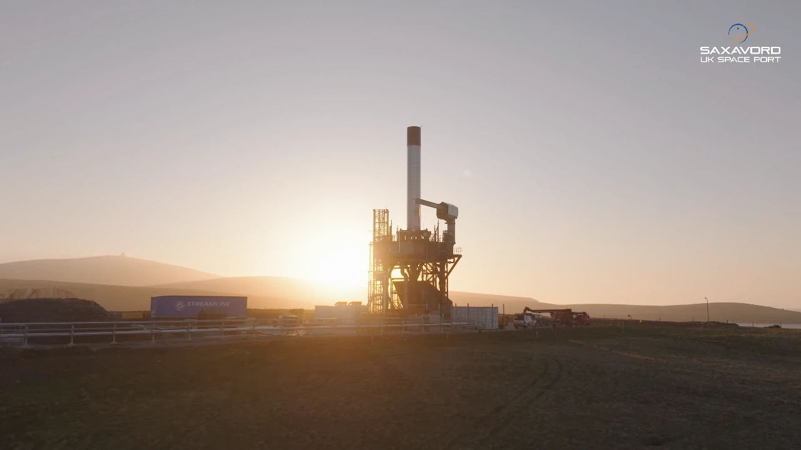
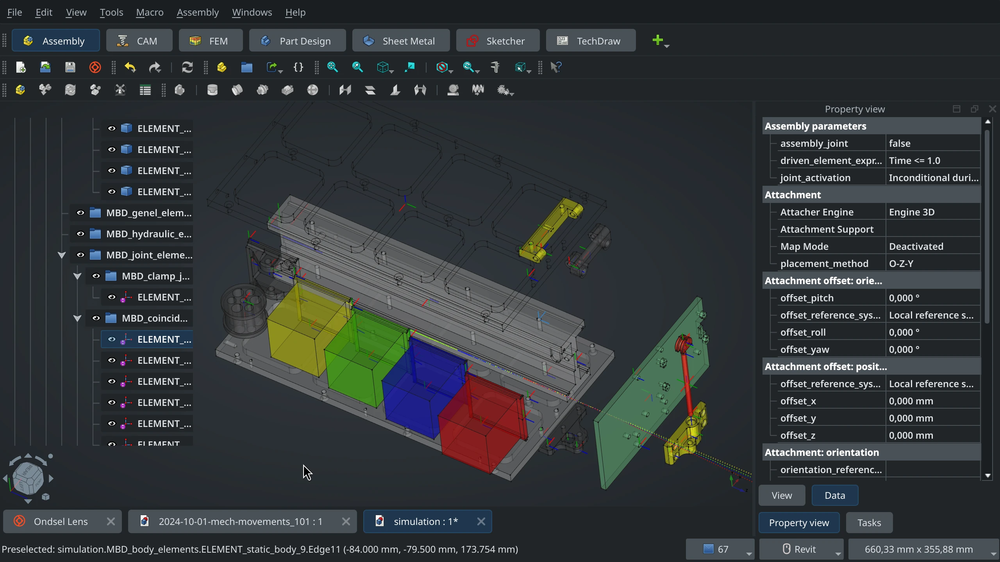

A while ago we collaborated with Libre Space Foundation on a fun little project that required simulating multi-body dynamics (MBD) in zero gravity. This helped us improve the MBD-capable solver that we’ve been developing behind the scenes for a while. Here is the story.

<!-- truncate -->

## What is Libre Space Foundation

The [Libre Space Foundation](https://libre.space/) (LSF) was established in 2015. Their mission — to advance open-source technologies in the space industry. The foundation focuses on developing and promoting open-source hardware and software solutions for satellite missions and space exploration.

LSF works on a range of projects, including satellite communications, ground station networks, and educational initiatives that aim to democratize access to space. Their efforts include projects like SatNOGS, an open-source global network of satellite ground stations, and UPSat, the first open-source satellite launched into space ini 2017.

_UPSat is the left one in the satellites group. Image: NASA_

LSF mainly works on projects with the European Space Agency, one of their missions is set to launch from the SaxaVord spaceport in Scotland.

_SaxaVord launchpad. Image: SaxaVord_

The team have been [long-time users](https://forum.freecad.org/viewtopic.php?t=22922) of FreeCAD. All the models are [publicly available](https://gitlab.com/librespacefoundation) on Gitlab.

## The challenge

One of the projects by the LSF is PICOBUS, a [pocketqube](https://en.wikipedia.org/wiki/PocketQube) satellite deployer. It has already seen real action in 2022 when it deployed 6 cubesats during the [first successful flight](https://everydayastronaut.com/flta002-to-the-black-alpha/) of Firefly’s [Alpha](https://fireflyspace.com/alpha/) rocket.

<Youtube v="jprpUmrIjTs" />

PICOBUS has the following parts:

- The rail that CubeSats slide into.
- The pusher that slides in the rail and holds the one end of the constant force spring.
- Surrounding plates that hold pocketqubes in place.
- The rocket mounting flange that attaches the deployer to the rocket.
- The door that has the deployment mechanism, thermal knives, and electronics.

Here is the entire model on Lens:

<iframe width="560" height="315" src="https://lens.ondsel.com/share/66f0a17144d4d1e0926a8c5a" title="PICOBUS assembly for simulation"></iframe>

So how does the deployment in space happen? The door is held shut by a spring-loaded pin, and that pin is held in place by a string. When signal is received from the rocket, two thermal knives are heated, and the string is cut. Once they are cut, the pin is pulled out, and the door is allowed to rotate. With the door open, the constant-force spring pushes CubeSats out, and they exit the deployer.

<Youtube v="bov6562iv1s" />

In fact, this FOSDEM 2024 talk discussed all this in great many detail:

<Youtube v="ZOUvQp9r-P8" />

Here comes the interesting part. To better understand what happens when the satellites leave the deployer, the LSF team needed to know three things:

1. **Dimensions of the exit cone** that satellites form when they are pushed outside.
2. **Exit velocity** of the satellites when they leave the deployer.
3. **Satellite tumbling** upon exit, as the satellites are pushed from the bottom plate and have a tumbling momentum.

The challenge here was that calculations needed to involve multi-body dynamics simulation as cubesats hit the rail, the surrounding plates, the door, and each other as they exit the deployer.

## The team

On the LSF side, we worked with two core contributors to the project — Thanos Patsas and Manthos Papamatthaiou. On the Ondsel side, Dr. Aik-Siong Koh, principal developer of Ondsel Solver, did the majority of the consulting and the development of our own private solver with multi-body dynamics capabilities.

We also hired Jose Gabriel Egas Ortuño to do the actual simulation and improve the new version of his [multi-body dynamics workbench](https://gitlab.com/josegegas/freecad-mbdyn-dynamics-workbench) that originally relied on [MBDyn](https://www.mbdyn.org/).

## What we did

As Jose’s workbench originally used MBDyn, we needed to update OndselMbD (our own solver, currently private) to read MBDyn input files and generate its output files so that it could be an MBDyn replacement in certain scenarios. A major challenge here was MBDyn not having the concept of Marker objects which are required by OndselMbD —  an equivalent to local coordinate systems, that has methods to help with MBD calculations.

The Libre Space Foundation team provided us STEP models for almost all the parts involved. To make the assembly complete, Jose modeled a few more parts. The pusher was modeled using a constant-force spring which imposes an acceleration to the satellites once the door opens and deployment takes place. To open the door, a pre-loaded torsion spring was modeled which, once released, applied a torque to the door’s hinge, opening it. 

Then Jose modeled the contacts between the pusher, CubeSats, and the door. These contacts were modeled using a mass-spring-damper contact model, in which a spring-damper system is added between the parts that make contact together, and the spring and damping constants are adjusted to mimic the behavior of the real contact.

Here is the simulation video:

<video width="100%" height="100%" controls>
  <source src="/video/2024/lsf-feature/cubesats-deployment-simulation.mp4" type="video/mp4" />
  Your browser does not support the video tag.
</video>

## When to expect the mission

The Libre Space Foundation team is currently waiting for the launch date — some time next year. This is going to be part of the maiden flight of the [RFA ONE](https://www.rfa.space/rfa-one/) rocket made by the Rocket Factory Augsburg.

## What we have learned

On a technical level, we discovered a few things in MBDyn that are missing or need to be improved. In particular, the engine doesn't have the concept of markers — coordinate system objects on parts. You could apply forces and torques on them, use them to form joints and prescribed motions, take measurements between them and read their positions, velocities and accelerations. This is being discussed. We are also developing some prerequisites for markers in the core of Ondsel ES and FreeCAD.

On a purely emotional level, it’s overwhelming to see someone using free and open-source software to design something that gets to fly into space and then do the job it was designed to do. The Libre Space Foundation made that a reality, several times already.

This collaboration and research around that also made us realize how much underappreciated the entire field of multi-body dynamics is. The industry-grade tools are expensive and very hard to master, but the results are extremely desirable. Unlocking MBD for more people is worth doing, but this means the tools have to be democratized — not just in price, but also in UX/UI. And there are some serious compromises to achieve here to make this work for both professionals and beginners.