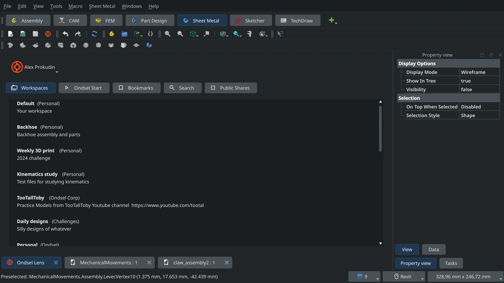
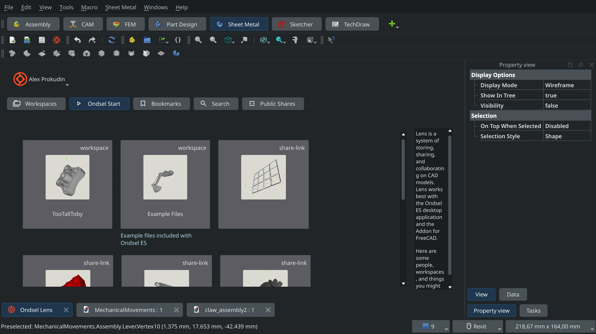
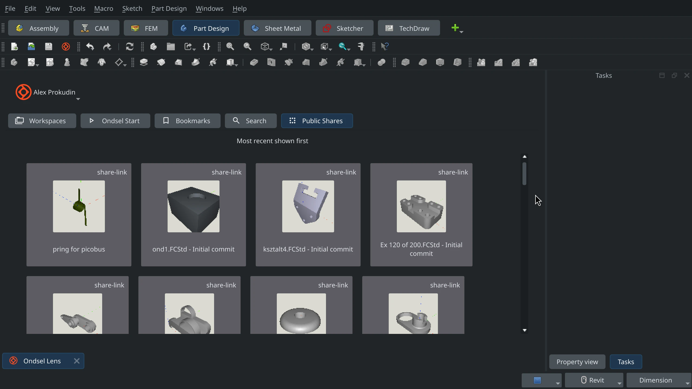
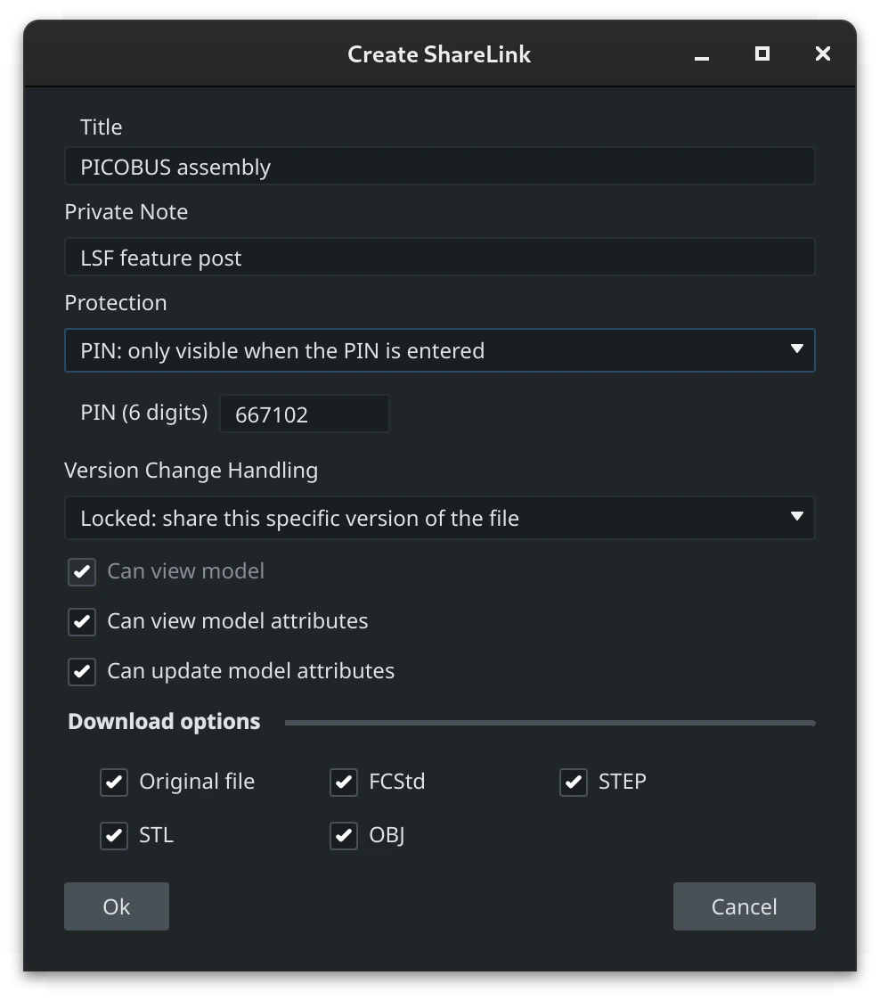
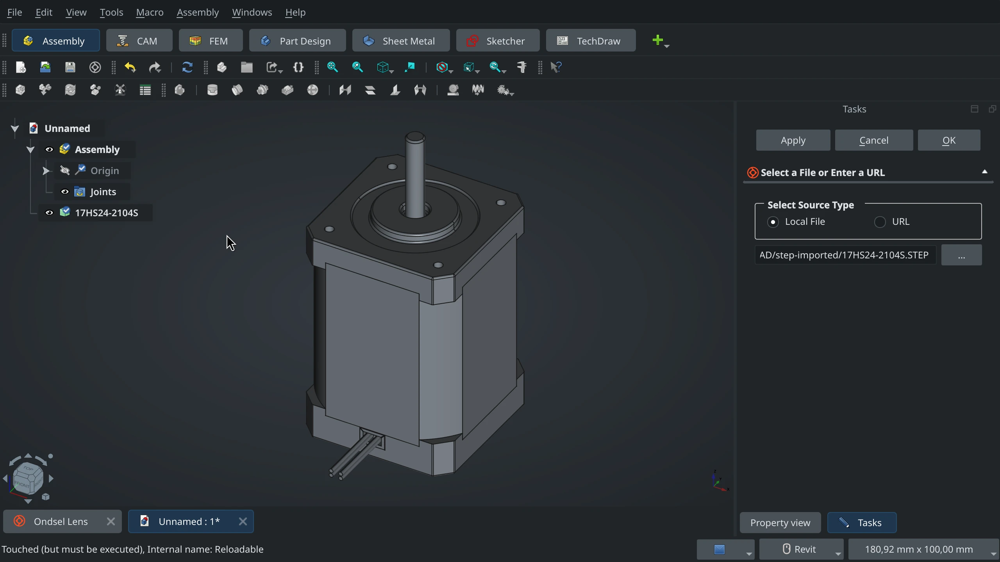

For the upcoming new version of Ondsel ES, we are bringing major changes to the Lens addon. Let’s outline our strategy here and do a quick preview of what’s coming.

<!-- truncate -->

## Where all this is going

We think that the Lens integration is most useful when you can easily download and reuse parts from the online service right in the desktop application — whether we are talking about off-the-shelf components in the public section of the library or custom parts privately designed by your teammates.

This means three major changes must happen: 

1. The addon needs a different user interface, one that works better for browsing the entire catalog of components — the sidebar in 2024.2 is not great for that.
2. Search should be built right into the addon. You should be able to get the entire list of components available to you, preview them, and then open the ones you are interested in with just one click.
3. You should be able to pick a part from Ondsel Lens and link it into your assembly.

We’ve already done 1 and 2, and laid a solid foundation for 3.

## What’s coming in the next release

**MDI view**. When it comes to sidebars, users spend most of their time interacting with the project tree, the Property View panel, and the Task panel. We listened to your feedback and turned the Lens add-on panel into a window in the main view. So it gets out of your way when you design, but you can easily switch to it when you need to upload a revision or browse for a component. Just click on the Ondsel Lens tab at the bottom.

We also added three new tabs that bring previously unavailable functionality.

**Ondsel Start**. This is where we provide example files to help you try new features, as well as promote great work that Lens users do.

**Search**. It’s now possible to search for models (by share link names), users, workspaces, and organizations available on Lens. When you try to open a share link, you get to choose whether you want to open in Ondsel ES or on Lens in the browser.

<video width="100%" height="100%" controls>
  <source src="/video/2024/lens-2024-10-update/search-in-lens-addon.mp4" type="video/mp4" />
  Your browser does not support the video tag.
</video>

**Public Shares**. The last new tab brings access to 25 latest publicly available models and parts, sorted from newest to oldest.

**More share link options**. We updated the addon to bring it up to speed with Lens. You can now set protection options for a new share link: make it publicly listed, not listed at all, or not listed *and* PIN-protected.

You can also tell Lens how to handle versioning in the share link: it can always load the latest revision or the particular revision that this model was at when you created this share link. This option is only available when you create a new share link.

Finally, you can now also set a private note. The title you set shows up in File Info and the public models feed, but private notes are only for yourself and your team.

When you create multiple share links for the same model, it’s typically because of one of the two reasons. You either want a share link per revision, or you want share links with different permissions for different people. So it’s useful to know the purpose of each share link. Private notes can tell you just that months and years later when you no longer remember the details, They are only visible to people who belong to the organization.

**Persistent connection**. The addon now handles network connectivity issues gracefully and doesn’t log you out when you temporarily lose Internet access.

**Share link handling**. You can now open a model from a share link directly in Ondsel ES when you are browsing Lens in a browser. The workflow is similar to what you get when e.g. clicking Zoom links. This works on both Linux, Windows, and macOS.

<video width="100%" height="100%" controls>
  <source src="/video/2024/lens-2024-10-update/open-in-oes.mp4" />
  Your browser does not support the video tag.
</video>

The feature sounds like a minor thing, but it actually required both server-side changes and developing some rather unusual macOS-specific code (Windows and Linux implementations were comparatively trivial). 

**Reloadable objects**. You can link a STEP file directly now (“File > Add Reloadable Object”), whether it’s located in a local folder on your computer or uploaded to a website (and you have a direct URL). When the linked file changes, Ondsel ES displays a different icon for the linked part that suggests you might want to reload that file. Just click the Recompute button in the toolbar.

We distribute this feature as part of the addon. There’s a separate post coming with details about how it all works. Suffice to say, we are not going to stop at STEP files, this is just the beginning. The plan is to make it easy to reuse off-the-shelf components from Lens, whatever supported file format they are in.

## How you can test it

All these changes are now available in weekly builds available from the Pre-Releases section of the [Download and Explore](https://lens.ondsel.com/download-and-explore) page. You can register (free tier gets you free downloads), download, and try it for yourself.

If this is the first time you are running Ondsel ES, you don’t need to do anything. However, if you installed and ran Ondsel ES at least once before, to get access to new features, you need to either delete the local copy of the plugin or change where its source is coming from. The latter requires having git installed on your system, so we’ll go the easy route that works everywhere:

1. Quite Ondsel ES if you are running it.
2. Go to a local folder where your addons are:
    1. Windows: `C:\Users\[YourUsername]\AppData\Roaming\Ondsel\Mod\`
    2. macOS: `~/Library/Preferences/Ondsel/Mod/`
    3. Linux: `~/.local/share/Ondsel/Mod/`
3. Delete the `Ondsel-Lens` folder.
4. Start Ondsel ES, that’s all.

Once v2024.3 is out alongside FreeCAD v1.0, you will need to repeat that again so that you would be using the latest stable code of the addon.

Please note that if you have a git client installed on your system, you should also be able to select the Ondsel Lens addon in the Addon Manager and then switch between git branches instead of deleting hidden folders.

We are not going to add a lot of new features between now and 2024.3, it's time to spend more time polishing the user experience. So we are interested in your feedback, you can post it on our [Discord server](https://discord.gg/7jmzezyyfP).
