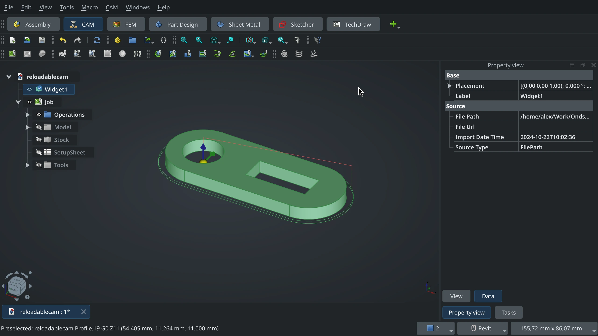
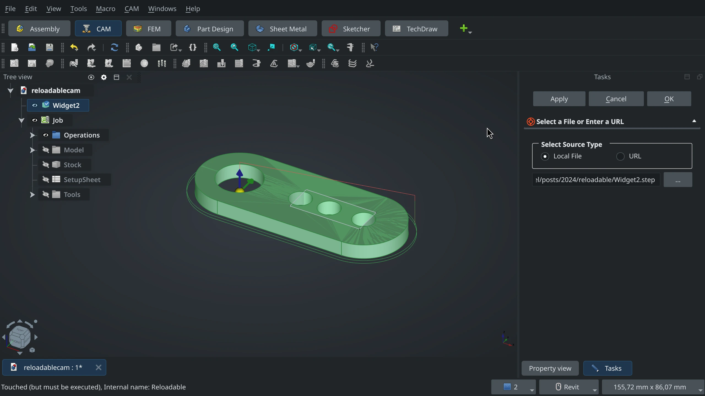
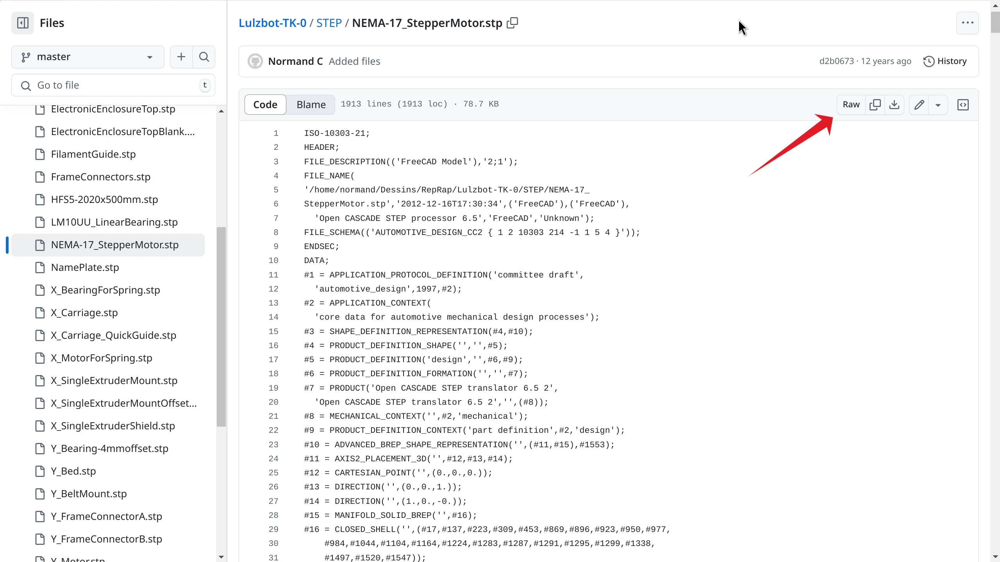
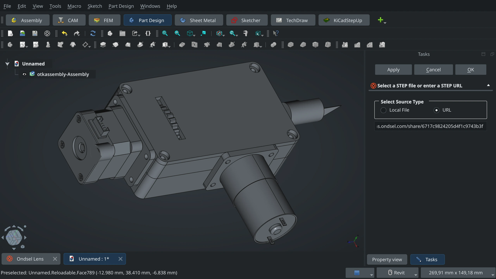
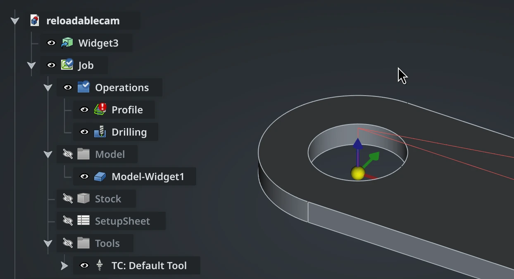

STEP files are the lingua franca for the CAD world. Virtually every solid modeling tool is capable of exporting STEP. Most can also import these files, but the experience can vary wildly in practice. Import may be possible but clunky. It may require the user to choose from many confusing options. Depending on how the file was exported, import may just fail. 

<!-- truncate -->

The OpenCASCADE kernel on which Ondsel is based handles STEP files remarkably well. It can load files that cause commercial tools like SolidWorks to crash. However, the user experience is still unfriendly when you work on a project where files in this format need to be linked rather than imported.

The Lens addon coming in the next release of Ondsel ES is featuring reloadable STEP files — a simple way to link STEP files in your project so that Ondsel ES could become a better player in workflows that involve various other CAD and EDA tools.

## What is a reloadable file?

A reloadable is a simple wrapper of an imported file. The wrapper tracks where the file came from and can reload it on demand. That doesn’t sound like much but let’s look at a common problem to see why this is important.

Imagine that you have a STEP file that you’ve downloaded from the web and you want to use Ondsel’s CAM workbench to manufacture a physical copy.

Your workflow would look something like this:

1. Create a new document and import the file.
2. Create a CAM job: set up the part, stock, and tools.
3. Create the operations to machine the part.
4. Post-process and run the job.

Now imagine what happens when you realize that you have downloaded and imported an old revision of the part. Most of that work is wasted and you have to start over.

With a reloadable, the workflow looks similar:

1. Create a new document.
2. Insert a reloadable via `File > Add Reloadable Object` and set the path to the STEP file. The part appears.
3. Select the reloadable object and create the CAM job like before.
4. Create the operations.
5. Post-process and run the job.

Now when you find that there’s a better revision, you simply download the new one. Double-click on the reloadable and either select the new file or, if you overwrote it on download, press ‘Apply’. 

The new version is imported into the reloadable and the shape is updated. The CAM job and operations still refer to the reloadable wrapper and don’t need to change at all. Just post-process again and you’re ready to run.

The same thing happens within TechDraw, Assembly, and many other workbenches.

## Functionality, benefits, and limitations

The reloadable can load files from the local file system or from any URL that serves a STEP file directly. For example, if the STEP file is in a GitHub repo, you can get the URL from the ‘raw’ link. 

Or if someone uploaded a STEP file on Lens and create a public share link for it, you can insert it too: start adding a reloadable file, switch to URL as a source, then paste a share link URL for your STEP file into the entry box, and click ‘Apply’:

The trick is to make share links that always point to the latest version. Otherwise you'd have to insert a new share link for a new revision.

If the wrapper points to a file on the local filesystem, it will detect if the file on the disk is newer than the imported version. The icon will change to indicate a reload is possible (the one for ‘Widget3‘ on the screenshot below).

It won’t automatically reload though. To reload, just double-click and press ‘Apply’.

The imported shape will behave like any other shape. You can select vertices, edges, and faces and use them wherever you would use a native shape. But be warned: if the reloaded shapes have different faces and edges, any references you have built to them will break. This isn’t, and cannot be, solved by the toponaming mitigation that was recently completed. There’s simply no way for Ondsel to know how the geometry of the shape has changed. We strongly encourage you to use references to underlying geometry sparingly.

The reloadable wrapper is intended to wrap smaller single-body shapes. While it is capable of importing large compound STEP files with many sub-elements, they will be shown as a single shape and you’ll be unable to interact with the sub-elements.

## Technical details and improvements

We believe that making Ondsel ES work better with other design tools is important. We know you use many tools to get the job done and it should be as easy as possible to move between them. We intend to keep improving the reloadable with new features and improved performance. There are a couple of ideas we’re looking into:

1. **Better workflow for using reloadables from Lens.** Imagine being able to browse for a needed off-the-shelf part through the Ondsel addon, click on it, and have it immediately available inside your document as a reloadable object. It's already possible, but the workflow isn't great, we will improve it.

2. **Make the reloadable wrapper also store the import preferences and settings.** Different STEP files may need different import properties. Once chosen, these should apply on reload without your intervention.

3. **Allow the user to add additional coordinate systems (LCS) to the reloadable.** These could be used as attachment points in an assembly and would avoid problems on reload, even if the base geometry changed. 

## Availability

This feature is currently available in our weekly builds and will be part of Ondsel ES 2024.3 that is scheduled to coincide with the FreeCAD 1.0 release. We are interested in your feedback and ideas on how to further improve it. Please grab the latest weekly made, try it, and [talk to us](https://discord.gg/7jmzezyyfP)!