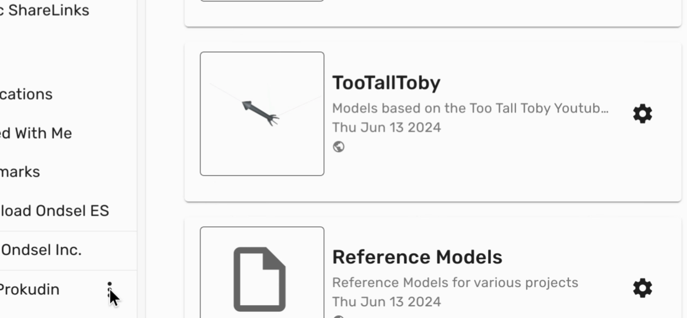
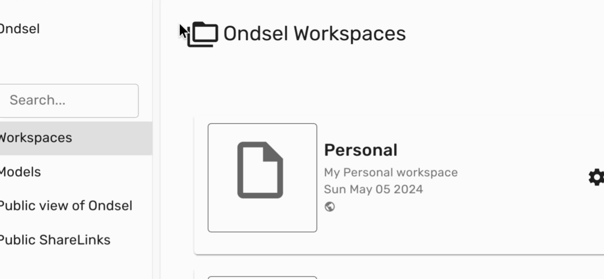

## Accessing The Settings

There are two ways to access account settings:

1. Click on the **3 dot icon** located at the bottom of the sidebar. Then, select **Account Settings**.

 

---

2. Alternatively, navigate to the top of the sidebar, click on the organization name, then click on the **gear** icon of your personal organization.

 

---

All account settings are divided into three parts.

## Public Details

These are the settings that are visible to other user and anonymous visitors:

- **Name**. This is your real name that you specified when registering. To edit it, click the 'CHANGE NAME' button to the right.
- **Username**. This is the unique name used in your public account's URL.
- **Short description**.
- **Long description**.
- **Tags**.
- **Links**.
- **Public page**. This is the link to your public profile that you can share.

## Private Details

These are the settings that no other user except you can know:

- **Email**. The email address you used for registering with Lens.
- **Password**. Your current password masked by asterisk symbols for security reasons. To change the password, click the 'RESET PASSWORD' button to the right. Lens will ask your confirmation to send an email with a unique link for resetting the password.

## Account

The only setting here is **Current Tier**. You can see what tier you are currently on, change it, and view account history.

To change your tier, click the 'CHOOSE NEW TIER' button. You will be taken to the page that lists existing tiers. You can upgrade from Solo to Peer or downgrade from Peer to Solo, in which case all your private models will become public.

You can also view the entire history of your account: when you joined and when you switched to various tiers. To do that, click the 'VIEW ACCOUNT HISTORY' button.

## Organization Membership

This settings page lists all organizations you are part of and allows creating a new organization.

For each organization, you can set email notifications: whether Lens should send you an email every time you receive a notification on the system.

## Public Promoted Items

This settings page lists all the share links, users, organization, and workspaces that you recommended, along with a complent comment for each (where available).

For more information about promoted items, please see the **Promotions** page.