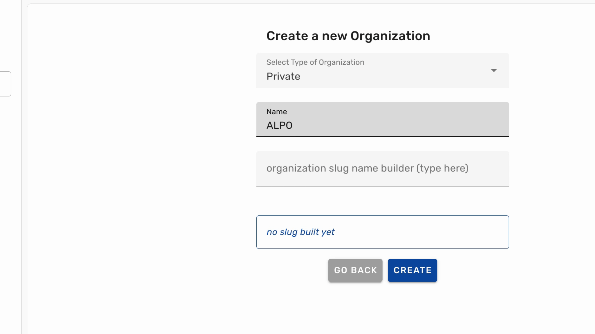

This guide will explain creating a new open or private organization on Ondsel Lens.

---

1. To start creating a new organization, click on the three dots icon at the bottom of the sidebar where your account name is.

---

2. Click on **Account Settings**.

---

3. On the **Account Settings** page, switch to the **Organization Memberships** tab.

---

4. Click the **Create Organization** button.

---

5. Select the **Type of Organization**, open or private.

---

6. Type the **Name** of the organization.

---

7. Then, type the organization's **Slug**, a variation of its name used in its URL on Lens.

---

8. Now click on **Create** to finalize creating a new organization.

 

---

This will create a new organization and open its settings for editing.

