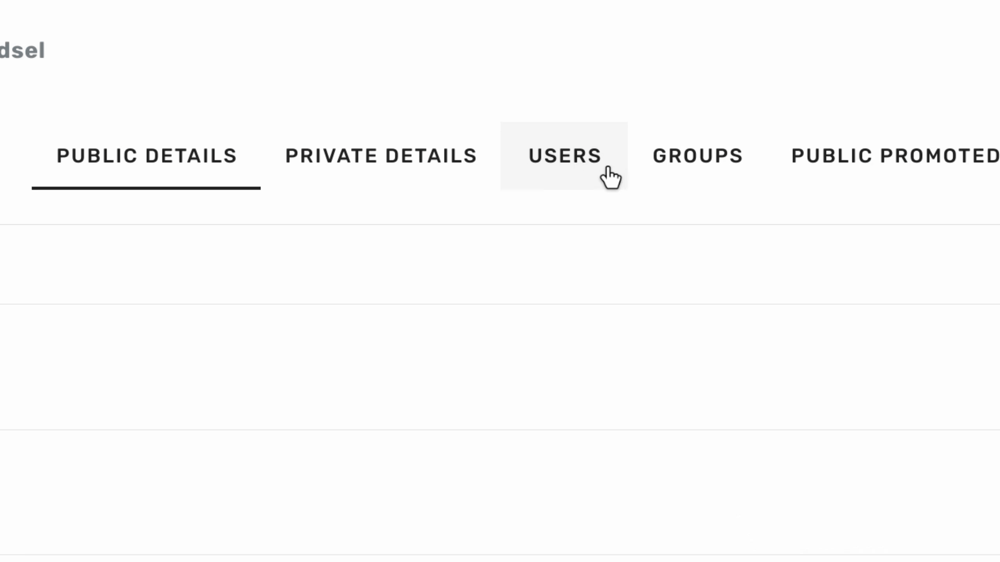
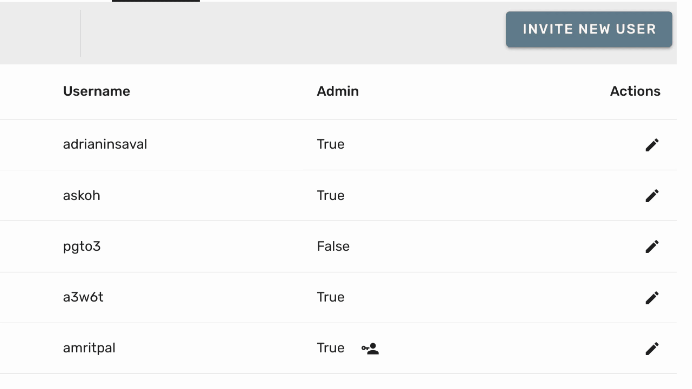
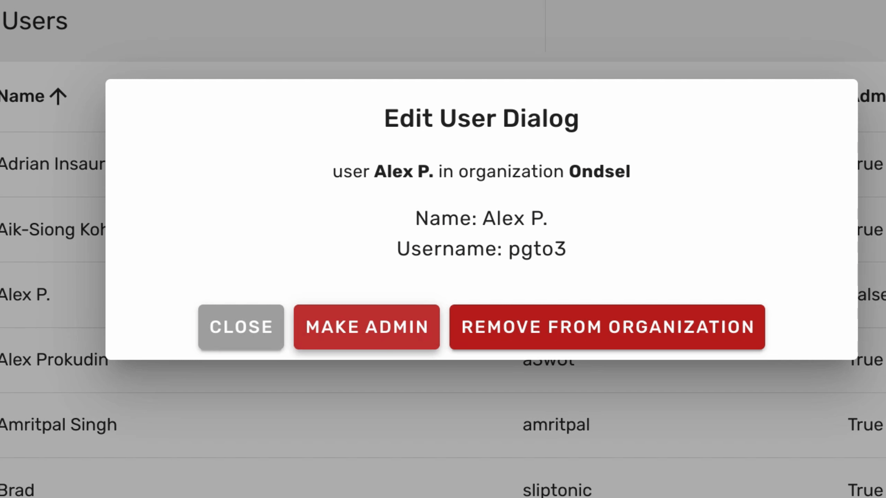
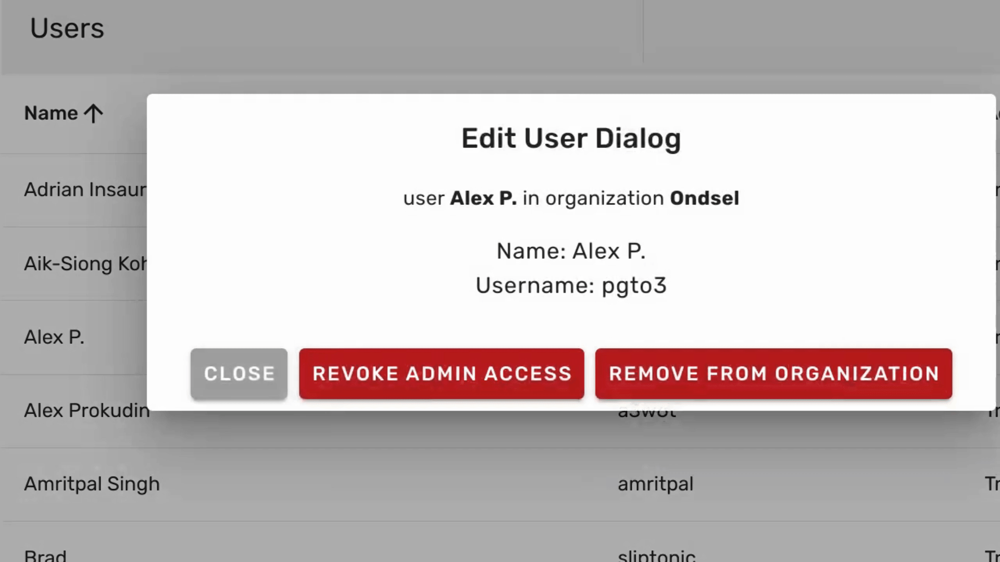

## Promoting users to admins

1. To promote a user to an administrator, navigate to the **Organization Settings** page.

Then, switch to the **Users** tab and locate the user you wish to promote.

 

---

2. Click the **Edit** icon located to the right of the user's name.

 

---

3. After that, click the **Make Admin** button.

 

The user's status will update immediately.

## Revoking admin priveleges

1. To revoke admin access, navigate to the **Organization Settings** page.

Then, switch to the **Users** tab and locate the user whose admin priveleges you want to revoke.

 

---

2. Click the **Edit** icon located to the right of the user's name.

 

---

3. Then, click the **Revoke Admin Access** button.

 

The user's status will update immediately.