## Inviting users to organizations

1. To start inviting users to an organization, click on the three dots icon at the bottom of the sidebar where your account name is.

Then click on **Account Settings**.

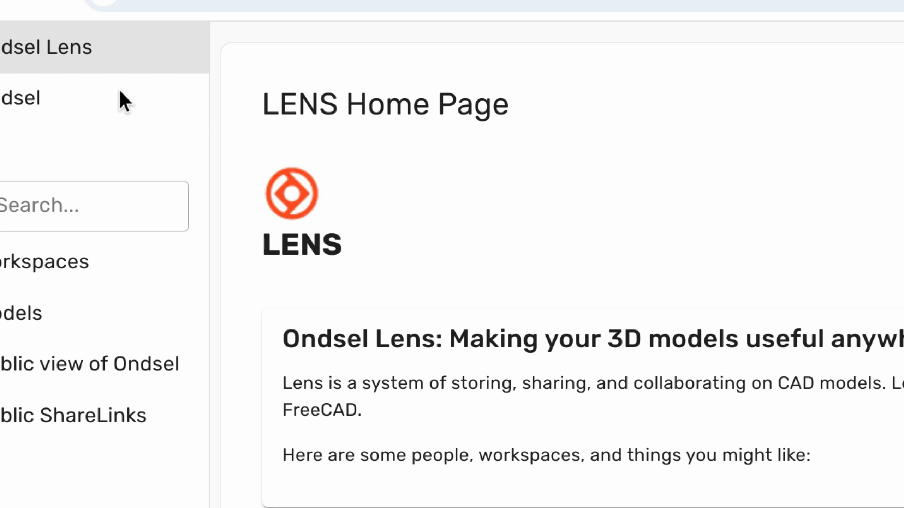

---

2. On the **Account Settings** page, switch to the **Users** tab.

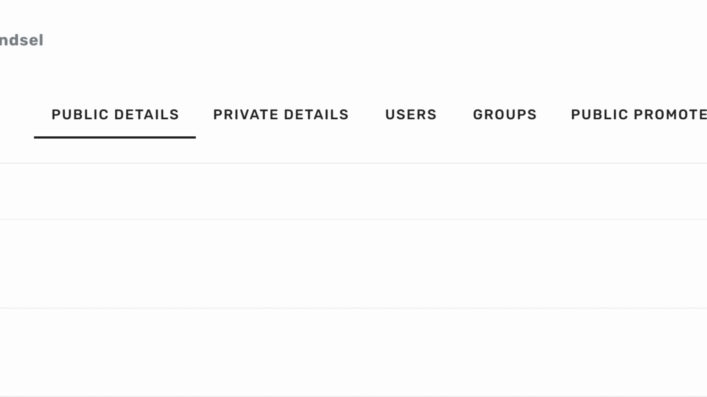

---

4. Click the **Invite New User** button.

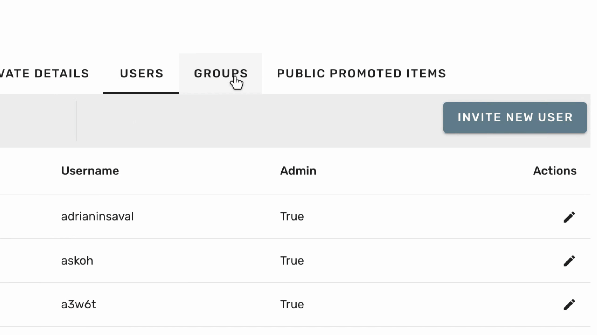

---

5. Submit user's email and click **Send**.

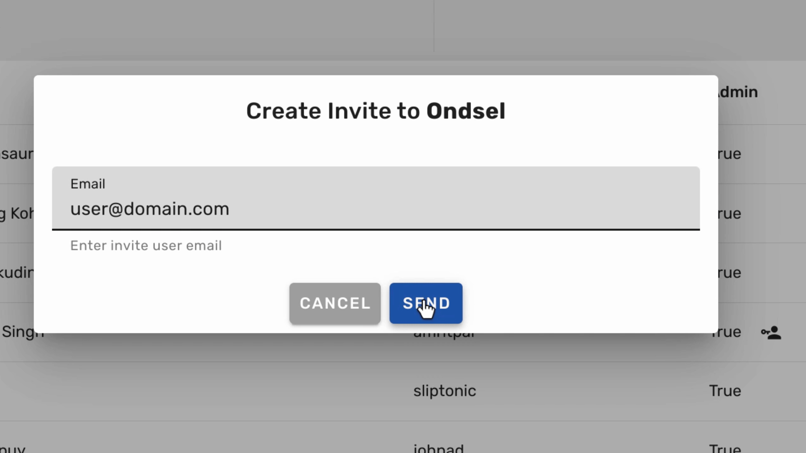

---

Once the users accepts the invitation, they will show up in the list of users and will automatically be added to all existing groups in the organization with minimum priveleges.

<!-- ## Managing access -->

## Removing users from organizations

1. To start removing users from an organization, first, navigate to the **Group** tab.

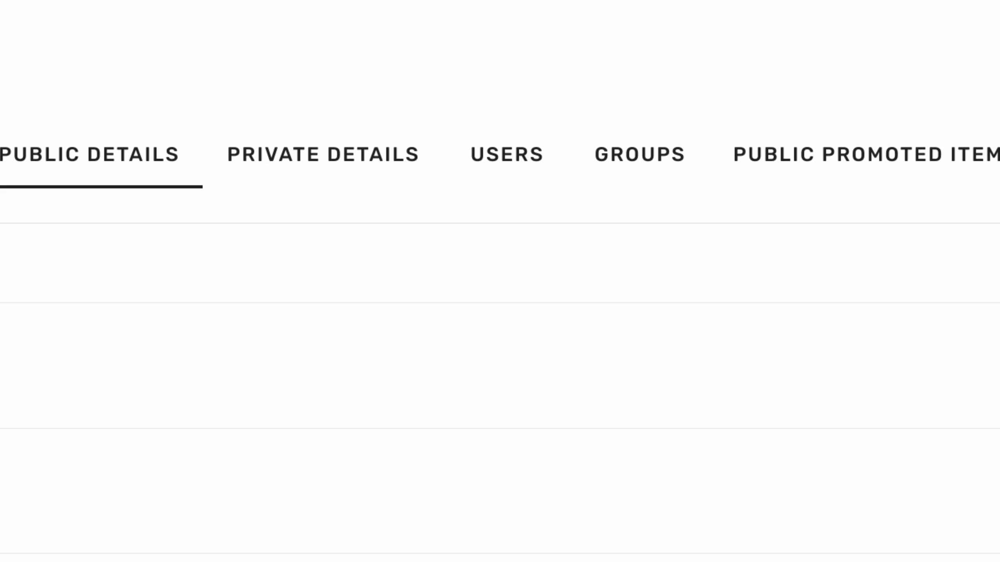 

---

2. Next, remove the user from every group they are associated with. To accomplish this, go to a specific group and click on **Add / Remove User**.

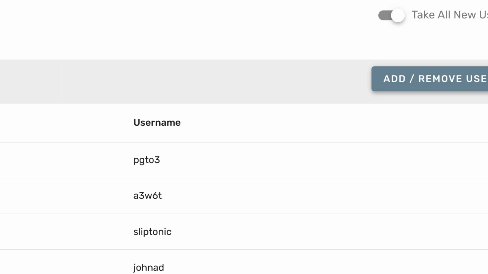 

---

3. Locate the user's name and uncheck the box to the left of it.

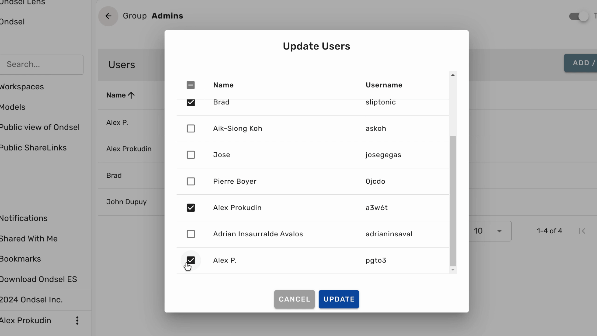 

---

4. Then, click on **Update**. The user will no longer be part of that group. 

Repeat this process for every other group the user is a member of.

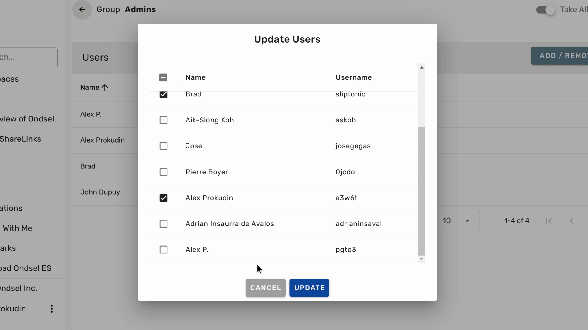 

---

5. Now that the user is no longer a member of any organization groups, go to the **Users** tab and find the user.

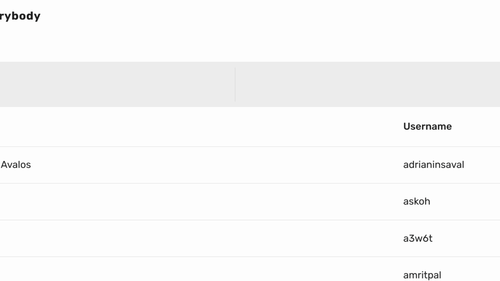 

---

6. Click on the **Edit** icon, followed by the **Remove from Organization** button.

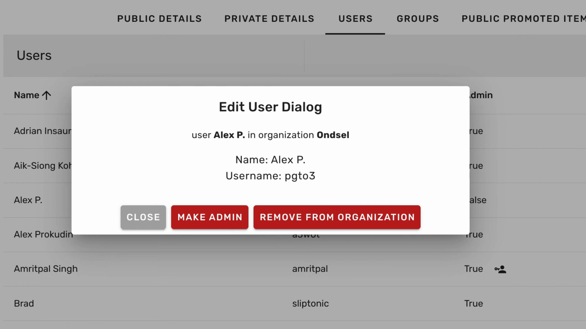 

---

7. Finally, confirm your decision to complete the removal process.

The user will be immediately removed from the organization.

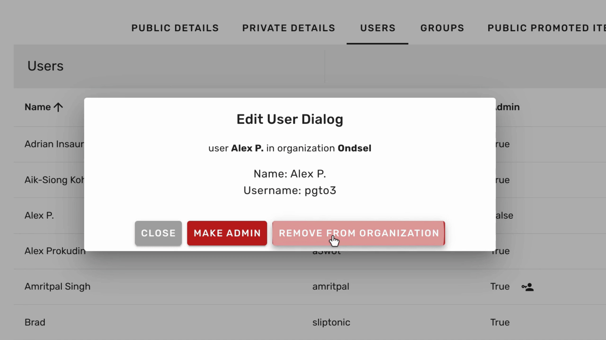