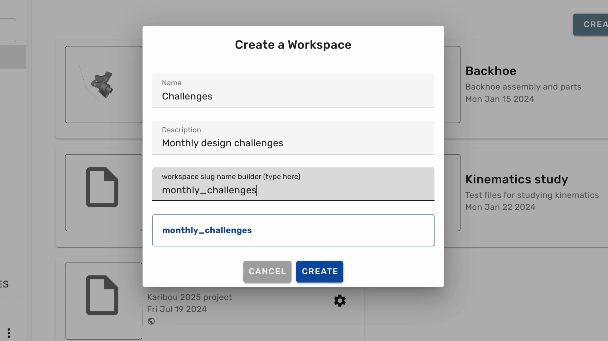

1. To create a new workspace, make sure that you are in the right organization and then click **Workspaces** in the sidebar.

 

---

2. Click on the **Create Workspace** button.

 

---

3. Fill in the name of the workspace, the user-visible description, and the slug.

 

---

4. Click **Create** to finalize the creation of the new workspace.

 

---

5. Once the new workspace has been created, you can click the gear icon on its card to configure the workspace's settings.

 