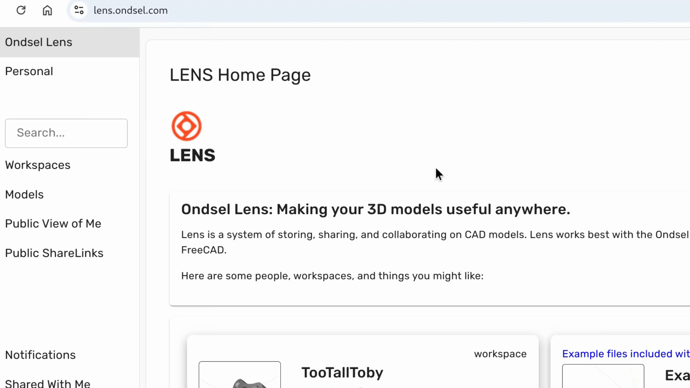
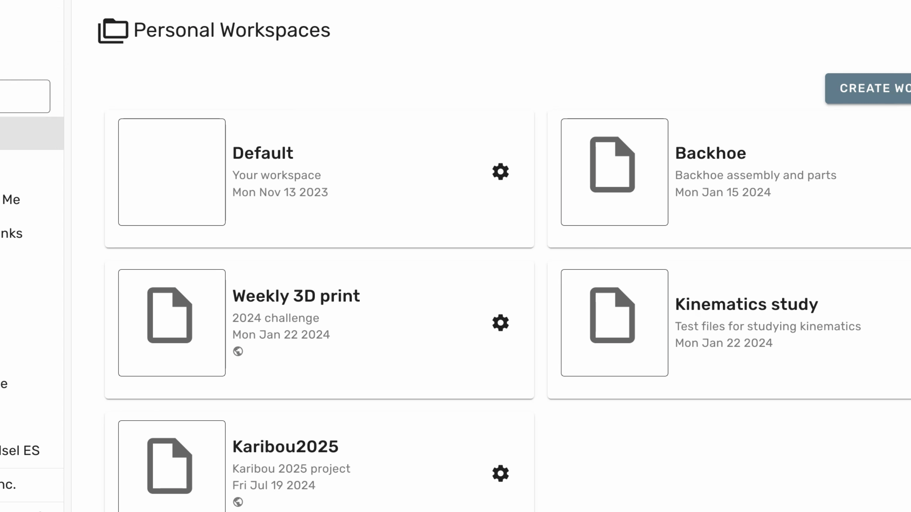
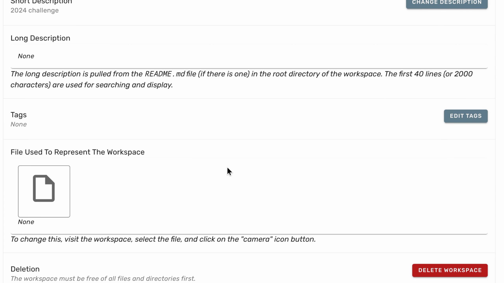
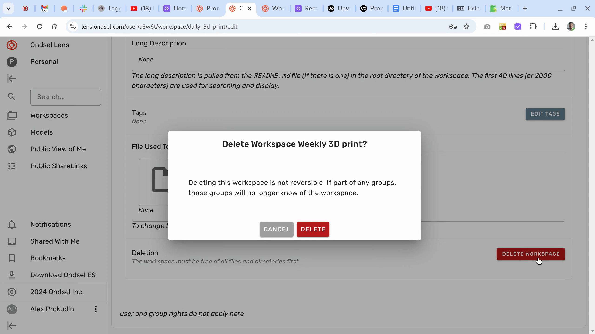

:::danger

Deleted workspaces and files inside them cannot be recovered!

:::

1. To start deleting a workspace, click the organization's name at the top of the sidebar to open the list of available organizations, and then select the correct organization.

 

---

In the list of available workspaces, click on the gear icon for the workspace you want to delete.

---

On the workspace settings page, scroll to the bottom and click **Delete Workspace**.

---

Confirm the deletion of the workspace.

