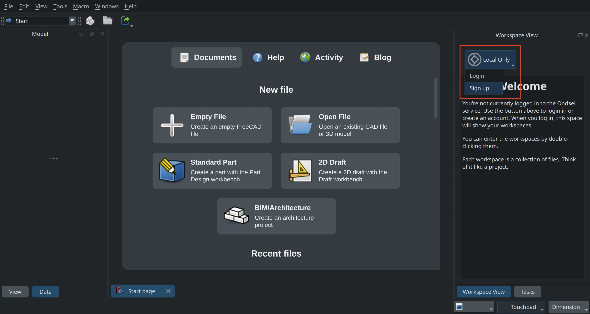
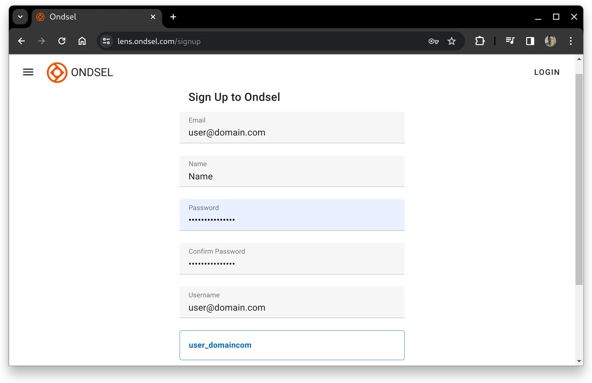
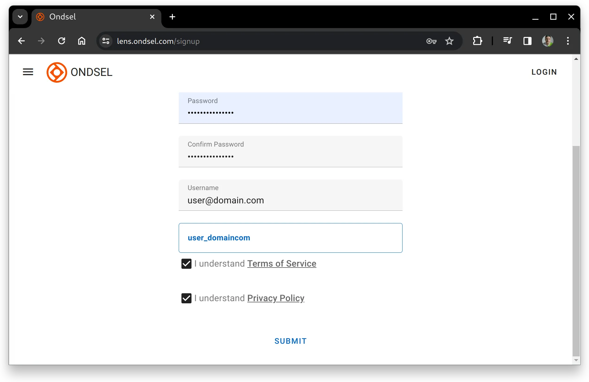

To create a free Ondsel Lens account, open the [Sign Up](https://lens.ondsel.com/signup) page in your browser. 

For Ondsel ES, in the _Workspace View_ panel click the **Local Only** button above and select the _Sign up_ option in the menu. This will open your preferred browser on the Sign Up page.

On the Sign Up page, please fill in the form: provide your email account, password, user name. The display name will be automatically created for you from the user name.

Please read and confirm that you understand Terms of Service and the Privacy Policy, then submit the information to apply for registration.

Once you submit your information, Ondsel Lens will email you with a confirmation link. Please click it to complete the registration.