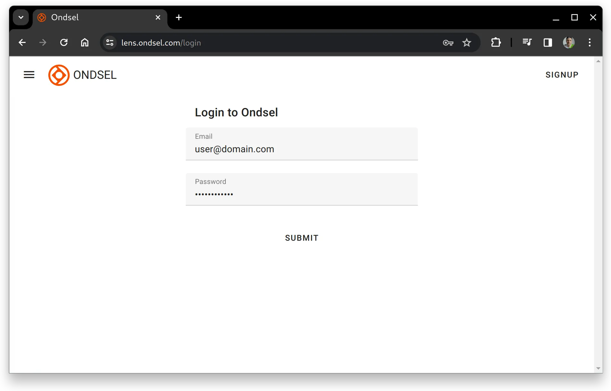
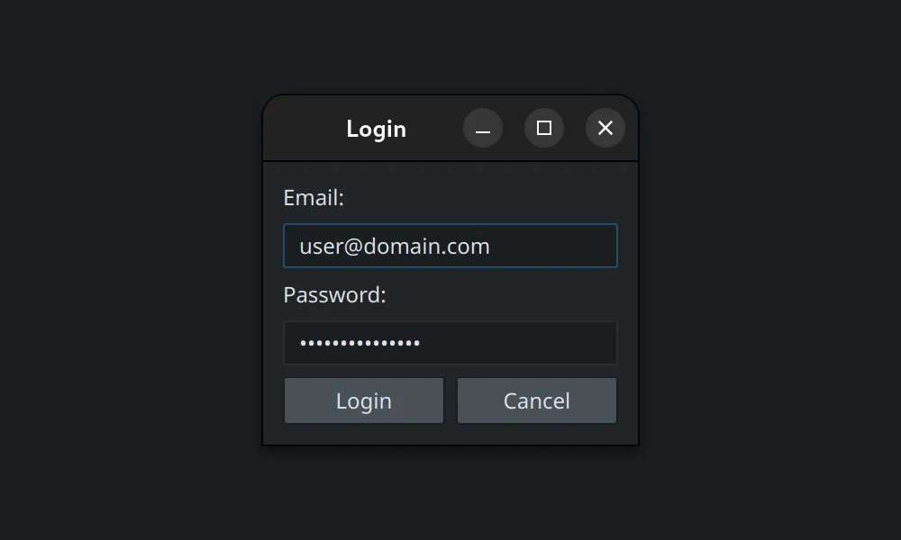

## Web interface

To log into Ondsel Lens from your browser, go to the <a href="https://lens.ondsel.com/login" _target="blank">Login</a> page and submit your email and password.

Upon successful login, you will be redirected to your models page. You can start uploading your FCStd and OBJ files.

## Ondsel ES

To log into the service from Ondsel ES, click the **Local Only** button above and select the _Login_ option in the menu. This will open a dialog to submit your email and password.

Upon successful login, you will see a list of available workspaces in the _Workspace View_ panel. For more information on workspaces, please see [this chapter](/docs/workspaces).