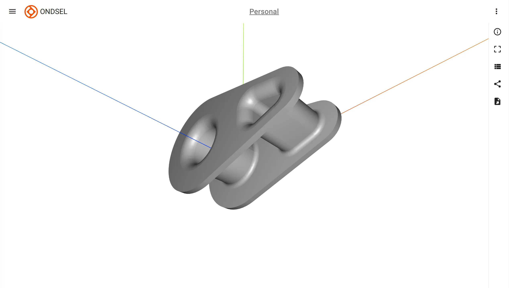

To start exploring a model you uploaded, do one of the two things:

- Select organization (top of the page, defaults to 'Personal'), workspace (is listed once you select organization), and directory where it's located. Then single-click to open and after that click 'EXPLORE'.
- Click the "hamburger" button in the upper left corner and choose "My Models" in the drop-down list to view all the models you uploaded, then single-click the model of interest.

Lens will create mesh from the original model and display it in the 3D space:

Navigation uses a conventional interaction model:

- **Left-click and drag** to **rotate** the camera around the model.
- **Right-click and drag** to **pan** the camera.
- **Scroll the mouse wheel** or **middle-click and drag up/down** to **zoom** in and out.
- **Single-click** select an object (Ondsel ES's body) in the model.

The vertical toolbar on the right provides contains several commands (top to bottom):

- **Get info**: displays basic information about the model's file (Date, Name, Created By, Organization)
- **Fit all or selection**: zooms the camera so that either the entire model (no selection) or a selected object fills the entire viewport.
- **See model attributes**: displays a list of adjustable custom attributes of a model, pre-created in Ondsel ES (see [Model customization](/docs/model-customization) for details).
- **Manage share links**: opens the dialog to manage share links for this model (see [Share links](/docs/share-links) for details).
- **Export model**: opens the dialog to export this model as a file to your local file storage.
