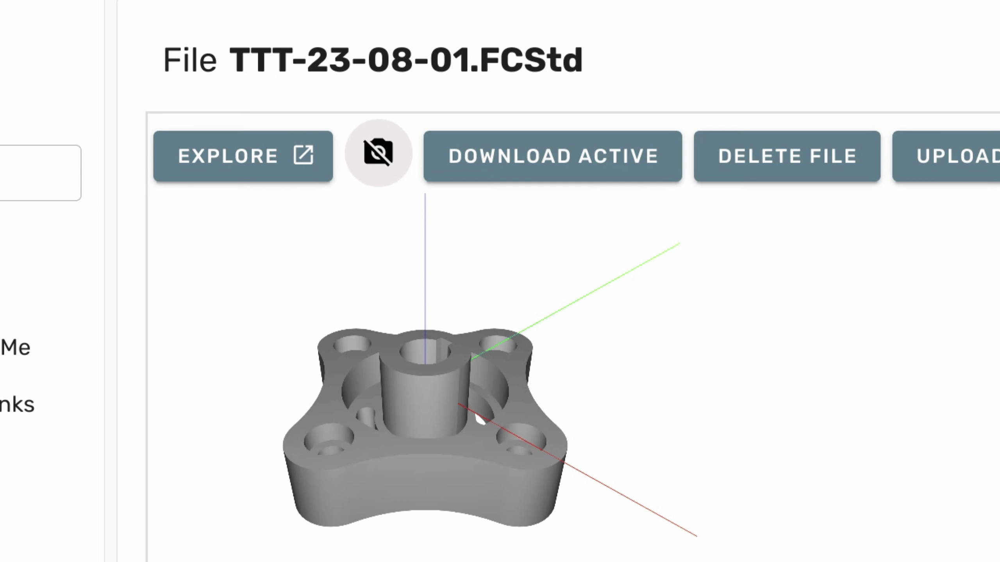
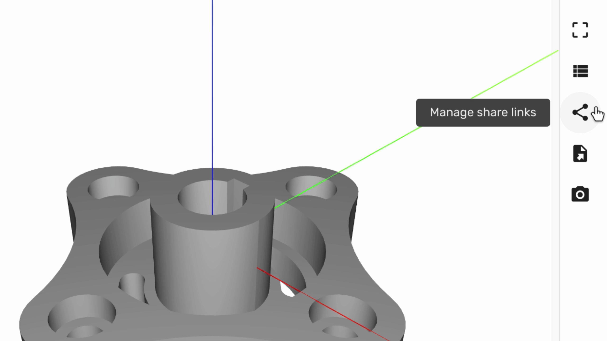
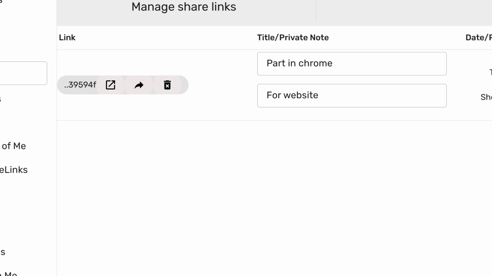
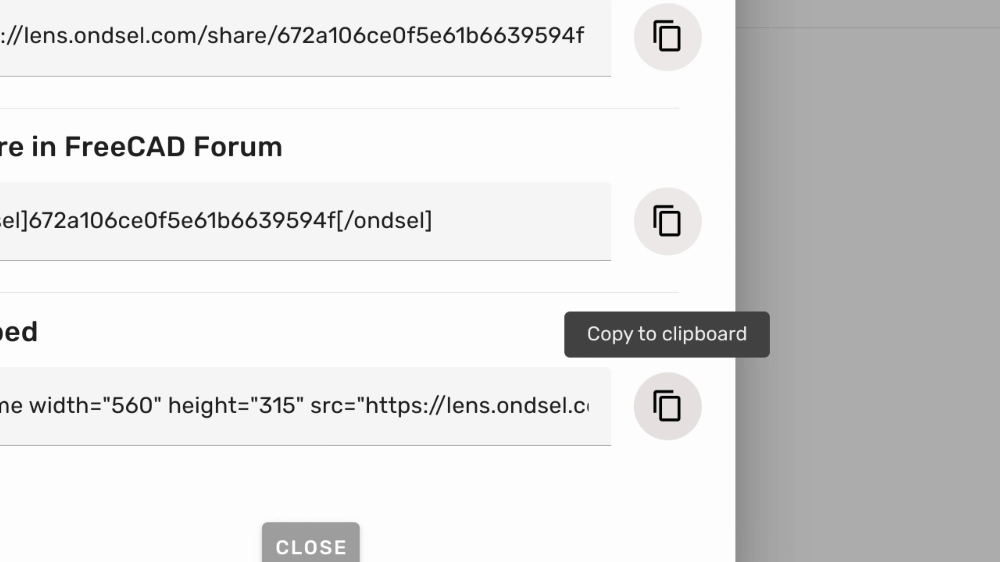

This tutorial will guide you through the process of obtaining the embed code for a share link of a model.

1. To begin, open the model page and click on **Explore**.

 

---

2. In the right toolbar, click on **Manage Share Links**.

---

3. Then click the **Share** button.

---

4. Next, click **Copy to Clipboard**.

This action will copy the embed code to your clipboard.

---

5. Finally, you can paste that code into your webpage.

---

By following these steps, you can successfully obtain and use the embed code for a share link.